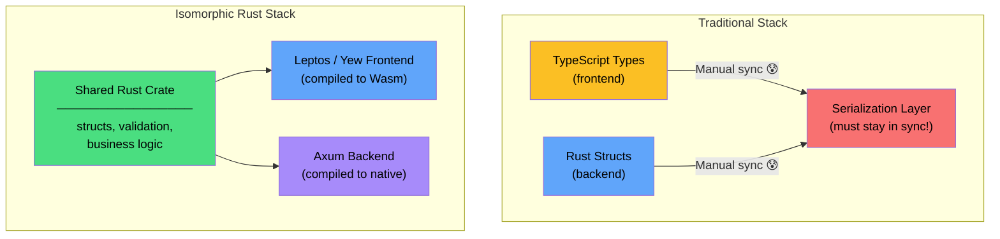

# 4. UI Frameworks: Leptos & Yew 🟡

> **What you'll learn:**
> - The paradigm shift from JavaScript SPAs (React/Vue) to Rust-compiled-to-Wasm frontend frameworks.
> - Virtual DOM rendering (Yew) vs. fine-grained reactive signals (Leptos) — architecturally and performance-wise.
> - How to build interactive components, handle events, manage state, and add client-side routing — entirely in Rust.
> - The tradeoffs: binary size, compilation time, ecosystem maturity, and developer experience vs. JavaScript frameworks.

---

## Why Rust on the Frontend?

JavaScript frameworks dominate the web — React, Vue, Svelte, Angular. So why would you write a frontend in Rust?

| Factor | JavaScript (React) | Rust (Leptos/Yew) |
|---|---|---|
| **Execution speed** | JIT-compiled, GC pauses | AOT-compiled to Wasm, no GC |
| **Type safety** | TypeScript (optional, erased at runtime) | Rust's type system (enforced at compile time) |
| **Bundle size** | ~40–100 KB (React core) | ~80–200 KB (Wasm + glue) — larger baseline, but no framework runtime |
| **Memory safety** | GC-managed (no use-after-free) | Ownership-enforced (no GC overhead) |
| **Shared backend types** | Separate TS/Rust type definitions | **Same Rust structs** on server and client |
| **Ecosystem** | Massive (npm) | Growing (crates.io + web-sys) |
| **Developer pool** | Enormous | Small but expert |
| **Compilation** | Instant (hot reload) | Slow (minutes for fresh builds) |

The killer feature is **isomorphic Rust**: the same structs, validation logic, and business rules run on both the server (native) and the client (Wasm) — with zero code duplication and zero type mismatch bugs.



---

## The Two Architectures: Virtual DOM vs Fine-Grained Reactivity

Yew and Leptos represent two fundamentally different approaches to UI rendering. Understanding both is essential for making informed framework choices.

### Virtual DOM (Yew) — The React Model

Yew follows React's Virtual DOM architecture:

1. **State changes** trigger a full component re-render (calling the `view()` function).
2. The framework builds a new **virtual DOM tree** (a lightweight in-memory representation).
3. It **diffs** the new virtual tree against the previous one.
4. Only the changed nodes are patched in the **real DOM** (via `web-sys`).

```
State Change → Re-render Component → Build New VTree → Diff Old vs New → Patch Real DOM
```

### Fine-Grained Reactivity (Leptos) — The SolidJS Model

Leptos follows SolidJS's fine-grained reactive signal architecture:

1. **Signals** are reactive primitives that hold values.
2. **Effects** (including DOM text nodes, attribute bindings) subscribe to specific signals.
3. When a signal changes, **only the subscribed effects run** — no component function is re-called, no virtual DOM is diffed.
4. DOM updates are **surgical**: only the exact text node or attribute that depends on the changed signal is updated.

```
Signal Change → Notify Subscribers → Update Specific DOM Nodes (no diffing)
```

### Architecture Comparison

| Aspect | Yew (Virtual DOM) | Leptos (Fine-Grained Signals) |
|---|---|---|
| **Inspiration** | React | SolidJS |
| **Re-render granularity** | Entire component function re-runs | Only subscribed effects re-run |
| **DOM diffing** | Yes — O(N) tree diff | No — O(1) targeted updates |
| **Memory overhead** | Two virtual trees in memory | Signal graph (typically smaller) |
| **Performance on many updates** | Slower (diff overhead per update) | Faster (no diffing, no allocations) |
| **Mental model** | "Render everything, framework finds changes" | "Track dependencies, update precisely" |
| **Familiarity for React devs** | ✅ Very familiar | 🟡 Requires mental shift |
| **Component syntax** | `html! {}` macro | `view! {}` macro (RSX) |
| **Maturity** | Older, larger community | Newer, rapidly growing, more actively developed |

---

## Yew: Building with the Virtual DOM

### Your First Yew Component

```toml
# Cargo.toml
[package]
name = "yew-app"
version = "0.1.0"
edition = "2021"

[dependencies]
yew = { version = "0.21", features = ["csr"] }   # Client-side rendering
wasm-bindgen = "0.2"
```

```rust
use yew::prelude::*;

/// A stateful counter component.
/// Every time the button is clicked, the entire `view()` function re-runs,
/// a new virtual DOM tree is built, diffed against the old one,
/// and only the changed <p> text node is patched.
#[function_component(Counter)]
fn counter() -> Html {
    // UseStateHandle<i32> — calling set_count triggers a re-render
    let count = use_state(|| 0_i32);

    let increment = {
        let count = count.clone();
        Callback::from(move |_: MouseEvent| {
            count.set(*count + 1);
            // After this: Yew re-calls counter() → builds new VTree →
            // diffs → patches the <p> text node. The <button> is unchanged,
            // so it's not touched in the real DOM.
        })
    };

    let decrement = {
        let count = count.clone();
        Callback::from(move |_: MouseEvent| {
            count.set(*count - 1);
        })
    };

    html! {
        <div class="counter">
            <h2>{ "Yew Counter" }</h2>
            <p>{ format!("Count: {}", *count) }</p>
            <button onclick={increment}>{ "+1" }</button>
            <button onclick={decrement}>{ "-1" }</button>
        </div>
    }
}

/// App root
#[function_component(App)]
fn app() -> Html {
    html! {
        <main>
            <h1>{ "My Yew Application" }</h1>
            <Counter />
        </main>
    }
}

fn main() {
    yew::Renderer::<App>::new().render();
}
```

### Yew Props and Component Communication

```rust
use yew::prelude::*;

/// Props must derive Properties and PartialEq (for VDOM diffing).
#[derive(Properties, PartialEq)]
pub struct TodoItemProps {
    pub text: String,
    pub completed: bool,
    pub on_toggle: Callback<()>,
}

/// A presentational component that receives data via props.
#[function_component(TodoItem)]
fn todo_item(props: &TodoItemProps) -> Html {
    let style = if props.completed {
        "text-decoration: line-through; color: gray;"
    } else {
        ""
    };

    let on_click = {
        let on_toggle = props.on_toggle.clone();
        Callback::from(move |_: MouseEvent| {
            on_toggle.emit(());
        })
    };

    html! {
        <li {style} onclick={on_click}>
            { &props.text }
        </li>
    }
}

/// Container component managing a list of todos.
#[function_component(TodoList)]
fn todo_list() -> Html {
    let todos = use_state(|| vec![
        ("Learn Rust".to_string(), false),
        ("Build Wasm app".to_string(), false),
        ("Deploy to edge".to_string(), false),
    ]);

    let todo_items: Html = todos.iter().enumerate().map(|(idx, (text, completed))| {
        let todos = todos.clone();
        let on_toggle = Callback::from(move |_| {
            let mut new_todos = (*todos).clone();
            new_todos[idx].1 = !new_todos[idx].1;
            todos.set(new_todos);
        });

        html! {
            <TodoItem
                text={text.clone()}
                completed={*completed}
                on_toggle={on_toggle}
            />
        }
    }).collect();

    html! {
        <div>
            <h2>{ "Todo List" }</h2>
            <ul>{ todo_items }</ul>
        </div>
    }
}
```

---

## Leptos: Building with Fine-Grained Signals

### Your First Leptos Component

```toml
# Cargo.toml
[package]
name = "leptos-app"
version = "0.1.0"
edition = "2021"

[dependencies]
leptos = { version = "0.6", features = ["csr"] }
wasm-bindgen = "0.2"
console_error_panic_hook = "0.1"
```

```rust
use leptos::*;

/// A reactive counter using Leptos signals.
/// KEY DIFFERENCE from Yew: This function body runs ONCE.
/// It does NOT re-run on state changes. Only the `move || count()` closure
/// re-runs — and it directly updates a single DOM text node.
#[component]
fn Counter() -> impl IntoView {
    // RwSignal<i32> — reading it (count()) tracks the dependency,
    // writing it (set_count()) notifies subscribers.
    let (count, set_count) = create_signal(0_i32);

    view! {
        <div class="counter">
            <h2>"Leptos Counter"</h2>
            // This closure subscribes to `count`. When count changes,
            // ONLY this text node is updated. No diffing. No re-render.
            <p>"Count: " {move || count()}</p>
            <button on:click=move |_| set_count.update(|n| *n += 1)>"+1"</button>
            <button on:click=move |_| set_count.update(|n| *n -= 1)>"-1"</button>
        </div>
    }
}

/// App root
#[component]
fn App() -> impl IntoView {
    view! {
        <main>
            <h1>"My Leptos Application"</h1>
            <Counter />
        </main>
    }
}

fn main() {
    console_error_panic_hook::set_once();
    mount_to_body(App);
}
```

### Leptos: Derived Signals and Memos

```rust
use leptos::*;

#[component]
fn TemperatureConverter() -> impl IntoView {
    let (celsius, set_celsius) = create_signal(0.0_f64);

    // Derived signal: automatically recomputes when `celsius` changes.
    // Leptos tracks the dependency graph at runtime.
    let fahrenheit = move || celsius() * 9.0 / 5.0 + 32.0;

    // Memo: similar to derived signal but cached — only recomputes
    // when its dependencies actually change. Use for expensive computations.
    let description = create_memo(move |_| {
        let c = celsius();
        if c < 0.0 {
            "Freezing! 🥶"
        } else if c < 20.0 {
            "Cold 🧊"
        } else if c < 30.0 {
            "Comfortable 😊"
        } else {
            "Hot! 🔥"
        }
    });

    view! {
        <div>
            <h2>"Temperature Converter"</h2>
            <input
                type="range"
                min="-40"
                max="50"
                step="0.1"
                prop:value=move || celsius().to_string()
                on:input=move |ev| {
                    let val: f64 = event_target_value(&ev).parse().unwrap_or(0.0);
                    set_celsius(val);
                }
            />
            <p>{move || format!("{:.1}°C = {:.1}°F", celsius(), fahrenheit())}</p>
            <p>"Feeling: " {move || description()}</p>
        </div>
    }
}
```

### Leptos: Dynamic Lists with `<For>`

```rust
use leptos::*;

#[derive(Clone, Debug)]
struct Todo {
    id: u32,
    text: String,
    completed: RwSignal<bool>,
}

#[component]
fn TodoApp() -> impl IntoView {
    let (todos, set_todos) = create_signal(Vec::<Todo>::new());
    let (next_id, set_next_id) = create_signal(0u32);
    let input_ref = create_node_ref::<leptos::html::Input>();

    let add_todo = move |_| {
        if let Some(input) = input_ref() {
            let text = input.value();
            if !text.is_empty() {
                let id = next_id();
                set_next_id.update(|n| *n += 1);
                set_todos.update(|todos| {
                    todos.push(Todo {
                        id,
                        text,
                        completed: create_rw_signal(false),
                    });
                });
                input.set_value("");
            }
        }
    };

    view! {
        <div>
            <h2>"Leptos Todo List"</h2>
            <div>
                <input
                    type="text"
                    placeholder="Add a todo..."
                    node_ref=input_ref
                />
                <button on:click=add_todo>"Add"</button>
            </div>
            <ul>
                // <For> provides keyed, efficient list rendering.
                // When a todo is toggled, ONLY that <li>'s style updates.
                // No virtual DOM diffing of the entire list.
                <For
                    each=move || todos().into_iter()
                    key=|todo| todo.id
                    children=move |todo| {
                        let completed = todo.completed;
                        view! {
                            <li
                                style:text-decoration=move || {
                                    if completed() { "line-through" } else { "none" }
                                }
                                on:click=move |_| completed.update(|b| *b = !*b)
                            >
                                {todo.text.clone()}
                            </li>
                        }
                    }
                />
            </ul>
            <p>"Total: " {move || todos().len()} " items"</p>
        </div>
    }
}
```

---

## Side-by-Side: Same Component in Yew vs Leptos

### Search Filter Component

**Yew (Virtual DOM):**

```rust
use yew::prelude::*;

#[function_component(SearchFilter)]
fn search_filter() -> Html {
    let items = use_state(|| vec!["Rust", "JavaScript", "Python", "Go", "TypeScript"]);
    let query = use_state(|| String::new());

    let filtered: Vec<&&str> = items
        .iter()
        .filter(|item| item.to_lowercase().contains(&query.to_lowercase()))
        .collect();

    let on_input = {
        let query = query.clone();
        Callback::from(move |e: InputEvent| {
            let target: web_sys::HtmlInputElement = e.target_unchecked_into();
            query.set(target.value());
            // After this: Yew re-runs the ENTIRE function_component body.
            // Rebuilds the VTree. Diffs. Patches changed nodes.
        })
    };

    html! {
        <div>
            <input type="text" placeholder="Search..." oninput={on_input} />
            <ul>
                { for filtered.iter().map(|item| html! { <li>{ item }</li> }) }
            </ul>
        </div>
    }
}
```

**Leptos (Fine-Grained Signals):**

```rust
use leptos::*;

#[component]
fn SearchFilter() -> impl IntoView {
    let items = vec!["Rust", "JavaScript", "Python", "Go", "TypeScript"];
    let (query, set_query) = create_signal(String::new());

    // Derived signal: recomputes only when `query` changes.
    // The items vec is captured by move — no re-allocation.
    let filtered = move || {
        let q = query().to_lowercase();
        items
            .iter()
            .filter(|item| item.to_lowercase().contains(&q))
            .cloned()
            .collect::<Vec<_>>()
    };

    view! {
        <div>
            <input
                type="text"
                placeholder="Search..."
                on:input=move |ev| set_query(event_target_value(&ev))
                // After this: Only `filtered` re-runs. Only the <For> list updates.
                // The <input> element is NOT re-created or diffed. The <div> is untouched.
            />
            <ul>
                <For
                    each=filtered
                    key=|item| item.to_string()
                    children=|item| view! { <li>{item}</li> }
                />
            </ul>
        </div>
    }
}
```

---

## Client-Side Routing

Both frameworks support client-side routing (URL-based navigation without full page reloads).

### Leptos Router

```rust
use leptos::*;
use leptos_router::*;

#[component]
fn App() -> impl IntoView {
    view! {
        <Router>
            <nav>
                <A href="/">"Home"</A>
                <A href="/about">"About"</A>
                <A href="/users">"Users"</A>
            </nav>
            <main>
                <Routes>
                    <Route path="/" view=HomePage />
                    <Route path="/about" view=AboutPage />
                    <Route path="/users/:id" view=UserPage />
                </Routes>
            </main>
        </Router>
    }
}

#[component]
fn HomePage() -> impl IntoView {
    view! { <h1>"Home"</h1> }
}

#[component]
fn AboutPage() -> impl IntoView {
    view! { <h1>"About"</h1> }
}

#[component]
fn UserPage() -> impl IntoView {
    let params = use_params_map();
    let id = move || params().get("id").cloned().unwrap_or_default();

    view! {
        <h1>"User: " {id}</h1>
    }
}
```

---

## Build Tools: Trunk vs cargo-leptos

| Tool | Framework | What It Does |
|---|---|---|
| **Trunk** | Yew (and other Wasm apps) | Wasm build, asset pipeline, dev server, hot reload |
| **cargo-leptos** | Leptos | Wasm + server build, SSR support, hot reload, Tailwind integration |

### Trunk (for Yew)

```bash
cargo install trunk
trunk serve  # Dev server at http://localhost:8080 with hot reload
trunk build --release  # Production build
```

```html
<!-- index.html (Trunk entry point) -->
<!DOCTYPE html>
<html>
<head>
    <link data-trunk rel="css" href="style.css"/>
</head>
<body></body>
</html>
```

### cargo-leptos (for Leptos)

```bash
cargo install cargo-leptos
cargo leptos watch  # Dev server with hot reload
cargo leptos build --release  # Production build (Wasm + server binary)
```

---

## Performance Comparison: Virtual DOM vs Signals

For UI-heavy applications with frequent state updates, the rendering architecture matters:

| Scenario | Yew (Virtual DOM) | Leptos (Signals) | Winner |
|---|---|---|---|
| **Initial render** | Fast (one VTree build) | Fast (one DOM creation) | Tie |
| **Single button click** | Re-runs component, diffs full VTree | Updates one text node | Leptos |
| **List with 10K items, update one** | Diffs 10K vnodes to find 1 change | Updates 1 DOM node directly | Leptos (by orders of magnitude) |
| **Complete list replacement** | Diffs all, patches all | Replaces all (keyed) | Similar |
| **Network-bound app (few UI updates)** | Both fine | Both fine | Tie (architecture doesn't matter) |
| **Binary size** | ~200-400 KB | ~150-300 KB | Leptos (slightly smaller) |
| **Compilation time** | Moderate | Moderate-to-slow (proc macros) | Similar |

### When to Choose Which

**Choose Yew if:**
- Your team comes from React and wants a familiar mental model.
- The app is UI-light (dashboards, forms) where diffing overhead is negligible.
- You need the larger ecosystem of community components and examples.

**Choose Leptos if:**
- You need SSR + hydration (Leptos has first-class support; Yew's is experimental).
- Performance matters: high-frequency updates, large lists, real-time UIs.
- You want isomorphic Rust with server functions (`#[server]`).
- You're starting a new project and want the most actively developed framework.

---

<details>
<summary><strong>🏋️ Exercise: Build a Real-Time Search Dashboard</strong> (click to expand)</summary>

**Challenge:** Build a search dashboard in **either** Yew or Leptos that:

1. Has an input field that filters a list of 1000 items as you type (debounced by 200ms).
2. Shows the count of matching items.
3. Highlights the matching substring in each result.
4. Uses client-side routing: `/` for the search page, `/item/:id` for item detail.

**Bonus:** Implement the same app in both frameworks and compare the code size and developer experience.

<details>
<summary>🔑 Solution</summary>

**Leptos implementation:**

```rust
use leptos::*;
use leptos_router::*;

/// Generate 1000 items for searching
fn generate_items() -> Vec<(u32, String)> {
    (0..1000)
        .map(|i| {
            let category = match i % 5 {
                0 => "Rust",
                1 => "WebAssembly",
                2 => "JavaScript",
                3 => "TypeScript",
                _ => "Python",
            };
            (i, format!("{category} Tutorial #{i}: Advanced Concepts Part {}", i / 10))
        })
        .collect()
}

#[component]
fn App() -> impl IntoView {
    // Generate items once — they're constant, not reactive
    let items = generate_items();

    // Provide items to child components via context
    provide_context(items);

    view! {
        <Router>
            <nav>
                <A href="/">"Search"</A>
            </nav>
            <main>
                <Routes>
                    <Route path="/" view=SearchPage />
                    <Route path="/item/:id" view=ItemDetail />
                </Routes>
            </main>
        </Router>
    }
}

#[component]
fn SearchPage() -> impl IntoView {
    let items: Vec<(u32, String)> = use_context().unwrap();
    let (query, set_query) = create_signal(String::new());
    let (debounced_query, set_debounced_query) = create_signal(String::new());

    // Debounce: wait 200ms after the last keystroke before filtering
    create_effect(move |_| {
        let q = query();
        set_timeout(
            move || set_debounced_query(q),
            std::time::Duration::from_millis(200),
        );
    });

    // Filtered items — only recomputes when debounced_query changes
    let filtered = move || {
        let q = debounced_query().to_lowercase();
        if q.is_empty() {
            return items.clone();
        }
        items
            .iter()
            .filter(|(_, text)| text.to_lowercase().contains(&q))
            .cloned()
            .collect::<Vec<_>>()
    };

    let count = move || filtered().len();

    view! {
        <div>
            <h1>"Search Dashboard"</h1>
            <input
                type="text"
                placeholder="Type to search..."
                on:input=move |ev| set_query(event_target_value(&ev))
            />
            <p>{move || format!("{} results found", count())}</p>
            <ul>
                <For
                    each=filtered
                    key=|(id, _)| *id
                    children=move |(id, text)| {
                        view! {
                            <li>
                                <A href=format!("/item/{id}")>
                                    // Highlight matching text
                                    {move || {
                                        let q = debounced_query().to_lowercase();
                                        if q.is_empty() {
                                            return view! { <span>{text.clone()}</span> }.into_view();
                                        }
                                        let lower = text.to_lowercase();
                                        if let Some(pos) = lower.find(&q) {
                                            let before = &text[..pos];
                                            let matched = &text[pos..pos + q.len()];
                                            let after = &text[pos + q.len()..];
                                            view! {
                                                <span>
                                                    {before.to_string()}
                                                    <mark>{matched.to_string()}</mark>
                                                    {after.to_string()}
                                                </span>
                                            }.into_view()
                                        } else {
                                            view! { <span>{text.clone()}</span> }.into_view()
                                        }
                                    }}
                                </A>
                            </li>
                        }
                    }
                />
            </ul>
        </div>
    }
}

#[component]
fn ItemDetail() -> impl IntoView {
    let params = use_params_map();
    let items: Vec<(u32, String)> = use_context().unwrap();

    let item = move || {
        let id: u32 = params().get("id")
            .and_then(|s| s.parse().ok())
            .unwrap_or(0);
        items.iter().find(|(i, _)| *i == id).cloned()
    };

    view! {
        <div>
            {move || match item() {
                Some((id, text)) => view! {
                    <h1>{format!("Item #{id}")}</h1>
                    <p>{text}</p>
                    <A href="/">"← Back to search"</A>
                }.into_view(),
                None => view! {
                    <h1>"Item not found"</h1>
                    <A href="/">"← Back to search"</A>
                }.into_view(),
            }}
        </div>
    }
}

fn main() {
    console_error_panic_hook::set_once();
    mount_to_body(App);
}
```

**Key observations:**

1. **Filtering 1000 items** with fine-grained signals is efficient — only the list DOM updates, not the entire page.
2. **Debouncing** prevents excessive computation while the user types.
3. **`<For>` with keys** ensures efficient list reconciliation — items that haven't changed are not re-rendered.
4. **Client-side routing** doesn't reload the Wasm module — navigation is instant.
5. The entire application (routing, state, rendering) is type-checked at compile time.

</details>
</details>

---

> **Key Takeaways**
> - **Yew** uses a Virtual DOM (React model): re-renders the component, diffs the tree, patches changes. Familiar to React developers.
> - **Leptos** uses fine-grained signals (SolidJS model): tracks dependencies at the signal level, updates only the exact DOM nodes that changed. Better performance for frequent updates.
> - **Isomorphic Rust** is the killer feature: share structs, validation, and business logic between server and client with zero code duplication.
> - **Binary size** is the tradeoff: Wasm bundles are 100-400 KB vs React's ~40 KB. This matters on mobile; gzip/brotli compression helps significantly.
> - **Compilation time** is the DX tradeoff: fresh builds take minutes. Use `cargo-leptos watch` or `trunk serve` for incremental hot reload during development.
> - **Choose Leptos** for new projects that need SSR, high performance, or server functions. **Choose Yew** for teams comfortable with React's mental model.

> **See also:**
> - [Chapter 5: SSR and Hydration](ch05-ssr-hydration.md) — how Leptos renders on the server and hydrates on the client.
> - [Chapter 2: `wasm-bindgen`](ch02-wasm-bindgen.md) — the layer that Leptos/Yew abstract over.
> - [Microservices companion guide](../microservices-book/src/SUMMARY.md) — the Axum server that powers Leptos SSR.
