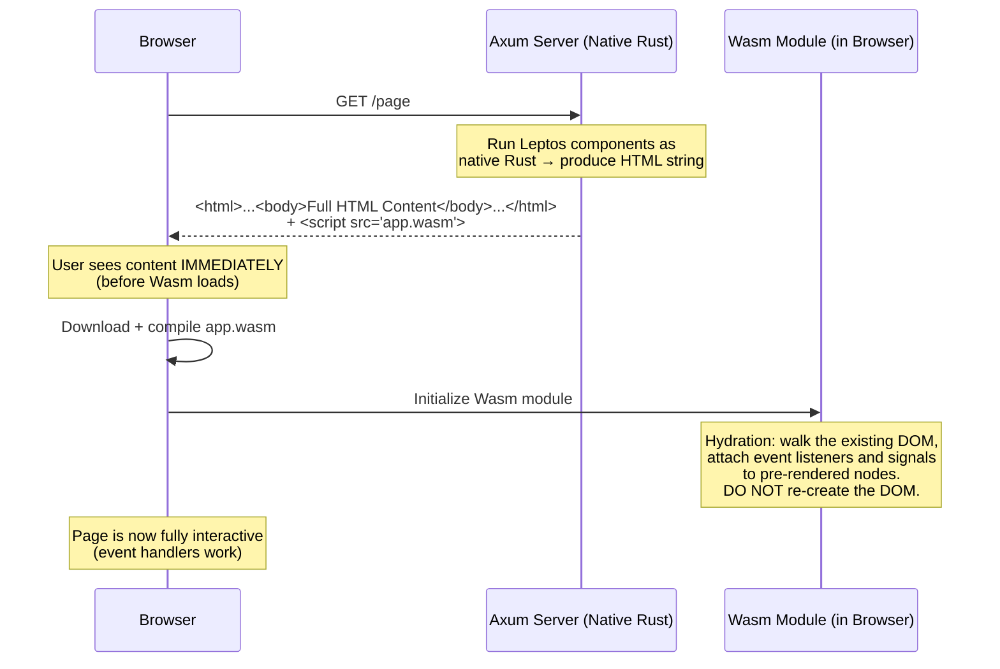
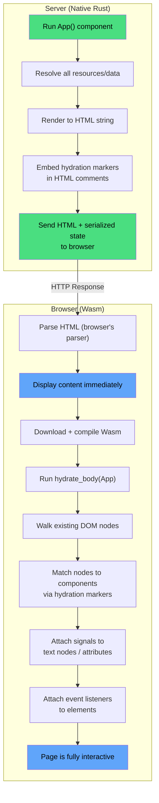
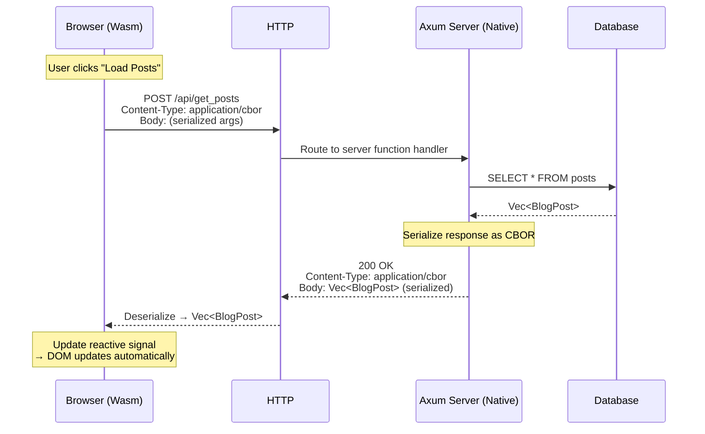

# 5. Server-Side Rendering (SSR) and Hydration 🔴

> **What you'll learn:**
> - How SSR works: rendering your Leptos/Yew components to HTML strings on the server (native Rust), then sending that HTML to the browser.
> - What hydration means: attaching event listeners and reactive signals to pre-rendered DOM nodes without re-creating them.
> - How to share the **exact same Rust structs** between your Axum backend and your Wasm frontend — zero code duplication.
> - Server functions (`#[server]`): calling server-side Rust code from client-side Rust as if it were a local function call.

---

## The Problem SSR Solves

Client-side rendering (CSR) — where the browser downloads a `.wasm` file, executes it, and builds the DOM from scratch — has two critical problems:

1. **Blank page on first load.** The user sees nothing until the Wasm module is downloaded, compiled, and executed. On a slow 3G connection, this can take 5–10 seconds.
2. **SEO invisibility.** Search engine crawlers see an empty `<body>` — no content to index.

SSR solves both by rendering HTML on the server and sending it immediately:



### CSR vs SSR vs SSG

| Strategy | When HTML Is Generated | First Paint | SEO | Interactivity |
|---|---|---|---|---|
| **CSR** (Client-Side Rendering) | In the browser, after Wasm loads | Slow (blank → content) | ❌ None | Instant after Wasm loads |
| **SSR** (Server-Side Rendering) | On each request, at the server | Fast (HTML arrives immediately) | ✅ Full | Delayed (until Wasm hydrates) |
| **SSG** (Static Site Generation) | At build time | Fastest (pre-built HTML) | ✅ Full | Delayed (until Wasm hydrates) |
| **Streaming SSR** | Incrementally as the server renders | Progressive (chunks arrive) | ✅ Partial → Full | Delayed (hydrates incrementally) |

---

## Leptos SSR: The Full-Stack Setup

Leptos has first-class SSR support. The same components run on both the server (native Rust + Axum) and the client (Wasm). The framework handles rendering, streaming, and hydration automatically.

### Project Structure

```
my-leptos-app/
├── Cargo.toml            # Workspace root
├── app/                  # Shared component library (compiled to BOTH targets)
│   ├── Cargo.toml
│   └── src/
│       ├── lib.rs        # App root component
│       ├── routes/       # Page components
│       │   ├── home.rs
│       │   └── about.rs
│       └── components/   # Reusable UI components
│           └── counter.rs
├── server/               # Server binary (native Rust + Axum)
│   ├── Cargo.toml
│   └── src/
│       └── main.rs       # Axum server setup
└── frontend/             # Wasm entry point
    ├── Cargo.toml
    └── src/
        └── main.rs       # Hydration entry point
```

### The Shared Crate (`app/`)

This is the key insight: **the same Rust code compiles to both native (for the server) and Wasm (for the client).**

```rust
// app/src/lib.rs
use leptos::*;
use leptos_meta::*;
use leptos_router::*;

/// The app shell — this component renders on BOTH server and client.
#[component]
pub fn App() -> impl IntoView {
    provide_meta_context();

    view! {
        <Stylesheet id="leptos" href="/pkg/style.css"/>
        <Title text="My Leptos App"/>
        <Router>
            <main>
                <Routes>
                    <Route path="" view=HomePage />
                    <Route path="about" view=AboutPage />
                </Routes>
            </main>
        </Router>
    }
}

// Shared types — used by BOTH server and client
#[derive(Clone, Debug, serde::Serialize, serde::Deserialize)]
pub struct BlogPost {
    pub id: u32,
    pub title: String,
    pub body: String,
    pub published: bool,
}
```

### The Server (`server/src/main.rs`)

```rust
// server/src/main.rs
use axum::Router;
use leptos::*;
use leptos_axum::{generate_route_list, LeptosRoutes};
use my_app::App; // Import the SHARED component

#[tokio::main]
async fn main() {
    let conf = get_configuration(None).await.unwrap();
    let leptos_options = conf.leptos_options;
    let addr = leptos_options.site_addr;

    // Generate the route list from Leptos's <Routes> component
    let routes = generate_route_list(App);

    let app = Router::new()
        // Serve the Wasm + JS files produced by cargo-leptos
        .leptos_routes(&leptos_options, routes, App)
        .fallback(leptos_axum::file_and_error_handler(leptos_options));

    let listener = tokio::net::TcpListener::bind(&addr).await.unwrap();
    axum::serve(listener, app.into_make_service()).await.unwrap();
}
```

### The Hydration Entry Point (`frontend/src/main.rs`)

```rust
// frontend/src/main.rs
use leptos::*;
use my_app::App; // Same import — same component

fn main() {
    console_error_panic_hook::set_once();

    // hydrate() tells Leptos: "The DOM already exists (from SSR).
    // Walk it, attach signals and event listeners, but DO NOT re-create elements."
    leptos::mount::hydrate_body(App);
}
```

---

## How Hydration Works Internally

Hydration is the process of making pre-rendered HTML interactive. It's subtle and error-prone:



### The Hydration Mismatch Problem

If the server-rendered HTML doesn't match what the client expects, hydration fails. This causes visible glitches (content flashing) or runtime errors.

```rust
use leptos::*;

#[component]
fn CurrentTime() -> impl IntoView {
    // 💥 HYDRATION MISMATCH: The server renders the server's current time.
    // By the time the client hydrates (seconds later), the time is different.
    // The client expects to find the SAME text in the DOM.
    let now = chrono::Utc::now().format("%H:%M:%S").to_string();

    view! {
        <p>"Current time: " {now}</p>
    }
}
```

```rust
use leptos::*;

#[component]
fn CurrentTime() -> impl IntoView {
    // ✅ FIX: Use a signal that starts empty and fills on the client.
    // The server renders a placeholder; the client updates it after hydration.
    let (time, set_time) = create_signal(String::from("Loading..."));

    // create_effect only runs on the CLIENT (not during SSR)
    create_effect(move |_| {
        // This runs after hydration — safe to use browser APIs
        let now = js_sys::Date::new_0();
        set_time(format!(
            "{:02}:{:02}:{:02}",
            now.get_hours(),
            now.get_minutes(),
            now.get_seconds()
        ));
    });

    view! {
        <p>"Current time: " {move || time()}</p>
    }
}
```

### Common Hydration Mismatch Causes

| Cause | Example | Fix |
|---|---|---|
| Time-dependent rendering | `chrono::Utc::now()` in view | Use `create_effect` for client-only logic |
| Random values | `rand::random::<u32>()` | Seed from serialized server state |
| Browser-only APIs | `window.innerWidth` | Guard with `cfg!(target_arch = "wasm32")` or `create_effect` |
| User-agent sniffing | Mobile vs desktop layout | Use CSS media queries instead |
| Uncontrolled inputs | Browser auto-fills a form field | Use controlled inputs with signals |

---

## Server Functions: RPC Without the Boilerplate

Leptos's `#[server]` attribute is its most powerful feature. It lets you write a Rust function that:
- **Runs on the server** (has access to databases, file system, secrets).
- **Is callable from the client** as if it were a local function call.
- **Automatically handles serialization,** HTTP transport, and error propagation.

```rust
use leptos::*;

/// This function runs on the SERVER (native Rust).
/// The client calls it as an async function — Leptos generates an HTTP endpoint
/// and the client-side code to call it.
#[server(GetPosts, "/api")]
pub async fn get_posts() -> Result<Vec<BlogPost>, ServerFnError> {
    // This code ONLY compiles for the server target.
    // It has access to databases, file systems, environment variables.
    use sqlx::PgPool;

    let pool = use_context::<PgPool>()
        .ok_or_else(|| ServerFnError::new("Database pool not found"))?;

    let posts = sqlx::query_as!(
        BlogPost,
        "SELECT id, title, body, published FROM posts WHERE published = true ORDER BY id DESC"
    )
    .fetch_all(&pool)
    .await
    .map_err(|e| ServerFnError::new(format!("DB error: {e}")))?;

    Ok(posts)
}

/// This function runs on the SERVER — creates a new post.
#[server(CreatePost, "/api")]
pub async fn create_post(title: String, body: String) -> Result<BlogPost, ServerFnError> {
    use sqlx::PgPool;

    let pool = use_context::<PgPool>()
        .ok_or_else(|| ServerFnError::new("Database pool not found"))?;

    let post = sqlx::query_as!(
        BlogPost,
        "INSERT INTO posts (title, body, published) VALUES ($1, $2, true) RETURNING id, title, body, published",
        title,
        body
    )
    .fetch_one(&pool)
    .await
    .map_err(|e| ServerFnError::new(format!("DB error: {e}")))?;

    Ok(post)
}

/// Component that uses the server function as a resource.
#[component]
pub fn PostList() -> impl IntoView {
    // create_resource: fetches data via the server function.
    // During SSR: calls get_posts() directly (same process).
    // During CSR: calls get_posts() via HTTP POST to /api/get_posts.
    let posts = create_resource(|| (), |_| get_posts());

    view! {
        <Suspense fallback=move || view! { <p>"Loading posts..."</p> }>
            {move || posts.get().map(|result| match result {
                Ok(posts) => view! {
                    <ul>
                        {posts.into_iter().map(|post| view! {
                            <li>
                                <h3>{post.title}</h3>
                                <p>{post.body}</p>
                            </li>
                        }).collect_view()}
                    </ul>
                }.into_view(),
                Err(e) => view! { <p class="error">{e.to_string()}</p> }.into_view(),
            })}
        </Suspense>
    }
}
```

### How Server Functions Work



Notice: **the same `BlogPost` struct** is used by:
1. The database query (`sqlx::query_as!`)
2. The server function return type
3. The client-side component rendering

No TypeScript types. No OpenAPI specs. No code generation. One struct, two compilation targets.

---

## Streaming SSR and `<Suspense>`

For pages with slow data sources (database queries, external APIs), Leptos supports **streaming SSR**: sending the HTML shell immediately and streaming additional chunks as data becomes available.

```rust
use leptos::*;

#[component]
pub fn DashboardPage() -> impl IntoView {
    // These resources load in parallel on the server
    let user = create_resource(|| (), |_| get_current_user());
    let stats = create_resource(|| (), |_| get_dashboard_stats());
    let recent_activity = create_resource(|| (), |_| get_recent_activity());

    view! {
        <h1>"Dashboard"</h1>

        // The server sends the <h1> immediately.
        // Each <Suspense> boundary streams its content as its resource resolves.

        <Suspense fallback=|| view! { <div class="skeleton">"Loading user..."</div> }>
            {move || user.get().map(|u| match u {
                Ok(user) => view! { <div class="user-card">{user.name}</div> }.into_view(),
                Err(e) => view! { <div class="error">{e.to_string()}</div> }.into_view(),
            })}
        </Suspense>

        <Suspense fallback=|| view! { <div class="skeleton">"Loading stats..."</div> }>
            {move || stats.get().map(|s| match s {
                Ok(stats) => view! {
                    <div class="stats">
                        <span>"Users: " {stats.total_users}</span>
                        <span>"Revenue: $" {stats.revenue}</span>
                    </div>
                }.into_view(),
                Err(e) => view! { <div class="error">{e.to_string()}</div> }.into_view(),
            })}
        </Suspense>

        <Suspense fallback=|| view! { <div class="skeleton">"Loading activity..."</div> }>
            {move || recent_activity.get().map(|a| match a {
                Ok(activities) => view! {
                    <ul>
                        {activities.into_iter().map(|a| view! {
                            <li>{a.description}</li>
                        }).collect_view()}
                    </ul>
                }.into_view(),
                Err(e) => view! { <div class="error">{e.to_string()}</div> }.into_view(),
            })}
        </Suspense>
    }
}
```

The browser receives:

```
1. Immediate: <h1>Dashboard</h1> + skeleton placeholders (user sees content)
2. Stream chunk: user card HTML (replaces skeleton)  ← 50ms later
3. Stream chunk: stats HTML (replaces skeleton)      ← 120ms later
4. Stream chunk: activity list HTML (replaces skeleton) ← 200ms later
5. Wasm loads, hydrates everything → fully interactive  ← 500ms later
```

---

## The `cfg` Dance: Platform-Specific Code

Some code should only run on the server or only on the client. Use `cfg` attributes:

```rust
use leptos::*;

#[component]
fn PlatformAware() -> impl IntoView {
    // This signal starts empty on both server and client
    let (info, set_info) = create_signal(String::new());

    // create_effect ONLY runs on the client (skipped during SSR)
    create_effect(move |_| {
        // Safe to use browser APIs here
        let window = web_sys::window().unwrap();
        let width = window.inner_width().unwrap().as_f64().unwrap();
        set_info(format!("Browser width: {width}px"));
    });

    view! {
        <p>{move || info()}</p>
    }
}

/// Conditionally compile code for server vs client
#[cfg(feature = "ssr")]
fn server_only_logic() -> String {
    // This code ONLY exists in the server binary.
    // It's completely stripped from the Wasm build.
    std::env::var("DATABASE_URL").unwrap_or_default()
}

#[cfg(feature = "hydrate")]
fn client_only_logic() {
    // This code ONLY exists in the Wasm binary.
    web_sys::console::log_1(&"Running on the client!".into());
}
```

---

<details>
<summary><strong>🏋️ Exercise: Build an SSR Blog with Server Functions</strong> (click to expand)</summary>

**Challenge:** Build a minimal blog application with Leptos SSR that:

1. Has a `/` route listing all published posts (loaded via a `#[server]` function).
2. Has a `/post/:id` route showing a single post.
3. Has a `/new` route with a form to create a new post (submits via a `#[server]` function).
4. Uses `<Suspense>` for loading states.
5. Shares the `BlogPost` struct between server and client.

For data storage, use an in-memory `Vec` guarded by a `Mutex` (instead of a real database) to keep the exercise self-contained.

<details>
<summary>🔑 Solution</summary>

```rust
// app/src/lib.rs
use leptos::*;
use leptos_router::*;
use serde::{Deserialize, Serialize};

/// Shared between server and client — one struct, two targets.
#[derive(Clone, Debug, Serialize, Deserialize)]
pub struct BlogPost {
    pub id: u32,
    pub title: String,
    pub body: String,
}

// ─── Server Functions ──────────────────────────────────────────

/// Fetch all posts from the in-memory store.
/// On the server: reads from the Mutex.
/// On the client: HTTP POST to /api/list_posts, deserializes the response.
#[server(ListPosts, "/api")]
pub async fn list_posts() -> Result<Vec<BlogPost>, ServerFnError> {
    // This code only compiles on the server
    use std::sync::Mutex;
    let store = use_context::<std::sync::Arc<Mutex<Vec<BlogPost>>>>()
        .ok_or_else(|| ServerFnError::new("Store not found"))?;
    let posts = store.lock().unwrap().clone();
    Ok(posts)
}

/// Fetch a single post by ID.
#[server(GetPost, "/api")]
pub async fn get_post(id: u32) -> Result<Option<BlogPost>, ServerFnError> {
    use std::sync::Mutex;
    let store = use_context::<std::sync::Arc<Mutex<Vec<BlogPost>>>>()
        .ok_or_else(|| ServerFnError::new("Store not found"))?;
    let post = store.lock().unwrap().iter().find(|p| p.id == id).cloned();
    Ok(post)
}

/// Create a new post. Returns the created post.
#[server(CreatePost, "/api")]
pub async fn create_post(title: String, body: String) -> Result<BlogPost, ServerFnError> {
    use std::sync::Mutex;

    if title.trim().is_empty() {
        return Err(ServerFnError::new("Title cannot be empty"));
    }

    let store = use_context::<std::sync::Arc<Mutex<Vec<BlogPost>>>>()
        .ok_or_else(|| ServerFnError::new("Store not found"))?;
    let mut posts = store.lock().unwrap();
    let id = posts.len() as u32 + 1;
    let post = BlogPost { id, title, body };
    posts.push(post.clone());
    Ok(post)
}

// ─── Components ────────────────────────────────────────────────

#[component]
pub fn App() -> impl IntoView {
    view! {
        <Router>
            <nav>
                <A href="/">"All Posts"</A>" | "
                <A href="/new">"New Post"</A>
            </nav>
            <main>
                <Routes>
                    <Route path="" view=PostListPage />
                    <Route path="post/:id" view=PostDetailPage />
                    <Route path="new" view=NewPostPage />
                </Routes>
            </main>
        </Router>
    }
}

/// List all blog posts.
#[component]
fn PostListPage() -> impl IntoView {
    let posts = create_resource(|| (), |_| list_posts());

    view! {
        <h1>"Blog Posts"</h1>
        <Suspense fallback=|| view! { <p>"Loading posts..."</p> }>
            {move || posts.get().map(|result| match result {
                Ok(posts) if posts.is_empty() => view! {
                    <p>"No posts yet. " <A href="/new">"Create one!"</A></p>
                }.into_view(),
                Ok(posts) => view! {
                    <ul>
                        {posts.into_iter().map(|post| view! {
                            <li>
                                <A href=format!("/post/{}", post.id)>
                                    <strong>{post.title}</strong>
                                </A>
                            </li>
                        }).collect_view()}
                    </ul>
                }.into_view(),
                Err(e) => view! {
                    <p class="error">"Error: " {e.to_string()}</p>
                }.into_view(),
            })}
        </Suspense>
    }
}

/// Single post detail page.
#[component]
fn PostDetailPage() -> impl IntoView {
    let params = use_params_map();
    let post = create_resource(
        move || params().get("id").and_then(|s| s.parse::<u32>().ok()).unwrap_or(0),
        |id| get_post(id),
    );

    view! {
        <Suspense fallback=|| view! { <p>"Loading..."</p> }>
            {move || post.get().map(|result| match result {
                Ok(Some(post)) => view! {
                    <article>
                        <h1>{post.title}</h1>
                        <div class="body">{post.body}</div>
                    </article>
                    <A href="/">"← Back"</A>
                }.into_view(),
                Ok(None) => view! {
                    <h1>"Post not found"</h1>
                    <A href="/">"← Back"</A>
                }.into_view(),
                Err(e) => view! {
                    <p class="error">"Error: " {e.to_string()}</p>
                }.into_view(),
            })}
        </Suspense>
    }
}

/// New post form — submits via server function.
#[component]
fn NewPostPage() -> impl IntoView {
    let create = create_server_action::<CreatePost>();
    let value = create.value();

    view! {
        <h1>"New Post"</h1>
        <ActionForm action=create>
            <label>
                "Title: "
                <input type="text" name="title" required />
            </label>
            <br/>
            <label>
                "Body: "
                <textarea name="body" rows="10" cols="50"></textarea>
            </label>
            <br/>
            <button type="submit">"Publish"</button>
        </ActionForm>

        // Show success or error message
        {move || value().map(|result| match result {
            Ok(post) => view! {
                <p class="success">
                    "Created: " <A href=format!("/post/{}", post.id)>{&post.title}</A>
                </p>
            }.into_view(),
            Err(e) => view! {
                <p class="error">"Error: " {e.to_string()}</p>
            }.into_view(),
        })}
    }
}
```

**Key points:**
1. `BlogPost` is **one struct** used everywhere — server, client, serialization.
2. `#[server]` functions are automatically converted to HTTP endpoints by Leptos.
3. `<ActionForm>` works **with or without JavaScript** — it submits as a regular HTML form (progressive enhancement).
4. `create_resource` handles loading, caching, and refetching automatically.
5. During SSR, server functions are called **directly** (no HTTP). During CSR, they're called **via HTTP**.

</details>
</details>

---

> **Key Takeaways**
> - **SSR renders HTML on the server** (fast first paint, SEO-friendly) **and hydration makes it interactive** on the client (attaches signals and event listeners without re-creating DOM).
> - **Hydration mismatches** are the #1 SSR bug. Anything time-dependent, random, or browser-specific must be deferred to `create_effect` (client-only).
> - **Server functions** (`#[server]`) are revolutionary: write server-side database queries and business logic that the client can call like local functions. No API boilerplate.
> - **Streaming SSR** with `<Suspense>` sends HTML incrementally — the user sees content as quickly as possible, not blocked by the slowest data source.
> - **One struct, two targets**: `BlogPost` is used in SQL queries, server function returns, and client-side rendering. Change it once, the compiler catches mismatches everywhere.
> - **Progressive enhancement**: `<ActionForm>` works without JavaScript — the form submits as standard HTML. When Wasm loads, it upgrades to SPA-style submission.

> **See also:**
> - [Chapter 4: UI Frameworks](ch04-ui-frameworks.md) — the component model and reactivity that SSR builds on.
> - [Chapter 7: Rust at the Edge](ch07-rust-at-the-edge.md) — running SSR at the CDN edge for even faster first paint.
> - [Microservices companion guide](../microservices-book/src/SUMMARY.md) — Axum, Tower middleware, and production server patterns.
