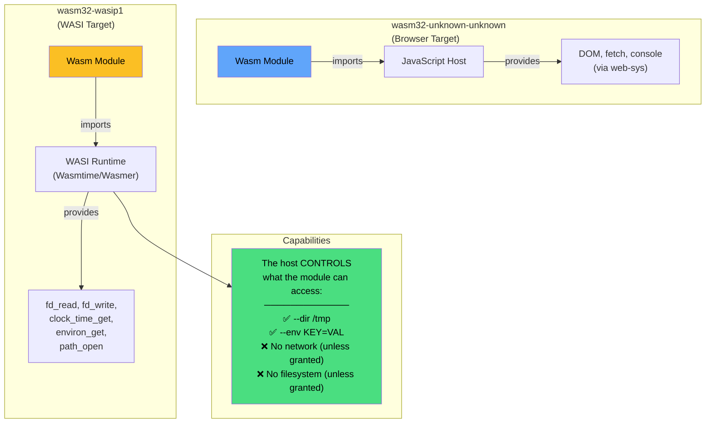
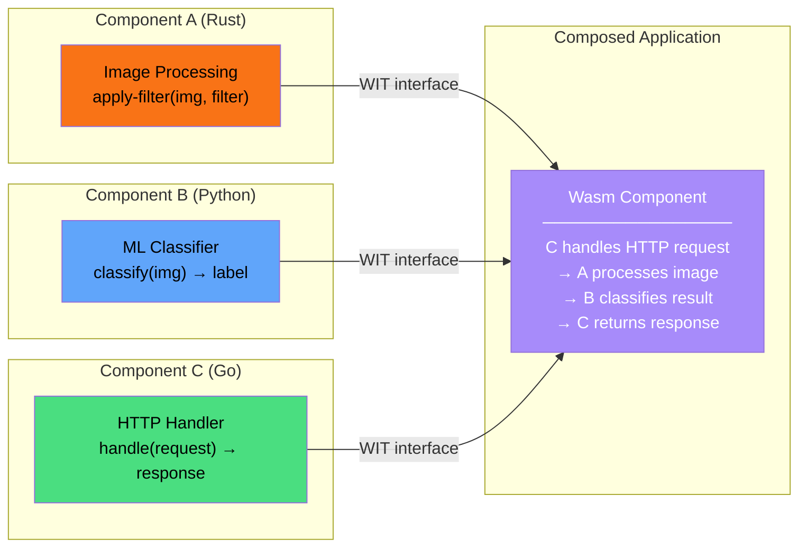

# 6. The WebAssembly System Interface (WASI) 🟡

> **What you'll learn:**
> - What WASI is and why it exists — a standardized, capability-based system interface for Wasm modules running **outside** the browser.
> - The `wasm32-wasip1` target: how it gives Wasm modules access to files, environment variables, clocks, and (limited) networking through explicit capabilities.
> - Why Wasm is being called "the next Docker" — instant startup, universal portability, and sandboxing by default.
> - The WASI Component Model and how it enables composing Wasm modules from different languages.

---

## From the Browser to... Everywhere

In Parts I–II, we compiled Rust to `wasm32-unknown-unknown` — a target with **no OS**, designed to run inside a JavaScript engine. But WebAssembly's portability promise extends far beyond browsers:

| Where | Runtime | What It Does |
|---|---|---|
| Browser | V8, SpiderMonkey, JavaScriptCore | `wasm32-unknown-unknown` — JS host provides APIs |
| Server | Wasmtime, Wasmer, WasmEdge | `wasm32-wasip1` — WASI provides OS-like capabilities |
| CDN Edge | Cloudflare Workers (V8), Fermyon Spin (Wasmtime) | `wasm32-wasip1` — HTTP handling at the edge |
| IoT / Embedded | Wasm Micro Runtime (WAMR) | Lightweight Wasm execution on microcontrollers |
| Plugin Systems | Any host embedding Wasmtime | Sandboxed extensibility (e.g., Envoy proxy, Zellij terminal) |

WASI (WebAssembly System Interface) is the **standard interface** that allows Wasm modules to interact with the outside world — files, environment variables, clocks, random numbers, and soon networking — without being tied to JavaScript or any specific runtime.



---

## The Capability-Based Security Model

This is the most important concept in WASI. Traditional OS security is **ambient authority**: a process can access any file the user can access. WASI flips this to **capability-based** security: a module can access **nothing** unless the host explicitly grants it.

```bash
# Native binary — has ambient authority to the entire filesystem
./my-program
# Can read ANY file the user has permissions for. No restrictions.

# WASI module — sandboxed by default
wasmtime my-program.wasm
# Cannot read ANY files. Cannot access the network. Cannot see env vars.
# The module starts with ZERO capabilities.

# Grant specific capabilities:
wasmtime my-program.wasm \
    --dir /data:/data            \     # Map host /data → module /data (read-write)
    --dir /config:/config:readonly \   # Map host /config → module /config (read-only)
    --env "API_KEY=secret123"    \     # Expose one environment variable
    --env "DB_HOST=localhost"          # Expose another
```

### Comparison with Containers

| Aspect | Docker Container | WASI Module |
|---|---|---|
| **Startup time** | 50–500ms (depends on image layers) | **< 1ms** (Wasmtime pre-compiled) |
| **Image size** | 50 MB – 1 GB | **100 KB – 5 MB** |
| **Isolation** | Linux namespaces + cgroups | **Wasm sandbox** (no kernel required) |
| **Default access** | Full filesystem inside container | **Nothing** (must grant capabilities) |
| **Portability** | Linux/amd64, Linux/arm64 (per image) | **Universal** — one `.wasm` runs everywhere |
| **Language support** | Any (it's a full Linux) | Rust, C/C++, Go, Python (via Wasm compilers) |
| **Cold start** | Seconds (pull + unpack) | **Microseconds** (pre-compiled module) |
| **Composability** | Container orchestration (Kubernetes) | **Component Model** (link Wasm modules) |

Solomon Hykes (Docker co-founder) famously said:
> "If WASM+WASI existed in 2008, we wouldn't have needed to create Docker."

---

## Your First WASI Program

### Step 1: Install the Target and Runtime

```bash
# Add the WASI target
rustup target add wasm32-wasip1

# Install Wasmtime (the reference WASI runtime)
curl https://wasmtime.dev/install.sh -sSf | bash

# Verify
wasmtime --version
```

### Step 2: Write a Standard Rust Program

```rust
// src/main.rs
// This is NORMAL Rust code. std::fs, std::env, println! — they all work.
// The Rust standard library's WASI implementation translates these
// into WASI system calls (fd_read, fd_write, environ_get, etc.).

use std::env;
use std::fs;
use std::io::{self, Read};

fn main() -> io::Result<()> {
    // Read environment variables (requires --env grants)
    println!("=== Environment ===");
    for (key, value) in env::vars() {
        println!("  {key}={value}");
    }

    // Read a file (requires --dir grant)
    println!("\n=== File Contents ===");
    match fs::read_to_string("/data/input.txt") {
        Ok(content) => println!("  {content}"),
        Err(e) => println!("  Error reading file: {e}"),
    }

    // Write a file (requires --dir grant with write access)
    fs::write("/data/output.txt", "Written from WASI!")?;
    println!("Wrote output.txt");

    // Read from stdin
    println!("\n=== Reading stdin ===");
    let mut input = String::new();
    io::stdin().read_to_string(&mut input)?;
    println!("Got: {input}");

    Ok(())
}
```

### Step 3: Build and Run

```bash
# Build for WASI
cargo build --target wasm32-wasip1 --release

# The output is a .wasm file (not a native binary)
ls -lh target/wasm32-wasip1/release/my-program.wasm
# → 1.2M (much smaller than a Docker image!)

# Run with Wasmtime — grant specific capabilities
echo "Hello from a file!" > /tmp/wasi-data/input.txt
echo "Some input" | wasmtime target/wasm32-wasip1/release/my-program.wasm \
    --dir /tmp/wasi-data:/data \
    --env "APP_NAME=WasiDemo" \
    --env "VERSION=1.0"

# Output:
# === Environment ===
#   APP_NAME=WasiDemo
#   VERSION=1.0
#
# === File Contents ===
#   Hello from a file!
# Wrote output.txt
#
# === Reading stdin ===
# Got: Some input
```

### What Happens Without Capabilities

```bash
# Run WITHOUT granting file access
wasmtime target/wasm32-wasip1/release/my-program.wasm

# Output:
# === Environment ===
#   (nothing — no env vars granted)
#
# === File Contents ===
#   Error reading file: Permission denied (os error 76)
#                                         ^^^^^^^^^^
# WASI error: the module tried to access /data/input.txt
# but no directory capability was granted for /data.
```

The module didn't crash. It got a clean error. **The sandbox enforced the policy without the module needing to cooperate.** This is fundamentally different from file permissions in Linux — the module has no way to bypass the restriction because it has no system calls to try.

---

## WASI APIs: What's Available

WASI is modular. The current stable specification (`wasip1`) includes:

| API Group | WASI Functions | Rust `std` Mapping |
|---|---|---|
| **I/O** | `fd_read`, `fd_write`, `fd_seek`, `fd_close` | `std::io::Read`, `std::io::Write`, `File` |
| **Filesystem** | `path_open`, `path_create_directory`, `path_readlink` | `std::fs::File`, `std::fs::create_dir` |
| **Environment** | `environ_get`, `environ_sizes_get` | `std::env::vars()`, `std::env::var()` |
| **Clock** | `clock_time_get`, `clock_res_get` | `std::time::Instant`, `std::time::SystemTime` |
| **Random** | `random_get` | `getrandom` crate, `rand` crate |
| **Process** | `proc_exit`, `sched_yield` | `std::process::exit()` |
| **Args** | `args_get`, `args_sizes_get` | `std::env::args()` |

### What's NOT in `wasip1`

| Missing API | Status | Workaround |
|---|---|---|
| **Networking (sockets)** | `wasip2` (Component Model) | Use runtime-specific extensions or `wasip2` |
| **Threads** | `wasi-threads` proposal (experimental) | Single-threaded only in `wasip1` |
| **GPU / Graphics** | Not planned for WASI | Use browser Wasm + WebGL/WebGPU instead |
| **Signals** | Not applicable | Wasm has no signal concept |

---

## `wasip2` and the Component Model

WASI Preview 2 (`wasip2`) introduces the **Component Model** — a major evolution that enables:

1. **Interface Types** — rich types (strings, records, lists, variants) at the module boundary, not just `i32`.
2. **Composability** — link multiple Wasm components together, each potentially written in a different language.
3. **Networking** — `wasi:http/outgoing-handler` for making HTTP requests.
4. **Async** — first-class async support for non-blocking I/O.

```rust
// With wasip2, you can define typed interfaces using WIT (Wasm Interface Types)

// my-component.wit
// package my-company:image-processor@1.0.0;
//
// interface process {
//     record image {
//         width: u32,
//         height: u32,
//         pixels: list<u8>,
//     }
//
//     enum filter {
//         sepia,
//         grayscale,
//         blur,
//     }
//
//     apply-filter: func(img: image, f: filter) -> image;
// }
```



---

## Practical Example: A CLI Tool as a WASI Module

Here's a real-world example: a JSON-to-CSV converter that runs as a sandboxed WASI module.

```rust
// src/main.rs
use std::env;
use std::fs;
use std::io::{self, BufRead, Write};

#[derive(serde::Deserialize)]
struct Record {
    name: String,
    age: u32,
    city: String,
}

fn main() -> io::Result<()> {
    let args: Vec<String> = env::args().collect();

    let (input_path, output_path) = match args.as_slice() {
        [_, input, output] => (input.as_str(), output.as_str()),
        _ => {
            eprintln!("Usage: json2csv <input.json> <output.csv>");
            std::process::exit(1);
        }
    };

    // Read input JSON (requires --dir capability for the input directory)
    let json_data = fs::read_to_string(input_path)?;
    let records: Vec<Record> = serde_json::from_str(&json_data)
        .map_err(|e| io::Error::new(io::ErrorKind::InvalidData, e))?;

    // Write CSV output (requires --dir capability for the output directory)
    let mut output = fs::File::create(output_path)?;
    writeln!(output, "name,age,city")?;
    for record in &records {
        writeln!(output, "{},{},{}", record.name, record.age, record.city)?;
    }

    println!("Converted {} records to CSV", records.len());
    Ok(())
}
```

```bash
# Build
cargo build --target wasm32-wasip1 --release

# Run — note: we grant access to SPECIFIC directories only
wasmtime target/wasm32-wasip1/release/json2csv.wasm \
    --dir /tmp/data:/data \
    -- /data/input.json /data/output.csv

# The module can ONLY access files under /data.
# It cannot read your home directory, SSH keys, or anything else.
```

### Pre-Compilation for Instant Startup

```bash
# Pre-compile the Wasm module to native code (platform-specific)
wasmtime compile target/wasm32-wasip1/release/json2csv.wasm \
    -o json2csv.cwasm

# Run the pre-compiled module — startup in MICROSECONDS
wasmtime run json2csv.cwasm \
    --dir /tmp/data:/data \
    -- /data/input.json /data/output.csv
```

| Execution Mode | Startup Time | Use Case |
|---|---|---|
| Interpreted (`*.wasm`) | ~5ms | Development, one-off scripts |
| JIT-compiled | ~10ms first run, then fast | Long-running processes |
| AOT pre-compiled (`*.cwasm`) | **< 100µs** | Edge workers, serverless, hot paths |

---

## Testing WASI Modules

You can test WASI modules using standard Rust tests with `cargo test`, but execution requires a WASI-compatible test runner:

```bash
# Install the WASI test runner
cargo install cargo-wasi

# Run tests targeting WASI
cargo wasi test

# Or configure .cargo/config.toml for automatic test running:
```

```toml
# .cargo/config.toml
[target.wasm32-wasip1]
runner = "wasmtime --dir ."
```

```bash
# Now `cargo test --target wasm32-wasip1` uses wasmtime as the test runner
cargo test --target wasm32-wasip1
```

---

<details>
<summary><strong>🏋️ Exercise: Sandboxed Log Analyzer</strong> (click to expand)</summary>

**Challenge:** Build a WASI module that:

1. Reads a log file from a granted directory (e.g., `/logs/app.log`).
2. Parses each line for a pattern (e.g., `ERROR`, `WARN`, `INFO`).
3. Writes a summary report to a granted output directory (e.g., `/output/report.txt`).
4. Reads a configuration file (e.g., `/config/settings.json`) specifying which log levels to include.
5. Demonstrate that the module **cannot** access any paths outside the granted directories.

<details>
<summary>🔑 Solution</summary>

```rust
// src/main.rs
use std::collections::HashMap;
use std::fs;
use std::io::{self, Write};

#[derive(serde::Deserialize)]
struct Config {
    /// Which log levels to include in the report
    levels: Vec<String>,
    /// Whether to include line numbers
    show_line_numbers: bool,
}

fn main() -> io::Result<()> {
    // Read configuration (requires --dir for /config)
    let config: Config = match fs::read_to_string("/config/settings.json") {
        Ok(json) => serde_json::from_str(&json)
            .map_err(|e| io::Error::new(io::ErrorKind::InvalidData, e))?,
        Err(_) => {
            // Default config if no settings file is granted
            eprintln!("No config file found, using defaults");
            Config {
                levels: vec![
                    "ERROR".to_string(),
                    "WARN".to_string(),
                    "INFO".to_string(),
                ],
                show_line_numbers: true,
            }
        }
    };

    // Read the log file (requires --dir for /logs)
    let log_content = fs::read_to_string("/logs/app.log")?;

    // Count occurrences of each level
    let mut counts: HashMap<&str, u32> = HashMap::new();
    let mut matching_lines: Vec<(usize, &str, &str)> = Vec::new(); // (line_num, level, line)

    for (line_num, line) in log_content.lines().enumerate() {
        for level in &config.levels {
            if line.contains(level.as_str()) {
                *counts.entry(level.as_str()).or_insert(0) += 1;
                matching_lines.push((line_num + 1, level, line));
                break; // Count each line once
            }
        }
    }

    // Write the report (requires --dir for /output)
    let mut report = fs::File::create("/output/report.txt")?;
    writeln!(report, "=== Log Analysis Report ===")?;
    writeln!(report, "Total lines scanned: {}", log_content.lines().count())?;
    writeln!(report)?;

    writeln!(report, "--- Summary ---")?;
    for level in &config.levels {
        let count = counts.get(level.as_str()).unwrap_or(&0);
        writeln!(report, "  {level}: {count}")?;
    }

    writeln!(report)?;
    writeln!(report, "--- Matching Lines ---")?;
    for (line_num, level, line) in &matching_lines {
        if config.show_line_numbers {
            writeln!(report, "  [{level}] L{line_num}: {line}")?;
        } else {
            writeln!(report, "  [{level}]: {line}")?;
        }
    }

    println!("Report written to /output/report.txt");
    println!("Found {} matching lines", matching_lines.len());

    // Demonstrate sandbox: try to access an unauthorized path
    match fs::read_to_string("/etc/passwd") {
        Ok(_) => println!("BUG: Should not be able to read /etc/passwd!"),
        Err(e) => println!("Sandbox working: Cannot read /etc/passwd: {e}"),
    }

    Ok(())
}
```

```bash
# Build for WASI
cargo build --target wasm32-wasip1 --release

# Create test data
mkdir -p /tmp/wasi-test/{logs,config,output}
cat > /tmp/wasi-test/logs/app.log << 'EOF'
2024-01-15 10:00:01 INFO  Server started on port 8080
2024-01-15 10:00:05 INFO  Connected to database
2024-01-15 10:01:23 WARN  High memory usage: 85%
2024-01-15 10:02:45 ERROR Failed to process request: timeout
2024-01-15 10:03:00 INFO  Request processed successfully
2024-01-15 10:05:12 ERROR Database connection lost
2024-01-15 10:05:15 WARN  Retrying database connection
2024-01-15 10:05:16 INFO  Database reconnected
EOF

cat > /tmp/wasi-test/config/settings.json << 'EOF'
{"levels": ["ERROR", "WARN"], "show_line_numbers": true}
EOF

# Run with SPECIFIC capabilities — the module can ONLY access these directories
wasmtime target/wasm32-wasip1/release/log-analyzer.wasm \
    --dir /tmp/wasi-test/logs:/logs:readonly \
    --dir /tmp/wasi-test/config:/config:readonly \
    --dir /tmp/wasi-test/output:/output

# Output:
# Report written to /output/report.txt
# Found 4 matching lines
# Sandbox working: Cannot read /etc/passwd: Permission denied

cat /tmp/wasi-test/output/report.txt
# === Log Analysis Report ===
# Total lines scanned: 8
#
# --- Summary ---
#   ERROR: 2
#   WARN: 2
#
# --- Matching Lines ---
#   [WARN] L3: 2024-01-15 10:01:23 WARN  High memory usage: 85%
#   [ERROR] L4: 2024-01-15 10:02:45 ERROR Failed to process request: timeout
#   [ERROR] L6: 2024-01-15 10:05:12 ERROR Database connection lost
#   [WARN] L7: 2024-01-15 10:05:15 WARN  Retrying database connection
```

**Key takeaway:** The module had read-only access to `/logs` and `/config`, write access to `/output`, and **zero access** to anything else. The host (Wasmtime) enforced this — the module had no way to escape its sandbox.

</details>
</details>

---

> **Key Takeaways**
> - **WASI** is a standardized system interface for Wasm modules running outside the browser. It provides file I/O, environment variables, clocks, and random numbers through explicit **capabilities**.
> - **Capability-based security** means modules start with ZERO access. The host must explicitly grant `--dir`, `--env`, and other capabilities. There is no ambient authority.
> - **`wasm32-wasip1`** lets you write standard Rust code that uses `std::fs`, `std::env`, and `println!` — the standard library handles the WASI translation.
> - **Instant startup** (< 100µs) with AOT pre-compilation makes WASI ideal for serverless, edge workers, and plugin systems.
> - **Universal portability**: one `.wasm` file runs on Linux, macOS, Windows, and every WASI-compatible runtime — no recompilation needed.
> - **The Component Model** (`wasip2`) adds typed interfaces, composability across languages, and networking — the future of modular Wasm.

> **See also:**
> - [Chapter 7: Rust at the Edge](ch07-rust-at-the-edge.md) — deploying WASI modules to Cloudflare Workers and Fermyon Spin.
> - [Chapter 1: Linear Memory](ch01-linear-memory.md) — the memory model that WASI modules still operate within.
> - [Embedded Rust companion guide](../embedded-book/src/SUMMARY.md) — `no_std` constraints that overlap with WASI's sandboxed environment.
