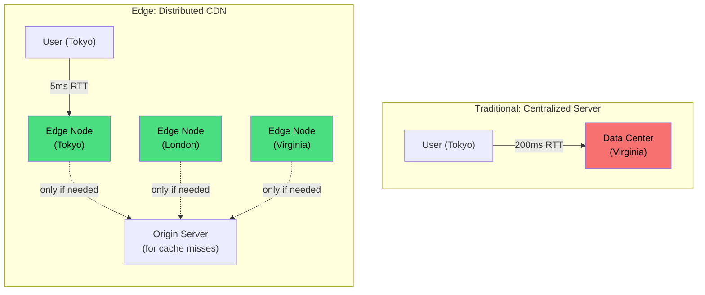
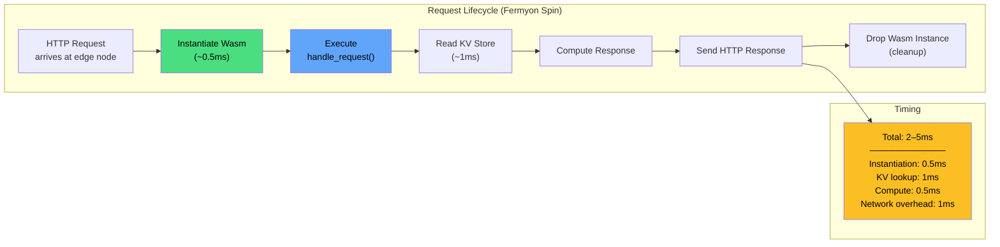

# 7. Rust at the Edge 🔴

> **What you'll learn:**
> - What "the edge" means: executing code at CDN nodes globally, milliseconds from the user, instead of in a centralized data center.
> - How Cloudflare Workers (V8 isolates) and Fermyon Spin (Wasmtime) run Rust Wasm modules at the edge with sub-millisecond cold starts.
> - How to handle HTTP requests, use key-value stores, and manage state at the edge.
> - The production tradeoffs: memory limits, execution time limits, cold starts, and debugging in a distributed CDN.

---

## What Is "The Edge"?

In traditional cloud architecture, your server runs in one region (e.g., `us-east-1`). A user in Tokyo makes a request that travels ~15,000 km to Virginia and back — adding 200–300ms of latency that no amount of code optimization can fix.

"The edge" means running your code **at the CDN node closest to the user** — there are 200+ such nodes globally. The request never leaves the user's continent.

| Deployment | Latency (Tokyo → Server) | Where Code Runs |
|---|---|---|
| US East data center | 200–300ms round-trip | Virginia |
| Edge (CDN node in Tokyo) | **5–20ms round-trip** | Tokyo |
| User's browser (Wasm) | **0ms** (local) | User's device |



### Why Wasm for the Edge?

Edge platforms need workloads that:
1. **Start instantly** — you can't afford 100ms JVM cold starts when the whole request budget is 50ms.
2. **Are sandboxed** — thousands of different customers' code runs on the same machine.
3. **Are portable** — the same code must run on x86 nodes, ARM nodes, and different OS versions.
4. **Are lightweight** — a CDN node serves thousands of concurrent tenants; containers are too heavy.

Wasm checks every box. That's why Cloudflare, Fastly, Fermyon, Netlify, and Vercel all offer Wasm-based edge runtimes.

| Platform | Execution Engine | Wasm Target | Key Feature |
|---|---|---|---|
| **Cloudflare Workers** | V8 Isolates | `wasm32-unknown-unknown` | Massive global network (300+ cities), KV/R2/D1/Durable Objects |
| **Fermyon Spin** | Wasmtime | `wasm32-wasip1` | Component Model, local dev, open-source runtime |
| **Fastly Compute** | Wasmtime | `wasm32-wasip1` | Low-level control, Varnish-grade caching |
| **Netlify Edge Functions** | Deno + V8 | `wasm32-unknown-unknown` | Integrates with Netlify's JAMstack |
| **Vercel Edge Runtime** | V8 | `wasm32-unknown-unknown` | Next.js integration |

---

## Cloudflare Workers: V8 Isolates

Cloudflare Workers run inside **V8 isolates** — the same JavaScript engine that powers Chrome. Your Rust Wasm executes inside V8's Wasm runtime, sandboxed alongside JavaScript.

### Setup

```bash
# Install the Workers CLI
npm install -g wrangler

# Create a new Rust Workers project
npx wrangler generate my-worker --template https://github.com/cloudflare/workers-rs
cd my-worker
```

```toml
# Cargo.toml
[package]
name = "my-worker"
version = "0.1.0"
edition = "2021"

[lib]
crate-type = ["cdylib"]

[dependencies]
worker = "0.3"
worker-macros = "0.3"
serde = { version = "1", features = ["derive"] }
serde_json = "1"
console_error_panic_hook = "0.1"
```

### A Complete Cloudflare Worker in Rust

```rust
use worker::*;
use serde::{Deserialize, Serialize};

#[derive(Serialize, Deserialize)]
struct ApiResponse {
    message: String,
    timestamp: u64,
    edge_location: String,
}

#[event(fetch)]
async fn main(req: Request, env: Env, _ctx: Context) -> Result<Response> {
    console_error_panic_hook::set_once();

    // Route requests
    let router = Router::new();
    router
        .get_async("/", handle_root)
        .get_async("/api/data", handle_api)
        .post_async("/api/process", handle_process)
        .get_async("/api/kv/:key", handle_kv_get)
        .put_async("/api/kv/:key", handle_kv_put)
        .run(req, env)
        .await
}

async fn handle_root(_req: Request, _ctx: RouteContext<()>) -> Result<Response> {
    Response::ok("Hello from Rust at the edge! 🦀")
}

async fn handle_api(_req: Request, ctx: RouteContext<()>) -> Result<Response> {
    let resp = ApiResponse {
        message: "Response from the nearest edge node".into(),
        timestamp: js_sys::Date::now() as u64,
        edge_location: ctx
            .req
            .headers()
            .get("cf-ray")?
            .unwrap_or_default(),
    };
    Response::from_json(&resp)
}

/// Process data at the edge — no round-trip to an origin server.
async fn handle_process(mut req: Request, _ctx: RouteContext<()>) -> Result<Response> {
    // Read the request body as bytes
    let body = req.bytes().await?;

    // Process it (e.g., hash, transform, validate)
    let hash = compute_hash(&body);
    let size = body.len();

    Response::from_json(&serde_json::json!({
        "original_size": size,
        "hash": format!("{hash:016x}"),
        "processed_at": "edge",
    }))
}

fn compute_hash(data: &[u8]) -> u64 {
    let mut hash: u64 = 0xcbf29ce484222325; // FNV-1a offset basis
    for &byte in data {
        hash ^= byte as u64;
        hash = hash.wrapping_mul(0x100000001b3);
    }
    hash
}

// ─── Key-Value Storage ─────────────────────────────────────────

/// Read from Cloudflare KV (globally distributed key-value store)
async fn handle_kv_get(_req: Request, ctx: RouteContext<()>) -> Result<Response> {
    let key = ctx.param("key").unwrap();
    let kv = ctx.kv("MY_KV_NAMESPACE")?;

    match kv.get(key).text().await? {
        Some(value) => Response::ok(value),
        None => Response::error("Key not found", 404),
    }
}

/// Write to Cloudflare KV
async fn handle_kv_put(mut req: Request, ctx: RouteContext<()>) -> Result<Response> {
    let key = ctx.param("key").unwrap();
    let value = req.text().await?;
    let kv = ctx.kv("MY_KV_NAMESPACE")?;

    kv.put(key, value)?
        .expiration_ttl(3600) // Expire after 1 hour
        .execute()
        .await?;

    Response::ok("Stored")
}
```

### Wrangler Configuration

```toml
# wrangler.toml
name = "my-rust-worker"
main = "build/worker/shim.mjs"
compatibility_date = "2024-01-01"

[build]
command = "cargo install -q worker-build && worker-build --release"

[[kv_namespaces]]
binding = "MY_KV_NAMESPACE"
id = "YOUR_KV_NAMESPACE_ID"
```

```bash
# Develop locally
wrangler dev

# Deploy to Cloudflare's global network (300+ cities)
wrangler publish
```

---

## Fermyon Spin: Wasmtime-Based Edge

Fermyon Spin uses Wasmtime (not V8) and targets `wasm32-wasip1`. It fully embraces the WASI Component Model and is open-source — you can run it locally, in Kubernetes, or on Fermyon Cloud.

### Setup

```bash
# Install Spin
curl -fsSL https://developer.fermyon.com/downloads/install.sh | bash
sudo mv spin /usr/local/bin/

# Create a new Rust Spin application
spin new -t http-rust my-spin-app
cd my-spin-app
```

### A Complete Spin Application

```rust
// src/lib.rs
use spin_sdk::http::{IntoResponse, Request, Response};
use spin_sdk::http_component;
use spin_sdk::key_value::Store;
use serde::{Deserialize, Serialize};

#[derive(Serialize, Deserialize)]
struct ProcessResult {
    input_size: usize,
    output_size: usize,
    operation: String,
}

/// The entry point for the Spin HTTP component.
/// Each request creates a NEW Wasm instance — cold start must be fast.
/// With Wasmtime AOT compilation, cold start is < 1ms.
#[http_component]
fn handle_request(req: Request) -> anyhow::Result<impl IntoResponse> {
    let path = req.uri().path();
    let method = req.method().as_str();

    match (method, path) {
        ("GET", "/") => Ok(Response::builder()
            .status(200)
            .header("content-type", "text/plain")
            .body("Hello from Rust + Spin at the edge! 🦀")
            .build()),

        ("POST", "/process") => handle_process(req),

        ("GET", path) if path.starts_with("/kv/") => handle_kv_get(path),
        ("PUT", path) if path.starts_with("/kv/") => handle_kv_put(req, path),

        _ => Ok(Response::builder()
            .status(404)
            .body("Not Found")
            .build()),
    }
}

fn handle_process(req: Request) -> anyhow::Result<impl IntoResponse> {
    let body = req.body();

    // ✅ Process the bytes entirely inside the Wasm module.
    // No network round-trips. No origin server. Pure computation at the edge.
    let processed: Vec<u8> = body
        .iter()
        .map(|b| b.wrapping_add(1))  // Simple transform — replace with real logic
        .collect();

    let result = ProcessResult {
        input_size: body.len(),
        output_size: processed.len(),
        operation: "byte_increment".to_string(),
    };

    Ok(Response::builder()
        .status(200)
        .header("content-type", "application/json")
        .body(serde_json::to_string(&result)?)
        .build())
}

fn handle_kv_get(path: &str) -> anyhow::Result<impl IntoResponse> {
    let key = &path[4..]; // Strip "/kv/" prefix
    let store = Store::open_default()?;

    match store.get(key)? {
        Some(value) => Ok(Response::builder()
            .status(200)
            .body(value)
            .build()),
        None => Ok(Response::builder()
            .status(404)
            .body("Key not found")
            .build()),
    }
}

fn handle_kv_put(req: Request, path: &str) -> anyhow::Result<impl IntoResponse> {
    let key = &path[4..];
    let store = Store::open_default()?;

    store.set(key, req.body())?;

    Ok(Response::builder()
        .status(200)
        .body("Stored")
        .build())
}
```

### Spin Configuration

```toml
# spin.toml
spin_manifest_version = 2

[application]
name = "my-spin-app"
version = "0.1.0"

[[trigger.http]]
route = "/..."
component = "my-spin-app"

[component.my-spin-app]
source = "target/wasm32-wasip1/release/my_spin_app.wasm"
allowed_outbound_hosts = ["https://api.example.com"]
key_value_stores = ["default"]

[component.my-spin-app.build]
command = "cargo build --target wasm32-wasip1 --release"
```

```bash
# Build and run locally
spin build
spin up
# → Serving on http://127.0.0.1:3000

# Deploy to Fermyon Cloud
spin cloud deploy
```

---

## Cold Starts: The Edge Performance Story

Cold start — the time from receiving a request to executing the first line of your code — is the critical metric for edge workloads.

| Platform | Runtime | Cold Start | Explanation |
|---|---|---|---|
| AWS Lambda (Node.js) | V8 | **100–500ms** | JIT compilation + module init |
| AWS Lambda (Java) | JVM | **500–5000ms** | JVM startup + classloading |
| Cloudflare Workers (JS) | V8 Isolate | **< 5ms** | Isolate creation + JS parse |
| Cloudflare Workers (Wasm) | V8 Isolate | **< 5ms** | Isolate + Wasm compile (cached) |
| Fermyon Spin (Wasm) | Wasmtime AOT | **< 1ms** | Pre-compiled, no JIT needed |
| Fastly Compute (Wasm) | Wasmtime AOT | **< 1ms** | Pre-compiled modules |



---

## Edge State: KV, Durable Objects, and Databases

Stateless compute at the edge is straightforward. **State** is the hard part. Each platform offers different state primitives:

### Cloudflare State Options

| Primitive | Consistency | Latency | Use Case |
|---|---|---|---|
| **KV** | Eventually consistent (~60s) | Fast reads (cached at edge) | Configuration, feature flags, static data |
| **R2** | Strong consistency | Moderate | Object storage (images, files) |
| **D1** | Strong consistency | Moderate | SQLite-based relational database |
| **Durable Objects** | Strong consistency, single-threaded | Low (co-located) | Coordination, counters, WebSocket servers |

### Fermyon State Options

| Primitive | Consistency | Latency | Use Case |
|---|---|---|---|
| **Key-Value Store** | Strong consistency | Low | Session data, counters, caches |
| **SQLite** | Strong consistency | Low | Relational data |
| **Outbound HTTP** | N/A | Depends on origin | Call external APIs |

### Example: Rate Limiter at the Edge

```rust
use worker::*;

/// A simple rate limiter using Durable Objects.
/// Each IP gets a Durable Object that tracks its request count.
#[durable_object]
pub struct RateLimiter {
    state: State,
    env: Env,
}

#[durable_object]
impl DurableObject for RateLimiter {
    fn new(state: State, env: Env) -> Self {
        Self { state, env }
    }

    async fn fetch(&mut self, req: Request) -> Result<Response> {
        // Get current request count (stored in Durable Object storage)
        let count: u32 = self.state.storage()
            .get("count")
            .await
            .unwrap_or(0);

        let window_start: u64 = self.state.storage()
            .get("window_start")
            .await
            .unwrap_or(0);

        let now = js_sys::Date::now() as u64;
        let window_ms = 60_000; // 1-minute window
        let max_requests = 100;

        // Reset window if expired
        let (count, window_start) = if now - window_start > window_ms {
            (0, now)
        } else {
            (count, window_start)
        };

        if count >= max_requests {
            return Response::error("Rate limit exceeded", 429);
        }

        // Increment count
        self.state.storage().put("count", count + 1).await?;
        self.state.storage().put("window_start", window_start).await?;

        Response::ok(format!("OK ({}/{max_requests} requests this window)", count + 1))
    }
}
```

---

## Platform Comparison: Cloudflare vs Spin

| Aspect | Cloudflare Workers | Fermyon Spin |
|---|---|---|
| **Wasm Target** | `wasm32-unknown-unknown` | `wasm32-wasip1` |
| **Engine** | V8 (shared with JS) | Wasmtime (dedicated Wasm) |
| **JS Interop** | Full (workers-rs wraps JS APIs) | None (pure WASI) |
| **State** | KV, R2, D1, Durable Objects, Queues | Key-Value, SQLite |
| **Network** | Global (300+ cities) | Fermyon Cloud or self-hosted |
| **Local Dev** | `wrangler dev` (V8-based) | `spin up` (Wasmtime) |
| **Open Source** | Runtime is closed-source | Fully open-source (Apache 2.0) |
| **Pricing** | Free tier + pay-per-request | Free tier + pay-per-request |
| **Best For** | Global distribution, JS integration | Component Model, open-source, maximum Wasm-native |

---

## Production Considerations

### Memory and Execution Limits

| Platform | Memory Limit | CPU Time Limit | Request Size Limit |
|---|---|---|---|
| Cloudflare Workers (Free) | 128 MB | 10ms | 100 MB |
| Cloudflare Workers (Paid) | 128 MB | 30s (50ms CPU) | 100 MB |
| Fermyon Cloud | 256 MB | 30s | Configurable |
| Fastly Compute | 150 MB | 60s | 8 MB (default) |

### Debugging Edge Deployments

```rust
// Cloudflare Workers — structured logging
use worker::*;

#[event(fetch)]
async fn main(req: Request, _env: Env, ctx: Context) -> Result<Response> {
    // console_log! writes to `wrangler tail` output
    console_log!("Request: {} {}", req.method(), req.path());

    let start = js_sys::Date::now();
    let result = process_request(req).await;
    let duration = js_sys::Date::now() - start;

    console_log!("Response generated in {duration:.1}ms");

    result
}
```

```bash
# Tail live logs from deployed Workers
wrangler tail --format=pretty

# Spin local logging
RUST_LOG=spin=trace spin up
```

---

<details>
<summary><strong>🏋️ Exercise: Global URL Shortener at the Edge</strong> (click to expand)</summary>

**Challenge:** Build a URL shortener that runs entirely at the edge:

1. `POST /shorten` with a JSON body `{"url": "https://..."}` creates a short code and stores the mapping in KV.
2. `GET /:code` looks up the code in KV and returns a 302 redirect to the original URL.
3. `GET /stats/:code` returns the number of times the short URL has been visited.
4. All state is stored in the edge platform's KV store — no origin server needed.

Implement it for **either** Cloudflare Workers or Fermyon Spin.

<details>
<summary>🔑 Solution</summary>

**Fermyon Spin implementation:**

```rust
use spin_sdk::http::{IntoResponse, Request, Response};
use spin_sdk::http_component;
use spin_sdk::key_value::Store;
use serde::{Deserialize, Serialize};

#[derive(Deserialize)]
struct ShortenRequest {
    url: String,
}

#[derive(Serialize)]
struct ShortenResponse {
    short_code: String,
    short_url: String,
}

#[derive(Serialize)]
struct StatsResponse {
    short_code: String,
    original_url: String,
    visit_count: u64,
}

#[http_component]
fn handle_request(req: Request) -> anyhow::Result<impl IntoResponse> {
    let path = req.uri().path().to_string();
    let method = req.method().as_str().to_string();

    match (method.as_str(), path.as_str()) {
        ("POST", "/shorten") => shorten(req),
        ("GET", p) if p.starts_with("/stats/") => get_stats(&p[7..]),
        ("GET", p) if p.len() > 1 => redirect(&p[1..]),
        _ => Ok(Response::builder()
            .status(404)
            .body("Not Found")
            .build()),
    }
}

fn shorten(req: Request) -> anyhow::Result<impl IntoResponse> {
    let body: ShortenRequest = serde_json::from_slice(req.body())?;

    // Generate a short code from the URL hash (deterministic, no randomness needed)
    let code = generate_code(&body.url);

    let store = Store::open_default()?;

    // Store the mapping: code → URL
    store.set(&format!("url:{code}"), body.url.as_bytes())?;

    // Initialize visit counter
    store.set(&format!("visits:{code}"), &0u64.to_le_bytes())?;

    let response = ShortenResponse {
        short_code: code.clone(),
        short_url: format!("/{code}"),
    };

    Ok(Response::builder()
        .status(201)
        .header("content-type", "application/json")
        .body(serde_json::to_string(&response)?)
        .build())
}

fn redirect(code: &str) -> anyhow::Result<impl IntoResponse> {
    let store = Store::open_default()?;

    // Look up the original URL
    match store.get(&format!("url:{code}"))? {
        Some(url_bytes) => {
            // Increment visit counter
            let visits: u64 = store
                .get(&format!("visits:{code}"))?
                .map(|b| {
                    let arr: [u8; 8] = b.try_into().unwrap_or([0; 8]);
                    u64::from_le_bytes(arr)
                })
                .unwrap_or(0);
            store.set(
                &format!("visits:{code}"),
                &(visits + 1).to_le_bytes(),
            )?;

            let url = String::from_utf8(url_bytes)?;
            Ok(Response::builder()
                .status(302)
                .header("location", url.as_str())
                .body("")
                .build())
        }
        None => Ok(Response::builder()
            .status(404)
            .body("Short URL not found")
            .build()),
    }
}

fn get_stats(code: &str) -> anyhow::Result<impl IntoResponse> {
    let store = Store::open_default()?;

    let url = store
        .get(&format!("url:{code}"))?
        .map(|b| String::from_utf8(b).unwrap_or_default());

    let visits: u64 = store
        .get(&format!("visits:{code}"))?
        .map(|b| {
            let arr: [u8; 8] = b.try_into().unwrap_or([0; 8]);
            u64::from_le_bytes(arr)
        })
        .unwrap_or(0);

    match url {
        Some(url) => {
            let stats = StatsResponse {
                short_code: code.to_string(),
                original_url: url,
                visit_count: visits,
            };
            Ok(Response::builder()
                .status(200)
                .header("content-type", "application/json")
                .body(serde_json::to_string(&stats)?)
                .build())
        }
        None => Ok(Response::builder()
            .status(404)
            .body("Short URL not found")
            .build()),
    }
}

/// Generate a short code from a URL using FNV-1a hash, encoded as base36.
fn generate_code(url: &str) -> String {
    let mut hash: u64 = 0xcbf29ce484222325;
    for &byte in url.as_bytes() {
        hash ^= byte as u64;
        hash = hash.wrapping_mul(0x100000001b3);
    }
    // Take lower 32 bits and encode as base36 (alphanumeric)
    let code = hash as u32;
    format!("{code:0>6}", code = base36_encode(code))
}

fn base36_encode(mut n: u32) -> String {
    const CHARSET: &[u8] = b"0123456789abcdefghijklmnopqrstuvwxyz";
    if n == 0 {
        return "0".to_string();
    }
    let mut result = Vec::new();
    while n > 0 {
        result.push(CHARSET[(n % 36) as usize]);
        n /= 36;
    }
    result.reverse();
    String::from_utf8(result).unwrap()
}
```

```bash
# Build and test locally
spin build
spin up

# Test the shortener
curl -X POST http://localhost:3000/shorten \
    -H "Content-Type: application/json" \
    -d '{"url": "https://doc.rust-lang.org/book/"}'
# → {"short_code":"a1b2c3","short_url":"/a1b2c3"}

curl -v http://localhost:3000/a1b2c3
# → 302 redirect to https://doc.rust-lang.org/book/

curl http://localhost:3000/stats/a1b2c3
# → {"short_code":"a1b2c3","original_url":"https://doc.rust-lang.org/book/","visit_count":1}

# Deploy globally
spin cloud deploy
```

</details>
</details>

---

> **Key Takeaways**
> - **"The edge"** means running code at CDN nodes globally, 5–20ms from the user instead of 200–300ms from a central data center.
> - **Wasm is the ideal edge runtime**: sub-millisecond cold starts, universal portability, memory-safe sandboxing, and tiny binary sizes.
> - **Cloudflare Workers** use V8 isolates and target `wasm32-unknown-unknown`. Rich state primitives (KV, R2, D1, Durable Objects). Largest global network.
> - **Fermyon Spin** uses Wasmtime and targets `wasm32-wasip1`. Open-source, Component Model native, no JS dependency.
> - **Cold starts** for Wasm edge functions are typically < 1ms (AOT) — orders of magnitude faster than Lambda/Cloud Functions.
> - **State at the edge** is the hard problem. Choose the right primitive: KV for fast reads, Durable Objects/SQLite for strong consistency.
> - **Production limits** are real: 128–256 MB memory, CPU time limits, request size caps. Design for these constraints.

> **See also:**
> - [Chapter 6: WASI](ch06-wasi.md) — the capability model that Spin builds on.
> - [Chapter 8: Capstone](ch08-capstone-edge-image-processor.md) — deploying a complete image processor to the edge.
> - [Microservices companion guide](../microservices-book/src/SUMMARY.md) — when to use edge vs. traditional Axum servers.
