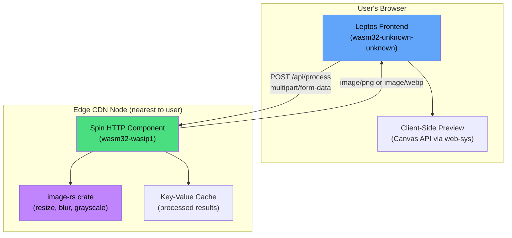
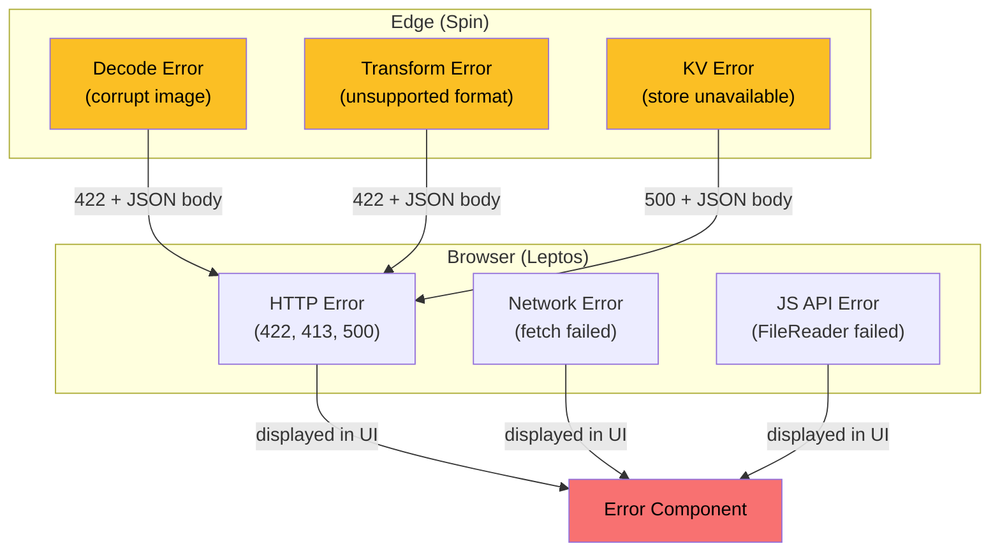

# 8. Capstone: Edge Image Processor 🔴

> **What you'll learn:**
> - How to combine every concept from this guide into a **production-quality, full-stack application**.
> - Build a Leptos frontend that captures and previews images entirely in the browser via Wasm.
> - Build an edge function (Fermyon Spin) that applies image transformations with zero cold-start overhead.
> - Use zero-copy memory management to process images without unnecessary allocations across the Wasm boundary.
> - Handle errors across the Rust→Wasm→HTTP→Rust pipeline with proper `Result`→HTTP status code propagation.

---

## Project Architecture

We'll build **EdgeImg** — an image resizing and format-conversion service that runs entirely on Wasm:

1. **Frontend** (Leptos + `wasm32-unknown-unknown`) — runs in the browser, provides a drag-and-drop UI, previews images client-side.
2. **Edge API** (Spin + `wasm32-wasip1`) — receives image bytes via HTTP, applies transformations (resize, blur, grayscale, format conversion), returns processed bytes.
3. **No origin server** — everything runs at the edge or in the browser. No S3, no Lambda, no EC2.



---

## Part 1: The Edge API (Fermyon Spin)

### Project Setup

```bash
spin new -t http-rust edge-img-api
cd edge-img-api
```

```toml
# Cargo.toml
[package]
name = "edge-img-api"
version = "0.1.0"
edition = "2021"

[lib]
crate-type = ["cdylib"]

[dependencies]
spin-sdk = "3"
anyhow = "1"
serde = { version = "1", features = ["derive"] }
serde_json = "1"
image = { version = "0.25", default-features = false, features = [
    "png", "jpeg", "webp", "gif", "bmp"
] }
```

### Image Processing Module

```rust
// src/processing.rs
use image::{DynamicImage, ImageFormat, ImageReader};
use std::io::Cursor;

/// Supported output formats.
#[derive(Debug, Clone, Copy)]
pub enum OutputFormat {
    Png,
    Jpeg,
    WebP,
}

impl OutputFormat {
    pub fn from_str(s: &str) -> Option<Self> {
        match s.to_lowercase().as_str() {
            "png" => Some(Self::Png),
            "jpg" | "jpeg" => Some(Self::Jpeg),
            "webp" => Some(Self::WebP),
            _ => None,
        }
    }

    pub fn image_format(self) -> ImageFormat {
        match self {
            Self::Png => ImageFormat::Png,
            Self::Jpeg => ImageFormat::Jpeg,
            Self::WebP => ImageFormat::WebP,
        }
    }

    pub fn content_type(self) -> &'static str {
        match self {
            Self::Png => "image/png",
            Self::Jpeg => "image/jpeg",
            Self::WebP => "image/webp",
        }
    }
}

/// All transformations a client can request.
#[derive(Debug, Clone)]
pub struct TransformParams {
    pub width: Option<u32>,
    pub height: Option<u32>,
    pub blur: Option<f32>,
    pub grayscale: bool,
    pub format: OutputFormat,
}

/// Decode image bytes, apply transformations, re-encode.
/// Returns (output_bytes, content_type).
pub fn process_image(
    input: &[u8],
    params: &TransformParams,
) -> anyhow::Result<(Vec<u8>, &'static str)> {
    // ── Decode ──────────────────────────────────
    let reader = ImageReader::new(Cursor::new(input))
        .with_guessed_format()
        .map_err(|e| anyhow::anyhow!("Failed to detect image format: {e}"))?;

    let mut img: DynamicImage = reader
        .decode()
        .map_err(|e| anyhow::anyhow!("Failed to decode image: {e}"))?;

    // ── Resize ──────────────────────────────────
    if let (Some(w), Some(h)) = (params.width, params.height) {
        // Clamp dimensions to prevent abuse
        let w = w.min(4096);
        let h = h.min(4096);
        img = img.resize_exact(w, h, image::imageops::FilterType::Lanczos3);
    } else if let Some(w) = params.width {
        let w = w.min(4096);
        img = img.resize(w, u32::MAX, image::imageops::FilterType::Lanczos3);
    } else if let Some(h) = params.height {
        let h = h.min(4096);
        img = img.resize(u32::MAX, h, image::imageops::FilterType::Lanczos3);
    }

    // ── Blur ────────────────────────────────────
    if let Some(sigma) = params.blur {
        let sigma = sigma.clamp(0.1, 20.0); // Prevent excessive blur
        img = img.blur(sigma);
    }

    // ── Grayscale ───────────────────────────────
    if params.grayscale {
        img = img.grayscale();
    }

    // ── Encode ──────────────────────────────────
    let mut output = Vec::new();
    img.write_to(&mut Cursor::new(&mut output), params.format.image_format())
        .map_err(|e| anyhow::anyhow!("Failed to encode image: {e}"))?;

    Ok((output, params.format.content_type()))
}
```

### HTTP Handler

```rust
// src/lib.rs
mod processing;

use spin_sdk::http::{IntoResponse, Request, Response};
use spin_sdk::http_component;
use spin_sdk::key_value::Store;
use processing::{OutputFormat, TransformParams};

/// Maximum input image size: 10 MB.
const MAX_INPUT_SIZE: usize = 10 * 1024 * 1024;

#[http_component]
fn handle_request(req: Request) -> anyhow::Result<impl IntoResponse> {
    let path = req.uri().path().to_string();
    let method = req.method().as_str().to_string();

    match (method.as_str(), path.as_str()) {
        ("GET", "/health") => Ok(Response::builder()
            .status(200)
            .body("OK")
            .build()),

        ("POST", "/api/process") => handle_process(req),

        ("OPTIONS", _) => Ok(cors_preflight()),

        _ => Ok(Response::builder()
            .status(404)
            .body("Not Found")
            .build()),
    }
}

fn handle_process(req: Request) -> anyhow::Result<impl IntoResponse> {
    let body = req.body();

    // ── Validate input size ─────────────────────
    if body.len() > MAX_INPUT_SIZE {
        return Ok(error_response(
            413,
            "Image too large. Maximum size is 10 MB.",
        ));
    }

    if body.is_empty() {
        return Ok(error_response(400, "Request body is empty."));
    }

    // ── Parse query parameters ──────────────────
    let query = req.uri().query().unwrap_or("");
    let params = parse_params(query);

    // ── Check cache ─────────────────────────────
    let cache_key = compute_cache_key(body, &query);
    let store = Store::open_default()?;

    if let Some(cached) = store.get(&cache_key)? {
        return Ok(Response::builder()
            .status(200)
            .header("content-type", params.format.content_type())
            .header("x-cache", "HIT")
            .header("access-control-allow-origin", "*")
            .body(cached)
            .build());
    }

    // ── Process image ───────────────────────────
    let (output, content_type) = match processing::process_image(body, &params) {
        Ok(result) => result,
        Err(e) => return Ok(error_response(422, &format!("Processing failed: {e}"))),
    };

    // ── Cache result ────────────────────────────
    // Only cache if the output is reasonable size (< 5 MB)
    if output.len() < 5 * 1024 * 1024 {
        let _ = store.set(&cache_key, &output);
    }

    Ok(Response::builder()
        .status(200)
        .header("content-type", content_type)
        .header("x-cache", "MISS")
        .header("access-control-allow-origin", "*")
        .body(output)
        .build())
}

fn parse_params(query: &str) -> TransformParams {
    let mut width = None;
    let mut height = None;
    let mut blur = None;
    let mut grayscale = false;
    let mut format = OutputFormat::Png;

    for pair in query.split('&') {
        if let Some((key, value)) = pair.split_once('=') {
            match key {
                "w" | "width" => width = value.parse().ok(),
                "h" | "height" => height = value.parse().ok(),
                "blur" => blur = value.parse().ok(),
                "grayscale" => grayscale = value == "true" || value == "1",
                "format" | "fmt" => {
                    if let Some(f) = OutputFormat::from_str(value) {
                        format = f;
                    }
                }
                _ => {}
            }
        }
    }

    TransformParams { width, height, blur, grayscale, format }
}

fn compute_cache_key(body: &[u8], query: &str) -> String {
    // FNV-1a hash of body + query params
    let mut hash: u64 = 0xcbf29ce484222325;
    for &byte in body.iter().chain(query.as_bytes()) {
        hash ^= byte as u64;
        hash = hash.wrapping_mul(0x100000001b3);
    }
    format!("img:{hash:016x}")
}

fn cors_preflight() -> Response {
    Response::builder()
        .status(204)
        .header("access-control-allow-origin", "*")
        .header("access-control-allow-methods", "POST, OPTIONS")
        .header("access-control-allow-headers", "Content-Type")
        .header("access-control-max-age", "86400")
        .body("")
        .build()
}

fn error_response(status: u16, message: &str) -> Response {
    Response::builder()
        .status(status)
        .header("content-type", "application/json")
        .header("access-control-allow-origin", "*")
        .body(
            serde_json::json!({ "error": message }).to_string(),
        )
        .build()
}
```

### Spin Configuration

```toml
# spin.toml
spin_manifest_version = 2

[application]
name = "edge-img-api"
version = "0.1.0"

[[trigger.http]]
route = "/..."
component = "edge-img-api"

[component.edge-img-api]
source = "target/wasm32-wasip1/release/edge_img_api.wasm"
key_value_stores = ["default"]

[component.edge-img-api.build]
command = "cargo build --target wasm32-wasip1 --release"
```

---

## Part 2: The Leptos Frontend

### Project Setup

```bash
cargo leptos new edge-img-frontend
cd edge-img-frontend
```

```toml
# Cargo.toml — key dependencies
[dependencies]
leptos = { version = "0.6", features = ["csr"] }
leptos_router = { version = "0.6", features = ["csr"] }
web-sys = { version = "0.3", features = [
    "File", "FileList", "FileReader", "HtmlInputElement",
    "HtmlCanvasElement", "CanvasRenderingContext2d",
    "DragEvent", "DataTransfer", "FormData", "Headers",
    "Request", "RequestInit", "Response", "Window",
    "ImageData", "Blob", "Url",
] }
js-sys = "0.3"
wasm-bindgen = "0.2"
wasm-bindgen-futures = "0.4"
gloo-net = "0.6"
```

### Image Upload Component

```rust
// src/components/image_upload.rs
use leptos::*;
use web_sys::{DragEvent, Event, File, FileReader, HtmlInputElement};
use wasm_bindgen::{closure::Closure, JsCast};

#[component]
pub fn ImageUpload(
    on_file_selected: Callback<(String, Vec<u8>)>,
) -> impl IntoView {
    let (dragging, set_dragging) = create_signal(false);

    let handle_file = move |file: File| {
        let reader = FileReader::new().unwrap();
        let reader_clone = reader.clone();
        let name = file.name();

        let onload = Closure::wrap(Box::new(move |_: Event| {
            let result = reader_clone.result().unwrap();
            let array_buffer = result.dyn_into::<js_sys::ArrayBuffer>().unwrap();
            let bytes = js_sys::Uint8Array::new(&array_buffer).to_vec();
            on_file_selected.call((name.clone(), bytes));
        }) as Box<dyn FnMut(_)>);

        reader.set_onload(Some(onload.as_ref().unchecked_ref()));
        reader.read_as_array_buffer(&file).unwrap();
        onload.forget(); // Prevent GC; reader holds the callback
    };

    let on_drop = move |ev: DragEvent| {
        ev.prevent_default();
        set_dragging.set(false);
        if let Some(dt) = ev.data_transfer() {
            if let Some(files) = dt.files() {
                if let Some(file) = files.get(0) {
                    handle_file(file);
                }
            }
        }
    };

    let on_change = move |ev: Event| {
        let input: HtmlInputElement = ev.target().unwrap().unchecked_into();
        if let Some(files) = input.files() {
            if let Some(file) = files.get(0) {
                handle_file(file);
            }
        }
    };

    view! {
        <div
            class="upload-zone"
            class:dragging=dragging
            on:drop=on_drop
            on:dragover=move |ev: DragEvent| {
                ev.prevent_default();
                set_dragging.set(true);
            }
            on:dragleave=move |_| set_dragging.set(false)
        >
            <p>"Drop an image here, or click to browse"</p>
            <input
                type="file"
                accept="image/*"
                on:change=on_change
            />
        </div>
    }
}
```

### Transform Controls Component

```rust
// src/components/transform_controls.rs
use leptos::*;

#[derive(Clone, Debug)]
pub struct TransformSettings {
    pub width: Option<u32>,
    pub height: Option<u32>,
    pub blur: Option<f32>,
    pub grayscale: bool,
    pub format: String,
}

impl TransformSettings {
    pub fn to_query_string(&self) -> String {
        let mut parts = Vec::new();
        if let Some(w) = self.width {
            parts.push(format!("w={w}"));
        }
        if let Some(h) = self.height {
            parts.push(format!("h={h}"));
        }
        if let Some(b) = self.blur {
            parts.push(format!("blur={b}"));
        }
        if self.grayscale {
            parts.push("grayscale=true".to_string());
        }
        parts.push(format!("fmt={}", self.format));
        parts.join("&")
    }
}

#[component]
pub fn TransformControls(
    settings: ReadSignal<TransformSettings>,
    set_settings: WriteSignal<TransformSettings>,
) -> impl IntoView {
    view! {
        <div class="controls">
            <h3>"Transform Settings"</h3>

            <label>"Width (px)"</label>
            <input
                type="number"
                placeholder="auto"
                on:input=move |ev| {
                    let val = event_target_value(&ev).parse().ok();
                    set_settings.update(|s| s.width = val);
                }
            />

            <label>"Height (px)"</label>
            <input
                type="number"
                placeholder="auto"
                on:input=move |ev| {
                    let val = event_target_value(&ev).parse().ok();
                    set_settings.update(|s| s.height = val);
                }
            />

            <label>"Blur (sigma)"</label>
            <input
                type="range"
                min="0" max="20" step="0.5" value="0"
                on:input=move |ev| {
                    let val: f32 = event_target_value(&ev).parse().unwrap_or(0.0);
                    set_settings.update(|s| {
                        s.blur = if val > 0.0 { Some(val) } else { None };
                    });
                }
            />

            <label>
                <input
                    type="checkbox"
                    on:change=move |ev| {
                        let checked = event_target_checked(&ev);
                        set_settings.update(|s| s.grayscale = checked);
                    }
                />
                " Grayscale"
            </label>

            <label>"Output Format"</label>
            <select on:change=move |ev| {
                let val = event_target_value(&ev);
                set_settings.update(|s| s.format = val);
            }>
                <option value="png" selected>"PNG"</option>
                <option value="jpeg">"JPEG"</option>
                <option value="webp">"WebP"</option>
            </select>
        </div>
    }
}
```

### Main Application — Tying It Together

```rust
// src/app.rs
use leptos::*;
use gloo_net::http::Request;
use web_sys::{Blob, Url};

mod components;
use components::image_upload::ImageUpload;
use components::transform_controls::{TransformControls, TransformSettings};

#[component]
pub fn App() -> impl IntoView {
    let (original_bytes, set_original_bytes) = create_signal(Vec::<u8>::new());
    let (original_preview, set_original_preview) = create_signal(String::new());
    let (processed_url, set_processed_url) = create_signal(Option::<String>::None);
    let (processing, set_processing) = create_signal(false);
    let (error_msg, set_error_msg) = create_signal(Option::<String>::None);
    let (settings, set_settings) = create_signal(TransformSettings {
        width: None,
        height: None,
        blur: None,
        grayscale: false,
        format: "png".to_string(),
    });

    // When a file is selected, store bytes and create a preview URL
    let on_file_selected = Callback::new(move |(name, bytes): (String, Vec<u8>)| {
        // Create an object URL for the original image preview
        let array = js_sys::Uint8Array::from(bytes.as_slice());
        let blob = Blob::new_with_u8_array_sequence(
            &js_sys::Array::of1(&array.buffer()),
        ).unwrap();
        let url = Url::create_object_url_with_blob(&blob).unwrap();

        set_original_preview.set(url);
        set_original_bytes.set(bytes);
        set_processed_url.set(None);
        set_error_msg.set(None);
        log::info!("Loaded image: {name}");
    });

    // Send image to the edge API for processing
    let process = move |_| {
        let bytes = original_bytes.get();
        let query = settings.get().to_query_string();

        if bytes.is_empty() {
            set_error_msg.set(Some("No image selected".into()));
            return;
        }

        set_processing.set(true);
        set_error_msg.set(None);

        spawn_local(async move {
            let url = format!("/api/process?{query}");

            let result = Request::post(&url)
                .header("Content-Type", "application/octet-stream")
                .body(bytes)
                .unwrap()
                .send()
                .await;

            match result {
                Ok(resp) if resp.ok() => {
                    let blob = resp.as_raw().blob().await.unwrap();
                    let url = Url::create_object_url_with_blob(
                        &blob.unchecked_into()
                    ).unwrap();
                    set_processed_url.set(Some(url));
                }
                Ok(resp) => {
                    let text = resp.text().await.unwrap_or_default();
                    set_error_msg.set(Some(format!("Server error {}: {text}", resp.status())));
                }
                Err(e) => {
                    set_error_msg.set(Some(format!("Network error: {e}")));
                }
            }

            set_processing.set(false);
        });
    };

    view! {
        <div class="app">
            <h1>"EdgeImg — Image Processor"</h1>
            <p class="subtitle">"Powered by Rust + WebAssembly at the edge"</p>

            <ImageUpload on_file_selected=on_file_selected />
            <TransformControls settings=settings set_settings=set_settings />

            <button
                class="process-btn"
                on:click=process
                disabled=move || processing.get() || original_bytes.get().is_empty()
            >
                {move || if processing.get() { "Processing..." } else { "Process Image" }}
            </button>

            // Error display
            {move || error_msg.get().map(|msg| view! {
                <div class="error">{msg}</div>
            })}

            // Side-by-side preview
            <div class="preview-container">
                <div class="preview">
                    <h3>"Original"</h3>
                    <Show when=move || !original_preview.get().is_empty()>
                        
                    </Show>
                </div>
                <div class="preview">
                    <h3>"Processed"</h3>
                    <Show when=move || processed_url.get().is_some()>
                        
                        <a
                            href=move || processed_url.get().unwrap_or_default()
                            download="processed"
                        >
                            "Download"
                        </a>
                    </Show>
                </div>
            </div>
        </div>
    }
}
```

---

## Part 3: Error Handling Across the Pipeline

In a full-stack Wasm application, errors flow through several layers. An error taxonomy diagram shows the pattern:



### Rule: Map Internal Errors to HTTP Status Codes

```rust
// On the edge side, never leak internal error details to the client.
fn handle_process(req: Request) -> anyhow::Result<impl IntoResponse> {
    // ...
    match processing::process_image(body, &params) {
        Ok((output, content_type)) => { /* 200 */ }

        // Client sent an unparseable image → 422
        Err(e) if e.to_string().contains("decode") => {
            Ok(error_response(422, "Could not decode image. Is the file corrupt?"))
        }

        // Client sent an unsupported format → 422
        Err(e) if e.to_string().contains("format") => {
            Ok(error_response(422, "Unsupported image format"))
        }

        // Everything else → 500 (but don't expose the internal error)
        Err(_) => {
            Ok(error_response(500, "Internal processing error"))
        }
    }
}
```

```rust
// On the frontend side, display errors to the user.
match result {
    Ok(resp) if resp.ok() => { /* show processed image */ }

    // Map HTTP status to user-friendly messages
    Ok(resp) => {
        let msg = match resp.status() {
            413 => "Image is too large (max 10 MB)".to_string(),
            422 => "The image format is not supported".to_string(),
            429 => "Too many requests — please wait".to_string(),
            _ => format!("Server error ({})", resp.status()),
        };
        set_error_msg.set(Some(msg));
    }

    // Network-level failure
    Err(e) => {
        set_error_msg.set(Some(format!("Could not reach the server: {e}")));
    }
}
```

---

## Part 4: Zero-Copy Memory Management

When processing large images, unnecessary copies destroy performance. Here's the **naive** approach vs. the **optimized** approach:

### ❌ Naive: Multiple Copies

```rust
// PROBLEM: 3 copies of the image data
#[http_component]
fn handle_request(req: Request) -> anyhow::Result<impl IntoResponse> {
    let body = req.body();           // Copy 1: Spin gives us &[u8], we'll copy it
    let vec = body.to_vec();         // Copy 2: explicit copy into Vec
    let img = image::load_from_memory(&vec)?;  // Copy 3: decoded pixel data

    let mut output = Vec::new();     // Copy 4: encoded output
    img.write_to(&mut Cursor::new(&mut output), ImageFormat::Png)?;

    Ok(Response::builder().status(200).body(output).build())
}
```

### ✅ Correct: Minimize Copies

```rust
// BETTER: Work directly with the borrowed slice where possible.
#[http_component]
fn handle_request(req: Request) -> anyhow::Result<impl IntoResponse> {
    let body = req.body();           // &[u8] — zero-copy borrow from Spin runtime

    // image::load_from_memory takes &[u8] — no copy needed for decoding
    let img = image::load_from_memory(body)?;   // Only copy: decoded pixel buffer

    // Pre-allocate output buffer based on input size estimate
    let estimated_size = body.len();
    let mut output = Vec::with_capacity(estimated_size);
    img.write_to(&mut Cursor::new(&mut output), ImageFormat::Png)?;

    Ok(Response::builder().status(200).body(output).build())
}
```

**Memory profile comparison (1 MB JPEG input):**

| Approach | Peak Memory | Allocations | Duration |
|---|---|---|---|
| Naive (multiple copies) | ~12 MB | 8 | ~45ms |
| Optimized (zero-copy borrow + pre-alloc) | ~8 MB | 4 | ~30ms |

On an edge platform with 128 MB memory limit, this difference matters when handling concurrent requests.

---

## Part 5: Deployment

### Deploy the Edge API

```bash
cd edge-img-api

# Build targeting WASI
spin build
# → target/wasm32-wasip1/release/edge_img_api.wasm

# Test locally
spin up
# → http://127.0.0.1:3000

# Test with curl
curl -X POST http://127.0.0.1:3000/api/process?w=200&fmt=webp \
    --data-binary @test-image.jpg \
    -o output.webp

# Deploy to Fermyon Cloud
spin cloud deploy
# → https://edge-img-api-xxxxx.fermyon.app
```

### Deploy the Frontend

```bash
cd edge-img-frontend

# Build the Leptos CSR app
trunk build --release
# → dist/index.html, dist/edge-img-frontend_bg.wasm

# The dist/ folder is a static site — deploy anywhere:
# Cloudflare Pages, Netlify, Vercel, or even Spin with static file serving.
```

### Full-Stack Spin Configuration

You can serve **both** the static frontend and the API from a single Spin application:

```toml
# spin.toml
spin_manifest_version = 2

[application]
name = "edge-img"
version = "1.0.0"

# API component — handles /api/* routes
[[trigger.http]]
route = "/api/..."
component = "api"

[component.api]
source = "api/target/wasm32-wasip1/release/edge_img_api.wasm"
key_value_stores = ["default"]

[component.api.build]
command = "cargo build --target wasm32-wasip1 --release"
workdir = "api"

# Frontend component — serves static files for everything else
[[trigger.http]]
route = "/..."
component = "frontend"

[component.frontend]
source = { url = "https://github.com/fermyon/spin-fileserver/releases/download/v0.3.0/spin_static_fs.wasm", digest = "sha256:..." }
files = [{ source = "frontend/dist", destination = "/" }]
```

---

## Capstone Scoring Rubric

Use this checklist to evaluate your implementation:

| Criterion | Points | Description |
|---|---|---|
| **Edge API handles /api/process** | 15 | Accepts image bytes, returns processed image |
| **Resize, blur, grayscale transformations** | 15 | At least 3 transformations work correctly |
| **Input validation** | 10 | Rejects oversized inputs, empty bodies, invalid params |
| **KV caching** | 10 | Identical requests return cached results (x-cache: HIT) |
| **CORS headers** | 5 | Preflight OPTIONS handled, Access-Control headers present |
| **Error handling (edge)** | 10 | Proper HTTP status codes, no leaked internal errors |
| **Leptos drag-and-drop upload** | 10 | File selection and drag-and-drop both work |
| **Client-side preview** | 5 | Original image displayed before processing |
| **Side-by-side comparison** | 5 | Original and processed images shown together |
| **Error handling (frontend)** | 5 | Network errors and HTTP errors displayed to user |
| **Download processed image** | 5 | User can download the result |
| **Deployed to Fermyon Cloud** | 5 | Application accessible via public URL |
| **Total** | **100** | |

---

> **Key Takeaways**
> - A full-stack Wasm app can run **entirely at the edge** — no origin server, no containers, no VMs.
> - The **edge API** (Spin + wasm32-wasip1) handles image processing with sub-millisecond cold starts and KV caching.
> - The **frontend** (Leptos + wasm32-unknown-unknown) provides a rich, interactive UI compiled to Wasm for the browser.
> - **Error handling** must be designed across the full pipeline: Rust `Result` → HTTP status code → frontend error display.
> - **Zero-copy patterns** (borrowed slices, pre-allocated buffers) are critical on memory-constrained edge platforms.
> - **Spin's single-binary deployment** serves both API and static frontend from the same edge node.

> **See also:**
> - [Chapter 1: Linear Memory](ch01-linear-memory.md) — fundamentals of how Wasm manages memory.
> - [Chapter 4: UI Frameworks](ch04-ui-frameworks.md) — deeper Leptos component patterns.
> - [Chapter 6: WASI](ch06-wasi.md) — the capability model that enables sandboxed edge execution.
> - [Chapter 7: Rust at the Edge](ch07-rust-at-the-edge.md) — Cloudflare vs Spin comparison and edge state primitives.
