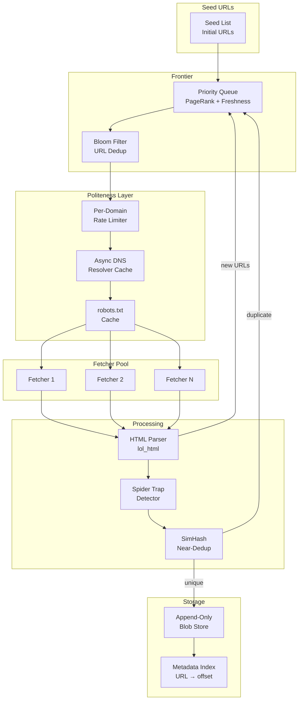

# System Design: The Global Web Crawler

## Speaker Intro

This handbook is written from the perspective of a **Principal Search Infrastructure Architect** who has designed, deployed, and operated planet-scale web crawlers that discover and download billions of pages per day. The content draws from first-hand experience building crawl infrastructure at the intersection of distributed-systems design, graph theory, and high-throughput networking—where a misconfigured rate limiter can bring down a small country's entire web presence, and where a naive deduplication strategy means burning petabytes of storage on identical content.

## Who This Is For

- **Backend engineers** who have used search engines, CDNs, or RSS readers and want to understand the system that feeds all of them—the web crawler—at industrial scale.
- **Systems programmers** who want a concrete, end-to-end project that exercises async networking, probabilistic data structures, custom DNS resolution, and distributed queues, all in Rust.
- **Architects evaluating Rust** for data-infrastructure pipelines and who need proof that the language can saturate 100 Gbps links while maintaining strict per-domain politeness and zero data loss.
- **Anyone who has wondered** how Google discovers 100+ billion pages—how it decides what to crawl next, how it avoids re-downloading duplicates, and how it stores the raw web at exabyte scale.

## Prerequisites

| Concept | Where to Learn |
|---|---|
| Intermediate Rust (ownership, traits, generics) | [Type System & Traits](../type-system-traits-book/src/SUMMARY.md) |
| `async`/`await` and the Tokio runtime | [Async Rust](../async-book/src/SUMMARY.md) |
| Hash maps, B-Trees, probabilistic data structures | [Algorithms & Concurrency](../algorithms-concurrency-book/src/SUMMARY.md) |
| Familiarity with HTTP/gRPC service patterns | [API Design](../api-design-book/src/SUMMARY.md) |
| Basic understanding of DNS, TCP, and HTTP | Any networking fundamentals resource |

## How to Use This Book

| Emoji | Meaning |
|---|---|
| 🟢 | **Architecture** — foundational data structures and high-level design decisions |
| 🟡 | **Distributed Queues** — rate limiting, DNS resolution, and storage pipelines |
| 🔴 | **Graph Traversal / Algorithms** — probabilistic deduplication, SimHash, parser design |

Each chapter tackles **one fundamental challenge** in web-crawler design. Read them in order—later chapters assume the URL frontier, politeness layer, and dedup pipeline from earlier chapters exist.

## The Problem We Are Solving

> Design a **distributed, politeness-aware web crawler** capable of discovering and downloading **100 billion pages per month**, deduplicating content in real time via SimHash, respecting `robots.txt` directives per domain, and storing raw HTML payloads in a compressed, append-only content store for downstream indexing.

The system we will build has these non-negotiable requirements:

| Requirement | Target |
|---|---|
| Discovery rate | 100 billion pages / month (~40,000 pages / second sustained) |
| Unique pages stored | ≥ 50 billion (after dedup) |
| Politeness | ≤ 1 request / second per domain (configurable) |
| DNS resolution throughput | ≥ 500,000 lookups / second |
| Duplicate detection (URL-level) | $O(1)$ via Bloom filter, < 0.1% false-positive rate |
| Near-duplicate detection (content) | SimHash Hamming distance ≤ 3, < 1 ms per document |
| Raw HTML storage | Compressed append-only blob store, ~2 PB total |
| Availability | 99.9% — graceful degradation under partial failure |

## Pacing Guide

| Chapter | Topic | Time | Checkpoint |
|---|---|---|---|
| Ch 0 | Introduction & Problem Statement | 30 min | Understand the design canvas |
| Ch 1 | The URL Frontier and Prioritization | 6–8 hours | Working priority queue with domain-aware scheduling |
| Ch 2 | Politeness and DNS Resolution | 5–7 hours | Per-domain rate limiter and async DNS cache |
| Ch 3 | Detecting Duplicates (Bloom Filters & SimHash) | 6–8 hours | Distributed Bloom filter and SimHash near-duplicate detector |
| Ch 4 | Parsing and Spider Traps | 5–7 hours | Fast HTML parser with trap detection and link extraction |
| Ch 5 | The Distributed Content Store | 6–8 hours | Append-only compressed blob store with metadata index |

**Total: ~29–39 hours** of focused study.

## Table of Contents

### Part I: Frontier & Scheduling
- **Chapter 1 — The URL Frontier and Prioritization 🟢** — Architecting the brain of the crawler. Designing a massive distributed queue (Kafka or custom Redis structures) that prioritizes URLs based on PageRank, update frequency, and domain authority. Ensuring fair scheduling across millions of domains.

### Part II: Deduplication & Parsing
- **Chapter 2 — Politeness and DNS Resolution 🟡** — How to avoid DDoS-ing small websites. Implementing strict per-domain rate limiting and connection pooling. Why standard OS DNS resolution is a massive bottleneck, and how to build a custom, asynchronous UDP DNS resolver cache.
- **Chapter 3 — Detecting Duplicates — Bloom Filters & SimHash 🔴** — Never downloading the same page twice. Using Distributed Bloom Filters to check URL membership in $O(1)$ time. Implementing SimHash to detect "near-duplicates" (e.g., the exact same news article on two different URLs with different ads).
- **Chapter 4 — Parsing and Spider Traps 🔴** — Extracting the DOM. Using Rust-based headless browsers or fast HTML parsers (like `lol_html`) to extract outgoing links. Detecting and breaking out of infinite spider traps (e.g., dynamically generated calendars or infinite pagination).

### Part III: Storage
- **Chapter 5 — The Distributed Content Store 🟡** — Storing the internet. Architecting an append-only blob storage system (similar to Google's Bigtable or Hadoop HDFS) to compress and store billions of raw HTML payloads for the downstream indexing workers.

## Architecture Overview

## Companion Guides

| Book | Relevance |
|---|---|
| [Distributed Systems](../distributed-systems-book/src/SUMMARY.md) | Consensus, replication, failure handling for the coordinator |
| [Algorithms & Concurrency](../algorithms-concurrency-book/src/SUMMARY.md) | Bloom filters, consistent hashing, lock-free queues |
| [Search Engine](../search-engine-book/src/SUMMARY.md) | The downstream consumer of our crawled content |
| [Zero-Copy Architecture](../zero-copy-book/src/SUMMARY.md) | io_uring, sendfile, and zero-copy I/O for high-throughput fetching |
| [Tokio Internals](../tokio-internals-book/src/SUMMARY.md) | Work-stealing runtime powering our async fetcher pool |
| [Cloud Native](../cloud-native-book/src/SUMMARY.md) | Kubernetes orchestration for the crawler fleet |
