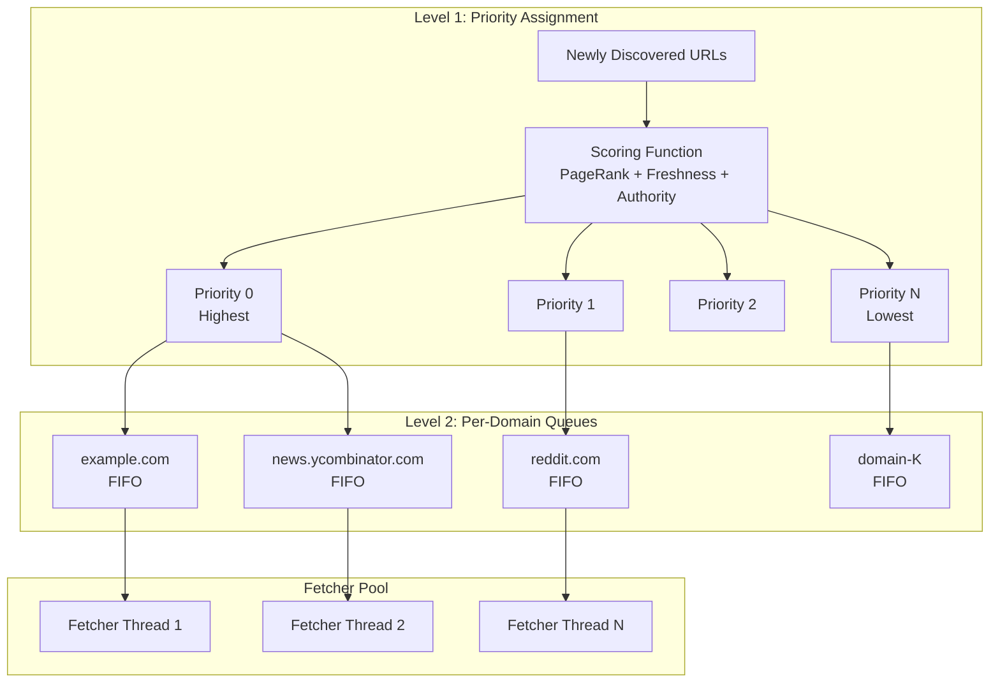
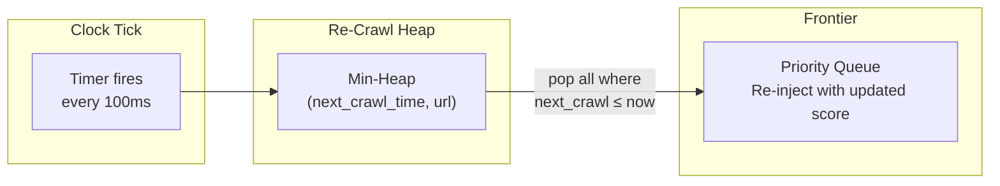
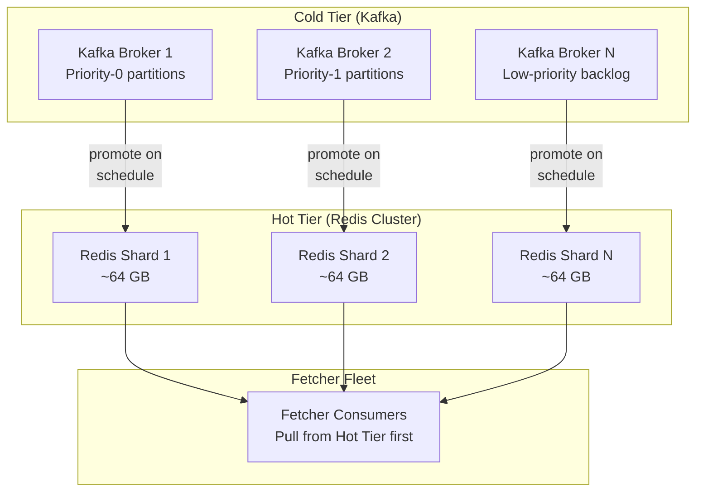

# 1. The URL Frontier and Prioritization 🟢

> **The Problem:** A naive crawler maintains a simple FIFO queue of URLs: pop a URL, fetch it, extract links, push them to the back. This approach fails catastrophically at scale. A FIFO queue treats a link to `https://en.wikipedia.org` the same as a link to a parked domain with zero content. It has no notion of "this page changes hourly" vs. "this page hasn't changed in five years." Worse, a single FIFO queue becomes the bottleneck of the entire system—one disk seek or one network hiccup and all 10,000 fetcher threads stall. We need a **distributed, priority-aware URL frontier** that acts as the brain of the crawler, deciding *what* to crawl and *when*.

---

## Why a FIFO Queue Fails

Let's enumerate the failure modes of a naive queue:

| Problem | FIFO Behavior | Impact |
|---|---|---|
| No priority | All URLs treated equally | Crawler wastes bandwidth on low-value pages |
| No freshness model | Pages re-crawled at fixed intervals | Popular pages go stale; dormant pages waste fetches |
| Single queue | One lock, one data structure | Throughput ceiling ~50K dequeue/sec; fetchers starve |
| No domain awareness | URLs interleaved randomly | Hammering a single domain with concurrent requests |
| Unbounded growth | Every discovered URL enqueued | Queue grows to billions of entries; OOM or disk thrashing |

A production crawler discovers **~1 billion new URLs per day**. If the frontier cannot ingest, prioritize, and serve URLs at this rate while remaining distributed and fault-tolerant, the crawler is dead.

---

## The Two-Level Frontier Architecture

Google's original web crawler paper (Mercator, 2001) introduced a two-level architecture that remains the gold standard. We will modernize it with Kafka partitions and Redis sorted sets.

### Level 1: Priority Queues (Back Queue Selector)

Level 1 determines **what to crawl**. URLs are scored and placed into one of $N$ priority buckets. Higher-priority buckets are drained faster.

### Level 2: Per-Domain FIFO Queues (Front Queue)

Level 2 determines **when to crawl**. Each domain gets its own FIFO queue. A scheduler ensures we never hit the same domain faster than the configured politeness interval.



---

## URL Scoring: The Priority Function

Every URL entering the frontier is assigned a floating-point priority score in $[0, 1]$. The score is a weighted combination of three signals:

$$
\text{priority}(u) = w_1 \cdot \text{PageRank}(u) + w_2 \cdot \text{freshness}(u) + w_3 \cdot \text{authority}(\text{domain}(u))
$$

### Signal 1: PageRank (Static Importance)

PageRank measures the structural importance of a URL within the web graph. A URL linked by many high-authority pages receives a higher score. For newly discovered URLs with no PageRank, we inherit the parent page's score with exponential decay:

$$
\text{PageRank}_{\text{child}} = \alpha \cdot \text{PageRank}_{\text{parent}}
$$

where $\alpha \approx 0.15$ (the damping factor).

### Signal 2: Freshness (Change Frequency)

Pages that change frequently should be re-crawled more often. We model change frequency with an exponential decay function:

$$
\text{freshness}(u) = e^{-\lambda \cdot \Delta t}
$$

where $\Delta t$ is the time since the last crawl and $\lambda$ is estimated from the page's historical change pattern. A news homepage with $\lambda = 0.1 \text{ hr}^{-1}$ scores 0.90 after 1 hour but 0.37 after 10 hours.

### Signal 3: Domain Authority

Domain authority is a pre-computed score for the entire domain based on inlink count, WHOIS age, and TLD trust. `.gov` and `.edu` domains score higher; newly registered domains score lower. This signal acts as a prior when per-URL data is sparse.

```rust,ignore
/// Compute the priority score for a URL.
fn priority_score(
    page_rank: f64,
    last_crawled_hours_ago: f64,
    change_rate_lambda: f64,
    domain_authority: f64,
) -> f64 {
    const W_PAGERANK: f64 = 0.4;
    const W_FRESHNESS: f64 = 0.35;
    const W_AUTHORITY: f64 = 0.25;

    let freshness = (-change_rate_lambda * last_crawled_hours_ago).exp();

    W_PAGERANK * page_rank + W_FRESHNESS * freshness + W_AUTHORITY * domain_authority
}

#[test]
fn high_value_news_page() {
    // Popular news homepage, crawled 2 hours ago, changes every hour
    let score = priority_score(0.85, 2.0, 0.5, 0.9);
    assert!(score > 0.7, "High-value page should score > 0.7, got {score}");
}

#[test]
fn stale_parked_domain() {
    // Zero PageRank, crawled 720 hours ago, barely changes, low authority
    let score = priority_score(0.0, 720.0, 0.001, 0.05);
    assert!(score < 0.2, "Parked domain should score < 0.2, got {score}");
}
```

---

## Distributing the Frontier with Kafka

A single-machine frontier cannot handle 40,000 URL enqueues per second sustained. We partition the frontier across a Kafka cluster where each partition corresponds to a **priority bucket**.

### Kafka Topic Layout

| Topic | Partitions | Key | Value |
|---|---|---|---|
| `frontier.priority-0` | 64 | Domain hash | `CrawlRequest` protobuf |
| `frontier.priority-1` | 64 | Domain hash | `CrawlRequest` protobuf |
| `frontier.priority-N` | 32 | Domain hash | `CrawlRequest` protobuf |
| `frontier.recrawl` | 64 | Domain hash | `CrawlRequest` with scheduled timestamp |

Keying by **domain hash** ensures all URLs for the same domain land in the same partition, which simplifies per-domain politeness enforcement downstream.

### Weighted consumption

Fetcher consumers subscribe to all priority topics but use weighted round-robin:

```rust,ignore
/// Select the next priority topic to consume from.
/// Higher-priority topics are polled more frequently.
fn select_priority_topic(weights: &[u32], counter: &mut u64) -> usize {
    let total: u32 = weights.iter().sum();
    let position = (*counter % total as u64) as u32;
    *counter += 1;

    let mut cumulative = 0u32;
    for (i, &w) in weights.iter().enumerate() {
        cumulative += w;
        if position < cumulative {
            return i;
        }
    }
    weights.len() - 1
}

#[test]
fn weighted_selection_favors_high_priority() {
    // Weights: priority-0 gets 50%, priority-1 gets 30%, priority-2 gets 20%
    let weights = [50, 30, 20];
    let mut counter = 0u64;
    let mut counts = [0u32; 3];
    for _ in 0..1000 {
        counts[select_priority_topic(&weights, &mut counter)] += 1;
    }
    assert_eq!(counts[0], 500);
    assert_eq!(counts[1], 300);
    assert_eq!(counts[2], 200);
}
```

---

## The Re-Crawl Scheduler

Not all URLs are one-time discoveries. A production crawler must **re-crawl** pages to detect changes. The re-crawl scheduler maintains a min-heap keyed by the next crawl timestamp:

$$
t_{\text{next}}(u) = t_{\text{last}}(u) + \frac{1}{\lambda(u)}
$$

where $\lambda(u)$ is the estimated change rate. Pages that change hourly get re-enqueued every hour; pages that change yearly are re-enqueued in 365 days.



### Adaptive Change-Rate Estimation

After each crawl, we compare the content hash with the previous version. If the page changed, we increase $\lambda$; if it didn't, we decrease it:

```rust,ignore
/// Update the estimated change rate after a crawl.
/// Uses exponential moving average.
fn update_change_rate(
    previous_lambda: f64,
    content_changed: bool,
    alpha: f64,  // smoothing factor, e.g. 0.3
) -> f64 {
    let observation = if content_changed { 1.0 } else { 0.0 };
    alpha * observation + (1.0 - alpha) * previous_lambda
}

#[test]
fn change_rate_increases_on_change() {
    let lambda = update_change_rate(0.1, true, 0.3);
    assert!(lambda > 0.1);
    // 0.3 * 1.0 + 0.7 * 0.1 = 0.37
    assert!((lambda - 0.37).abs() < 1e-10);
}

#[test]
fn change_rate_decreases_on_no_change() {
    let lambda = update_change_rate(0.5, false, 0.3);
    assert!(lambda < 0.5);
    // 0.3 * 0.0 + 0.7 * 0.5 = 0.35
    assert!((lambda - 0.35).abs() < 1e-10);
}
```

---

## Redis-Based Frontier (Alternative to Kafka)

For smaller crawlers (< 1 billion pages/month), a Redis-based frontier trades Kafka's durability guarantees for lower operational complexity. We use Redis **Sorted Sets** as priority queues.

### Data Model

| Redis Key | Type | Purpose |
|---|---|---|
| `frontier:pq:{priority}` | Sorted Set | Score = priority float; Member = URL |
| `frontier:domain:{domain}` | List | Per-domain FIFO for politeness |
| `frontier:seen` | Bloom filter (RedisBloom) | URL dedup |
| `frontier:recrawl` | Sorted Set | Score = next_crawl_timestamp; Member = URL |

### Enqueue Operation

```rust,ignore
/// Enqueue a URL into the Redis-based frontier.
/// Returns true if the URL was new (not seen before).
async fn enqueue_url(
    redis: &mut redis::aio::MultiplexedConnection,
    url: &str,
    priority: f64,
    domain: &str,
) -> redis::RedisResult<bool> {
    // Check Bloom filter first (O(1), no false negatives)
    let exists: bool = redis::cmd("BF.EXISTS")
        .arg("frontier:seen")
        .arg(url)
        .query_async(redis)
        .await?;

    if exists {
        return Ok(false); // Already seen
    }

    // Add to Bloom filter
    redis::cmd("BF.ADD")
        .arg("frontier:seen")
        .arg(url)
        .query_async(redis)
        .await?;

    // Add to priority sorted set
    let bucket = priority_bucket(priority);
    redis::cmd("ZADD")
        .arg(format!("frontier:pq:{bucket}"))
        .arg(priority)
        .arg(url)
        .query_async(redis)
        .await?;

    // Add to domain FIFO
    redis::cmd("RPUSH")
        .arg(format!("frontier:domain:{domain}"))
        .arg(url)
        .query_async(redis)
        .await?;

    Ok(true)
}

fn priority_bucket(priority: f64) -> u8 {
    // Map [0.0, 1.0] → buckets 0..=9
    ((priority * 10.0).min(9.0)) as u8
}
```

---

## Frontier Capacity Planning

How large does the frontier get? Let's do the math:

| Parameter | Value |
|---|---|
| Discovered URLs / day | ~1 billion |
| Average URL length | 80 bytes |
| Metadata per URL (priority, timestamps, domain) | 64 bytes |
| Total per URL | ~144 bytes |
| URLs in frontier at any time (7-day backlog) | ~7 billion |
| **Total frontier memory** | **~1 TB** |

A 1 TB frontier doesn't fit in RAM on a single machine. Solutions:

1. **Kafka-based** — URLs are on disk in Kafka's log segments. Only the consumer offsets live in memory. Kafka handles the 1 TB+ backlog with ease via log compaction.
2. **Redis Cluster** — Shard across 16 Redis nodes, each with 64 GB RAM. The Bloom filter alone for 50 billion URLs at 0.1% FPR requires ~60 GB.
3. **Hybrid** — Redis for the "hot" frontier (URLs to crawl in the next hour); Kafka for the "cold" backlog.



---

## Handling Frontier Failures

The frontier is the single most critical component. If it loses data, URLs are permanently forgotten. Failure modes and mitigations:

| Failure | Mitigation |
|---|---|
| Kafka broker dies | Replication factor ≥ 3; ISR (in-sync replicas) guarantee no data loss |
| Redis node OOM | Redis Cluster automatic failover to replica; periodic RDB snapshots |
| Bloom filter corruption | Rebuild from the URL log (Kafka topic with all discovered URLs) |
| Stuck consumer | Consumer group rebalancing; Kafka's `max.poll.interval.ms` timeout |
| Split-brain (network partition) | Kafka uses ZooKeeper/KRaft for leader election; Redis Cluster uses gossip + majority quorum |

---

## Putting It All Together

The complete URL frontier flow:

1. **Link Extraction** — The parser extracts URLs from fetched pages and sends them to the frontier ingestion endpoint.
2. **Dedup Check** — Bloom filter rejects already-seen URLs in $O(1)$.
3. **Scoring** — New URLs are scored using PageRank + freshness + domain authority.
4. **Priority Assignment** — URLs are placed into the appropriate Kafka partition (by priority) or Redis sorted set.
5. **Domain Routing** — URLs are routed to per-domain FIFO queues for politeness enforcement.
6. **Fetcher Consumption** — Fetcher threads pull from domain queues, respecting the rate-limit interval.
7. **Re-Crawl Scheduling** — After a successful fetch, the URL is added to the re-crawl heap with an updated `next_crawl_time`.

```rust,ignore
/// The complete frontier pipeline for a single discovered URL.
async fn process_discovered_url(
    frontier: &Frontier,
    url: &str,
    parent_page_rank: f64,
    domain: &str,
) -> Result<(), FrontierError> {
    // Step 1: URL normalization
    let normalized = normalize_url(url)?;

    // Step 2: Bloom filter dedup
    if frontier.bloom.contains(&normalized) {
        return Ok(()); // Already seen
    }
    frontier.bloom.insert(&normalized);

    // Step 3: Score the URL
    let page_rank = parent_page_rank * 0.15; // Inherited with decay
    let domain_auth = frontier.domain_authority(&domain);
    let score = priority_score(page_rank, 0.0, 0.5, domain_auth);

    // Step 4: Enqueue with priority
    frontier.enqueue(&normalized, score, domain).await?;

    Ok(())
}

/// Normalize a URL: lowercase scheme/host, remove fragment, sort query params.
fn normalize_url(url: &str) -> Result<String, FrontierError> {
    let mut parsed = url::Url::parse(url)
        .map_err(|e| FrontierError::InvalidUrl(e.to_string()))?;
    parsed.set_fragment(None);

    // Sort query parameters for canonical form
    if let Some(query) = parsed.query() {
        let mut pairs: Vec<(String, String)> = parsed
            .query_pairs()
            .map(|(k, v)| (k.into_owned(), v.into_owned()))
            .collect();
        pairs.sort();
        let sorted: String = pairs
            .iter()
            .map(|(k, v)| format!("{k}={v}"))
            .collect::<Vec<_>>()
            .join("&");
        parsed.set_query(Some(&sorted));
    }

    Ok(parsed.to_string())
}
```

---

> **Key Takeaways**
>
> 1. A **two-level frontier** separates priority (what) from politeness (when), enabling both intelligent scheduling and respectful crawling.
> 2. URL priority is a **weighted combination** of PageRank, freshness (exponential decay), and domain authority—not a single metric.
> 3. **Kafka partitions keyed by domain hash** naturally enforce co-locality for politeness while distributing load across brokers.
> 4. The **re-crawl scheduler** uses adaptive change-rate estimation (exponential moving average) so the crawler learns each page's update frequency over time.
> 5. Frontier capacity for a global crawler exceeds **1 TB**; a **hot/cold hybrid** (Redis + Kafka) balances latency with storage cost.
> 6. **URL normalization** (lowercase, remove fragments, sort query params) prevents trivially different strings from consuming frontier capacity.

---

## Exercises

### Exercise 1: Priority Bucket Sizing

Given these weights—priority-0: 50%, priority-1: 30%, priority-2: 20%—and a sustained 40,000 URLs/sec dequeue rate, calculate:
- How many URLs/sec each priority level serves.
- If priority-0 has 100 million URLs backlogged, how long until it's drained (assuming no new enqueues)?

<details>
<summary>Solution</summary>

- Priority-0: 40,000 × 0.50 = **20,000 URLs/sec**
- Priority-1: 40,000 × 0.30 = **12,000 URLs/sec**
- Priority-2: 40,000 × 0.20 = **8,000 URLs/sec**
- Drain time for 100M URLs at 20K/sec: 100,000,000 / 20,000 = **5,000 seconds ≈ 83 minutes**

</details>

### Exercise 2: Bloom Filter Sizing

Design a Bloom filter for 50 billion URLs with a 0.1% false-positive rate. Calculate:
- The required number of bits $m$.
- The optimal number of hash functions $k$.
- The total memory in gigabytes.

<details>
<summary>Solution</summary>

Using the Bloom filter formulas:

$$m = -\frac{n \ln p}{(\ln 2)^2}$$

where $n = 50 \times 10^9$ and $p = 0.001$:

$$m = -\frac{50 \times 10^9 \times \ln(0.001)}{(\ln 2)^2} = -\frac{50 \times 10^9 \times (-6.9078)}{0.4805} \approx 7.19 \times 10^{11} \text{ bits}$$

$$k = \frac{m}{n} \ln 2 = \frac{7.19 \times 10^{11}}{50 \times 10^9} \times 0.6931 \approx 10$$

$$\text{Memory} = \frac{7.19 \times 10^{11}}{8 \times 10^9} \approx \textbf{89.9 GB}$$

This is why the Bloom filter must be distributed across multiple nodes.

</details>

### Exercise 3: Implement `normalize_url`

Extend the `normalize_url` function to also:
1. Remove default ports (80 for HTTP, 443 for HTTPS).
2. Decode percent-encoded unreserved characters (`%41` → `A`).
3. Remove trailing slashes from paths (except root `/`).

<details>
<summary>Solution</summary>

```rust,ignore
fn normalize_url(url: &str) -> Result<String, FrontierError> {
    let mut parsed = url::Url::parse(url)
        .map_err(|e| FrontierError::InvalidUrl(e.to_string()))?;

    // Remove fragment
    parsed.set_fragment(None);

    // Remove default ports
    if let Some(port) = parsed.port() {
        let is_default = matches!(
            (parsed.scheme(), port),
            ("http", 80) | ("https", 443)
        );
        if is_default {
            parsed.set_port(None).ok();
        }
    }

    // Remove trailing slash (except root)
    let path = parsed.path().to_string();
    if path.len() > 1 && path.ends_with('/') {
        parsed.set_path(&path[..path.len() - 1]);
    }

    // Sort query parameters
    if parsed.query().is_some() {
        let mut pairs: Vec<(String, String)> = parsed
            .query_pairs()
            .map(|(k, v)| (k.into_owned(), v.into_owned()))
            .collect();
        pairs.sort();
        let sorted: String = pairs
            .iter()
            .map(|(k, v)| format!("{k}={v}"))
            .collect::<Vec<_>>()
            .join("&");
        parsed.set_query(Some(&sorted));
    }

    Ok(parsed.to_string())
}
```

</details>
