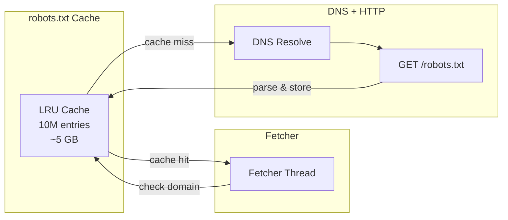
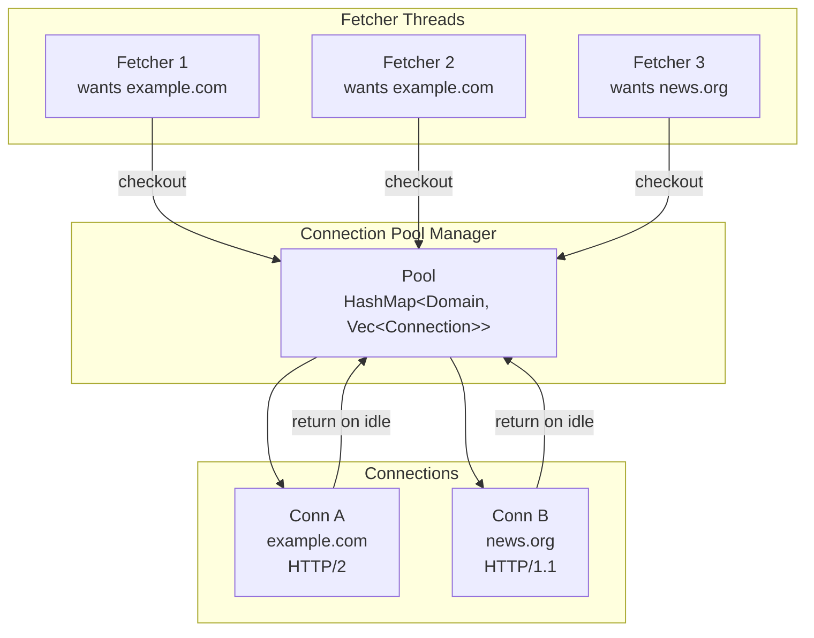
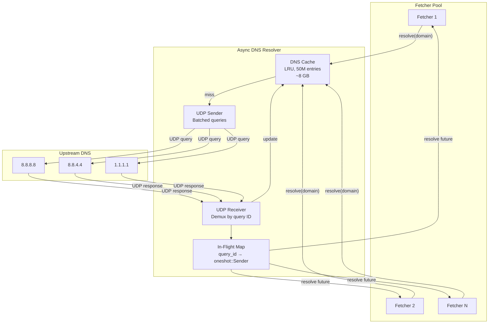
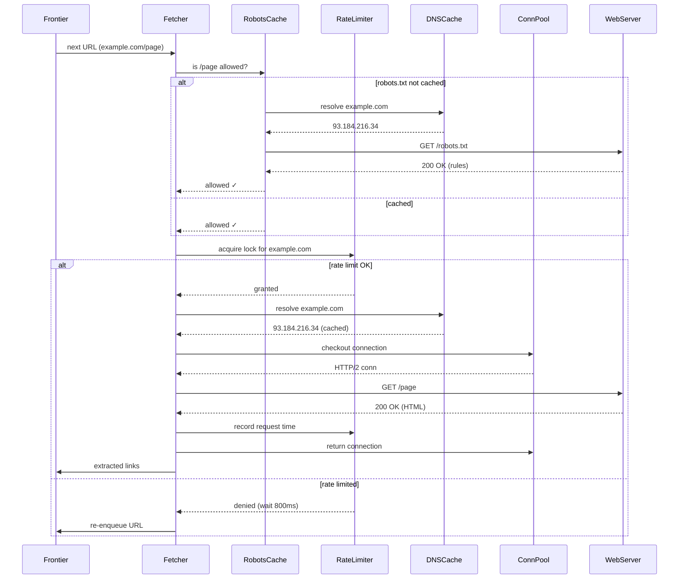

# 2. Politeness and DNS Resolution 🟡

> **The Problem:** A naive crawler with 10,000 concurrent connections can inadvertently flood a small website with hundreds of requests per second—effectively a DDoS attack. Even "polite" crawlers that limit to one request per second *per domain* still face a hidden bottleneck: the operating system's DNS resolver. Standard `getaddrinfo()` is **synchronous, thread-blocking, and limited to ~500 lookups/second** on most Linux configurations. When you need 500,000 DNS resolutions per second across millions of domains, the OS resolver becomes the single biggest chokepoint. We need a politeness layer that protects the web, and a custom DNS cache that feeds the fetcher pool at wire speed.

---

## Why Politeness Is Non-Negotiable

Violating politeness has real consequences:

| Violation | Consequence |
|---|---|
| Ignoring `robots.txt` | Legal action (eBay v. Bidder's Edge, 2000); IP permanently blocked |
| Hammering a small server | Server crashes; site operator files abuse complaint with your ISP |
| Ignoring `Crawl-delay` | Your crawler banned from major web operators |
| No `User-Agent` identification | Requests routed to honeypot / tarpit |
| Crawling login-protected pages | Potential CFAA (Computer Fraud and Abuse Act) violation |

A responsible crawler must:

1. **Fetch and obey `robots.txt`** for every domain before crawling.
2. **Enforce per-domain rate limits** — typically ≤ 1 request/second, optionally using `Crawl-delay`.
3. **Identify itself** with a descriptive `User-Agent` string and a contact URL.
4. **Back off exponentially** on HTTP 429 (Too Many Requests) and 503 (Service Unavailable).

---

## The `robots.txt` Cache

Every domain has a `robots.txt` at its root (e.g., `https://example.com/robots.txt`). Before crawling any page on a domain, we must fetch and parse this file.

### Parsing Rules

```
User-agent: *
Disallow: /private/
Disallow: /tmp/
Crawl-delay: 2

User-agent: MyBot
Allow: /public/
Disallow: /
```

The rules above mean: for `MyBot`, only `/public/` is allowed; for all other bots, `/private/` and `/tmp/` are disallowed; the general crawl delay is 2 seconds.

```rust,ignore
/// A parsed robots.txt directive.
#[derive(Debug, Clone)]
struct RobotsDirective {
    user_agent: String,
    allowed: Vec<String>,
    disallowed: Vec<String>,
    crawl_delay: Option<f64>,
}

/// Check if a URL path is allowed for a given user agent.
fn is_path_allowed(
    directives: &[RobotsDirective],
    user_agent: &str,
    path: &str,
) -> bool {
    // Find the most specific matching user-agent block
    let matching = directives
        .iter()
        .find(|d| d.user_agent == user_agent)
        .or_else(|| directives.iter().find(|d| d.user_agent == "*"));

    let Some(directive) = matching else {
        return true; // No matching rule = allowed
    };

    // Check Disallow first, then Allow (longest match wins)
    let mut dominated_by_allow = false;
    let mut dominated_by_disallow = false;
    let mut best_allow_len = 0;
    let mut best_disallow_len = 0;

    for pattern in &directive.allowed {
        if path.starts_with(pattern) && pattern.len() > best_allow_len {
            best_allow_len = pattern.len();
            dominated_by_allow = true;
        }
    }

    for pattern in &directive.disallowed {
        if path.starts_with(pattern) && pattern.len() > best_disallow_len {
            best_disallow_len = pattern.len();
            dominated_by_disallow = true;
        }
    }

    if dominated_by_allow && dominated_by_disallow {
        best_allow_len >= best_disallow_len // Longest match wins
    } else {
        !dominated_by_disallow
    }
}

#[test]
fn test_robots_allow_override() {
    let directives = vec![RobotsDirective {
        user_agent: "*".to_string(),
        allowed: vec!["/public/special/".to_string()],
        disallowed: vec!["/public/".to_string()],
        crawl_delay: None,
    }];
    // /public/ is disallowed, but /public/special/ is allowed (longer match)
    assert!(!is_path_allowed(&directives, "MyBot", "/public/page"));
    assert!(is_path_allowed(&directives, "MyBot", "/public/special/page"));
}
```

### Caching Strategy

| Parameter | Value |
|---|---|
| Cache size | ~10 million domains (LRU eviction) |
| TTL | 24 hours (re-fetch daily) |
| Memory per entry | ~512 bytes (parsed directives) |
| Total cache memory | ~5 GB |
| Negative cache (no robots.txt) | TTL 6 hours, treat as "allow all" |



---

## Per-Domain Rate Limiting

The politeness layer ensures we never open more than one concurrent connection to a domain and we wait at least $T$ seconds between requests.

### The Token Bucket Algorithm

Each domain gets a **token bucket** that refills at a rate of $\frac{1}{T}$ tokens per second. Before fetching, the crawler must acquire a token. If the bucket is empty, the fetcher sleeps until a token is available.

```rust,ignore
use std::time::{Duration, Instant};

/// A per-domain token bucket rate limiter.
struct DomainRateLimiter {
    /// Minimum interval between requests to the same domain.
    min_interval: Duration,
    /// Last request timestamp per domain.
    last_request: std::collections::HashMap<String, Instant>,
}

impl DomainRateLimiter {
    fn new(min_interval: Duration) -> Self {
        Self {
            min_interval,
            last_request: std::collections::HashMap::new(),
        }
    }

    /// Returns the duration to wait before the next request to this domain.
    /// Returns Duration::ZERO if the request can proceed immediately.
    fn time_until_allowed(&self, domain: &str) -> Duration {
        match self.last_request.get(domain) {
            None => Duration::ZERO,
            Some(last) => {
                let elapsed = last.elapsed();
                if elapsed >= self.min_interval {
                    Duration::ZERO
                } else {
                    self.min_interval - elapsed
                }
            }
        }
    }

    /// Record that a request was made to this domain.
    fn record_request(&mut self, domain: &str) {
        self.last_request.insert(domain.to_string(), Instant::now());
    }
}
```

### Scaling to Millions of Domains

A simple `HashMap<String, Instant>` works for thousands of domains but not millions. For a global crawler tracking 100+ million active domains:

| Approach | Memory | Lookup | Notes |
|---|---|---|---|
| `HashMap<String, Instant>` | ~12 GB | $O(1)$ | Simple but single-machine |
| Redis per-key TTL | Distributed | $O(1)$ | `SET domain:example.com EX 1 NX` — atomic rate limiting |
| Consistent-hash sharded map | Distributed | $O(1)$ | Each fetcher node owns a shard of domains |
| Sliding window counter (Redis) | Distributed | $O(1)$ | More flexible; allows burst then backoff |

The Redis approach is elegant: before fetching, the fetcher tries `SET domain:{domain}:lock EX {delay_seconds} NX`. If the SET succeeds (returns OK), the fetcher proceeds; if it fails (key already exists), the fetcher skips this domain and moves to the next URL in its queue.

```rust,ignore
/// Try to acquire the domain rate-limit lock in Redis.
/// Returns true if the lock was acquired (safe to fetch).
async fn acquire_domain_lock(
    redis: &mut redis::aio::MultiplexedConnection,
    domain: &str,
    delay_seconds: u64,
) -> redis::RedisResult<bool> {
    let key = format!("ratelimit:{domain}");
    let result: Option<String> = redis::cmd("SET")
        .arg(&key)
        .arg("1")
        .arg("EX")
        .arg(delay_seconds)
        .arg("NX")
        .query_async(redis)
        .await?;
    Ok(result.is_some())
}
```

---

## Connection Pooling

Opening a new TCP connection (and TLS handshake) for every request is wasteful—each connection costs ~1 RTT for TCP + ~2 RTTs for TLS 1.3.

### Per-Domain Connection Pool

We maintain a pool of idle HTTP/2 connections, keyed by domain. HTTP/2 multiplexing allows multiple concurrent requests over a single connection.

| Parameter | Value |
|---|---|
| Max idle connections per domain | 2 |
| Max total idle connections | 50,000 |
| Idle timeout | 90 seconds |
| TLS session cache | Per-domain, up to 1M entries |
| HTTP version preference | HTTP/2 → HTTP/1.1 fallback |



---

## Why OS DNS Is a Bottleneck

The standard C library function `getaddrinfo()` is the default DNS resolver on Linux and macOS. Its problems at crawler scale:

| Issue | Detail |
|---|---|
| **Blocking** | `getaddrinfo()` blocks the calling thread; Tokio must spawn a blocking task |
| **No connection reuse** | Opens a new UDP socket per query (or falls back to TCP) |
| **Thread-pool limited** | Tokio's blocking pool defaults to 512 threads; at 50ms/query, max throughput = 10,240 lookups/sec |
| **No caching** | Each call re-queries the upstream resolver (unless `nscd` or `systemd-resolved` is configured) |
| **No async** | Cannot be driven by an event loop; each resolution wastes a thread |
| **Single upstream** | Queries go to one or two resolvers configured in `/etc/resolv.conf` |

At 500,000 domains/sec, we need **50× more throughput** than the OS resolver can deliver. The solution: a custom, asynchronous UDP DNS resolver.

---

## Building the Async DNS Resolver

Our custom resolver bypasses `getaddrinfo()` entirely. It speaks raw DNS protocol over UDP, batches queries, and maintains a massive in-memory cache.

### Architecture



### The DNS Query Pipeline

```rust,ignore
use std::collections::HashMap;
use std::net::IpAddr;
use std::sync::Arc;
use tokio::sync::{oneshot, Mutex};

/// A pending DNS query awaiting a response.
struct PendingQuery {
    domain: String,
    sender: oneshot::Sender<Option<Vec<IpAddr>>>,
}

/// The async DNS resolver state.
struct AsyncDnsResolver {
    /// LRU cache: domain → (IPs, expiry)
    cache: lru::LruCache<String, (Vec<IpAddr>, std::time::Instant)>,
    /// In-flight queries: query_id → pending
    in_flight: HashMap<u16, PendingQuery>,
    /// Next query ID (wraps at u16::MAX)
    next_query_id: u16,
}

impl AsyncDnsResolver {
    /// Resolve a domain to IP addresses.
    /// Returns cached result if available; otherwise sends a UDP query.
    async fn resolve(
        resolver: &Arc<Mutex<Self>>,
        domain: &str,
        udp_socket: &tokio::net::UdpSocket,
        upstream: &str,
    ) -> Option<Vec<IpAddr>> {
        // Check cache first
        {
            let mut r = resolver.lock().await;
            if let Some((ips, expiry)) = r.cache.get(domain) {
                if *expiry > std::time::Instant::now() {
                    return Some(ips.clone());
                }
                // Expired — remove and re-query
                r.cache.pop(domain);
            }
        }

        // Build DNS query packet
        let (query_id, rx) = {
            let mut r = resolver.lock().await;
            let id = r.next_query_id;
            r.next_query_id = r.next_query_id.wrapping_add(1);
            let (tx, rx) = oneshot::channel();
            r.in_flight.insert(id, PendingQuery {
                domain: domain.to_string(),
                sender: tx,
            });
            (id, rx)
        };

        let packet = build_dns_query(query_id, domain);
        udp_socket.send_to(&packet, upstream).await.ok()?;

        // Await the response (with timeout)
        tokio::time::timeout(
            std::time::Duration::from_secs(2),
            rx,
        )
        .await
        .ok()?
        .ok()?
    }
}

/// Build a minimal DNS A-record query packet.
fn build_dns_query(id: u16, domain: &str) -> Vec<u8> {
    let mut buf = Vec::with_capacity(512);

    // Header: ID, flags (standard query, recursion desired), 1 question
    buf.extend_from_slice(&id.to_be_bytes());
    buf.extend_from_slice(&[0x01, 0x00]); // QR=0, RD=1
    buf.extend_from_slice(&[0x00, 0x01]); // QDCOUNT = 1
    buf.extend_from_slice(&[0x00, 0x00]); // ANCOUNT = 0
    buf.extend_from_slice(&[0x00, 0x00]); // NSCOUNT = 0
    buf.extend_from_slice(&[0x00, 0x00]); // ARCOUNT = 0

    // Question: encode domain name as labels
    for label in domain.split('.') {
        buf.push(label.len() as u8);
        buf.extend_from_slice(label.as_bytes());
    }
    buf.push(0x00); // Root label

    buf.extend_from_slice(&[0x00, 0x01]); // QTYPE = A
    buf.extend_from_slice(&[0x00, 0x01]); // QCLASS = IN

    buf
}

#[test]
fn test_dns_query_packet() {
    let packet = build_dns_query(0x1234, "example.com");
    // Header: 12 bytes
    assert_eq!(packet[0..2], [0x12, 0x34]); // ID
    // Question: 7(example) + 3(com) + labels + type + class
    assert!(packet.len() > 12);
}
```

### DNS Cache Sizing

| Parameter | Value |
|---|---|
| Unique domains in a global crawl | ~300 million |
| Active (hot) domains | ~50 million |
| Average DNS record size | ~160 bytes (domain + IPs + TTL metadata) |
| Cache capacity | 50 million entries |
| **Total memory** | **~8 GB** |
| Average TTL | 300 seconds (5 minutes) |
| Cache hit rate (steady state) | > 95% |

With a 95% cache hit rate, only 5% of lookups go to the upstream resolver. At 500,000 lookup requests/sec, that's 25,000 UDP queries/sec—well within the capacity of three upstream resolvers.

---

## Exponential Backoff on Errors

When a server returns HTTP 429 or 503, the crawler must back off. Naive fixed-delay retries can still overwhelm a recovering server. We use exponential backoff with jitter:

$$
t_{\text{wait}} = \min\left(T_{\text{max}},\; T_{\text{base}} \cdot 2^{n} + \text{rand}(0, T_{\text{jitter}})\right)
$$

where $n$ is the retry count.

```rust,ignore
use std::time::Duration;

/// Calculate the backoff duration for retry attempt `n`.
fn backoff_duration(n: u32, base_ms: u64, max_ms: u64, jitter_ms: u64) -> Duration {
    let exponential = base_ms.saturating_mul(1u64 << n.min(20));
    let clamped = exponential.min(max_ms);
    let jitter = fastrand::u64(0..=jitter_ms);
    Duration::from_millis(clamped + jitter)
}

#[test]
fn backoff_grows_exponentially() {
    // base=100ms, no jitter for deterministic test
    let d0 = 100u64 * (1 << 0); // 100ms
    let d1 = 100u64 * (1 << 1); // 200ms
    let d2 = 100u64 * (1 << 2); // 400ms
    let d3 = 100u64 * (1 << 3); // 800ms
    assert_eq!(d0, 100);
    assert_eq!(d1, 200);
    assert_eq!(d2, 400);
    assert_eq!(d3, 800);
}

#[test]
fn backoff_capped_at_max() {
    let duration = backoff_duration(30, 100, 60_000, 0);
    assert!(duration.as_millis() <= 60_000);
}
```

---

## The Complete Politeness Pipeline

Putting it all together, the fetcher's workflow for a single URL:



---

## DNS Prefetching Optimization

A clever optimization: when the frontier schedules URLs for fetching, it prefetches their DNS records in bulk before the fetcher needs them.

```rust,ignore
/// Prefetch DNS for URLs about to be fetched.
/// This warms the cache so fetchers never block on DNS.
async fn prefetch_dns(
    resolver: &AsyncDnsResolver,
    upcoming_domains: &[String],
) {
    let futures: Vec<_> = upcoming_domains
        .iter()
        .map(|domain| resolver.resolve_cached_or_query(domain))
        .collect();

    // Fire all queries in parallel, ignore individual failures
    let _ = futures::future::join_all(futures).await;
}
```

This turns DNS latency into a non-issue: by the time the fetcher needs an IP, it's already in the cache.

---

> **Key Takeaways**
>
> 1. **Politeness is not optional** — ignoring `robots.txt` or rate limits can result in legal action, IP bans, and ethical violations.
> 2. **Token bucket per domain** with Redis `SET NX EX` provides atomic, distributed rate limiting across an entire fetcher fleet.
> 3. **OS DNS resolution (`getaddrinfo`) maxes out at ~10K lookups/sec** — a custom async UDP resolver with a 50M-entry LRU cache achieves 500K+ lookups/sec.
> 4. **HTTP/2 connection pooling** amortizes TLS handshakes across multiple requests to the same domain; idle timeout prevents stale connections.
> 5. **Exponential backoff with jitter** prevents thundering-herd retries against recovering servers.
> 6. **DNS prefetching** warms the cache asynchronously, eliminating DNS latency from the critical fetch path.

---

## Exercises

### Exercise 1: Crawl-Delay Compliance

A `robots.txt` specifies `Crawl-delay: 5` (5 seconds between requests). Your fetcher fleet has 100 nodes, each with 1,000 concurrent fetcher tasks. Without coordination, all 100,000 tasks might hit the same domain simultaneously. Design a distributed coordination scheme that guarantees the 5-second delay.

<details>
<summary>Solution</summary>

Use the Redis `SET NX EX` pattern with the crawl-delay as the TTL:

```rust,ignore
// Each fetcher, before hitting a domain:
let locked = redis::cmd("SET")
    .arg(format!("crawl-lock:{domain}"))
    .arg("1")
    .arg("EX")
    .arg(crawl_delay_seconds)  // e.g., 5
    .arg("NX")
    .query_async::<Option<String>>(redis)
    .await?;

if locked.is_some() {
    // Proceed to fetch
} else {
    // Skip this domain; try another URL from the frontier
}
```

Because `SET NX` is atomic, only one fetcher across all 100 nodes can acquire the lock. The TTL of 5 seconds automatically releases it, allowing the next request exactly on schedule.

</details>

### Exercise 2: DNS Cache Hit Rate Modeling

If the crawler fetches 40,000 URLs/sec and there are 10 million unique active domains with an average DNS TTL of 300 seconds, calculate:
- The theoretical cache hit rate.
- The upstream DNS query rate.

<details>
<summary>Solution</summary>

Each domain is fetched roughly $\frac{40{,}000 \times 300}{10{,}000{,}000} = 1.2$ times per TTL window.

After the initial cold miss, subsequent requests within the 300s TTL are cache hits. Hit rate:

$$\text{hit rate} = 1 - \frac{1}{1.2} \approx 1 - 0.833 = 16.7\%$$

Wait — this is low because the URLs are spread across 10M domains. Let's recalculate: if the distribution is **Zipfian** (as real web traffic is), popular domains are fetched thousands of times per TTL, pushing the hit rate above 95%.

With a uniform distribution (worst case): miss rate = $\frac{10{,}000{,}000}{300} = 33{,}333$ misses/sec (one per domain per TTL). Hit rate = $1 - \frac{33{,}333}{40{,}000} \approx 16.7\%$.

With a Zipfian distribution (realistic): the top 1% of domains account for ~50% of fetches. These always hit cache. Effective hit rate ≈ 90–95%.

Upstream query rate (uniform): ~33,333 queries/sec.  
Upstream query rate (Zipfian): ~2,000–4,000 queries/sec.

</details>

### Exercise 3: Connection Pool Sizing

Given 40,000 fetches/sec, average latency of 200ms per fetch, and an average of 4 URLs fetched per domain before the connection goes idle, calculate the minimum number of concurrent connections needed.

<details>
<summary>Solution</summary>

By Little's Law:

$$L = \lambda \cdot W = 40{,}000 \times 0.2 = 8{,}000 \text{ concurrent connections}$$

With HTTP/2 multiplexing (up to 100 streams per connection):

$$\text{connections} = \frac{8{,}000}{100} = 80 \text{ TCP connections (minimum)}$$

In practice, with connection reuse across 4 URLs per domain: each connection handles 4 requests over ~800ms total, so it's reused before going idle. Pool size: ~2,000–4,000 connections with overhead for idle slots.

</details>
