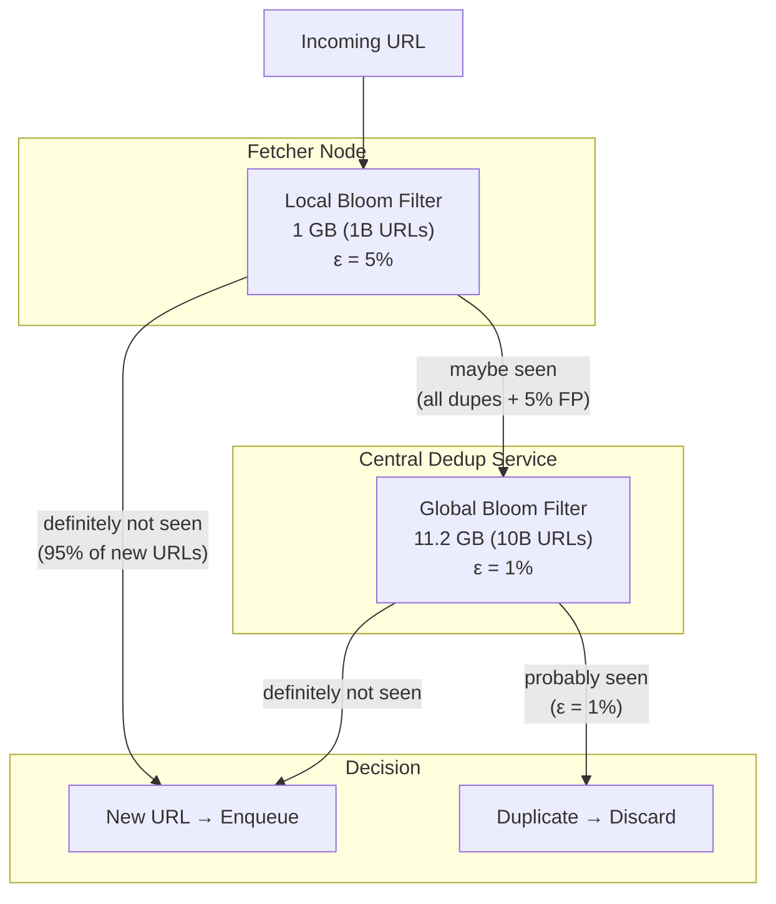
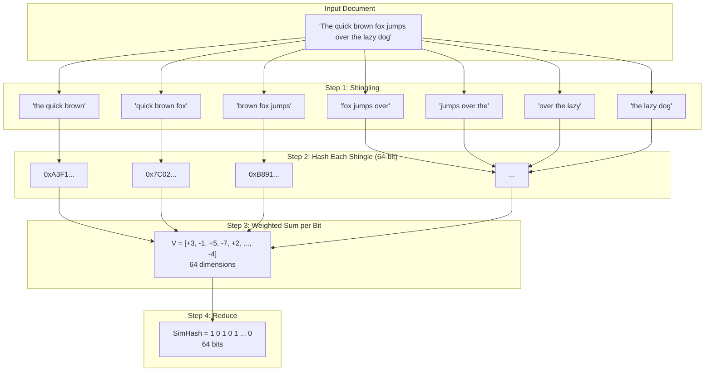
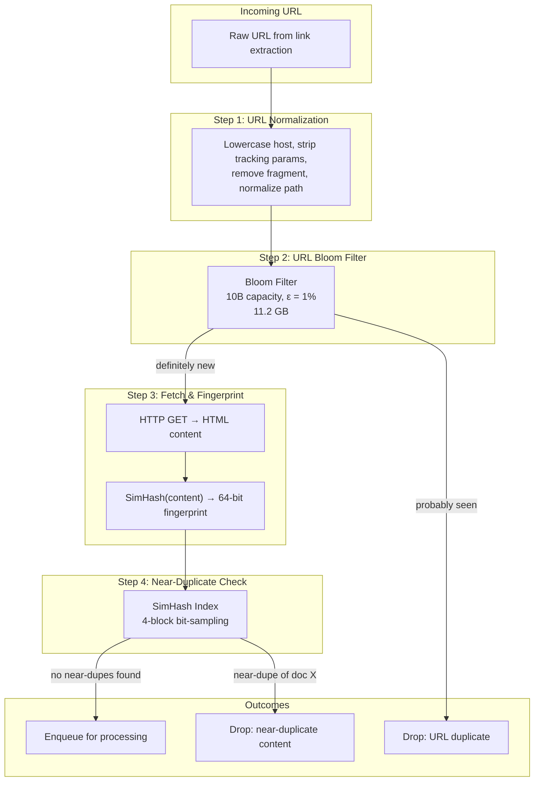

# 3. Detecting Duplicates — Bloom Filters & SimHash 🔴

> **The Problem:** The web is full of redundancy. The exact same URL can appear millions of times across different pages' outgoing links. Worse, the exact same *content* can live at dozens of different URLs (syndicated articles, mirror sites, URL parameters that don't change the page). A naive crawler that re-downloads and re-processes every duplicated URL or near-duplicate page wastes bandwidth, storage, and compute exponentially. We need two layers of deduplication: a **URL-level** filter that answers "have I seen this URL before?" in $O(1)$ time and constant memory, and a **content-level** fingerprint that detects near-duplicate documents even when their URLs, ads, and boilerplate differ.

---

## The Scale of Duplication

Before diving into solutions, let's quantify the problem:

| Metric | Estimate |
|---|---|
| Unique URLs discovered per day | ~2 billion |
| Fraction that are exact URL duplicates | ~60–70% |
| Unique pages after URL dedup | ~600–800 million |
| Fraction that are near-duplicate content | ~25–30% |
| Truly unique pages per day | ~450–550 million |
| Memory if we stored every URL as a `String` | ~200 GB (100-byte avg URL × 2B) |
| Memory if we used a `HashSet<String>` | ~400 GB (Rust `HashSet` overhead) |

Storing 10+ billion URLs in a `HashSet` is infeasible on a single machine. We need a probabilistic data structure that trades a tiny false-positive rate for massive memory savings.

---

## Layer 1: URL Deduplication with Bloom Filters

### What Is a Bloom Filter?

A Bloom filter is a space-efficient probabilistic set that answers **"is this element in the set?"** with:

- **No** → **definitely not in the set** (zero false negatives).
- **Yes** → **probably in the set** (small false-positive rate $\epsilon$).

It uses a bit array of $m$ bits and $k$ independent hash functions. To insert an element, compute $k$ hash positions and set those bits to 1. To query, check if all $k$ positions are 1.

### Mathematical Foundation

The optimal number of hash functions and bits per element:

$$
k = \frac{m}{n} \ln 2
$$

$$
m = -\frac{n \ln \epsilon}{(\ln 2)^2}
$$

where:
- $n$ = expected number of elements
- $\epsilon$ = desired false-positive rate
- $m$ = number of bits
- $k$ = number of hash functions

For our crawler:

| Parameter | Value |
|---|---|
| Expected URLs ($n$) | 10 billion |
| False-positive rate ($\epsilon$) | 0.01 (1%) |
| Bits per element ($m/n$) | 9.585 |
| Total bits ($m$) | 95.85 billion ≈ 11.2 GB |
| Hash functions ($k$) | 7 |

**11.2 GB to track 10 billion URLs** — compared to 400 GB for a `HashSet<String>`. That's a **35× memory reduction**.

### Implementation in Rust

```rust,ignore
use bitvec::prelude::*;
use std::hash::{Hash, Hasher};

/// A Bloom filter for URL deduplication.
struct BloomFilter {
    /// The bit array.
    bits: BitVec,
    /// Number of hash functions.
    num_hashes: u32,
    /// Number of bits in the filter.
    num_bits: u64,
    /// Number of inserted elements (approximate).
    count: u64,
}

impl BloomFilter {
    /// Create a new Bloom filter sized for `expected_items` with the given
    /// false-positive rate.
    fn new(expected_items: u64, fp_rate: f64) -> Self {
        let num_bits = Self::optimal_bits(expected_items, fp_rate);
        let num_hashes = Self::optimal_hashes(num_bits, expected_items);
        Self {
            bits: bitvec![0; num_bits as usize],
            num_hashes,
            num_bits,
            count: 0,
        }
    }

    fn optimal_bits(n: u64, epsilon: f64) -> u64 {
        let ln2_sq = (2.0_f64.ln()).powi(2);
        (-(n as f64) * epsilon.ln() / ln2_sq).ceil() as u64
    }

    fn optimal_hashes(m: u64, n: u64) -> u32 {
        ((m as f64 / n as f64) * 2.0_f64.ln()).round() as u32
    }

    /// Insert a URL into the filter.
    fn insert(&mut self, url: &str) {
        for i in 0..self.num_hashes {
            let pos = self.hash_position(url, i);
            self.bits.set(pos, true);
        }
        self.count += 1;
    }

    /// Check if a URL *might* be in the filter.
    /// Returns false if definitely not seen; true if probably seen.
    fn might_contain(&self, url: &str) -> bool {
        (0..self.num_hashes).all(|i| {
            let pos = self.hash_position(url, i);
            self.bits[pos]
        })
    }

    /// Compute the bit position for hash function `i`.
    /// Uses the Kirschner-Mitzenmacher optimization:
    /// h_i(x) = h1(x) + i * h2(x) mod m
    fn hash_position(&self, url: &str, i: u32) -> usize {
        let mut hasher1 = siphasher::sip::SipHasher13::new();
        url.hash(&mut hasher1);
        let h1 = hasher1.finish();

        let mut hasher2 = siphasher::sip::SipHasher24::new();
        url.hash(&mut hasher2);
        let h2 = hasher2.finish();

        let combined = h1.wrapping_add((i as u64).wrapping_mul(h2));
        (combined % self.num_bits) as usize
    }

    /// Current estimated false-positive rate.
    fn estimated_fp_rate(&self) -> f64 {
        let ones = self.bits.count_ones() as f64;
        let m = self.num_bits as f64;
        let k = self.num_hashes as f64;
        (ones / m).powf(k)
    }
}

#[test]
fn bloom_filter_basic_operations() {
    let mut bf = BloomFilter::new(1_000, 0.01);
    assert!(!bf.might_contain("https://example.com/page1"));

    bf.insert("https://example.com/page1");
    assert!(bf.might_contain("https://example.com/page1"));

    // A URL we never inserted should (almost certainly) not match
    assert!(!bf.might_contain("https://example.com/never-inserted"));
}

#[test]
fn bloom_filter_sizing() {
    let bf = BloomFilter::new(10_000_000_000, 0.01);
    // ~9.6 bits per element
    let bits_per_element = bf.num_bits as f64 / 10_000_000_000.0;
    assert!(bits_per_element > 9.0 && bits_per_element < 10.0);
    assert_eq!(bf.num_hashes, 7);
}
```

### The Kirschner-Mitzenmacher Trick

Instead of computing $k$ independent hash functions (expensive), we compute only **two** hash functions $h_1(x)$ and $h_2(x)$, then derive all $k$ positions as:

$$
g_i(x) = h_1(x) + i \cdot h_2(x) \mod m
$$

This has been proven to have the same false-positive guarantees as $k$ truly independent hash functions, while being ~3.5× faster in practice.

---

## Distributing the Bloom Filter

A single 11.2 GB Bloom filter fits in one machine's RAM, but it creates a single point of failure and a bottleneck. We can partition it across $P$ nodes.

### Partitioning Strategies

| Strategy | How It Works | Pros | Cons |
|---|---|---|---|
| **Hash-partitioned** | URL hash determines which shard to query | Even load; only 1 network hop | Resharding on node add/remove |
| **Replicated** | Full copy on every node | No network hop; fault-tolerant | $P× $ memory; sync lag |
| **Layered** | Local small BF + remote large BF | Fast local reject; rare remote hit | Two-step lookup |

For a global crawler, the **layered** approach gives the best performance:



The local filter absorbs **most** lookups without any network call. Only ambiguous results are escalated to the global filter.

### Handling Growth: Scalable Bloom Filters

Standard Bloom filters have a fixed capacity. When $n$ exceeds the design capacity, the false-positive rate degrades. A **Scalable Bloom Filter** (SBF) chains multiple filters with tightening error bounds:

```rust,ignore
/// A scalable Bloom filter that grows by adding new layers.
struct ScalableBloomFilter {
    /// Active filters, from oldest to newest.
    filters: Vec<BloomFilter>,
    /// Growth factor for each new filter's capacity.
    growth_factor: u64,
    /// Tightening ratio: each new filter's FP rate is multiplied by this.
    tightening_ratio: f64,
    /// Initial capacity.
    initial_capacity: u64,
    /// Target overall FP rate.
    target_fp_rate: f64,
}

impl ScalableBloomFilter {
    fn new(initial_capacity: u64, target_fp_rate: f64) -> Self {
        let tightening_ratio = 0.5; // Each layer halves its FP budget
        let first_fp = target_fp_rate * (1.0 - tightening_ratio);
        let first_filter = BloomFilter::new(initial_capacity, first_fp);
        Self {
            filters: vec![first_filter],
            growth_factor: 2,
            tightening_ratio,
            initial_capacity,
            target_fp_rate,
        }
    }

    fn insert(&mut self, url: &str) {
        // Check if current filter is at capacity
        let current = self.filters.last().unwrap();
        if current.count >= (current.num_bits as f64
            / (current.num_hashes as f64 * 1.44)) as u64
        {
            self.add_layer();
        }
        self.filters.last_mut().unwrap().insert(url);
    }

    fn might_contain(&self, url: &str) -> bool {
        self.filters.iter().any(|f| f.might_contain(url))
    }

    fn add_layer(&mut self) {
        let layer_num = self.filters.len();
        let capacity = self.initial_capacity
            * self.growth_factor.pow(layer_num as u32);
        let fp_rate = self.target_fp_rate
            * (1.0 - self.tightening_ratio)
            * self.tightening_ratio.powi(layer_num as i32);
        self.filters.push(BloomFilter::new(capacity, fp_rate));
    }
}

#[test]
fn scalable_bloom_grows() {
    let mut sbf = ScalableBloomFilter::new(100, 0.01);
    for i in 0..500 {
        sbf.insert(&format!("https://example.com/{i}"));
    }
    // Should have grown beyond 1 filter
    assert!(sbf.filters.len() >= 2);
    // Should find all inserted URLs
    for i in 0..500 {
        assert!(sbf.might_contain(&format!("https://example.com/{i}")));
    }
}
```

---

## URL Normalization Before Dedup

Before checking the Bloom filter, we must **normalize** URLs. Otherwise, the following URLs would be treated as different pages even though they all resolve to the same content:

| Raw URL | Issue |
|---|---|
| `https://Example.COM/Page` | Mixed-case host |
| `https://example.com/page?utm_source=twitter` | Tracking parameters |
| `https://example.com/page/` | Trailing slash |
| `https://example.com:443/page` | Default port explicit |
| `https://example.com/a/../page` | Path traversal |
| `https://example.com/page#section` | Fragment identifier |

### Normalization Rules

```rust,ignore
use url::Url;

/// Tracking parameters to strip from URLs.
const TRACKING_PARAMS: &[&str] = &[
    "utm_source", "utm_medium", "utm_campaign", "utm_term",
    "utm_content", "fbclid", "gclid", "ref", "source",
];

/// Normalize a URL for deduplication.
fn normalize_url(raw: &str) -> Option<String> {
    let mut parsed = Url::parse(raw).ok()?;

    // 1. Lowercase the scheme and host
    // (url crate already lowercases scheme)
    let host = parsed.host_str()?.to_lowercase();

    // 2. Remove default port
    if (parsed.scheme() == "https" && parsed.port() == Some(443))
        || (parsed.scheme() == "http" && parsed.port() == Some(80))
    {
        parsed.set_port(None).ok()?;
    }

    // 3. Remove fragment
    parsed.set_fragment(None);

    // 4. Remove tracking parameters
    let filtered_pairs: Vec<(String, String)> = parsed
        .query_pairs()
        .filter(|(key, _)| {
            !TRACKING_PARAMS.contains(&key.as_ref())
        })
        .map(|(k, v)| (k.into_owned(), v.into_owned()))
        .collect();

    if filtered_pairs.is_empty() {
        parsed.set_query(None);
    } else {
        let query = filtered_pairs
            .iter()
            .map(|(k, v)| format!("{k}={v}"))
            .collect::<Vec<_>>()
            .join("&");
        parsed.set_query(Some(&query));
    }

    // 5. Normalize path (remove trailing slash, resolve . and ..)
    let path = parsed.path().to_string();
    let normalized_path = path.trim_end_matches('/');
    let normalized_path = if normalized_path.is_empty() {
        "/"
    } else {
        normalized_path
    };
    parsed.set_path(normalized_path);

    // 6. Reconstruct with lowercase host
    Some(format!(
        "{}://{}{}{}",
        parsed.scheme(),
        host,
        parsed.path(),
        parsed
            .query()
            .map(|q| format!("?{q}"))
            .unwrap_or_default(),
    ))
}

#[test]
fn test_url_normalization() {
    assert_eq!(
        normalize_url("https://Example.COM:443/Page?utm_source=twitter#top"),
        Some("https://example.com/Page".to_string()),
    );

    assert_eq!(
        normalize_url("https://example.com/a/b/?ref=home"),
        Some("https://example.com/a/b".to_string()),
    );

    assert_eq!(
        normalize_url("http://example.com:80/page?q=rust&gclid=abc"),
        Some("http://example.com/page?q=rust".to_string()),
    );
}
```

---

## Layer 2: Content Deduplication with SimHash

URL deduplication catches cases where the *same URL* appears multiple times. But the web has a much harder problem: **near-duplicate content** at different URLs.

Examples:
- A news article syndicated across 50 sites with different ads and navigation.
- Product pages with identical descriptions but different URL parameters.
- Forum threads with the same content but different pagination URLs.
- Mirror sites hosting the same open-source documentation.

We need a **content fingerprint** that is:

1. **Fast to compute** — we're processing billions of documents.
2. **Near-duplicate sensitive** — two documents that share 90% of their text should produce similar fingerprints.
3. **Compact** — the fingerprint must fit in 8–16 bytes.

### What Is SimHash?

SimHash (Charikar, 2002) produces a fixed-size hash where **similar documents produce similar hashes**. Unlike cryptographic hashes (where a single bit change produces a completely different hash), SimHash preserves similarity:

$$
\text{Hamming}(\text{SimHash}(A), \text{SimHash}(B)) \propto 1 - \text{Cosine}(A, B)
$$

Two documents with Hamming distance ≤ 3 (out of 64 bits) are considered near-duplicates.

### The Algorithm

1. **Tokenize** the document into features (e.g., 3-word shingles).
2. **Hash** each feature into a 64-bit value.
3. **For each bit position** (0–63), maintain a running sum:
   - If the feature's hash has a 1 at position $i$, add the feature's weight.
   - If it has a 0 at position $i$, subtract the weight.
4. **Reduce:** if the final sum at position $i$ is positive, set bit $i$ to 1; otherwise 0.



### Implementation

```rust,ignore
use std::collections::hash_map::DefaultHasher;
use std::hash::{Hash, Hasher};

/// Compute the SimHash of a document using 3-word shingles.
fn simhash(text: &str) -> u64 {
    let words: Vec<&str> = text
        .split_whitespace()
        .map(|w| w.trim_matches(|c: char| !c.is_alphanumeric()))
        .filter(|w| !w.is_empty())
        .collect();

    if words.len() < 3 {
        // Fall back to a regular hash for very short documents
        let mut h = DefaultHasher::new();
        text.hash(&mut h);
        return h.finish();
    }

    // Accumulate weighted bit sums across 64 positions
    let mut v = [0i64; 64];

    for shingle in words.windows(3) {
        let token = format!(
            "{} {} {}",
            shingle[0].to_lowercase(),
            shingle[1].to_lowercase(),
            shingle[2].to_lowercase(),
        );

        let mut hasher = DefaultHasher::new();
        token.hash(&mut hasher);
        let hash = hasher.finish();

        for i in 0..64 {
            if (hash >> i) & 1 == 1 {
                v[i] += 1;
            } else {
                v[i] -= 1;
            }
        }
    }

    // Reduce: positive sum → 1, else → 0
    let mut fingerprint: u64 = 0;
    for i in 0..64 {
        if v[i] > 0 {
            fingerprint |= 1u64 << i;
        }
    }
    fingerprint
}

/// Compute the Hamming distance between two SimHash fingerprints.
fn hamming_distance(a: u64, b: u64) -> u32 {
    (a ^ b).count_ones()
}

/// Check if two documents are near-duplicates.
/// Threshold: Hamming distance ≤ 3 out of 64 bits.
fn is_near_duplicate(a: u64, b: u64, threshold: u32) -> bool {
    hamming_distance(a, b) <= threshold
}

#[test]
fn identical_documents_have_zero_distance() {
    let doc = "The quick brown fox jumps over the lazy dog near the riverbank";
    let h1 = simhash(doc);
    let h2 = simhash(doc);
    assert_eq!(hamming_distance(h1, h2), 0);
}

#[test]
fn similar_documents_have_small_distance() {
    let doc1 = "The quick brown fox jumps over the lazy dog near the riverbank";
    let doc2 = "The quick brown fox leaps over the lazy dog near the riverbank";
    // Only one word changed: "jumps" → "leaps"
    let h1 = simhash(doc1);
    let h2 = simhash(doc2);
    let dist = hamming_distance(h1, h2);
    assert!(
        dist <= 5,
        "Expected small Hamming distance for similar docs, got {dist}"
    );
}

#[test]
fn different_documents_have_large_distance() {
    let doc1 = "The quick brown fox jumps over the lazy dog near the riverbank";
    let doc2 = "Rust is a systems programming language focused on safety and concurrency";
    let h1 = simhash(doc1);
    let h2 = simhash(doc2);
    let dist = hamming_distance(h1, h2);
    assert!(
        dist > 10,
        "Expected large Hamming distance for different docs, got {dist}"
    );
}
```

---

## Fast Near-Duplicate Lookup at Scale

Computing SimHash for each document is fast, but how do we check a new document's fingerprint against **10 billion** stored fingerprints with Hamming distance ≤ 3?

A brute-force scan is $O(n)$ — far too slow. The standard solution is **bit-sampling** (aka **multi-probe tables**).

### Bit-Sampling Strategy

Split the 64-bit fingerprint into $b$ blocks of $64/b$ bits each. Two fingerprints with Hamming distance ≤ $k$ must share **at least one identical block** (by the pigeonhole principle if $k < b$).

For $k = 3$ and $b = 4$ (blocks of 16 bits):

| Block 1 (bits 0–15) | Block 2 (bits 16–31) | Block 3 (bits 32–47) | Block 4 (bits 48–63) |
|---|---|---|---|
| `0xA3F1` | `0x7C02` | `0xB891` | `0x4D5E` |

If two fingerprints differ in ≤ 3 bits, at least one of these 4 blocks is identical. We build 4 hash tables, one per block, and look up each block to find candidates.

```rust,ignore
use std::collections::HashMap;

/// An index for fast near-duplicate detection using bit-sampling.
struct SimHashIndex {
    /// Number of blocks to split the 64-bit hash into.
    num_blocks: usize,
    /// Bits per block.
    bits_per_block: usize,
    /// One hash table per block: block_value → list of (full_hash, doc_id).
    tables: Vec<HashMap<u64, Vec<(u64, u64)>>>,
    /// Hamming distance threshold.
    threshold: u32,
}

impl SimHashIndex {
    fn new(num_blocks: usize, threshold: u32) -> Self {
        assert!(64 % num_blocks == 0, "64 must be divisible by num_blocks");
        Self {
            num_blocks,
            bits_per_block: 64 / num_blocks,
            tables: (0..num_blocks).map(|_| HashMap::new()).collect(),
            threshold,
        }
    }

    /// Extract the `block_idx`-th block from a 64-bit fingerprint.
    fn extract_block(&self, fingerprint: u64, block_idx: usize) -> u64 {
        let shift = block_idx * self.bits_per_block;
        let mask = (1u64 << self.bits_per_block) - 1;
        (fingerprint >> shift) & mask
    }

    /// Insert a document's fingerprint into the index.
    fn insert(&mut self, fingerprint: u64, doc_id: u64) {
        for i in 0..self.num_blocks {
            let block = self.extract_block(fingerprint, i);
            self.tables[i]
                .entry(block)
                .or_default()
                .push((fingerprint, doc_id));
        }
    }

    /// Find all near-duplicate doc_ids for a given fingerprint.
    fn query(&self, fingerprint: u64) -> Vec<u64> {
        let mut candidates = Vec::new();
        for i in 0..self.num_blocks {
            let block = self.extract_block(fingerprint, i);
            if let Some(entries) = self.tables[i].get(&block) {
                for &(stored_fp, doc_id) in entries {
                    if hamming_distance(fingerprint, stored_fp) <= self.threshold {
                        candidates.push(doc_id);
                    }
                }
            }
        }
        candidates.sort_unstable();
        candidates.dedup();
        candidates
    }
}

#[test]
fn simhash_index_finds_near_duplicates() {
    let mut index = SimHashIndex::new(4, 3);

    let fp1: u64 = 0xDEAD_BEEF_CAFE_BABE;
    index.insert(fp1, 1);

    // Create a fingerprint that differs by 2 bits
    let fp2 = fp1 ^ 0b11; // Flip the two lowest bits
    let results = index.query(fp2);
    assert!(
        results.contains(&1),
        "Should find doc 1 as near-duplicate"
    );
}

#[test]
fn simhash_index_rejects_distant_fingerprints() {
    let mut index = SimHashIndex::new(4, 3);
    index.insert(0xDEAD_BEEF_CAFE_BABE, 1);

    // A completely different fingerprint
    let results = index.query(0x1234_5678_9ABC_DEF0);
    assert!(results.is_empty(), "Should not find any near-duplicates");
}
```

### Complexity Comparison

| Approach | Insert | Query | Memory |
|---|---|---|---|
| Brute-force scan | $O(1)$ | $O(n)$ | $O(n)$ |
| Bit-sampling ($b = 4$) | $O(b)$ | $O(b \cdot \bar{c})$ | $O(b \cdot n)$ |
| Sorted multi-table | $O(b \log n)$ | $O(b \log n)$ | $O(b \cdot n)$ |

where $\bar{c}$ is the average number of candidates per block (typically very small for 16-bit blocks — $\frac{n}{2^{16}} \approx 150{,}000$ candidates per block for 10B documents).

---

## The Complete Deduplication Pipeline

Combining URL normalization, Bloom filters, and SimHash into a single pipeline:



### Pipeline Throughput

| Stage | Latency | Throughput |
|---|---|---|
| URL normalization | ~1 µs | 1M URLs/sec/core |
| Bloom filter lookup | ~0.2 µs | 5M lookups/sec/core |
| SimHash computation | ~50 µs (typical HTML page) | 20K docs/sec/core |
| SimHash index query | ~10 µs | 100K queries/sec/core |
| **End-to-end per URL** | **~0.2 µs** (most URLs filtered by BF) | **~3M URLs/sec/core** |

Since ~65% of URLs are filtered by the Bloom filter, the expensive fetch + SimHash stages are only reached by ~35% of URLs.

---

## Counting Bloom Filters for URL Removal

Standard Bloom filters only support insertion — you cannot remove an element (clearing a bit might invalidate other elements that share that bit position). A **Counting Bloom Filter** replaces each single bit with a small counter (typically 4 bits):

```rust,ignore
/// A counting Bloom filter that supports both insert and remove.
struct CountingBloomFilter {
    /// 4-bit counters packed into bytes.
    /// Each byte holds 2 counters.
    counters: Vec<u8>,
    num_hashes: u32,
    num_slots: u64,
}

impl CountingBloomFilter {
    fn new(expected_items: u64, fp_rate: f64) -> Self {
        let num_slots = BloomFilter::optimal_bits(expected_items, fp_rate);
        let num_hashes = BloomFilter::optimal_hashes(num_slots, expected_items);
        // Each slot needs 4 bits → 2 slots per byte
        let num_bytes = ((num_slots + 1) / 2) as usize;
        Self {
            counters: vec![0u8; num_bytes],
            num_hashes,
            num_slots,
        }
    }

    fn get_counter(&self, pos: usize) -> u8 {
        let byte_idx = pos / 2;
        if pos % 2 == 0 {
            self.counters[byte_idx] & 0x0F
        } else {
            (self.counters[byte_idx] >> 4) & 0x0F
        }
    }

    fn increment(&mut self, pos: usize) {
        let byte_idx = pos / 2;
        let current = self.get_counter(pos);
        if current < 15 {
            // Avoid overflow
            if pos % 2 == 0 {
                self.counters[byte_idx] =
                    (self.counters[byte_idx] & 0xF0) | (current + 1);
            } else {
                self.counters[byte_idx] =
                    (self.counters[byte_idx] & 0x0F) | ((current + 1) << 4);
            }
        }
    }

    fn decrement(&mut self, pos: usize) {
        let byte_idx = pos / 2;
        let current = self.get_counter(pos);
        if current > 0 {
            if pos % 2 == 0 {
                self.counters[byte_idx] =
                    (self.counters[byte_idx] & 0xF0) | (current - 1);
            } else {
                self.counters[byte_idx] =
                    (self.counters[byte_idx] & 0x0F) | ((current - 1) << 4);
            }
        }
    }

    /// Insert a URL.
    fn insert(&mut self, url: &str) {
        for i in 0..self.num_hashes {
            let pos = hash_position(url, i, self.num_slots);
            self.increment(pos);
        }
    }

    /// Remove a URL. Only call this for URLs that were definitely inserted.
    fn remove(&mut self, url: &str) {
        for i in 0..self.num_hashes {
            let pos = hash_position(url, i, self.num_slots);
            self.decrement(pos);
        }
    }

    /// Check membership.
    fn might_contain(&self, url: &str) -> bool {
        (0..self.num_hashes).all(|i| {
            let pos = hash_position(url, i, self.num_slots);
            self.get_counter(pos) > 0
        })
    }
}

/// Shared hash-position function.
fn hash_position(url: &str, i: u32, num_slots: u64) -> usize {
    use std::hash::{Hash, Hasher};
    let mut h1 = siphasher::sip::SipHasher13::new();
    url.hash(&mut h1);
    let hash1 = h1.finish();

    let mut h2 = siphasher::sip::SipHasher24::new();
    url.hash(&mut h2);
    let hash2 = h2.finish();

    let combined = hash1.wrapping_add((i as u64).wrapping_mul(hash2));
    (combined % num_slots) as usize
}

#[test]
fn counting_bloom_insert_and_remove() {
    let mut cbf = CountingBloomFilter::new(1_000, 0.01);

    cbf.insert("https://example.com/page1");
    assert!(cbf.might_contain("https://example.com/page1"));

    cbf.remove("https://example.com/page1");
    assert!(!cbf.might_contain("https://example.com/page1"));
}
```

The trade-off: a Counting Bloom Filter uses **4× more memory** (4 bits per slot instead of 1), but allows URL expiration and re-crawl scheduling.

---

## Real-World Comparison

| Feature | Bloom Filter | Counting BF | HyperLogLog | SimHash | MinHash |
|---|---|---|---|---|---|
| **Purpose** | Set membership | Set membership + delete | Cardinality estimation | Near-duplicate detection | Jaccard similarity |
| **Memory (10B items)** | 11.2 GB | 44.8 GB | ~16 KB | 8 bytes/doc + index | 128 bytes/doc |
| **False positives** | Yes (tunable) | Yes (tunable) | N/A | Hamming threshold | Threshold-dependent |
| **False negatives** | No | No | N/A | Possible | Possible |
| **Supports delete** | No | Yes | N/A | N/A | N/A |
| **Use in crawler** | URL dedup | URL dedup with TTL | Count unique URLs | Content dedup | Content dedup (alternative) |

---

> **Key Takeaways**
>
> 1. **Bloom filters reduce URL dedup memory by 35×** — from ~400 GB (`HashSet<String>`) to ~11.2 GB for 10 billion URLs at 1% false-positive rate.
> 2. **The Kirschner-Mitzenmacher optimization** lets you compute $k$ hash functions using only two base hashes, making Bloom filter operations ~3.5× faster.
> 3. **URL normalization is mandatory** — without it, trivial variants (trailing slashes, tracking params, fragments) bloat the URL space.
> 4. **SimHash detects near-duplicate content** by producing fingerprints where similar documents have small Hamming distance; threshold ≤ 3 bits out of 64 catches ~95% of near-duplicates.
> 5. **Bit-sampling (multi-probe tables)** turns a brute-force $O(n)$ SimHash lookup into a practical $O(b \cdot \bar{c})$ query by exploiting the pigeonhole principle.
> 6. **Layered Bloom filters** (local + global) eliminate most network round-trips; Scalable Bloom Filters handle unbounded URL growth gracefully.

---

## Exercises

### Exercise 1: Bloom Filter False-Positive Rate

You have a Bloom filter with $m = 2^{30}$ bits (~128 MB) and $k = 7$ hash functions. After inserting 100 million URLs, what is the expected false-positive rate? At what insertion count does the false-positive rate exceed 5%?

<details>
<summary>Solution</summary>

The false-positive probability after inserting $n$ elements:

$$
p \approx \left(1 - e^{-kn/m}\right)^k
$$

With $m = 2^{30} = 1{,}073{,}741{,}824$, $k = 7$, $n = 10^8$:

$$
p \approx \left(1 - e^{-7 \times 10^8 / 1.074 \times 10^9}\right)^7 = \left(1 - e^{-0.6518}\right)^7 \approx (0.4790)^7 \approx 0.56\%
$$

For $p = 5\%$: solve $0.05 = (1 - e^{-7n/m})^7$ → $n \approx 2.29 \times 10^8$ (about 229 million URLs).

</details>

### Exercise 2: SimHash Collision Analysis

Two documents have SimHash fingerprints that differ by exactly 4 bits. Using the bit-sampling strategy with 4 blocks of 16 bits each, what is the probability that at least one block is identical? How does this change with 8 blocks of 8 bits?

<details>
<summary>Solution</summary>

With 4 blocks and 4 differing bits, the worst case is that each block has exactly 1 differing bit — meaning **no blocks are identical**. However, the 4 differing bits could be distributed as (4,0,0,0), (3,1,0,0), (2,2,0,0), (2,1,1,0), or (1,1,1,1).

Only the (1,1,1,1) distribution has no identical blocks. The probability of this distribution (assuming random bit positions):

$$
P(\text{no identical block}) = \frac{\binom{16}{1}^4}{\binom{64}{4}} \approx \frac{65{,}536}{635{,}376} \approx 10.3\%
$$

So the probability of finding at least one identical block is **~89.7%**.

With 8 blocks of 8 bits: by pigeonhole, at least 4 blocks have 0 differing bits, so we're **guaranteed** to find identical blocks. The lookup **always** succeeds.

This is why more blocks (at the cost of more memory for tables) improves recall.

</details>

### Exercise 3: Combining URL and Content Dedup

Design a system that handles the following scenario: a news aggregator site republishes articles from 100 different news sources. Each republished article has a unique URL but identical core content, wrapped in the aggregator's navigation, ads, and footer. How would you combine Bloom filters and SimHash to efficiently identify that 100 different URLs all point to the same article? What preprocessing step could improve the SimHash accuracy?

<details>
<summary>Solution</summary>

1. **URL Bloom Filter** correctly identifies all 100 URLs as *new* (they are different URLs). All 100 are fetched.

2. **Content extraction** is the critical preprocessing step: before computing SimHash, strip the boilerplate (navigation, ads, footers) using a content-extraction algorithm like:
   - **Readability** (Mozilla's algorithm): extracts the main article body.
   - **DOM density analysis**: paragraphs with high text-to-tag ratio are likely content.

3. **SimHash on extracted content** produces fingerprints that are identical or differ by ≤ 1 bit, since the core article text is the same.

4. **Dedup decision**: the first fetched copy is stored; the remaining 99 are marked as near-duplicates with a pointer to the canonical document.

```rust,ignore
fn dedup_pipeline(url: &str, raw_html: &str) -> DedupResult {
    // Extract main content, stripping boilerplate
    let content = extract_article_content(raw_html);
    let fingerprint = simhash(&content);

    // Check the SimHash index
    if let Some(canonical_id) = simhash_index.find_near_duplicate(fingerprint, 3) {
        DedupResult::NearDuplicate { canonical_id }
    } else {
        let doc_id = store_document(url, raw_html, fingerprint);
        simhash_index.insert(fingerprint, doc_id);
        DedupResult::New { doc_id }
    }
}
```

The key insight is that **SimHash accuracy depends heavily on the quality of the input text**. Running it on raw HTML (with boilerplate) reduces its ability to match semantically identical articles.

</details>
