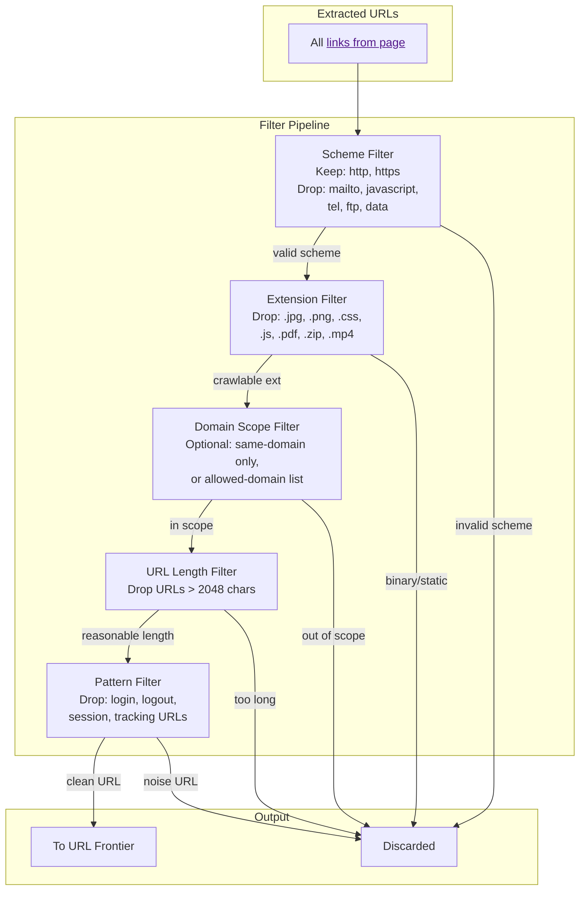
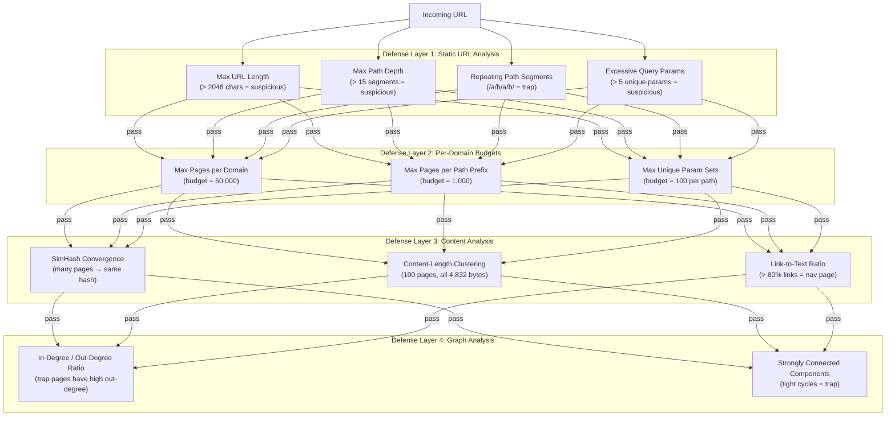
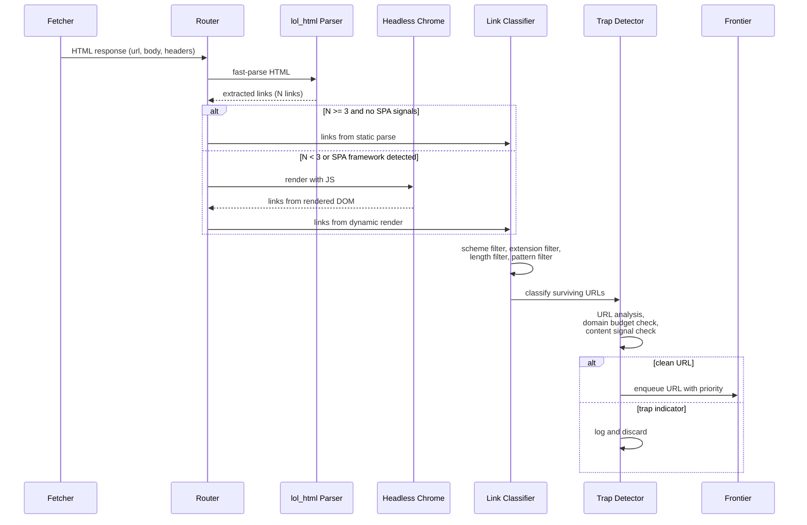

# 4. Parsing and Spider Traps 🔴

> **The Problem:** After fetching a page, the crawler must extract every outgoing link to feed back into the URL frontier. This sounds simple—just find all `<a href="...">` tags—but the modern web makes it anything but. JavaScript-rendered pages hide links behind dynamic DOM manipulation. Malformed HTML (unclosed tags, broken encodings, nested tables from the 1990s) crashes naive parsers. And lurking in the web's shadowy corners are **spider traps**: URL structures that generate an infinite number of pages, luring the crawler into an endless loop that consumes resources while producing nothing of value. A production crawler must combine a fast, fault-tolerant HTML parser, a selective JavaScript renderer, and a multi-layered trap detector to survive the real web.

---

## The Parsing Challenge

The web is *not* clean XHTML. Real-world HTML that a crawler encounters:

| Challenge | Example |
|---|---|
| Unclosed tags | `<p>First paragraph<p>Second paragraph` |
| Misnested tags | `<b><i>text</b></i>` |
| Missing doctype | No `<!DOCTYPE html>` at all |
| Broken encoding | Latin-1 bytes in a page declared as UTF-8 |
| Tag soup | `<table><tr><td><table><tr><td>...` 30 levels deep |
| Inline JS links | `<a href="javascript:loadPage(42)">` |
| Data URIs | `<a href="data:text/html,<h1>hello</h1>">` |
| Server-side rendering artifacts | `<div ng-href="{{url}}">` (Angular) |
| Dynamic `<base>` tags | Changes the meaning of all relative URLs on the page |

A production parser must handle all of these gracefully, **never crash**, and still extract links at high throughput.

---

## Choosing a Parser

### Parser Comparison

| Parser | Language | Speed | Streaming | JS Support | Fault Tolerance |
|---|---|---|---|---|---|
| **lol_html** (Cloudflare) | Rust | ~1 GB/s | ✅ Yes | ❌ No | ✅ Excellent |
| **html5ever** | Rust | ~400 MB/s | ✅ Yes | ❌ No | ✅ Spec-compliant |
| **scraper** (wraps html5ever) | Rust | ~300 MB/s | ❌ (DOM) | ❌ No | ✅ Good |
| **headless Chrome** (via CDP) | C++ | ~5 MB/s | ❌ No | ✅ Full | ✅ Excellent |
| **Servo layout engine** | Rust | ~50 MB/s | ❌ No | ⚠️ Partial | ✅ Good |

For a global crawler at billions of pages/day:

- **Primary path** (95% of pages): `lol_html` — streaming, zero-allocation link extraction at ~1 GB/s.
- **Secondary path** (5% of pages): headless Chrome for JavaScript-rendered pages (SPAs, React apps, infinite scroll).

### Streaming Link Extraction with `lol_html`

`lol_html` (Low Output Latency HTML) is Cloudflare's streaming HTML rewriter. It processes HTML in a single pass without building a DOM tree, making it ideal for link extraction.

```rust,ignore
use lol_html::{element, HtmlRewriter, Settings};
use url::Url;

/// Extract all outgoing links from an HTML document using
/// streaming parsing (no full DOM construction).
fn extract_links(html: &[u8], base_url: &Url) -> Vec<Url> {
    let mut links = Vec::new();

    // The closure captures `links` and `base_url`
    let mut rewriter = HtmlRewriter::new(
        Settings {
            element_content_handlers: vec![
                // <a href="...">
                element!("a[href]", |el| {
                    if let Some(href) = el.get_attribute("href") {
                        if let Ok(resolved) = base_url.join(&href) {
                            links.push(resolved);
                        }
                    }
                    Ok(())
                }),
                // <link rel="canonical" href="...">
                element!("link[rel='canonical'][href]", |el| {
                    if let Some(href) = el.get_attribute("href") {
                        if let Ok(resolved) = base_url.join(&href) {
                            links.push(resolved);
                        }
                    }
                    Ok(())
                }),
                // <area href="..."> (image maps)
                element!("area[href]", |el| {
                    if let Some(href) = el.get_attribute("href") {
                        if let Ok(resolved) = base_url.join(&href) {
                            links.push(resolved);
                        }
                    }
                    Ok(())
                }),
            ],
            ..Settings::default()
        },
        |_chunk: &[u8]| {},  // We don't need the rewritten output
    );

    rewriter.write(html).expect("lol_html write failed");
    rewriter.end().expect("lol_html end failed");

    links
}

#[test]
fn extracts_absolute_and_relative_links() {
    let html = br#"
        <html>
        <body>
            <a href="https://example.com/page1">Absolute</a>
            <a href="/page2">Root-relative</a>
            <a href="page3">Relative</a>
            <a href="#section">Fragment-only</a>
            <a href="mailto:test@example.com">Email</a>
        </body>
        </html>
    "#;

    let base = Url::parse("https://example.com/dir/current").unwrap();
    let links = extract_links(html, &base);

    let urls: Vec<String> = links.iter().map(|u| u.to_string()).collect();
    assert!(urls.contains(&"https://example.com/page1".to_string()));
    assert!(urls.contains(&"https://example.com/page2".to_string()));
    assert!(urls.contains(&"https://example.com/dir/page3".to_string()));

    // Fragment-only links resolve to the same page — typically filtered later
    // mailto: links should not parse as valid HTTP URLs
    assert!(!urls.iter().any(|u| u.starts_with("mailto:")));
}
```

### Handling the `<base>` Tag

A `<base href="...">` tag changes the base URL for all relative links on the page. If the parser encounters a `<base>` tag, it must update its resolution logic *before* processing subsequent links.

```rust,ignore
/// Extract links with proper <base> tag handling.
fn extract_links_with_base(html: &[u8], page_url: &Url) -> Vec<Url> {
    let mut effective_base: Url = page_url.clone();
    let mut links = Vec::new();

    // Two-phase approach: first find <base>, then extract links.
    // With lol_html streaming, we handle it in order:
    let mut rewriter = HtmlRewriter::new(
        Settings {
            element_content_handlers: vec![
                // Handle <base href="..."> — must appear before links
                element!("base[href]", |el| {
                    if let Some(href) = el.get_attribute("href") {
                        if let Ok(new_base) = page_url.join(&href) {
                            // Safety: only update base once (first <base> wins per spec)
                            effective_base = new_base;
                        }
                    }
                    Ok(())
                }),
                // Extract links using the effective base
                element!("a[href]", |el| {
                    if let Some(href) = el.get_attribute("href") {
                        if let Ok(resolved) = effective_base.join(&href) {
                            links.push(resolved);
                        }
                    }
                    Ok(())
                }),
            ],
            ..Settings::default()
        },
        |_chunk: &[u8]| {},
    );

    rewriter.write(html).expect("lol_html write failed");
    rewriter.end().expect("lol_html end failed");
    links
}

#[test]
fn base_tag_changes_resolution() {
    let html = br#"
        <html>
        <head><base href="https://cdn.example.com/assets/"></head>
        <body>
            <a href="page1.html">Link</a>
        </body>
        </html>
    "#;

    let page = Url::parse("https://example.com/original/path").unwrap();
    let links = extract_links_with_base(html, &page);

    assert_eq!(
        links[0].as_str(),
        "https://cdn.example.com/assets/page1.html"
    );
}
```

---

## Link Filtering and Classification

Not all extracted URLs should enter the frontier. A classification step filters out noise:



```rust,ignore
/// URL classification result.
#[derive(Debug, PartialEq)]
enum UrlVerdict {
    /// URL should be enqueued for crawling.
    Crawl,
    /// URL should be skipped with a reason.
    Skip(&'static str),
}

/// Non-crawlable file extensions (lowercase).
const SKIP_EXTENSIONS: &[&str] = &[
    ".jpg", ".jpeg", ".png", ".gif", ".svg", ".webp", ".ico",
    ".css", ".js", ".woff", ".woff2", ".ttf", ".eot",
    ".pdf", ".zip", ".tar", ".gz", ".rar", ".7z",
    ".mp3", ".mp4", ".avi", ".mov", ".wmv", ".flv",
    ".doc", ".docx", ".xls", ".xlsx", ".ppt", ".pptx",
];

/// Patterns in URL paths that indicate non-content pages.
const SKIP_PATTERNS: &[&str] = &[
    "/login", "/logout", "/signin", "/signout",
    "/session", "/cart", "/checkout", "/account",
    "/wp-admin", "/cgi-bin",
];

/// Classify a URL for crawl-worthiness.
fn classify_url(url: &url::Url) -> UrlVerdict {
    // 1. Scheme check
    match url.scheme() {
        "http" | "https" => {}
        _ => return UrlVerdict::Skip("non-http scheme"),
    }

    // 2. Extension check
    let path = url.path().to_lowercase();
    for ext in SKIP_EXTENSIONS {
        if path.ends_with(ext) {
            return UrlVerdict::Skip("binary/static extension");
        }
    }

    // 3. Length check
    if url.as_str().len() > 2048 {
        return UrlVerdict::Skip("URL too long");
    }

    // 4. Pattern check
    for pattern in SKIP_PATTERNS {
        if path.contains(pattern) {
            return UrlVerdict::Skip("skip pattern matched");
        }
    }

    UrlVerdict::Crawl
}

#[test]
fn test_url_classification() {
    use url::Url;

    let crawl = Url::parse("https://example.com/article/rust-lang").unwrap();
    assert_eq!(classify_url(&crawl), UrlVerdict::Crawl);

    let image = Url::parse("https://example.com/photo.jpg").unwrap();
    assert_eq!(classify_url(&image), UrlVerdict::Skip("binary/static extension"));

    let mailto = Url::parse("mailto:user@example.com").unwrap();
    assert_eq!(classify_url(&mailto), UrlVerdict::Skip("non-http scheme"));

    let login = Url::parse("https://example.com/login?redirect=/home").unwrap();
    assert_eq!(classify_url(&login), UrlVerdict::Skip("skip pattern matched"));
}
```

---

## Spider Traps

A **spider trap** is a URL structure that produces an infinite (or near-infinite) number of valid-looking pages, each linking to more pages. Spider traps can be:

1. **Accidental** — poorly designed websites with unintended infinite URL spaces.
2. **Malicious** — deliberately constructed to waste crawler resources.

### Common Spider Trap Patterns

| Trap Type | Example URL Pattern | How It Works |
|---|---|---|
| **Infinite calendar** | `/calendar/2026/01/01` → `/calendar/2026/01/02` → ... | Each day links to the next, forever |
| **Infinite pagination** | `/page/1` → `/page/2` → `/page/3` → ... | Page N always links to page N+1, even if empty |
| **Session ID in URL** | `/product?sid=abc123` → same page, different SID each time | Server embeds a new session token in every link |
| **Combinatorial parameters** | `/search?color=red&size=L&sort=price` | Every combination of parameters generates a "new" URL |
| **Symbolic link loops** | `/a/b/a/b/a/b/...` | Directory symlinks create infinite path depth |
| **Soft-404 pages** | `/anything/you/type/here` → 200 OK with generic content | Server returns 200 for *every* URL path |
| **Query string injection** | `/page?ref=/page?ref=/page?ref=...` | Referral parameters nest recursively |
| **JavaScript-generated URLs** | `onclick="loadNext(id+1)"` | JS generates incrementing URLs on every page render |

### The Cost of Spider Traps

If unchecked, a single spider trap domain can:
- Consume **millions of fetch slots** in the frontier queue.
- Waste **terabytes of storage** on worthless duplicate content.
- Skew **PageRank** calculations (many internal links inflate page importance).
- Poison the **SimHash index** with thousands of near-duplicate fingerprints.

---

## Detecting and Breaking Spider Traps

No single technique catches all spider traps. A production crawler uses **layered defenses**:



### Layer 1: Static URL Analysis

These checks run *before* fetching, on the raw URL string. They are cheap and fast.

```rust,ignore
/// Static URL analysis to detect spider trap indicators.
struct UrlTrapDetector {
    max_url_length: usize,
    max_path_depth: usize,
    max_query_params: usize,
}

impl Default for UrlTrapDetector {
    fn default() -> Self {
        Self {
            max_url_length: 2048,
            max_path_depth: 15,
            max_query_params: 5,
        }
    }
}

/// Why a URL was flagged as a potential spider trap.
#[derive(Debug, PartialEq)]
enum TrapIndicator {
    /// URL is too long.
    ExcessiveLength(usize),
    /// URL path has too many segments.
    ExcessiveDepth(usize),
    /// URL path contains repeating segment patterns.
    RepeatingSegments(String),
    /// URL has too many query parameters.
    ExcessiveParams(usize),
    /// No trap indicators detected.
    Clean,
}

impl UrlTrapDetector {
    /// Analyze a URL for spider trap indicators.
    fn analyze(&self, url: &url::Url) -> TrapIndicator {
        // 1. Length check
        if url.as_str().len() > self.max_url_length {
            return TrapIndicator::ExcessiveLength(url.as_str().len());
        }

        // 2. Path depth check
        let segments: Vec<&str> = url.path_segments()
            .map(|s| s.collect())
            .unwrap_or_default();
        if segments.len() > self.max_path_depth {
            return TrapIndicator::ExcessiveDepth(segments.len());
        }

        // 3. Repeating segment detection
        if let Some(pattern) = detect_repeating_pattern(&segments) {
            return TrapIndicator::RepeatingSegments(pattern);
        }

        // 4. Excessive query parameters
        let param_count = url.query_pairs().count();
        if param_count > self.max_query_params {
            return TrapIndicator::ExcessiveParams(param_count);
        }

        TrapIndicator::Clean
    }
}

/// Detect repeating patterns in URL path segments.
/// E.g., ["a", "b", "a", "b"] → Some("a/b")
fn detect_repeating_pattern(segments: &[&str]) -> Option<String> {
    if segments.len() < 4 {
        return None;
    }

    // Check for pattern lengths from 1 to segments.len()/2
    for pattern_len in 1..=segments.len() / 2 {
        let pattern = &segments[..pattern_len];
        let mut repeats = true;
        let mut repetition_count = 0;

        for chunk in segments.chunks(pattern_len) {
            if chunk == pattern {
                repetition_count += 1;
            } else if chunk.len() == pattern_len {
                repeats = false;
                break;
            }
            // Partial final chunk is OK
        }

        if repeats && repetition_count >= 3 {
            return Some(pattern.join("/"));
        }
    }
    None
}

#[test]
fn detects_repeating_path_segments() {
    assert_eq!(
        detect_repeating_pattern(&["a", "b", "a", "b", "a", "b"]),
        Some("a/b".to_string()),
    );
    assert_eq!(
        detect_repeating_pattern(&["dir", "dir", "dir"]),
        Some("dir".to_string()),
    );
    assert_eq!(
        detect_repeating_pattern(&["a", "b", "c"]),
        None,
    );
}

#[test]
fn url_trap_detector_flags_deep_paths() {
    let detector = UrlTrapDetector::default();
    let deep = url::Url::parse(
        "https://example.com/a/b/c/d/e/f/g/h/i/j/k/l/m/n/o/p/q"
    ).unwrap();
    assert!(matches!(
        detector.analyze(&deep),
        TrapIndicator::ExcessiveDepth(17)
    ));
}
```

### Layer 2: Per-Domain Budgets

Even if individual URLs look clean, a domain that produces 500,000 crawled pages is suspicious. We impose hard budgets.

```rust,ignore
use std::collections::HashMap;

/// Per-domain crawl budget tracker.
struct DomainBudgetTracker {
    /// Max total pages to crawl from any single domain.
    max_pages_per_domain: u64,
    /// Max pages under a single path prefix (e.g., /calendar/).
    max_pages_per_prefix: u64,
    /// Current page counts per domain.
    domain_counts: HashMap<String, u64>,
    /// Current page counts per (domain, path_prefix).
    prefix_counts: HashMap<(String, String), u64>,
}

impl DomainBudgetTracker {
    fn new(max_pages_per_domain: u64, max_pages_per_prefix: u64) -> Self {
        Self {
            max_pages_per_domain,
            max_pages_per_prefix,
            domain_counts: HashMap::new(),
            prefix_counts: HashMap::new(),
        }
    }

    /// Check if we have budget remaining for this URL.
    fn has_budget(&self, url: &url::Url) -> bool {
        let domain = url.host_str().unwrap_or("").to_string();
        let prefix = extract_path_prefix(url);

        let domain_count = self.domain_counts.get(&domain).copied().unwrap_or(0);
        if domain_count >= self.max_pages_per_domain {
            return false;
        }

        let key = (domain, prefix);
        let prefix_count = self.prefix_counts.get(&key).copied().unwrap_or(0);
        if prefix_count >= self.max_pages_per_prefix {
            return false;
        }

        true
    }

    /// Record that a page was crawled.
    fn record(&mut self, url: &url::Url) {
        let domain = url.host_str().unwrap_or("").to_string();
        let prefix = extract_path_prefix(url);

        *self.domain_counts.entry(domain.clone()).or_insert(0) += 1;
        *self.prefix_counts.entry((domain, prefix)).or_insert(0) += 1;
    }
}

/// Extract the first two path segments as a prefix.
/// /blog/2026/01/article → /blog/2026
fn extract_path_prefix(url: &url::Url) -> String {
    let segments: Vec<&str> = url
        .path_segments()
        .map(|s| s.take(2).collect())
        .unwrap_or_default();
    format!("/{}", segments.join("/"))
}

#[test]
fn budget_exhaustion() {
    let mut tracker = DomainBudgetTracker::new(3, 2);
    let url1 = url::Url::parse("https://trap.com/cal/jan").unwrap();
    let url2 = url::Url::parse("https://trap.com/cal/feb").unwrap();
    let url3 = url::Url::parse("https://trap.com/blog/post").unwrap();
    let url4 = url::Url::parse("https://trap.com/cal/mar").unwrap();

    tracker.record(&url1);
    tracker.record(&url2);
    assert!(tracker.has_budget(&url3));  // Domain budget: 2/3, different prefix
    assert!(!tracker.has_budget(&url4)); // Prefix budget: 2/2 for /cal

    tracker.record(&url3);
    // Domain budget exhausted: 3/3
    let url5 = url::Url::parse("https://trap.com/new/page").unwrap();
    assert!(!tracker.has_budget(&url5));
}
```

### Layer 3: Content-Based Trap Detection

After fetching, we analyze the content to detect traps that look fine at the URL level.

```rust,ignore
/// Signals extracted from page content to detect traps.
struct ContentSignals {
    /// Content length in bytes.
    content_length: usize,
    /// SimHash fingerprint.
    simhash: u64,
    /// Ratio of link text to total text content.
    link_to_text_ratio: f64,
    /// Number of outgoing links found.
    outgoing_link_count: usize,
}

/// A detector that identifies traps based on content patterns
/// across multiple pages from the same domain.
struct ContentTrapDetector {
    /// Recent content lengths per domain (ring buffer).
    recent_lengths: HashMap<String, Vec<usize>>,
    /// Recent SimHash fingerprints per domain.
    recent_hashes: HashMap<String, Vec<u64>>,
    /// Max entries to track per domain.
    window_size: usize,
    /// Similarity threshold for declaring "same content".
    simhash_threshold: u32,
}

impl ContentTrapDetector {
    fn new(window_size: usize) -> Self {
        Self {
            recent_lengths: HashMap::new(),
            recent_hashes: HashMap::new(),
            window_size,
            simhash_threshold: 3,
        }
    }

    /// Record content signals and return whether this looks like a trap.
    fn record_and_check(
        &mut self,
        domain: &str,
        signals: &ContentSignals,
    ) -> bool {
        // Track content lengths
        let lengths = self.recent_lengths
            .entry(domain.to_string())
            .or_default();
        lengths.push(signals.content_length);
        if lengths.len() > self.window_size {
            lengths.remove(0);
        }

        // Track SimHash values
        let hashes = self.recent_hashes
            .entry(domain.to_string())
            .or_default();
        hashes.push(signals.simhash);
        if hashes.len() > self.window_size {
            hashes.remove(0);
        }

        // Check 1: Are most recent pages the same content length?
        if lengths.len() >= 10 {
            let mode_count = count_mode(lengths);
            if mode_count as f64 / lengths.len() as f64 > 0.8 {
                return true; // 80%+ pages have identical size = soft-404 trap
            }
        }

        // Check 2: Are most recent pages near-duplicate by SimHash?
        if hashes.len() >= 10 {
            let similar_count = hashes
                .windows(2)
                .filter(|pair| {
                    (pair[0] ^ pair[1]).count_ones() <= self.simhash_threshold
                })
                .count();
            if similar_count as f64 / (hashes.len() - 1) as f64 > 0.7 {
                return true; // 70%+ consecutive pages are near-dupes = trap
            }
        }

        false
    }
}

/// Count occurrences of the most common value.
fn count_mode(values: &[usize]) -> usize {
    let mut counts: HashMap<usize, usize> = HashMap::new();
    for &v in values {
        *counts.entry(v).or_insert(0) += 1;
    }
    counts.values().copied().max().unwrap_or(0)
}

#[test]
fn detects_soft_404_trap() {
    let mut detector = ContentTrapDetector::new(20);
    let domain = "trap-site.com";

    // Simulate 12 pages that all have the same content length and hash
    for _ in 0..12 {
        let signals = ContentSignals {
            content_length: 4832, // Identical every time
            simhash: 0xDEAD_BEEF_CAFE_BABE,
            link_to_text_ratio: 0.9,
            outgoing_link_count: 50,
        };
        let is_trap = detector.record_and_check(domain, &signals);
        // Should detect trap once we have enough samples
        if detector.recent_lengths[domain].len() >= 10 {
            assert!(is_trap, "Should detect soft-404 trap");
        }
    }
}
```

---

## Handling JavaScript-Rendered Pages

Many modern websites (SPAs, React/Next.js apps) only populate links after JavaScript execution. For these, the raw HTML contains no meaningful `<a href>` links.

### Detection Strategy

```rust,ignore
/// Heuristics to determine if a page needs JavaScript rendering.
fn needs_js_rendering(html: &str, extracted_links: &[url::Url]) -> bool {
    // Few or no links in the raw HTML, but the page has JS frameworks
    let has_framework_signals =
        html.contains("__NEXT_DATA__")        // Next.js
        || html.contains("ng-app")            // Angular
        || html.contains("data-reactroot")    // React
        || html.contains("nuxt")              // Nuxt/Vue
        || html.contains("id=\"app\"");       // Generic SPA mount point

    let few_links = extracted_links.len() < 3;
    let has_heavy_js = html.matches("<script").count() > 5;

    // If raw HTML has very few links but lots of JS, render it
    (few_links && has_framework_signals) || (few_links && has_heavy_js)
}
```

### Headless Browser Pool

For pages that need JS rendering, we maintain a pool of headless Chrome instances:

```rust,ignore
use std::time::Duration;

/// Configuration for the headless browser pool.
struct BrowserPoolConfig {
    /// Number of browser instances.
    pool_size: usize,
    /// Max time to wait for page load + JS execution.
    page_timeout: Duration,
    /// Max time to wait for network idle.
    network_idle_timeout: Duration,
    /// Max memory per browser instance.
    max_memory_mb: usize,
}

impl Default for BrowserPoolConfig {
    fn default() -> Self {
        Self {
            pool_size: 16,
            page_timeout: Duration::from_secs(15),
            network_idle_timeout: Duration::from_secs(3),
            max_memory_mb: 512,
        }
    }
}

/// Render a page using a headless browser and extract links.
async fn render_and_extract(
    browser: &headless_chrome::Browser,
    url: &str,
    config: &BrowserPoolConfig,
) -> Result<Vec<String>, Box<dyn std::error::Error>> {
    let tab = browser.new_tab()?;

    // Navigate with timeout
    tab.navigate_to(url)?;
    tab.wait_until_navigated()?;

    // Wait for network to become idle (all XHR/fetch calls completed)
    std::thread::sleep(config.network_idle_timeout);

    // Extract all links from the rendered DOM
    let links = tab.evaluate(
        r#"
        Array.from(document.querySelectorAll('a[href]'))
            .map(a => a.href)
            .filter(href => href.startsWith('http'))
        "#,
        true,
    )?;

    // Parse the JSON array result
    let link_array: Vec<String> = match links.value {
        Some(val) => serde_json::from_value(val).unwrap_or_default(),
        None => Vec::new(),
    };

    tab.close(true)?;
    Ok(link_array)
}
```

### Cost of JS Rendering

| Metric | `lol_html` (no JS) | Headless Chrome |
|---|---|---|
| Throughput per instance | ~20,000 pages/sec | ~4 pages/sec |
| Memory per page | ~100 KB | ~50–200 MB |
| CPU per page | ~50 µs | ~500 ms |
| Network overhead | 1 request | 10–100 requests (JS, CSS, images) |
| Accuracy for SPAs | ❌ Misses most links | ✅ Full link coverage |

At these costs, JS rendering must be **highly selective**. Only 3–5% of pages should go through the browser pool.

---

## The Complete Parsing Pipeline



---

## Advanced: Detecting Calendar and Pagination Traps

Calendar and pagination traps are among the most common. They have a distinctive structure: **sequential, predictable URL patterns** where each page links to the next.

```rust,ignore
/// Detect sequential URL patterns that suggest infinite traps.
struct SequentialPatternDetector {
    /// Recent URL paths per domain, preserving insertion order.
    recent_paths: HashMap<String, Vec<String>>,
    window_size: usize,
}

impl SequentialPatternDetector {
    fn new(window_size: usize) -> Self {
        Self {
            recent_paths: HashMap::new(),
            window_size,
        }
    }

    /// Record a URL and check if it belongs to a sequential pattern.
    fn record_and_check(&mut self, domain: &str, path: &str) -> bool {
        let paths = self.recent_paths
            .entry(domain.to_string())
            .or_default();
        paths.push(path.to_string());
        if paths.len() > self.window_size {
            paths.remove(0);
        }

        if paths.len() < 5 {
            return false;
        }

        // Extract numeric suffixes from recent paths
        let numbers: Vec<Option<i64>> = paths
            .iter()
            .map(|p| extract_trailing_number(p))
            .collect();

        // Check if we have a run of consecutive numbers
        let consecutive_run = numbers
            .windows(2)
            .filter(|pair| match (pair[0], pair[1]) {
                (Some(a), Some(b)) => (b - a).abs() == 1,
                _ => false,
            })
            .count();

        // If 80%+ of recent URLs have consecutive numeric patterns → trap
        consecutive_run as f64 / (numbers.len() - 1) as f64 > 0.8
    }
}

/// Extract the trailing numeric component from a URL path.
/// "/page/42" → Some(42)
/// "/calendar/2026/01/15" → Some(15)
/// "/article/rust-intro" → None
fn extract_trailing_number(path: &str) -> Option<i64> {
    path.rsplit('/')
        .next()
        .and_then(|segment| segment.parse::<i64>().ok())
}

#[test]
fn detects_pagination_trap() {
    let mut detector = SequentialPatternDetector::new(20);
    let domain = "blog.example.com";

    for page in 1..=10 {
        let path = format!("/posts/page/{page}");
        let is_trap = detector.record_and_check(domain, &path);
        if page >= 6 {
            assert!(is_trap, "Should detect pagination trap by page {page}");
        }
    }
}

#[test]
fn detects_calendar_trap() {
    let mut detector = SequentialPatternDetector::new(20);
    let domain = "events.example.com";

    for day in 1..=10 {
        let path = format!("/calendar/2026/01/{day:02}");
        let is_trap = detector.record_and_check(domain, &path);
        if day >= 6 {
            assert!(is_trap, "Should detect calendar trap by day {day}");
        }
    }
}

#[test]
fn does_not_flag_normal_articles() {
    let mut detector = SequentialPatternDetector::new(20);
    let domain = "news.example.com";

    // Non-sequential article IDs (typical real-world pattern)
    let ids = [4891, 4725, 5102, 3899, 5244, 4001, 5500, 3712, 4999, 5301];
    for id in ids {
        let path = format!("/article/{id}");
        let is_trap = detector.record_and_check(domain, &path);
        assert!(!is_trap, "Should not flag non-sequential articles");
    }
}
```

---

## Handling Encoding and Character Sets

Real-world HTML uses dozens of character encodings. Incorrect handling corrupts extracted link text and URLs:

```rust,ignore
/// Detect and decode the character encoding of an HTML document.
fn decode_html(raw_bytes: &[u8], content_type_header: Option<&str>) -> String {
    // Priority 1: charset from Content-Type header
    if let Some(header) = content_type_header {
        if let Some(charset) = extract_charset_from_header(header) {
            if let Some(decoded) = decode_with_charset(raw_bytes, &charset) {
                return decoded;
            }
        }
    }

    // Priority 2: <meta charset="..."> in first 1024 bytes
    let head = &raw_bytes[..raw_bytes.len().min(1024)];
    if let Some(charset) = detect_meta_charset(head) {
        if let Some(decoded) = decode_with_charset(raw_bytes, &charset) {
            return decoded;
        }
    }

    // Priority 3: BOM detection
    if raw_bytes.starts_with(&[0xEF, 0xBB, 0xBF]) {
        // UTF-8 BOM
        return String::from_utf8_lossy(&raw_bytes[3..]).into_owned();
    }
    if raw_bytes.starts_with(&[0xFF, 0xFE]) || raw_bytes.starts_with(&[0xFE, 0xFF]) {
        // UTF-16 BOM — needs conversion
        // (simplified; production code uses encoding_rs)
    }

    // Fallback: UTF-8 with lossy replacement
    String::from_utf8_lossy(raw_bytes).into_owned()
}

fn extract_charset_from_header(header: &str) -> Option<String> {
    header
        .split(';')
        .find_map(|part| {
            let trimmed = part.trim();
            if trimmed.to_lowercase().starts_with("charset=") {
                Some(trimmed[8..].trim_matches('"').to_lowercase())
            } else {
                None
            }
        })
}

fn detect_meta_charset(head: &[u8]) -> Option<String> {
    let head_str = String::from_utf8_lossy(head).to_lowercase();
    // Look for <meta charset="...">
    if let Some(pos) = head_str.find("charset=") {
        let after = &head_str[pos + 8..];
        let charset: String = after
            .trim_start_matches('"')
            .trim_start_matches('\'')
            .chars()
            .take_while(|c| c.is_alphanumeric() || *c == '-' || *c == '_')
            .collect();
        if !charset.is_empty() {
            return Some(charset);
        }
    }
    None
}

fn decode_with_charset(bytes: &[u8], charset: &str) -> Option<String> {
    let encoding = encoding_rs::Encoding::for_label(charset.as_bytes())?;
    let (decoded, _, had_errors) = encoding.decode(bytes);
    if had_errors {
        None
    } else {
        Some(decoded.into_owned())
    }
}

#[test]
fn charset_from_content_type() {
    assert_eq!(
        extract_charset_from_header("text/html; charset=iso-8859-1"),
        Some("iso-8859-1".to_string()),
    );
    assert_eq!(
        extract_charset_from_header("text/html"),
        None,
    );
}

#[test]
fn meta_charset_detection() {
    let html = b"<html><head><meta charset=\"utf-8\"></head>";
    assert_eq!(detect_meta_charset(html), Some("utf-8".to_string()));
}
```

---

> **Key Takeaways**
>
> 1. **`lol_html` handles 95% of pages** at ~1 GB/s throughput with streaming, zero-DOM-construction parsing — reserving expensive headless Chrome for the ~5% of pages that require JavaScript rendering.
> 2. **`<base>` tag handling is critical** — forgetting it means all relative links on affected pages resolve to the wrong host.
> 3. **Spider traps are layered** — no single detection method catches all traps. Combine static URL analysis, per-domain budgets, content fingerprinting, and sequential-pattern detection.
> 4. **Per-domain budgets are the hard stop** — even if every other defense misses a trap, a 50,000-page cap per domain limits the blast radius.
> 5. **Content-based detection** (SimHash convergence, identical content-length) catches soft-404 traps that look fine at the URL level.
> 6. **Character encoding detection** must follow a priority chain: HTTP header → meta charset → BOM → UTF-8 fallback.

---

## Exercises

### Exercise 1: Symlink Path Trap

A file server has symbolic links such that `/mirror/a/b/` points back to `/mirror/`. This creates URLs like `/mirror/a/b/a/b/a/b/...`. The repeating-pattern detector from Layer 1 catches patterns like `/a/b/a/b/a/b`. But what if the symlink creates a cycle with period 3 (`/a/b/c/a/b/c/a/b/c/...`)? Modify the `detect_repeating_pattern` function to detect any cycle length up to $L/3$ where $L$ is the path length.

<details>
<summary>Solution</summary>

The existing implementation already checks pattern lengths from 1 to `segments.len() / 2`, which covers cycles of any period. For a cycle of period 3 with segments `["a", "b", "c", "a", "b", "c", "a", "b", "c"]`, the function checks `pattern_len = 3`, finds the pattern `["a", "b", "c"]`, and counts 3 repetitions (≥ 3 required), so it returns `Some("a/b/c")`.

The key constraint is requiring at least 3 repetitions. For cycle period $p$, we need at least $3p$ path segments. Since we check up to `segments.len() / 2`, this comfortably covers period lengths up to `segments.len() / 3`.

```rust,ignore
#[test]
fn detects_period_3_symlink() {
    let segments = vec!["a", "b", "c", "a", "b", "c", "a", "b", "c"];
    assert_eq!(
        detect_repeating_pattern(&segments),
        Some("a/b/c".to_string()),
    );
}
```

</details>

### Exercise 2: Adaptive Domain Budget

The fixed 50,000-page budget per domain is too aggressive for domains like `en.wikipedia.org` (millions of legitimate pages) and too generous for domains like `personal-blog.example.com` (maybe 200 real pages). Design an adaptive budget system that starts with a low budget and increases it based on observed content diversity (unique SimHash fingerprints, unique content-length values, unique outgoing link structures).

<details>
<summary>Solution</summary>

Use a tiered budget system where the budget grows as the domain proves its content diversity:

```rust,ignore
struct AdaptiveBudget {
    /// Current allowed page count.
    budget: u64,
    /// Pages crawled so far.
    crawled: u64,
    /// Number of unique SimHash fingerprints seen.
    unique_hashes: usize,
    /// Diversity ratio: unique_hashes / crawled.
    diversity_threshold: f64,
}

impl AdaptiveBudget {
    fn new() -> Self {
        Self {
            budget: 500,            // Start conservative
            crawled: 0,
            unique_hashes: 0,
            diversity_threshold: 0.5,
        }
    }

    fn record_page(&mut self, is_unique_hash: bool) {
        self.crawled += 1;
        if is_unique_hash {
            self.unique_hashes += 1;
        }

        // Expand budget at checkpoints if diversity is high
        if self.crawled == self.budget && self.crawled < 1_000_000 {
            let diversity = self.unique_hashes as f64 / self.crawled as f64;
            if diversity >= self.diversity_threshold {
                self.budget *= 4; // Quadruple the budget
            }
        }
    }
}
```

A domain like Wikipedia would quickly reach 500 pages with > 95% unique content, triggering budget expansion to 2,000 → 8,000 → 32,000 → ... up to 1M. A spam domain with 80% duplicate content would stay at 500.

</details>

### Exercise 3: JS-Rendering Decision Model

You observe that ~30% of pages flagged for JS rendering actually don't produce any additional links beyond what `lol_html` found (false positives). Each JS render costs 500ms and ~100MB of memory. Design a learning system that reduces the false-positive rate over time by tracking which domains actually benefit from JS rendering.

<details>
<summary>Solution</summary>

Track per-domain JS rendering effectiveness:

```rust,ignore
struct JsRenderingOracle {
    /// Per-domain: (total_renders, renders_that_found_new_links)
    domain_stats: HashMap<String, (u64, u64)>,
    /// Minimum renders before making a decision.
    min_samples: u64,
    /// Minimum success rate to continue rendering.
    min_success_rate: f64,
}

impl JsRenderingOracle {
    fn should_render(&self, domain: &str, static_link_count: usize) -> bool {
        // Always render if we have no data yet
        let Some(&(total, successes)) = self.domain_stats.get(domain) else {
            return static_link_count < 3;
        };

        if total < self.min_samples {
            return static_link_count < 3; // Not enough data, use heuristic
        }

        let success_rate = successes as f64 / total as f64;
        success_rate >= self.min_success_rate && static_link_count < 3
    }

    fn record(&mut self, domain: &str, found_new_links: bool) {
        let entry = self.domain_stats
            .entry(domain.to_string())
            .or_insert((0, 0));
        entry.0 += 1;
        if found_new_links {
            entry.1 += 1;
        }
    }
}
```

Domains where JS rendering consistently finds no new links get permanently flagged as "static-only," saving 500ms per page. Domains like React-based SPAs that always benefit from rendering get flagged as "always render."

</details>
