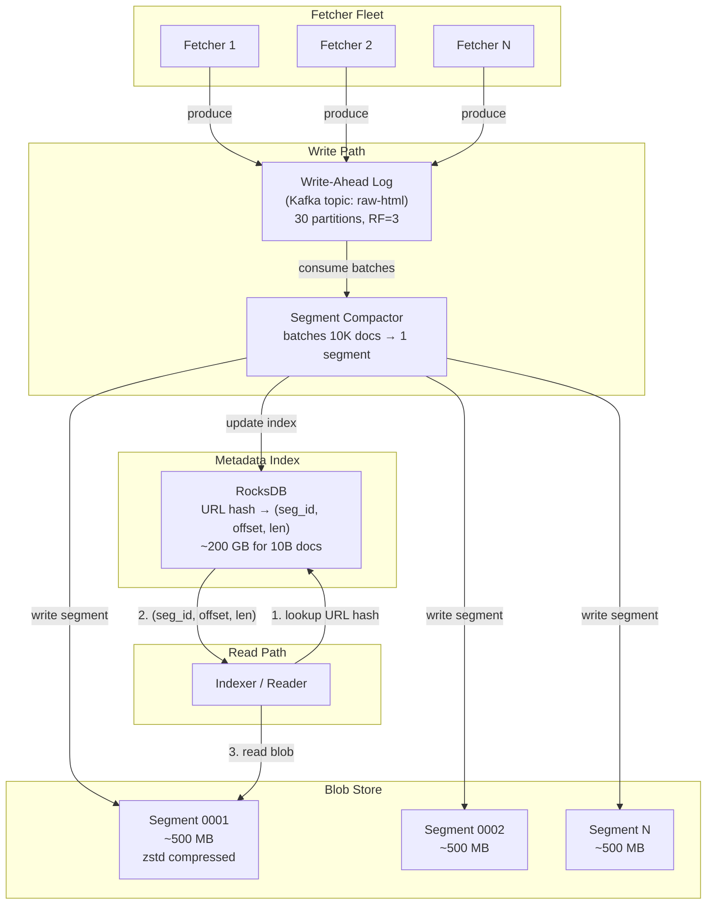
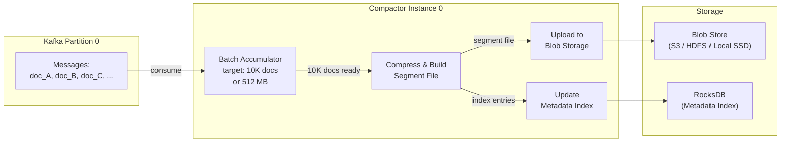
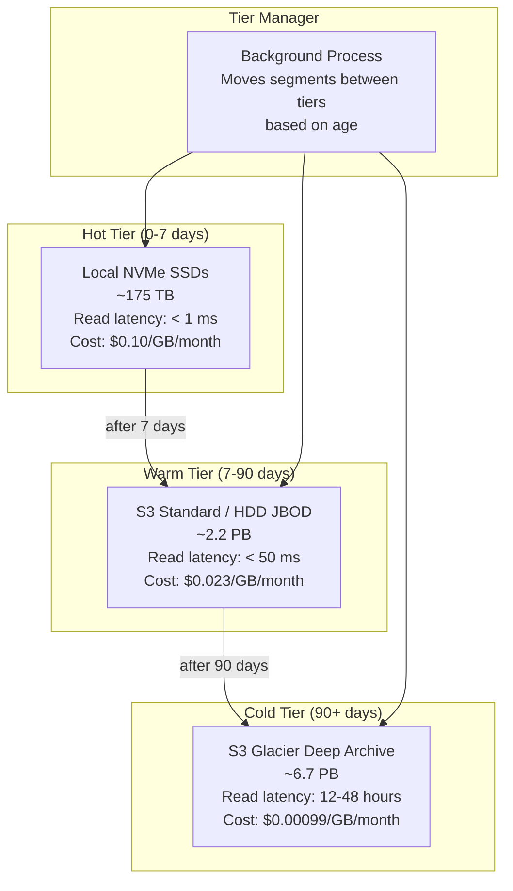
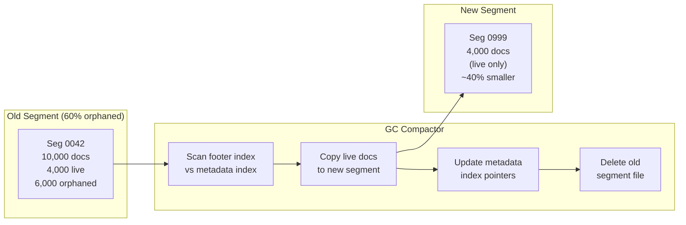

# 5. The Distributed Content Store 🟡

> **The Problem:** A global web crawler downloads billions of HTML pages per day, each ranging from a few kilobytes to several megabytes. All of this raw content must be persisted durably so that downstream systems—indexers, ranking pipelines, machine learning feature extractors, and legal compliance auditors—can process it asynchronously. The store must handle **petabytes** of data with high write throughput, cheap storage costs, and reasonable random-read latency. Traditional databases (PostgreSQL, MySQL) are wholly unsuitable: they choke on blob-heavy write workloads. We need an **append-only, compressed blob storage system** purpose-built for the write-heavy, read-occasionally access pattern of a crawl archive.

---

## Requirements

| Requirement | Target |
|---|---|
| Write throughput | ≥ 500,000 documents/sec across the cluster |
| Average document size | ~50 KB (compressed HTML) |
| Daily ingestion volume | ~25 TB/day (compressed) |
| Total stored data (1 year) | ~9 PB |
| Read latency (random access by URL) | < 50 ms (SSD tier), < 500 ms (HDD tier) |
| Durability | No data loss (≥ 2 replicas) |
| Cost per GB/month | < $0.01 (cold tier), < $0.05 (warm tier) |
| Compression ratio | ≥ 5:1 (HTML compresses well) |
| Metadata lookup | $O(1)$ by URL hash |

---

## Architecture Overview

The content store has three main components:

1. **Write-Ahead Log (WAL)** — An append-only log (backed by Kafka or a custom log) that durably captures every fetched document before it's committed to storage.
2. **Blob Store** — Compressed, immutable segment files on distributed storage (HDFS, S3, or local SSDs) that hold the actual HTML payloads.
3. **Metadata Index** — A fast key-value store (RocksDB or Cassandra) that maps each URL hash to its location in the blob store (segment ID + offset + length).



---

## The Write-Ahead Log

Every fetched document enters the system through the WAL. This provides:

1. **Durability** — Documents are persisted immediately; the blob compactor can crash and restart without data loss.
2. **Decoupling** — Fetchers write at their own pace; compactors consume at their own pace.
3. **Replay** — If the blob store has a corruption event, we can replay the WAL to rebuild segments.

### Kafka as WAL

| Configuration | Value | Rationale |
|---|---|---|
| Topic | `raw-html` | One topic for all fetched HTML |
| Partitions | 30 | Parallelism for compactors |
| Replication factor | 3 | Survive 2 broker failures |
| `max.message.bytes` | 10 MB | Accommodate large pages |
| Retention | 72 hours | Time for compactors to process + buffer for incidents |
| Compression | `zstd` | Producer-side compression; ~5:1 for HTML |
| `acks` | `all` | Wait for all in-sync replicas for durability |

```rust,ignore
use serde::{Deserialize, Serialize};

/// A fetched document record written to the WAL.
#[derive(Debug, Serialize, Deserialize)]
struct CrawlRecord {
    /// SHA-256 hash of the normalized URL (32 bytes).
    url_hash: [u8; 32],
    /// The normalized URL string.
    url: String,
    /// Unix timestamp (seconds) when the page was fetched.
    fetch_timestamp: u64,
    /// HTTP status code.
    http_status: u16,
    /// Content-Type header value.
    content_type: String,
    /// Raw HTML body (before compression — Kafka compresses at the topic level).
    body: Vec<u8>,
    /// HTTP response headers (selected subset).
    headers: Vec<(String, String)>,
    /// SimHash fingerprint of the extracted content.
    simhash: u64,
}

impl CrawlRecord {
    /// Compute the URL hash for indexing.
    fn compute_url_hash(url: &str) -> [u8; 32] {
        use sha2::{Sha256, Digest};
        let mut hasher = Sha256::new();
        hasher.update(url.as_bytes());
        let result = hasher.finalize();
        let mut hash = [0u8; 32];
        hash.copy_from_slice(&result);
        hash
    }
}

/// Produce a crawl record to the WAL.
async fn write_to_wal(
    producer: &rdkafka::producer::FutureProducer,
    record: &CrawlRecord,
) -> Result<(), Box<dyn std::error::Error>> {
    let payload = bincode::serialize(record)?;

    // Use the URL hash as the partition key for ordering guarantees
    // (same URL always goes to the same partition)
    let key = &record.url_hash[..];

    let delivery = producer.send(
        rdkafka::producer::FutureRecord::to("raw-html")
            .key(key)
            .payload(&payload),
        rdkafka::util::Timeout::After(std::time::Duration::from_secs(5)),
    ).await;

    match delivery {
        Ok(_) => Ok(()),
        Err((err, _)) => Err(Box::new(err)),
    }
}

#[test]
fn url_hash_deterministic() {
    let h1 = CrawlRecord::compute_url_hash("https://example.com/page");
    let h2 = CrawlRecord::compute_url_hash("https://example.com/page");
    assert_eq!(h1, h2);
}

#[test]
fn url_hash_differs_for_different_urls() {
    let h1 = CrawlRecord::compute_url_hash("https://example.com/page1");
    let h2 = CrawlRecord::compute_url_hash("https://example.com/page2");
    assert_ne!(h1, h2);
}
```

---

## The Blob Store: Segment Files

The compactor reads batches from the WAL and packs them into **segment files** — large, immutable, compressed blobs that are efficient for both sequential and random reads.

### Segment File Format

Each segment file is a self-contained archive:

```
┌──────────────────────────────────────────────────────┐
│ Segment Header (64 bytes)                            │
│   magic: [u8; 4] = b"CSEG"                          │
│   version: u16                                       │
│   doc_count: u32                                     │
│   created_at: u64                                    │
│   compression: u8 (0 = none, 1 = zstd, 2 = lz4)    │
│   index_offset: u64 (byte offset to footer index)    │
│   _reserved: [u8; 33]                                │
├──────────────────────────────────────────────────────┤
│ Document 0: [compressed HTML bytes]                  │
│ Document 1: [compressed HTML bytes]                  │
│ ...                                                  │
│ Document N: [compressed HTML bytes]                  │
├──────────────────────────────────────────────────────┤
│ Footer Index (doc_count × 48 bytes)                  │
│   Entry 0: url_hash[32] | offset: u64 | length: u32 │
│   Entry 1: url_hash[32] | offset: u64 | length: u32 │
│   ...                                                │
├──────────────────────────────────────────────────────┤
│ Footer Checksum (32 bytes, SHA-256 of everything)    │
└──────────────────────────────────────────────────────┘
```

```rust,ignore
use std::io::{self, Read, Write, Seek, SeekFrom};

const SEGMENT_MAGIC: &[u8; 4] = b"CSEG";
const SEGMENT_VERSION: u16 = 1;
const HEADER_SIZE: u64 = 64;
const INDEX_ENTRY_SIZE: u64 = 44; // 32 (hash) + 8 (offset) + 4 (length)

/// A segment file header.
#[derive(Debug)]
struct SegmentHeader {
    doc_count: u32,
    created_at: u64,
    compression: CompressionType,
    index_offset: u64,
}

#[derive(Debug, Clone, Copy)]
#[repr(u8)]
enum CompressionType {
    None = 0,
    Zstd = 1,
    Lz4 = 2,
}

/// An entry in the segment's footer index.
#[derive(Debug, Clone)]
struct IndexEntry {
    url_hash: [u8; 32],
    /// Byte offset from the start of the segment file.
    offset: u64,
    /// Length of the compressed document in bytes.
    length: u32,
}

/// Build a segment file from a batch of crawl records.
fn build_segment<W: Write>(
    writer: &mut W,
    records: &[CrawlRecord],
    compression: CompressionType,
) -> io::Result<()> {
    // Phase 1: Write placeholder header
    let header_bytes = [0u8; HEADER_SIZE as usize];
    writer.write_all(&header_bytes)?;

    // Phase 2: Write compressed documents, tracking offsets
    let mut index_entries = Vec::with_capacity(records.len());
    let mut current_offset = HEADER_SIZE;

    for record in records {
        let compressed = compress_document(&record.body, compression);
        writer.write_all(&compressed)?;

        index_entries.push(IndexEntry {
            url_hash: record.url_hash,
            offset: current_offset,
            length: compressed.len() as u32,
        });
        current_offset += compressed.len() as u64;
    }

    let index_offset = current_offset;

    // Phase 3: Write footer index
    for entry in &index_entries {
        writer.write_all(&entry.url_hash)?;
        writer.write_all(&entry.offset.to_le_bytes())?;
        writer.write_all(&entry.length.to_le_bytes())?;
    }

    // Phase 4: Go back and write the real header
    // (In practice, we'd use Seek; here we return the header info
    // for the caller to patch)

    Ok(())
}

fn compress_document(data: &[u8], compression: CompressionType) -> Vec<u8> {
    match compression {
        CompressionType::Zstd => {
            zstd::encode_all(data, 3).unwrap_or_else(|_| data.to_vec())
        }
        CompressionType::Lz4 => {
            lz4_flex::compress_prepend_size(data)
        }
        CompressionType::None => data.to_vec(),
    }
}

fn decompress_document(data: &[u8], compression: CompressionType) -> Vec<u8> {
    match compression {
        CompressionType::Zstd => {
            zstd::decode_all(data).unwrap_or_else(|_| data.to_vec())
        }
        CompressionType::Lz4 => {
            lz4_flex::decompress_size_prepended(data)
                .unwrap_or_else(|_| data.to_vec())
        }
        CompressionType::None => data.to_vec(),
    }
}
```

### Segment Sizing

| Parameter | Value | Rationale |
|---|---|---|
| Target segment size | 512 MB | Large enough for sequential I/O; small enough for manageable replication |
| Documents per segment | ~10,000 | At ~50 KB avg compressed size |
| Segments created per day | ~5,000 | 25 TB/day ÷ 512 MB/segment |
| Segments per year | ~1.8 million | Requires good metadata organization |
| Compression algorithm | zstd (level 3) | Best ratio-to-speed for HTML; ~5:1 |

### Compression Comparison for HTML

| Algorithm | Ratio | Compress Speed | Decompress Speed | Best For |
|---|---|---|---|---|
| **zstd (level 3)** | 5.2:1 | 400 MB/s | 1.2 GB/s | Default: best balance |
| **zstd (level 9)** | 5.8:1 | 100 MB/s | 1.2 GB/s | Cold archival tier |
| **lz4** | 3.0:1 | 1.5 GB/s | 4.0 GB/s | Hot tier requiring fast reads |
| **gzip (level 6)** | 4.5:1 | 150 MB/s | 600 MB/s | Legacy compatibility |
| **brotli (level 6)** | 5.5:1 | 80 MB/s | 800 MB/s | Web-optimized but slower writes |

---

## The Metadata Index

The metadata index answers: *"Given a URL, which segment file contains its HTML, and at what byte offset?"*

### Schema

```
Key:   url_hash (32 bytes, SHA-256)
Value: segment_id (8 bytes) | offset (8 bytes) | length (4 bytes) |
       fetch_timestamp (8 bytes) | http_status (2 bytes) | simhash (8 bytes)
       = 38 bytes total
```

At 10 billion documents, the index is:

$$
10 \times 10^9 \times (32 + 38) = 700 \text{ GB}
$$

### RocksDB as the Metadata Store

RocksDB is ideal for this workload: write-heavy, point-lookup-heavy, and LSM-tree-based.

```rust,ignore
use rocksdb::{DB, Options, WriteOptions};

/// Metadata for a stored document.
#[derive(Debug, Clone)]
struct DocumentMeta {
    segment_id: u64,
    offset: u64,
    length: u32,
    fetch_timestamp: u64,
    http_status: u16,
    simhash: u64,
}

impl DocumentMeta {
    fn to_bytes(&self) -> [u8; 38] {
        let mut buf = [0u8; 38];
        buf[0..8].copy_from_slice(&self.segment_id.to_le_bytes());
        buf[8..16].copy_from_slice(&self.offset.to_le_bytes());
        buf[16..20].copy_from_slice(&self.length.to_le_bytes());
        buf[20..28].copy_from_slice(&self.fetch_timestamp.to_le_bytes());
        buf[28..30].copy_from_slice(&self.http_status.to_le_bytes());
        buf[30..38].copy_from_slice(&self.simhash.to_le_bytes());
        buf
    }

    fn from_bytes(bytes: &[u8]) -> Option<Self> {
        if bytes.len() < 38 {
            return None;
        }
        Some(Self {
            segment_id: u64::from_le_bytes(bytes[0..8].try_into().ok()?),
            offset: u64::from_le_bytes(bytes[8..16].try_into().ok()?),
            length: u32::from_le_bytes(bytes[16..20].try_into().ok()?),
            fetch_timestamp: u64::from_le_bytes(bytes[20..28].try_into().ok()?),
            http_status: u16::from_le_bytes(bytes[28..30].try_into().ok()?),
            simhash: u64::from_le_bytes(bytes[30..38].try_into().ok()?),
        })
    }
}

/// The metadata index backed by RocksDB.
struct MetadataIndex {
    db: DB,
}

impl MetadataIndex {
    fn open(path: &str) -> Result<Self, rocksdb::Error> {
        let mut opts = Options::default();
        opts.create_if_missing(true);
        opts.set_write_buffer_size(256 * 1024 * 1024); // 256 MB memtable
        opts.set_max_write_buffer_number(4);
        opts.set_target_file_size_base(256 * 1024 * 1024); // 256 MB SST files
        opts.set_level_zero_file_num_compaction_trigger(4);
        opts.set_max_bytes_for_level_base(1024 * 1024 * 1024); // 1 GB
        opts.set_compression_type(rocksdb::DBCompressionType::Lz4);
        // Bloom filter on keys for fast negative lookups
        let mut block_opts = rocksdb::BlockBasedOptions::default();
        block_opts.set_bloom_filter(10.0, false);
        block_opts.set_block_cache(&rocksdb::Cache::new_lru_cache(2 * 1024 * 1024 * 1024)); // 2 GB
        opts.set_block_based_table_factory(&block_opts);

        let db = DB::open(&opts, path)?;
        Ok(Self { db })
    }

    /// Insert or update document metadata.
    fn put(&self, url_hash: &[u8; 32], meta: &DocumentMeta) -> Result<(), rocksdb::Error> {
        let mut write_opts = WriteOptions::default();
        write_opts.set_sync(false); // Async writes for throughput; WAL provides durability
        self.db.put_opt(url_hash, &meta.to_bytes(), &write_opts)
    }

    /// Look up document metadata by URL hash.
    fn get(&self, url_hash: &[u8; 32]) -> Result<Option<DocumentMeta>, rocksdb::Error> {
        match self.db.get(url_hash)? {
            Some(bytes) => Ok(DocumentMeta::from_bytes(&bytes)),
            None => Ok(None),
        }
    }
}

#[test]
fn metadata_round_trip() {
    let meta = DocumentMeta {
        segment_id: 42,
        offset: 1024,
        length: 50_000,
        fetch_timestamp: 1_700_000_000,
        http_status: 200,
        simhash: 0xDEAD_BEEF_CAFE_BABE,
    };

    let bytes = meta.to_bytes();
    let recovered = DocumentMeta::from_bytes(&bytes).unwrap();

    assert_eq!(recovered.segment_id, 42);
    assert_eq!(recovered.offset, 1024);
    assert_eq!(recovered.length, 50_000);
    assert_eq!(recovered.http_status, 200);
    assert_eq!(recovered.simhash, 0xDEAD_BEEF_CAFE_BABE);
}
```

### RocksDB Tuning for the Crawl Workload

| Parameter | Value | Why |
|---|---|---|
| `write_buffer_size` | 256 MB | Batch writes in memory before flushing |
| `max_write_buffer_number` | 4 | Allow 4 concurrent memtables (1 GB total) |
| `target_file_size_base` | 256 MB | Large SST files reduce file count |
| `compression_type` | LZ4 | Fast decompression for point reads |
| Block cache | 2 GB | Cache hot SST blocks in RAM |
| Bloom filter | 10 bits/key | Fast "key doesn't exist" answers |
| `set_sync(false)` | Async writes | Kafka WAL provides durability; RocksDB doesn't need to fsync every write |

---

## The Compactor

The compactor is the bridge between the WAL and the blob store. It runs as a fleet of consumer processes, one per Kafka partition.



```rust,ignore
/// The compactor consumes from a Kafka partition and produces segments.
struct Compactor {
    /// Batch of records being accumulated.
    batch: Vec<CrawlRecord>,
    /// Target number of documents per segment.
    target_batch_size: usize,
    /// Target segment size in bytes (uncompressed).
    target_segment_bytes: usize,
    /// Current batch size in bytes.
    current_batch_bytes: usize,
    /// Next segment ID to assign.
    next_segment_id: u64,
}

impl Compactor {
    fn new(target_batch_size: usize, target_segment_bytes: usize) -> Self {
        Self {
            batch: Vec::with_capacity(target_batch_size),
            target_batch_size,
            target_segment_bytes,
            current_batch_bytes: 0,
            next_segment_id: 0,
        }
    }

    /// Add a record to the current batch.
    /// Returns Some(segment_id) if the batch is full and was flushed.
    fn add_record(&mut self, record: CrawlRecord) -> Option<u64> {
        self.current_batch_bytes += record.body.len();
        self.batch.push(record);

        if self.batch.len() >= self.target_batch_size
            || self.current_batch_bytes >= self.target_segment_bytes
        {
            Some(self.flush())
        } else {
            None
        }
    }

    /// Flush the current batch into a segment file.
    fn flush(&mut self) -> u64 {
        let segment_id = self.next_segment_id;
        self.next_segment_id += 1;

        let batch = std::mem::take(&mut self.batch);
        self.current_batch_bytes = 0;

        // Build segment file
        let segment_path = format!("segments/{segment_id:010}.cseg");
        let mut file = std::fs::File::create(&segment_path)
            .expect("Failed to create segment file");
        build_segment(&mut file, &batch, CompressionType::Zstd)
            .expect("Failed to build segment");

        segment_id
    }
}

#[test]
fn compactor_flushes_at_target_size() {
    let mut compactor = Compactor::new(3, 1_000_000);

    let make_record = |i: u32| CrawlRecord {
        url_hash: [i as u8; 32],
        url: format!("https://example.com/{i}"),
        fetch_timestamp: 0,
        http_status: 200,
        content_type: "text/html".to_string(),
        body: vec![0u8; 100],
        headers: vec![],
        simhash: 0,
    };

    assert!(compactor.add_record(make_record(1)).is_none());
    assert!(compactor.add_record(make_record(2)).is_none());
    // Third record triggers flush
    let segment_id = compactor.add_record(make_record(3));
    assert_eq!(segment_id, Some(0));
    // Batch is now empty
    assert!(compactor.batch.is_empty());
}
```

---

## Reading Documents

The read path performs two steps: a metadata index lookup, then a blob store read.

```rust,ignore
/// Read a document from the content store by URL.
async fn read_document(
    url: &str,
    index: &MetadataIndex,
    segment_reader: &SegmentReader,
) -> Result<Option<Vec<u8>>, Box<dyn std::error::Error>> {
    let url_hash = CrawlRecord::compute_url_hash(url);

    // Step 1: Metadata lookup in RocksDB
    let meta = match index.get(&url_hash)? {
        Some(m) => m,
        None => return Ok(None), // URL not in store
    };

    // Step 2: Read compressed blob from segment file
    let compressed = segment_reader.read_blob(
        meta.segment_id,
        meta.offset,
        meta.length,
    ).await?;

    // Step 3: Decompress
    let html = decompress_document(&compressed, CompressionType::Zstd);

    Ok(Some(html))
}

/// Reads blobs from segment files (local SSD or remote object store).
struct SegmentReader {
    /// Base path for segment files.
    base_path: String,
    /// LRU cache of recently read segments (or segment regions).
    cache: lru::LruCache<(u64, u64), Vec<u8>>,
}

impl SegmentReader {
    async fn read_blob(
        &self,
        segment_id: u64,
        offset: u64,
        length: u32,
    ) -> Result<Vec<u8>, io::Error> {
        let path = format!(
            "{}/{:010}.cseg",
            self.base_path, segment_id
        );

        let mut file = tokio::fs::File::open(&path).await?;
        file.seek(SeekFrom::Start(offset)).await?;

        let mut buf = vec![0u8; length as usize];
        file.read_exact(&mut buf).await?;

        Ok(buf)
    }
}
```

---

## Tiered Storage

Not all data is accessed with equal frequency. Recent crawl data is read heavily by indexers; year-old data is rarely accessed. A tiered storage architecture minimizes cost:



### Tier Specifications

| Tier | Age | Storage Medium | Capacity (1 year) | Monthly Cost |
|---|---|---|---|---|
| **Hot** | 0–7 days | NVMe SSD | 175 TB | ~$17,500 |
| **Warm** | 7–90 days | S3 Standard / HDD | 2.2 PB | ~$50,600 |
| **Cold** | 90+ days | S3 Glacier | 6.7 PB | ~$6,633 |
| **Total** | | | **9.1 PB** | **~$74,733/month** |

```rust,ignore
use std::time::{Duration, SystemTime};

/// Storage tier for a segment.
#[derive(Debug, Clone, Copy, PartialEq)]
enum StorageTier {
    Hot,   // Local SSD
    Warm,  // S3 Standard
    Cold,  // S3 Glacier
}

/// Determine the appropriate storage tier for a segment.
fn classify_tier(segment_created_at: SystemTime) -> StorageTier {
    let age = SystemTime::now()
        .duration_since(segment_created_at)
        .unwrap_or(Duration::ZERO);

    if age < Duration::from_secs(7 * 24 * 3600) {
        StorageTier::Hot
    } else if age < Duration::from_secs(90 * 24 * 3600) {
        StorageTier::Warm
    } else {
        StorageTier::Cold
    }
}

/// Tier migration job: moves segments from hot → warm → cold.
struct TierMigrator {
    /// Segments currently on each tier.
    segment_tiers: std::collections::HashMap<u64, (StorageTier, SystemTime)>,
}

impl TierMigrator {
    /// Scan all segments and return those that need migration.
    fn segments_to_migrate(&self) -> Vec<(u64, StorageTier, StorageTier)> {
        let mut migrations = Vec::new();
        for (&seg_id, &(current_tier, created_at)) in &self.segment_tiers {
            let target_tier = classify_tier(created_at);
            if target_tier != current_tier {
                migrations.push((seg_id, current_tier, target_tier));
            }
        }
        migrations
    }
}

#[test]
fn tier_classification() {
    use std::time::Duration;

    let now = SystemTime::now();
    assert_eq!(classify_tier(now), StorageTier::Hot);

    let one_month_ago = now - Duration::from_secs(30 * 24 * 3600);
    assert_eq!(classify_tier(one_month_ago), StorageTier::Warm);

    let six_months_ago = now - Duration::from_secs(180 * 24 * 3600);
    assert_eq!(classify_tier(six_months_ago), StorageTier::Cold);
}
```

---

## Replication and Durability

Every segment file must be stored on at least 2 independent storage nodes to survive hardware failures.

### Replication Strategy

| Component | Replication Factor | Method |
|---|---|---|
| WAL (Kafka) | 3 | Built-in ISR replication |
| Hot segments (SSD) | 2 | Async copy to second SSD node |
| Warm segments (S3) | 3 (built-in) | S3 cross-AZ replication |
| Cold segments (Glacier) | 3 (built-in) | Glacier cross-AZ replication |
| Metadata index (RocksDB) | 2 | Primary + standby with WAL shipping |

```rust,ignore
/// Replication state for a segment.
#[derive(Debug, Clone)]
struct SegmentReplica {
    segment_id: u64,
    /// Locations where this segment is stored.
    locations: Vec<ReplicaLocation>,
}

#[derive(Debug, Clone)]
struct ReplicaLocation {
    /// Which storage node holds this replica.
    node_id: String,
    /// Full path or object key for the replica.
    path: String,
    /// When this replica was last verified (checksum check).
    last_verified: SystemTime,
}

impl SegmentReplica {
    /// Check if the segment has sufficient replicas.
    fn is_sufficiently_replicated(&self, required: usize) -> bool {
        self.locations.len() >= required
    }

    /// Check if any replicas are stale (not verified recently).
    fn stale_replicas(&self, max_age: Duration) -> Vec<&ReplicaLocation> {
        let threshold = SystemTime::now() - max_age;
        self.locations
            .iter()
            .filter(|loc| loc.last_verified < threshold)
            .collect()
    }
}

#[test]
fn replication_sufficiency() {
    let segment = SegmentReplica {
        segment_id: 42,
        locations: vec![
            ReplicaLocation {
                node_id: "node-1".into(),
                path: "segments/0000000042.cseg".into(),
                last_verified: SystemTime::now(),
            },
            ReplicaLocation {
                node_id: "node-2".into(),
                path: "segments/0000000042.cseg".into(),
                last_verified: SystemTime::now(),
            },
        ],
    };

    assert!(segment.is_sufficiently_replicated(2));
    assert!(!segment.is_sufficiently_replicated(3));
}
```

---

## Garbage Collection and Re-Crawl

Over time, the content store accumulates stale data: pages that have been re-crawled with fresher versions. A garbage collection process reclaims space:

```rust,ignore
/// Garbage collection strategy for the content store.
///
/// When a URL is re-crawled, the new version is written to a new segment.
/// The metadata index is updated to point to the new location.
/// The old version is now "orphaned" — taking up space in its segment
/// but no longer reachable through the index.
///
/// GC runs periodically to compact segments with many orphaned entries.
struct GarbageCollector {
    /// Segments with orphan ratio above this threshold are compacted.
    compaction_threshold: f64,
}

impl GarbageCollector {
    /// Scan a segment's footer index against the live metadata index
    /// to determine what fraction of entries are orphaned.
    fn compute_orphan_ratio(
        &self,
        segment_id: u64,
        index_entries: &[IndexEntry],
        metadata_index: &MetadataIndex,
    ) -> f64 {
        let mut live = 0u64;
        let mut orphaned = 0u64;

        for entry in index_entries {
            match metadata_index.get(&entry.url_hash) {
                Ok(Some(meta)) if meta.segment_id == segment_id => {
                    live += 1;
                }
                _ => {
                    orphaned += 1;
                }
            }
        }

        let total = live + orphaned;
        if total == 0 {
            return 0.0;
        }
        orphaned as f64 / total as f64
    }

    /// Decide whether a segment should be compacted.
    fn should_compact(&self, orphan_ratio: f64) -> bool {
        orphan_ratio >= self.compaction_threshold
    }
}

#[test]
fn gc_triggers_at_threshold() {
    let gc = GarbageCollector {
        compaction_threshold: 0.5,
    };
    assert!(!gc.should_compact(0.3));  // 30% orphaned → don't compact
    assert!(gc.should_compact(0.5));   // 50% orphaned → compact
    assert!(gc.should_compact(0.8));   // 80% orphaned → definitely compact
}
```

### GC Compaction Flow



---

## End-to-End Data Flow Summary

| Stage | Component | Throughput | Latency | Storage |
|---|---|---|---|---|
| 1. Fetch | Fetcher fleet | 500K pages/sec | 200 ms avg | — |
| 2. WAL write | Kafka | 500K records/sec | 5 ms (ack) | 72-hour retention (~1.8 TB) |
| 3. Compaction | Compactor fleet | 500K records/sec | — | Produces 5,000 segments/day |
| 4. Blob store | S3 / SSD | 500K writes/sec (batched) | — | 25 TB/day, 9 PB/year |
| 5. Metadata index | RocksDB | 500K writes/sec | — | ~700 GB for 10B URLs |
| 6. Random read | Metadata + Blob | 100K reads/sec | < 50 ms (warm) | — |

---

> **Key Takeaways**
>
> 1. **Append-only segment files** (inspired by LSM-trees and Bigtable) provide high write throughput by avoiding random I/O; each segment is an immutable ~512 MB blob of compressed HTML.
> 2. **Kafka as a WAL** decouples the fetcher fleet from the storage pipeline, provides durability guarantees, and enables replay after failures.
> 3. **RocksDB as the metadata index** handles 500K point lookups/sec with Bloom filters and block caching; the entire index for 10 billion URLs fits in ~700 GB.
> 4. **Tiered storage** (hot SSD → warm S3 → cold Glacier) keeps the annual cost under $75K/month for 9 PB of data, compared to ~$900K/month if everything stayed on SSD.
> 5. **Zstd compression at level 3** achieves ~5:1 compression on HTML while maintaining 400 MB/s compress and 1.2 GB/s decompress throughput.
> 6. **Garbage collection** compacts segments where > 50% of entries are orphaned (superseded by re-crawled versions), reclaiming disk space without disrupting live reads.

---

## Exercises

### Exercise 1: Segment File Random Read

Given a segment file with 10,000 documents (average 50 KB compressed each, ~500 MB total) stored on an SSD with 100 µs random read latency, what is the worst-case time to read a single document? What if you cache the footer index (10,000 × 44 bytes ≈ 430 KB) in memory?

<details>
<summary>Solution</summary>

**Without footer cache:**
1. Read the 64-byte header to find `index_offset` → 1 SSD read (~100 µs).
2. Seek to footer; read the specific entry (binary search on url_hash) → could require reading up to 430 KB of index → 1–2 SSD reads (~200 µs).
3. Seek to the document offset; read `length` bytes → 1 SSD read for a 50 KB doc (~100 µs).

**Total without cache: ~400 µs worst case.**

**With footer index cached in memory:**
1. Binary search the in-memory index → ~0.1 µs (negligible).
2. One seeking SSD read for the document → ~100 µs.

**Total with cache: ~100 µs.**

Memory cost of caching all footer indexes: 1.8 million segments × 430 KB = ~774 GB. Too much to cache all segments. Instead, cache only hot-tier segments (7 days × 5,000 segments/day = 35,000 segments × 430 KB ≈ **15 GB**), which fits comfortably in RAM.

</details>

### Exercise 2: WAL Replay After Failure

The compactor crashes after consuming 8,000 of 10,000 messages from a Kafka partition but before writing the segment file. When it restarts, how does it know which messages to re-process? What happens if it crashes *after* writing the segment but *before* committing the Kafka offset?

<details>
<summary>Solution</summary>

**Scenario 1: Crash before segment write.**
Kafka consumer offset was not committed (the compactor commits offsets *after* the segment is written). On restart, Kafka replays from the last committed offset — the compactor re-processes all 10,000 messages. No data loss; the 8,000 processed messages are re-consumed harmlessly (the segment build is idempotent).

**Scenario 2: Crash after segment write but before offset commit.**
The segment file exists on disk and the metadata index was updated. On restart, Kafka replays the same 10,000 messages. The compactor builds a *duplicate* segment.

To handle this, use **idempotent segment IDs**: derive the segment ID from a hash of the Kafka partition + offset range. If a segment with that ID already exists, skip the write.

```rust,ignore
fn derive_segment_id(partition: i32, start_offset: i64, end_offset: i64) -> u64 {
    use std::hash::{Hash, Hasher};
    let mut hasher = std::collections::hash_map::DefaultHasher::new();
    partition.hash(&mut hasher);
    start_offset.hash(&mut hasher);
    end_offset.hash(&mut hasher);
    hasher.finish()
}
```

This makes the compaction process **exactly-once** in practice: even if Kafka replays messages, the resulting segment is identical and the write is a no-op.

</details>

### Exercise 3: Cross-Region Replication

Your crawler operates from a US-East data center, but your European indexing pipeline needs access to the same content store. S3 cross-region replication introduces ~200ms latency. Design a read path that serves European readers from a regional cache while keeping the system eventually consistent. What is the maximum staleness guarantee you can offer?

<details>
<summary>Solution</summary>

Deploy a **read-through cache** in EU-West:

```
EU Reader → EU Metadata Cache (Redis) →
  HIT  → EU Segment Cache (S3 bucket, regional) → return document
  MISS → Async fetch from US-East S3 → populate EU cache → return
```

**Staleness guarantee**: New segments appear in US-East first. EU cache is populated either on-read (cache miss triggers async copy) or via a background replicator that mirrors new segments every $T$ minutes.

- With a **background replicator** running every 5 minutes: maximum staleness = 5 minutes + S3 cross-region copy time (~2 min for 512 MB) = **~7 minutes**.
- With **on-demand read-through** only: staleness = 0 (always reads fresh data from US-East on cache miss), but latency = ~200ms on first access.

The hybrid approach (background replication + read-through fallback) gives the best trade-off: ~7 minute staleness for cached data with 0 staleness for cache misses, at the cost of slightly higher latency on the first read.

</details>
