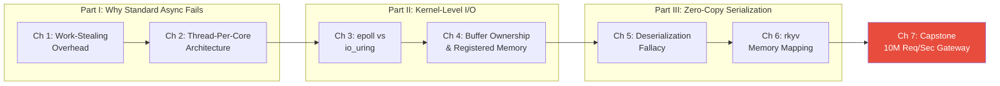

# Zero-Copy Architecture: io_uring, Thread-Per-Core, and rkyv

## Speaker Intro

- Principal Systems Architect and Network Engineer with 20+ years building latency-critical infrastructure — high-frequency trading gateways, database storage engines, L4/L7 proxies, and hyper-scale message brokers
- Designed and deployed shared-nothing, thread-per-core architectures processing 10M+ messages/sec at sub-microsecond P99 tail latencies
- Contributor to Linux `io_uring` ecosystem tooling and zero-copy serialization frameworks in production Rust services
- Background in kernel bypass networking (DPDK, XDP), NUMA-aware memory allocation, and CPU microarchitecture — with an obsessive focus on *eliminating every unnecessary byte copy, syscall, and context switch*

---

This is not a book about writing async Rust. It is a book about **eliminating everything async Rust does wrong**.

Every `tokio::spawn` you write forces a `Send + Sync` bound. Every `Send + Sync` bound forces an `Arc`. Every `Arc` forces an atomic reference count. Every atomic operation forces a cache-line invalidation across every core that has ever touched that data. Multiply that by 10 million requests per second and you have built a system where **your synchronization overhead exceeds your actual business logic**.

This book teaches you how to tear all of that out. We replace work-stealing runtimes with **thread-per-core** executors where tasks never migrate between cores. We replace `epoll` readiness notifications with **`io_uring` completion queues** where the kernel deposits finished I/O directly into user-space memory. We replace `serde` deserialization with **`rkyv` zero-copy access** where structured data is read directly from network buffers without allocating a single Rust struct.

The result is a system where a network packet arrives at the NIC, lands in a pre-registered kernel buffer, gets inspected in-place by your application logic, and leaves through the NIC to an upstream server — **without a single `memcpy`, a single `malloc`, or a single context switch**.

This is an ultra-advanced companion to the [Async Rust](../async-book/src/SUMMARY.md) and [Smart Pointers & Memory Architecture](../smart-pointers-book/src/SUMMARY.md) guides, focusing entirely on **eliminating syscalls, context switches, and memory copies**.

## Who This Is For

- **Staff/Principal engineers** building reverse proxies, API gateways, message brokers, or trading systems where Tokio's work-stealing overhead is measurable and unacceptable
- **Database engine developers** who need to serve queries from `mmap`-backed storage without deserializing rows into heap-allocated Rust structs
- **Network engineers** migrating from C/C++ DPDK or kernel bypass stacks to Rust and need equivalent zero-copy semantics
- **Performance engineers** who have profiled their async Rust services and found that `Arc::clone`, `Mutex::lock`, and `serde::Deserialize` dominate their flame graphs
- **Anyone who has hit Tokio's ceiling** and needs to understand *why* the runtime itself becomes the bottleneck at extreme scale

## Prerequisites

This book assumes you are already proficient in async Rust and have working knowledge of operating system internals:

| Concept | Where to Learn |
|---------|---------------|
| `async`/`await`, `Future`, `Pin`, `Waker` | [Async Rust](../async-book/src/SUMMARY.md) |
| `Send`, `Sync`, `Arc`, `Mutex` | [Rust's Type System & Traits](../type-system-traits-book/src/SUMMARY.md) |
| Ownership, borrowing, lifetimes | [Rust Memory Management](../memory-management-book/src/SUMMARY.md) |
| Stack vs heap, `Box`, `Rc`, `RefCell` | [Smart Pointers & Memory Architecture](../smart-pointers-book/src/SUMMARY.md) |
| CPU caches (L1/L2/L3), cache-line size (64 bytes), NUMA | Any computer architecture textbook (Hennessy & Patterson recommended) |
| Linux syscalls (`read`, `write`, `epoll`, `mmap`) | `man` pages or Stevens' *UNIX Network Programming* |
| Basic understanding of TCP/IP and socket programming | Any networking fundamentals resource |

If terms like "cache-line bouncing", "completion queue", "submission queue entry", or "relative pointer" are unfamiliar, this book will define them — but you must already understand why `Arc<Mutex<T>>` is slower than `Rc<RefCell<T>>` on a single thread, and why `epoll_wait` requires a syscall that `io_uring` does not.

## How to Use This Book

**Read linearly the first time.** Parts I–IV build on each other. Each chapter has:

| Symbol | Meaning |
|--------|---------|
| 🟢 | Advanced — foundational for this series, but already requires deep Rust and async fluency |
| 🟡 | Expert — requires understanding of thread-per-core principles from Part I |
| 🔴 | Kernel-Level — deep `io_uring` internals, raw buffer management, or zero-copy memory mapping |

Each chapter includes:
- A **"What you'll learn"** block at the top
- **Mermaid diagrams** visualizing I/O lifecycles, memory layouts, and architecture comparisons
- **Side-by-side code comparisons**: "The Standard Way (Bottlenecked)" vs "The Zero-Copy Way"
- **Anti-patterns** marked with `// ⚠️ SYNC BOTTLENECK:` showing code that compiles but incurs hidden synchronization costs
- **Fixes** marked with `// ✅ FIX:` showing the zero-copy or shared-nothing alternative
- An **inline exercise** with a hidden solution
- **Key Takeaways** summarizing the core insights
- **Cross-references** to companion guides and external resources

## Pacing Guide

| Chapters | Topic | Suggested Time | Checkpoint |
|----------|-------|----------------|------------|
| 1 | Work-Stealing Limits | 4–6 hours | You can explain why `Arc` creates cross-core cache invalidation and quantify Tokio scheduling overhead |
| 2 | Thread-Per-Core Architecture | 5–7 hours | You can design a shared-nothing system using Glommio's `LocalExecutor` with `!Send` futures |
| 3 | Readiness vs. Completion I/O | 5–7 hours | You can explain the `io_uring` SQ/CQ ring buffer protocol and why it eliminates syscalls on the hot path |
| 4 | Buffer Ownership & Registered Memory | 6–8 hours | You can implement fixed buffer rings and explain kernel-registered memory semantics |
| 5 | The Deserialization Fallacy | 4–6 hours | You can profile serde overhead and explain why traditional deserialization defeats zero-copy I/O |
| 6 | Zero-Copy with rkyv | 6–8 hours | You can access `Archived` types in-place from raw byte buffers without heap allocation |
| 7 | Capstone: 10M Req/Sec Gateway | 8–12 hours | You've built a thread-per-core, io_uring-backed, rkyv-inspected reverse proxy with zero memcpy |

**Total estimated time: 38–54 hours**

## Tooling You'll Need

Install these before starting:

```bash
# Core Rust toolchain
rustup update stable
rustup component add rust-src  # for viewing MIR and standard library source

# Linux kernel >= 5.19 required for io_uring features used in this book
uname -r  # verify kernel version

# Profiling and benchmarking
cargo install flamegraph criterion

# The crates we'll use throughout
# (added per-chapter, but listed here for reference)
# glommio = "0.9"       — Thread-per-core runtime
# monoio = "0.2"        — Alternative TPC runtime
# io-uring = "0.7"      — Low-level io_uring bindings
# rkyv = "0.8"          — Zero-copy serialization
# tokio (for comparison benchmarks only)
```

> **Platform note:** `io_uring` is Linux-only (kernel ≥ 5.1, with features through 5.19+). macOS and Windows developers should use a Linux VM or container for the hands-on exercises. The conceptual material (Parts I and III) is platform-independent.

## Table of Contents

### Part I: The Limits of Traditional Async

| Chapter | Title | Core Question |
|---------|-------|--------------|
| 1 🟢 | Why Work-Stealing Fails at Hyper-Scale | What are the hidden costs of `tokio::spawn` and cross-core task migration? |
| 2 🟡 | Thread-Per-Core (Shared-Nothing) Architecture | How do Glommio and Monoio eliminate synchronization by pinning tasks to cores? |

### Part II: Bypassing the Kernel with io_uring

| Chapter | Title | Core Question |
|---------|-------|--------------|
| 3 🟡 | Readiness vs. Completion I/O | Why is `epoll` fundamentally incompatible with zero-copy, and how does `io_uring` fix it? |
| 4 🔴 | Buffer Ownership and Registered Memory | How do you pass buffer ownership to the kernel and eliminate per-I/O memory mapping? |

### Part III: Zero-Copy Serialization

| Chapter | Title | Core Question |
|---------|-------|--------------|
| 5 🟡 | The Deserialization Fallacy | Why does `serde::Deserialize` defeat zero-copy even when your I/O layer is perfect? |
| 6 🔴 | Pure Memory Mapping with rkyv | How do you access structured data directly from byte buffers without a single allocation? |

### Part IV: Capstone Project

| Chapter | Title | Core Question |
|---------|-------|--------------|
| 7 🔴 | Capstone: The 10M Req/Sec API Gateway | How do you combine all three layers into a production-grade, fully zero-copy reverse proxy? |

### Appendices

| Chapter | Title |
|---------|-------|
| A | Summary and Reference Card |



## Companion Guides

This book stands at the intersection of three other guides in the series:

| Guide | Relationship |
|-------|-------------|
| [Async Rust](../async-book/src/SUMMARY.md) | Covers `Future`, `Pin`, Tokio — we assume this knowledge and move *beyond* it |
| [Smart Pointers & Memory Architecture](../smart-pointers-book/src/SUMMARY.md) | Covers `Box`, `Rc`, `Arc`, memory layout — we use this vocabulary throughout |
| [Rust at the Limit: Compiler Optimizations](../compiler-optimizations-book/src/SUMMARY.md) | Covers LLVM, SIMD, PGO — complementary performance techniques at the compiler level |
| [Unsafe Rust & FFI](../unsafe-ffi-book/src/SUMMARY.md) | Covers raw pointers, `unsafe` blocks — several chapters here require `unsafe` for buffer management |
