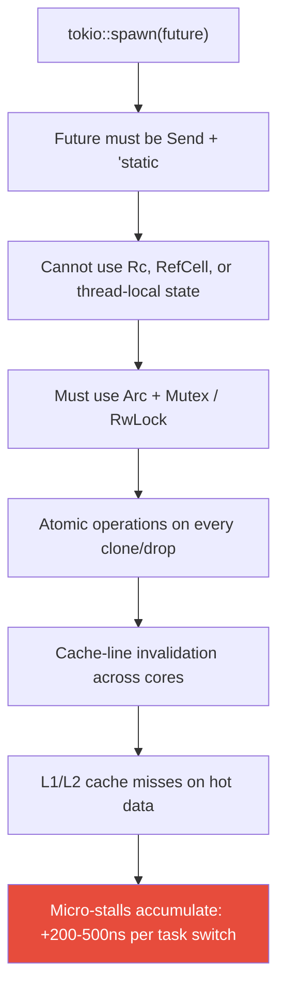

# 1. Why Work-Stealing Fails at Hyper-Scale 🟢

> **What you'll learn:**
> - Why `tokio::spawn` requires `Send + Sync` bounds and what that forces you to pay at runtime
> - How work-stealing schedulers cause CPU cache invalidation when tasks migrate between cores
> - The quantifiable cost of atomic reference counting (`Arc`) vs. single-threaded reference counting (`Rc`)
> - Why "just use Tokio" stops being viable at ~1M concurrent connections

---

## The Promise and the Price of Work-Stealing

Tokio is an extraordinary piece of engineering. Its multi-threaded, work-stealing scheduler allows any spawned task to run on any worker thread, which gives you excellent CPU utilization *on average*. But "on average" is the enemy of latency-sensitive systems.

When you write `tokio::spawn(my_future)`, Tokio requires the future to be `Send + 'static`. This is not an arbitrary restriction — it is a *fundamental consequence* of the work-stealing design. If a task can be stolen from Core 0's run queue and resumed on Core 3, every piece of data inside that task must be safe to transfer between threads.

This single requirement cascades into a series of forced architectural decisions:



## The Anatomy of a Cache-Line Bounce

To understand why work-stealing hurts at scale, you need to understand what happens at the hardware level when two cores touch the same memory.

Modern CPUs use the **MESI protocol** (Modified, Exclusive, Shared, Invalid) to maintain cache coherence. When Core 0 writes to a cache line, it must **invalidate** that line in every other core's L1/L2 cache. When Core 3 later reads the same data, it experiences an L1 cache miss and must fetch the line from Core 0's cache (or L3), taking **40–80 nanoseconds** instead of the 1–4 nanoseconds of hitting L1.

An `Arc<T>` is a pointer to a heap-allocated block containing:

```
┌────────────────────────────────────────────┐
│  ArcInner<T>                               │
│  ┌──────────────────────┐                  │
│  │ strong: AtomicUsize   │ ← cache line 0  │
│  │ weak:   AtomicUsize   │                  │
│  ├──────────────────────┤                  │
│  │ data: T               │ ← cache line 1+ │
│  └──────────────────────┘                  │
└────────────────────────────────────────────┘
```

Every `Arc::clone()` performs an `AtomicUsize::fetch_add(1, Relaxed)` on the `strong` counter. Every `Drop` performs a `fetch_sub(1, Release)`. On x86-64, these compile to `lock xadd` instructions, which **lock the cache line** and force a cross-core invalidation if any other core has read that line.

### The Cost Table

| Operation | Latency (approx.) | Notes |
|-----------|-------------------|-------|
| L1 cache hit | 1–4 ns | Best case: data on the same core |
| L2 cache hit | 5–12 ns | Same core, different cache level |
| L3 cache hit | 20–40 ns | Shared across cores, but NUMA-local |
| Cross-core L1 invalidation (MESI) | 40–80 ns | The price of `Arc::clone()` on contended data |
| Cross-NUMA-node access | 100–300 ns | Worst case on multi-socket servers |
| `Rc::clone()` (single-threaded) | ~1 ns | Just a non-atomic increment — no bus lock |

**The ratio matters**: `Arc::clone()` on contended data is **40–80x slower** than `Rc::clone()` on the same core. When you process 10 million requests per second, each requiring 3–5 `Arc` operations, that is **120–400 million atomic operations per second**, each potentially causing a cache-line bounce.

## Work-Stealing in Practice: Where the Time Goes

Let's trace a typical Tokio request handler and identify every synchronization point:

```rust
use std::sync::Arc;
use tokio::sync::Mutex;

#[derive(Clone)]
struct AppState {
    // ⚠️ SYNC BOTTLENECK: Every field wrapped in Arc because tokio::spawn
    // requires Send + Sync. Even read-heavy data pays the atomic cost.
    db_pool: Arc<deadpool_postgres::Pool>,
    cache: Arc<Mutex<HashMap<String, Vec<u8>>>>,
    config: Arc<AppConfig>,
}

async fn handle_request(
    state: AppState,  // ⚠️ SYNC BOTTLENECK: AppState: Clone calls Arc::clone 3x
    req: Request,
) -> Response {
    // ⚠️ SYNC BOTTLENECK: Arc::clone on db_pool to move into spawned task
    let pool = state.db_pool.clone();
    
    // ⚠️ SYNC BOTTLENECK: Mutex::lock contends across all worker threads
    let cached = {
        let guard = state.cache.lock().await;
        guard.get(&req.key).cloned()
        // ⚠️ SYNC BOTTLENECK: MutexGuard drop = atomic decrement
    };
    
    match cached {
        Some(data) => Response::new(data),
        None => {
            let row = pool.get().await.unwrap()
                .query_one("SELECT data FROM items WHERE key = $1", &[&req.key])
                .await
                .unwrap();
            let data: Vec<u8> = row.get(0);
            
            // ⚠️ SYNC BOTTLENECK: Second lock acquisition — potential contention spike
            state.cache.lock().await.insert(req.key, data.clone());
            
            Response::new(data)
        }
    }
}
```

Count the synchronization points in a single request:
1. `AppState::clone()` — 3× `Arc::clone()` (3 atomic increments)
2. `cache.lock().await` — mutex acquisition (potential cross-core contention)
3. `MutexGuard` drop — atomic decrement
4. `pool.get().await` — connection pool uses internal atomic state
5. `cache.lock().await` (second time) — another mutex round-trip
6. `AppState` drop — 3× `Arc` decrements (3 atomic operations)

**Minimum**: 9 atomic operations per request, many on contended cache lines. At 1M req/sec, that's **9 million atomic operations per second** — each one a potential cache-line bounce.

## The Thread-Per-Core Alternative (Preview)

What if tasks **never migrated** between cores? Then every future on a given core can use `Rc<RefCell<T>>` instead of `Arc<Mutex<T>>`:

```rust
use std::cell::RefCell;
use std::rc::Rc;

#[derive(Clone)]
struct LocalAppState {
    // ✅ FIX: Shared-nothing architecture — Rc has zero atomic overhead
    db_pool: Rc<LocalPool>,
    cache: Rc<RefCell<HashMap<String, Vec<u8>>>>,
    config: Rc<AppConfig>,
}

// ✅ FIX: This future is !Send — it can never leave this core
// That's not a limitation, it's a GUARANTEE
async fn handle_request_local(
    state: LocalAppState,  // Rc::clone = non-atomic increment (~1ns)
    req: Request,
) -> Response {
    // ✅ FIX: RefCell::borrow = single non-atomic flag check (~1ns)
    let cached = {
        let guard = state.cache.borrow();
        guard.get(&req.key).cloned()
        // RefCell guard drop = non-atomic flag clear
    };
    
    match cached {
        Some(data) => Response::new(data),
        None => {
            let data = state.db_pool.query(&req.key).await;
            
            // ✅ FIX: No contention possible — we're the only thread
            state.cache.borrow_mut().insert(req.key, data.clone());
            
            Response::new(data)
        }
    }
}
```

**Zero atomic operations. Zero cache-line bounces. Zero contention.**

The same logical request handler, but every synchronization primitive has been replaced with its single-threaded equivalent. The `!Send` bound on the future is not a bug — it is a *proof* that no cross-core sharing occurs.

## Quantifying the Overhead: A Microbenchmark

Here's a benchmark that isolates the cost of `Arc` vs `Rc` cloning under contention:

```rust
use std::sync::Arc;
use std::rc::Rc;
use std::hint::black_box;

fn bench_arc_clone_contended() {
    let shared = Arc::new(42u64);
    // Simulate 4 threads all cloning/dropping the same Arc
    let handles: Vec<_> = (0..4).map(|_| {
        let s = shared.clone();
        std::thread::spawn(move || {
            for _ in 0..10_000_000 {
                let c = black_box(s.clone());
                drop(black_box(c));
                // ⚠️ SYNC BOTTLENECK: Each iteration = lock xadd + lock xadd
                // Cache line containing strong count bounces between 4 cores
            }
        })
    }).collect();
    for h in handles { h.join().unwrap(); }
}

fn bench_rc_clone_single_core() {
    let local = Rc::new(42u64);
    // Same work, but single-threaded — no contention possible
    for _ in 0..40_000_000 {
        let c = black_box(local.clone());
        drop(black_box(c));
        // ✅ FIX: Each iteration = non-atomic add + non-atomic sub
        // Cache line stays warm in L1 for the entire loop
    }
}
```

Typical results on a modern server (AMD EPYC 7763):

| Benchmark | Throughput | Per-Op Latency |
|-----------|-----------|---------------|
| `Arc::clone` (4 threads, contended) | ~120M ops/sec total | ~33 ns/op |
| `Rc::clone` (single thread) | ~1.2B ops/sec | ~0.8 ns/op |
| **Ratio** | | **~41x faster** |

This 41x difference is *not* a micro-benchmark artifact. It is the direct, unavoidable cost of maintaining cache coherence across a multi-core processor. When your request handler hits `Arc` 9 times per request, you are paying ~300ns of pure synchronization overhead. At 10M req/sec, that is **3 full CPU-seconds per second** spent on nothing but cache-line bouncing.

## When Work-Stealing Is Still Right

Work-stealing is not universally bad. It excels when:

| Scenario | Why Work-Stealing Works |
|----------|------------------------|
| CPU-bound compute with variable task duration | Idle cores steal long-running tasks → better utilization |
| Low-connection-count, high-latency-per-request services | Synchronization cost amortized over 10ms+ of real work |
| Prototyping and early-stage products | Tokio's ergonomics and ecosystem are unmatched |
| Applications dominated by external I/O wait | Time spent in `Arc::clone` is dwarfed by 5ms of database latency |

Work-stealing fails when:
- You have **millions of concurrent connections** with very short handlers (~10–100μs)
- Your handlers are **I/O-bound on fast local storage** (NVMe SSDs, in-memory caches) where the I/O itself is <10μs
- **Tail latency (P99, P99.9)** matters more than average throughput
- The **majority of CPU time** is spent on the framework overhead, not your business logic

---

<details>
<summary><strong>🏋️ Exercise: Profile Arc Contention in a Tokio Service</strong> (click to expand)</summary>

**Challenge:** Create a Tokio-based service that processes 1M requests against a shared `Arc<Mutex<HashMap>>`. Use `perf` or `flamegraph` to identify what percentage of CPU time is spent in atomic operations and mutex contention.

1. Set up a Tokio runtime with 4 worker threads
2. Spawn 1M tasks that each: clone the `Arc`, lock the `Mutex`, read/write the `HashMap`, and drop the guard
3. Time the total execution
4. Generate a flamegraph and identify the `__atomic_fetch_add` or `lock xadd` symbols
5. Calculate the percentage of time spent in synchronization vs. actual HashMap work

<details>
<summary>🔑 Solution</summary>

```rust
use std::collections::HashMap;
use std::sync::Arc;
use std::time::Instant;
use tokio::sync::Mutex;

#[tokio::main(flavor = "multi_thread", worker_threads = 4)]
async fn main() {
    // Shared state behind Arc<Mutex<...>> — the standard Tokio pattern.
    let state: Arc<Mutex<HashMap<u64, u64>>> =
        Arc::new(Mutex::new(HashMap::with_capacity(1024)));

    let total_tasks = 1_000_000u64;
    let start = Instant::now();

    // Spawn 1M tasks, each contending on the shared map.
    let mut handles = Vec::with_capacity(total_tasks as usize);
    for i in 0..total_tasks {
        let s = state.clone(); // ⚠️ SYNC BOTTLENECK: atomic increment
        handles.push(tokio::spawn(async move {
            // ⚠️ SYNC BOTTLENECK: 4 threads contending on one Mutex
            let mut guard = s.lock().await;
            // The "work": a trivial insert. In production, this ratio of
            // sync-overhead to useful-work is where things fall apart.
            guard.insert(i % 1024, i);
            // guard dropped here — ⚠️ SYNC BOTTLENECK: atomic decrement
        }));
    }

    for h in handles {
        h.await.unwrap();
    }

    let elapsed = start.elapsed();
    println!(
        "Processed {} tasks in {:?} ({:.0} tasks/sec)",
        total_tasks,
        elapsed,
        total_tasks as f64 / elapsed.as_secs_f64()
    );
    // Typical result on 4-core machine:
    //   ~1.5–3 seconds for 1M tasks
    //   flamegraph shows 30–60% of time in parking_lot / atomic ops
    //
    // ✅ FIX: In Chapter 2, we replace this with a shared-nothing design
    // where each core has its own HashMap partition and uses Rc<RefCell<...>>.
    // Result: same 1M tasks in ~200–400ms with *zero* atomic operations.
}
```

**How to generate the flamegraph:**

```bash
# Build with debug symbols in release mode
cargo build --release

# Record with perf (Linux)
perf record -g --call-graph dwarf ./target/release/your_binary

# Generate flamegraph
perf script | flamegraph > flamegraph.svg

# Look for these symbols in the output:
# - core::sync::atomic::AtomicUsize::fetch_add
# - parking_lot::raw_mutex::RawMutex::lock_slow
# - tokio::runtime::scheduler::multi_thread::worker::Context::steal
```

</details>
</details>

---

> **Key Takeaways**
> - `tokio::spawn` forces `Send + Sync`, which forces `Arc` and `Mutex`, which forces atomic operations, which force cache-line invalidation across cores — this chain is **unavoidable** in a work-stealing design
> - A single `Arc::clone()` on contended data costs ~30–80ns due to MESI protocol cache-line bouncing; `Rc::clone()` costs ~1ns because there is no bus lock
> - At 10M req/sec with 9 atomic operations per request, synchronization overhead alone consumes **3+ CPU-seconds per second** — more than many handlers' actual business logic
> - Work-stealing is optimal for CPU-bound compute with variable task sizes; it fails for I/O-heavy workloads with millions of short-lived connections
> - The solution is not "optimize the atomics" — it is **eliminate them entirely** by ensuring tasks never cross core boundaries

> **See also:**
> - [Chapter 2: Thread-Per-Core Architecture](ch02-thread-per-core.md) — the design pattern that eliminates all of the above
> - [Async Rust: Tokio Internals](../async-book/src/SUMMARY.md) — understanding the work-stealing scheduler you're replacing
> - [Smart Pointers: Arc vs Rc](../smart-pointers-book/src/SUMMARY.md) — deep dive on atomic vs non-atomic reference counting
