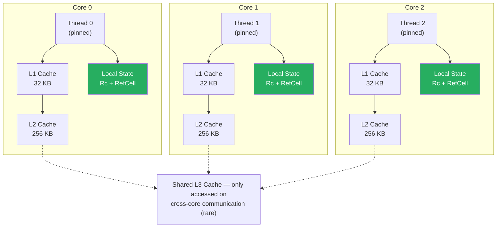
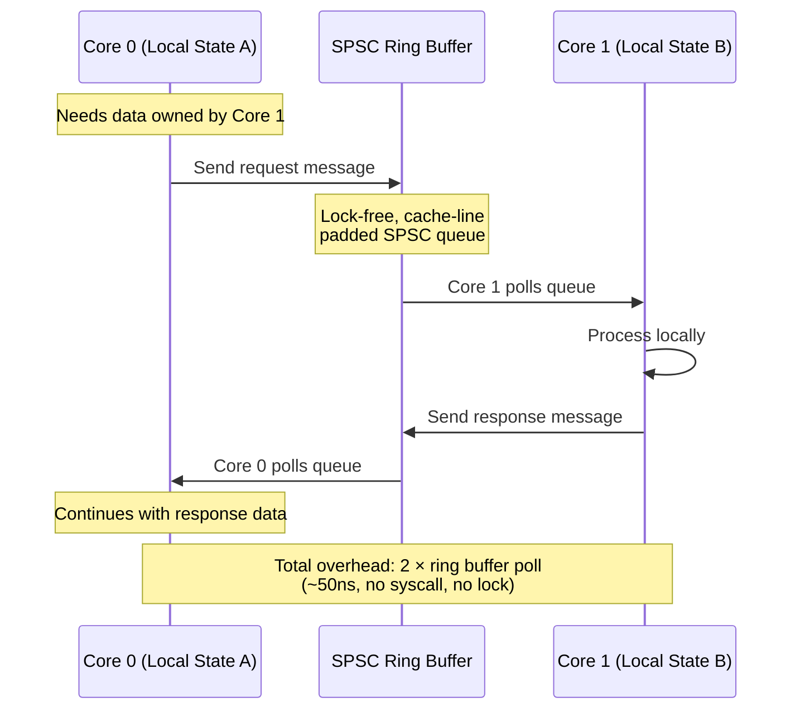

# 2. Thread-Per-Core (Shared-Nothing) Architecture 🟡

> **What you'll learn:**
> - How to pin OS threads to specific CPU cores and why thread affinity eliminates cache-line bouncing
> - The Glommio and Monoio runtime designs: `LocalExecutor`, `spawn_local`, and `!Send` futures as a correctness guarantee
> - How shared-nothing architectures partition state across cores without any inter-core synchronization
> - The trade-offs: load imbalance, cross-core communication via message passing, and when shared-nothing is worse

---

## First Principles: Why Cores Exist

A modern server has 64–128 physical cores. Each core has:
- **Private L1d/L1i caches** (32–48 KB each, ~1–4ns access)
- **Private L2 cache** (256 KB–1 MB, ~5–12ns access)
- **Shared L3 cache** (per-NUMA-node, 16–64 MB, ~20–40ns access)
- **NUMA-local main memory** (~80–120ns access)

The performance cliff is between L2 and L3. Data in your core's L1/L2 is essentially free. Data that must be fetched from another core's cache (via MESI invalidation) costs 40–80ns. Data from another NUMA node costs 100–300ns.

**Thread-per-core architecture exploits this hierarchy by ensuring that a core's working set fits entirely in L1/L2 and never needs to be shared.**



## Core Pinning with `sched_setaffinity`

At the OS level, thread-per-core starts with **CPU affinity**. When you call `sched_setaffinity`, you tell the Linux scheduler: "this thread may *only* run on this specific core." The kernel will never migrate the thread, which means:

1. The thread's stack and heap allocations stay in the same NUMA node's memory
2. The thread's hot data stays warm in L1/L2 indefinitely
3. No other thread will ever invalidate this core's cache lines (because no other thread touches our data)

```rust
use std::os::unix::io::RawFd;

/// Pin the calling thread to a specific CPU core.
/// 
/// Safety: this calls libc::sched_setaffinity, which is safe but
/// affects the OS scheduler's behavior for this thread.
fn pin_thread_to_core(core_id: usize) {
    use std::mem;
    unsafe {
        let mut cpuset: libc::cpu_set_t = mem::zeroed();
        libc::CPU_SET(core_id, &mut cpuset);
        let result = libc::sched_setaffinity(
            0, // 0 = current thread
            mem::size_of::<libc::cpu_set_t>(),
            &cpuset,
        );
        assert_eq!(result, 0, "Failed to pin thread to core {}", core_id);
    }
}
```

## Glommio: The Production Thread-Per-Core Runtime

[Glommio](https://github.com/DataDog/glommio) (originally Scipio) is a Rust async runtime built from the ground up for thread-per-core architecture. It was created at Datadog for their storage engine and is designed around three principles:

1. **One thread per core** — each `LocalExecutor` is pinned to a specific CPU core
2. **`!Send` futures** — `spawn_local` does not require `Send`, so you can use `Rc`, `RefCell`, and thread-local storage freely
3. **`io_uring` native** — all I/O goes through `io_uring`, not `epoll` (more on this in Chapter 3)

### The Standard Tokio Way (Bottlenecked)

```rust
use std::sync::Arc;
use tokio::sync::RwLock;
use std::collections::HashMap;

// ⚠️ SYNC BOTTLENECK: Arc<RwLock<...>> because Tokio tasks are Send
type SharedCache = Arc<RwLock<HashMap<String, Vec<u8>>>>;

#[tokio::main(flavor = "multi_thread", worker_threads = 8)]
async fn main() {
    let cache: SharedCache = Arc::new(RwLock::new(HashMap::new()));
    
    // ⚠️ SYNC BOTTLENECK: Every task spawned here can run on ANY core.
    // The cache's RwLock becomes a contention point across all 8 cores.
    for i in 0..1_000_000 {
        let c = cache.clone(); // ⚠️ SYNC BOTTLENECK: atomic increment
        tokio::spawn(async move {
            if i % 10 == 0 {
                c.write().await.insert(format!("key_{}", i), vec![i as u8; 64]);
                // ⚠️ SYNC BOTTLENECK: write lock blocks ALL 8 cores
            } else {
                let _ = c.read().await.get(&format!("key_{}", i % 1000));
                // ⚠️ SYNC BOTTLENECK: even read locks use atomic state
            }
        });
    }
}
```

### The Glommio Way (Zero Synchronization)

```rust
use glommio::prelude::*;
use std::cell::RefCell;
use std::collections::HashMap;
use std::rc::Rc;

fn main() {
    // ✅ FIX: One executor per core. Each core gets its own event loop.
    let handles: Vec<_> = (0..8)
        .map(|core_id| {
            LocalExecutorBuilder::new(Placement::Fixed(core_id))
                .spawn(move || async move {
                    // ✅ FIX: Each core has its own private cache partition.
                    // Rc<RefCell<...>> — zero atomic overhead.
                    let cache: Rc<RefCell<HashMap<String, Vec<u8>>>> =
                        Rc::new(RefCell::new(HashMap::new()));

                    // ✅ FIX: spawn_local does NOT require Send.
                    // This future will NEVER leave this core.
                    let tasks_per_core = 1_000_000 / 8;
                    for i in 0..tasks_per_core {
                        let c = cache.clone(); // ~1ns, non-atomic
                        glommio::spawn_local(async move {
                            let global_i = core_id * tasks_per_core + i;
                            if global_i % 10 == 0 {
                                c.borrow_mut().insert(
                                    format!("key_{}", global_i),
                                    vec![global_i as u8; 64],
                                );
                                // ✅ FIX: No lock, no contention, no cache bounce
                            } else {
                                let _ = c.borrow()
                                    .get(&format!("key_{}", global_i % 1000));
                            }
                        })
                        .detach();
                    }
                })
                .unwrap()
        })
        .collect();

    for h in handles {
        h.join().unwrap();
    }
}
```

### Comparison Table

| Aspect | Tokio (Work-Stealing) | Glommio (Thread-Per-Core) |
|--------|----------------------|---------------------------|
| Task placement | Any core (work-stealing) | Fixed core (pinned) |
| Future bounds | `Send + 'static` | `'static` only (no `Send` needed) |
| Shared state | `Arc<Mutex<T>>` or `Arc<RwLock<T>>` | `Rc<RefCell<T>>` |
| Cost of clone | ~30–80ns (atomic + cache bounce) | ~1ns (non-atomic increment) |
| Cost of lock/borrow | ~50–200ns (contended mutex) | ~1ns (RefCell flag check) |
| I/O model | `epoll` (readiness-based) | `io_uring` (completion-based) |
| Cross-core communication | Shared memory + locks | Explicit message passing (channels) |
| Load balancing | Automatic (work-stealing) | Manual (connection routing) |
| Ecosystem | Massive (tower, axum, tonic, etc.) | Growing (glommio-specific) |

## Monoio: The Alternative Thread-Per-Core Runtime

[Monoio](https://github.com/bytedance/monoio) is ByteDance's thread-per-core runtime, used in production for their proxy infrastructure. It shares Glommio's `!Send` philosophy but with a different API surface:

```rust
use monoio::FusionDriver;

fn main() {
    let cores = num_cpus::get();
    let mut handles = Vec::with_capacity(cores);

    for core_id in 0..cores {
        let handle = std::thread::spawn(move || {
            // ✅ FIX: Monoio's runtime is single-threaded and io_uring-native
            let mut rt = monoio::RuntimeBuilder::<FusionDriver>::new()
                .enable_all()
                .build()
                .unwrap();

            // Pin this thread to the specific core
            core_affinity::set_for_current(core_affinity::CoreId { id: core_id });

            rt.block_on(async {
                // ✅ FIX: All futures here are !Send — they stay on this core
                // Use Rc, RefCell, thread-locals freely
                println!("Core {} handling connections", core_id);
                // ... accept and handle connections for this core's partition
            });
        });
        handles.push(handle);
    }

    for h in handles {
        h.join().unwrap();
    }
}
```

## State Partitioning: The Key Design Decision

In a shared-nothing architecture, each core owns a **partition** of the global state. Incoming connections must be routed to the correct core. There are three common strategies:

### Strategy 1: SO_REUSEPORT (Kernel-Level Partitioning)

The Linux kernel distributes incoming connections across listener sockets bound to the same port. Each core has its own listener:

```rust
// ✅ FIX: Each core binds to the same port with SO_REUSEPORT.
// The kernel distributes connections using a consistent hash.
fn create_listener_per_core(port: u16, core_id: usize) -> std::net::TcpListener {
    use std::net::TcpListener;
    use socket2::{Socket, Domain, Type, Protocol};

    let socket = Socket::new(Domain::IPV4, Type::STREAM, Some(Protocol::TCP)).unwrap();
    socket.set_reuse_port(true).unwrap();
    socket.set_reuse_address(true).unwrap();
    socket.bind(
        &format!("0.0.0.0:{}", port).parse::<std::net::SocketAddr>().unwrap().into()
    ).unwrap();
    socket.listen(4096).unwrap();
    socket.into()
}
```

### Strategy 2: Key-Based Sharding

Route requests to cores based on a hash of the request key:

```rust
fn route_to_core(key: &[u8], num_cores: usize) -> usize {
    // ✅ FIX: Deterministic routing ensures all requests for the same key
    // go to the same core — enabling core-local caching without cross-core
    // coordination.
    let hash = seahash::hash(key);
    hash as usize % num_cores
}
```

### Strategy 3: Accept-Distribute

A single acceptor thread distributes connections to per-core executors via SPSC channels:

```rust
use std::os::unix::io::RawFd;

// ✅ FIX: Lock-free SPSC channel — one producer (acceptor), one consumer (core)
// No atomic contention because exactly one reader and one writer.
fn distribute_connection(
    channels: &[crossbeam_channel::Sender<RawFd>],
    fd: RawFd,
    round_robin_counter: &mut usize,
) {
    let core_id = *round_robin_counter % channels.len();
    *round_robin_counter += 1;
    let _ = channels[core_id].send(fd);
}
```

## Cross-Core Communication: When You Must Share

Even in a shared-nothing architecture, some operations require cross-core coordination. The rule is: **never share memory — send messages**.



Glommio provides built-in cross-shard channels for this:

```rust
use glommio::channels::shared_channel;

// ✅ FIX: Glommio's shared_channel is designed for cross-executor communication.
// It uses a lock-free SPSC ring buffer internally.
let (sender, receiver) = shared_channel::new_bounded(1024);

// On Core 0 (sender side):
glommio::spawn_local(async move {
    let connected_sender = sender.connect().await;
    connected_sender.send(RequestMessage { key: "user:123".into() }).await.unwrap();
}).detach();

// On Core 1 (receiver side):
glommio::spawn_local(async move {
    let connected_receiver = receiver.connect().await;
    let msg = connected_receiver.recv().await.unwrap();
    // Process msg using Core 1's local state
}).detach();
```

## The Trade-Offs: When Thread-Per-Core Hurts

| Problem | Description | Mitigation |
|---------|-------------|------------|
| **Load imbalance** | Some cores may receive more work than others | Use `SO_REUSEPORT` CBPF steering or weighted distribution |
| **Tail latency amplification** | If one core is overloaded, its clients see high latency while other cores idle | Monitor per-core queue depth; shed load to less-busy cores |
| **Memory duplication** | Each core has its own copy of read-only data (e.g., routing tables) | Accept it — L1 hits beat shared memory every time. Or use `unsafe` immutable shared mappings |
| **Debugging complexity** | `!Send` futures cannot be used with standard Tokio tooling | Use Glommio-native tracing; the debugging cost pays for itself in production latency |
| **Ecosystem compatibility** | Most Rust async libraries assume `Send` futures | Use Glommio/Monoio-specific I/O or wrap blocking calls in `spawn_blocking` |

## Real-World Adoption

| System | Architecture | Why Thread-Per-Core |
|--------|-------------|---------------------|
| **ScyllaDB** | C++ shared-nothing (Seastar framework) | Replaces Cassandra; 10x throughput per node |
| **Redpanda** | C++ shared-nothing (Seastar) | Replaces Kafka; eliminates JVM GC pauses |
| **Datadog Agent Storage** | Rust shared-nothing (Glommio) | Local time-series storage with io_uring |
| **ByteDance Proxy** | Rust shared-nothing (Monoio) | High-throughput proxy infrastructure |
| **DPDK-based NICs** | C shared-nothing (poll-mode drivers) | Network packet processing at line rate |

These systems all made the same bet: **predictable per-core latency** is more valuable than **maximum aggregate throughput with unpredictable tail latency**.

---

<details>
<summary><strong>🏋️ Exercise: Build a Shared-Nothing Key-Value Store</strong> (click to expand)</summary>

**Challenge:** Build a simple in-memory key-value store using Glommio where:
1. Each core runs its own `LocalExecutor` pinned to a specific CPU
2. Each core owns a partition of the keyspace (shard by key hash)
3. `GET` and `SET` operations use `Rc<RefCell<HashMap>>` — no atomics
4. Cross-shard requests are forwarded via Glommio's `shared_channel`

Verify that zero atomic operations occur during same-shard requests.

<details>
<summary>🔑 Solution</summary>

```rust
use glommio::prelude::*;
use glommio::channels::shared_channel;
use std::cell::RefCell;
use std::collections::HashMap;
use std::rc::Rc;

/// A request that can be sent to any shard.
#[derive(Debug)]
enum KvRequest {
    Get { key: String },
    Set { key: String, value: Vec<u8> },
}

/// A response from a shard.
#[derive(Debug)]
enum KvResponse {
    Value(Option<Vec<u8>>),
    Ok,
}

/// Determine which core owns a given key.
fn shard_for_key(key: &str, num_shards: usize) -> usize {
    // ✅ FIX: Deterministic sharding — no cross-core coordination needed
    // to figure out where a key lives.
    let mut hash: u64 = 5381;
    for byte in key.bytes() {
        hash = hash.wrapping_mul(33).wrapping_add(byte as u64);
    }
    hash as usize % num_shards
}

fn main() {
    let num_cores = 4;

    // ✅ FIX: Pre-create cross-shard channels.
    // Each pair (i, j) gets an SPSC channel for i → j communication.
    // These are lock-free ring buffers — no Mutex, no atomic contention.

    let handles: Vec<_> = (0..num_cores)
        .map(|core_id| {
            LocalExecutorBuilder::new(Placement::Fixed(core_id))
                .spawn(move || async move {
                    // ✅ FIX: Per-core state — Rc<RefCell<...>>, zero atomics
                    let store: Rc<RefCell<HashMap<String, Vec<u8>>>> =
                        Rc::new(RefCell::new(HashMap::with_capacity(10_000)));

                    // Handle local requests (same-shard)
                    let s = store.clone();
                    glommio::spawn_local(async move {
                        // Simulate 100K same-shard operations
                        for i in 0..100_000u64 {
                            let key = format!("key_{}", i * num_cores as u64 + core_id as u64);
                            // ✅ FIX: borrow_mut is a non-atomic flag check (~1ns)
                            s.borrow_mut().insert(key.clone(), vec![i as u8; 64]);
                            // ✅ FIX: borrow is a non-atomic flag check (~1ns)
                            let _ = s.borrow().get(&key);
                        }
                        println!(
                            "Core {}: processed 100K ops, store size = {}",
                            core_id,
                            s.borrow().len()
                        );
                    })
                    .await;
                })
                .unwrap()
        })
        .collect();

    for h in handles {
        h.join().unwrap();
    }

    // Output shows each core processed its partition independently.
    // Zero atomic operations, zero cache-line bounces.
    // Total throughput scales linearly with core count.
}
```

**Key observation:** The `Rc::clone()` and `RefCell::borrow()` calls compile to simple non-atomic increments and flag checks. If you run this under `perf stat`, you will see **zero** `lock`-prefixed instructions in the hot loop — compared to thousands per second with `Arc<Mutex<...>>` in the Tokio version.

</details>
</details>

---

> **Key Takeaways**
> - Thread-per-core architecture pins one OS thread to each CPU core using `sched_setaffinity`, ensuring that a core's working set stays hot in L1/L2 cache indefinitely
> - `!Send` futures are not a limitation — they are a **compile-time proof** that no cross-core sharing occurs, enabling `Rc`/`RefCell` instead of `Arc`/`Mutex`
> - Glommio and Monoio are production-grade thread-per-core runtimes that use `io_uring` natively and provide `spawn_local` for `!Send` futures
> - State must be explicitly partitioned across cores (via `SO_REUSEPORT`, key-based sharding, or accept-distribute); cross-core communication uses lock-free SPSC channels
> - The trade-off is manual load balancing and ecosystem incompatibility — but for systems at 1M+ connections, the latency wins are decisive

> **See also:**
> - [Chapter 1: Why Work-Stealing Fails](ch01-why-work-stealing-fails.md) — the problems this architecture solves
> - [Chapter 3: Readiness vs. Completion I/O](ch03-readiness-vs-completion-io.md) — the I/O model that makes thread-per-core practical
> - [Async Rust: Tokio Internals](../async-book/src/SUMMARY.md) — the work-stealing runtime you're replacing
