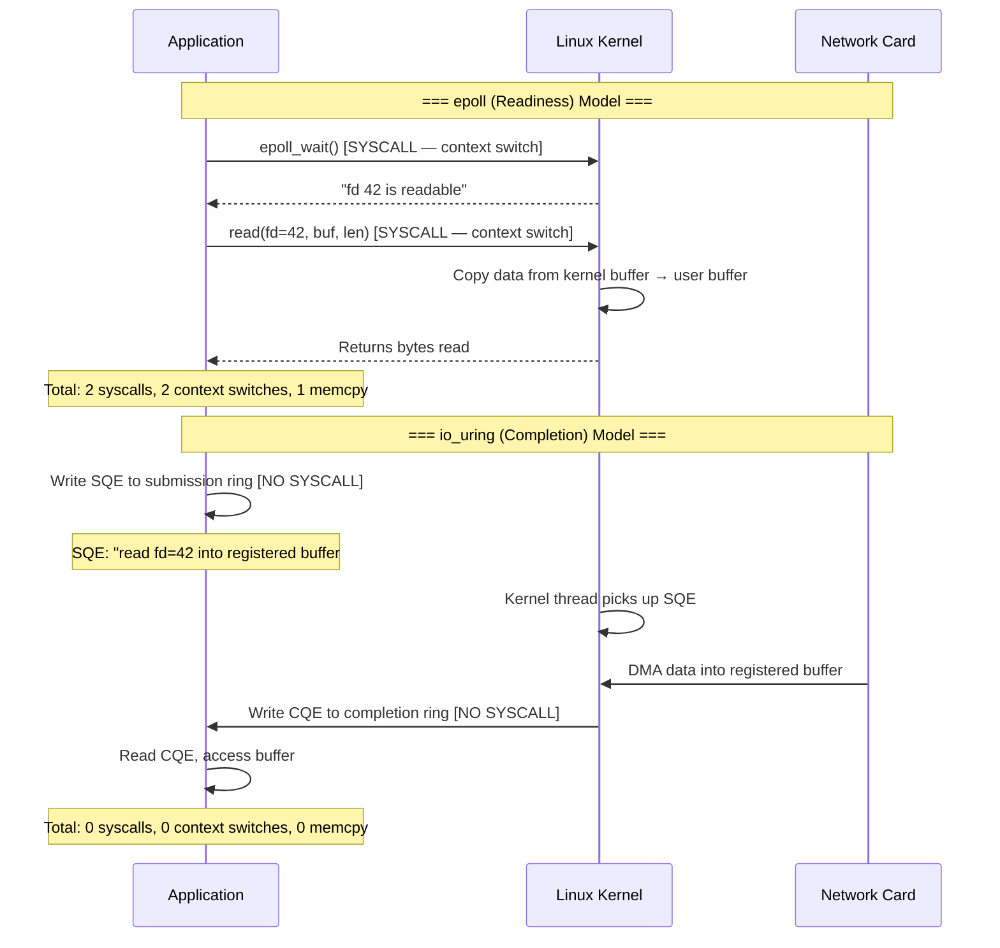

# 3. Readiness vs. Completion I/O 🟡

> **What you'll learn:**
> - Why `epoll` (readiness-based I/O) requires a syscall on every read/write and forces userspace buffer management
> - How `io_uring` (completion-based I/O) uses shared memory ring buffers to eliminate syscalls on the hot path
> - The Submission Queue (SQ) and Completion Queue (CQ) protocol: how userspace and kernel communicate without context switches
> - Why completion-based I/O is the foundation of true zero-copy networking

---

## Two Philosophies of I/O Multiplexing

Every high-performance network server must handle thousands to millions of concurrent connections. The operating system provides two fundamentally different models for this:

| Aspect | Readiness-Based (`epoll`) | Completion-Based (`io_uring`) |
|--------|--------------------------|-------------------------------|
| **Question asked** | "Which file descriptors are *ready* for I/O?" | "Here are I/O operations — tell me when they're *done*" |
| **Who performs the I/O?** | Userspace (`read()`/`write()` syscalls) | Kernel (executes operations asynchronously) |
| **Syscalls per operation** | 2+ (`epoll_wait` + `read`/`write`) | 0 on hot path (shared-memory rings) |
| **Buffer ownership** | Userspace owns buffers; passes pointers to kernel | Kernel owns buffers during operation; returns them on completion |
| **Zero-copy potential** | Limited — kernel copies to/from user buffers | Native — kernel can DMA directly into registered buffers |
| **Context switches** | At least 1 per I/O batch (`epoll_wait`) | 0 when SQ polling is enabled (`IORING_SETUP_SQPOLL`) |

The difference is not incremental. It is architectural.



## The `epoll` Model: Why Readiness Notification Is Fundamentally Limited

Let's trace what happens when Tokio reads from a TCP socket:

```rust
// ⚠️ SYNC BOTTLENECK: The standard Tokio read path
// (simplified — actual Tokio is more complex but has the same syscall pattern)

// Step 1: Tokio's reactor calls epoll_wait
// This is a SYSCALL — saves all registers, switches to kernel mode,
// walks the ready list, switches back to user mode, restores registers.
// Cost: ~1-3 μs per call.
let ready_events = epoll_wait(epoll_fd, events, max_events, timeout);
// ⚠️ SYNC BOTTLENECK: context switch #1

for event in ready_events {
    if event.is_readable() {
        // Step 2: Now we know fd is ready, perform the actual read.
        // This is ANOTHER SYSCALL.
        let mut buf = vec![0u8; 4096];
        // ⚠️ SYNC BOTTLENECK: vec allocation — heap allocation + potential mmap
        let n = read(event.fd, &mut buf);
        // ⚠️ SYNC BOTTLENECK: context switch #2
        // ⚠️ SYNC BOTTLENECK: kernel copies data from its internal
        // sk_buff into our userspace buffer — a full memcpy
        
        process_data(&buf[..n]);
    }
}
```

**The fundamental problem**: `epoll` only tells you *when* a file descriptor is ready. You still must issue a separate syscall to perform the actual I/O, and the kernel still copies data between kernel space and user space.

Even with Tokio's sophisticated reactor that batches `epoll_wait` calls and amortizes the cost, every individual `read()` or `write()` is still a syscall with a context switch and a `memcpy`.

### The Hidden Cost of Readiness

```
User-space timeline:    |--work--|--epoll_wait--|--read--|--work--|--epoll_wait--|
                                  ↑ syscall      ↑ syscall        ↑ syscall
Kernel-space timeline:           |---check fds---|--copy data--|  |---check fds---|
Context switches:                ↕               ↕              ↕
```

Each `↕` is a context switch costing 1–5μs. At 1M operations per second, that is **1–5 full CPU-seconds per second** spent switching between user mode and kernel mode.

## The `io_uring` Model: Shared-Memory Ring Buffers

`io_uring` (introduced in Linux 5.1 by Jens Axboe) replaces the syscall-per-operation model with a **shared memory region** accessible to both userspace and the kernel:

```
┌─────────────────────────────────────────────────────┐
│                    Shared Memory                     │
│  ┌─────────────────┐    ┌──────────────────────┐    │
│  │ Submission Queue │    │  Completion Queue     │    │
│  │ (SQ Ring)        │    │  (CQ Ring)            │    │
│  │                  │    │                       │    │
│  │  ┌───┐ ┌───┐    │    │  ┌───┐ ┌───┐         │    │
│  │  │SQE│ │SQE│ ...│    │  │CQE│ │CQE│ ...     │    │
│  │  └───┘ └───┘    │    │  └───┘ └───┘         │    │
│  │                  │    │                       │    │
│  │  head ──► tail   │    │  head ──► tail        │    │
│  └─────────────────┘    └──────────────────────┘    │
│        ▲                        │                    │
│        │ App writes              │ App reads          │
│        │ (no syscall)            │ (no syscall)       │
│        │                        ▼                    │
│  Kernel reads                Kernel writes            │
│  (no syscall)                (no syscall)             │
└─────────────────────────────────────────────────────┘
```

### The Protocol

1. **Application** writes a Submission Queue Entry (SQE) into the SQ ring — this describes the I/O operation (opcode, fd, buffer address, length)
2. **Application** advances the SQ tail pointer (a simple memory store — no syscall)
3. **Kernel** (via a polling thread or on the next `io_uring_enter`) reads the SQE and performs the operation
4. **Kernel** writes a Completion Queue Entry (CQE) into the CQ ring containing the result
5. **Application** reads the CQE and advances the CQ head pointer

**In SQ polling mode (`IORING_SETUP_SQPOLL`)**, the kernel dedicates a thread to watching the SQ. The entire operation — from "I want to read" to "here's the data" — involves **zero syscalls and zero context switches**.

### SQE and CQE Structures

```rust
/// A Submission Queue Entry — what the application writes
/// to tell the kernel "please do this I/O operation."
#[repr(C)]
struct io_uring_sqe {
    opcode: u8,       // IORING_OP_READ, IORING_OP_WRITE, IORING_OP_ACCEPT, etc.
    flags: u8,        // IOSQE_FIXED_FILE, IOSQE_IO_LINK, etc.
    ioprio: u16,      // I/O priority
    fd: i32,          // File descriptor (or fixed file index)
    off: u64,         // Offset for file operations
    addr: u64,        // Buffer address (or buffer group ID for provided buffers)
    len: u32,         // Length of the operation
    user_data: u64,   // Opaque cookie — returned in the CQE so you can match completions
    // ... additional union fields for advanced operations
}

/// A Completion Queue Entry — what the kernel writes
/// to tell the application "this I/O operation finished."
#[repr(C)]
struct io_uring_cqe {
    user_data: u64,   // Matches the SQE's user_data — your correlation token
    res: i32,         // Result: bytes transferred, or negative errno
    flags: u32,       // IORING_CQE_F_BUFFER (which provided buffer was used), etc.
}
```

## Using `io_uring` from Rust: The `io-uring` Crate

The low-level `io-uring` crate provides a safe (but low-level) wrapper around the kernel interface:

```rust
use io_uring::{IoUring, opcode, types};
use std::os::unix::io::AsRawFd;
use std::net::TcpListener;

fn main() -> Result<(), Box<dyn std::error::Error>> {
    // ✅ FIX: Create an io_uring instance with 256 SQ/CQ entries.
    // This allocates the shared memory region accessible by both
    // user-space and the kernel — no further mmap calls needed.
    let mut ring = IoUring::new(256)?;

    let listener = TcpListener::bind("0.0.0.0:8080")?;
    let fd = types::Fd(listener.as_raw_fd());

    // ✅ FIX: Prepare an ACCEPT operation as an SQE.
    // This does NOT issue a syscall — it writes to shared memory.
    let accept_sqe = opcode::Accept::new(fd, std::ptr::null_mut(), std::ptr::null_mut())
        .build()
        .user_data(0x01); // Our token to identify this completion

    // ✅ FIX: Push the SQE into the submission queue.
    // Still no syscall — just a pointer advance in shared memory.
    unsafe {
        ring.submission()
            .push(&accept_sqe)
            .expect("submission queue full");
    }

    // Submit and wait for one completion.
    // This IS a syscall (io_uring_enter), but with SQPOLL mode,
    // even this can be eliminated.
    ring.submit_and_wait(1)?;

    // ✅ FIX: Read the completion. No syscall — reading from shared memory.
    let cqe = ring.completion().next().expect("no completion");
    
    if cqe.result() >= 0 {
        let client_fd = cqe.result();
        println!("Accepted connection: fd={}", client_fd);
        
        // Now prepare a READ SQE for the new connection...
        let mut buf = vec![0u8; 4096];
        let read_sqe = opcode::Read::new(
            types::Fd(client_fd),
            buf.as_mut_ptr(),
            buf.len() as u32,
        )
        .build()
        .user_data(0x02);
        
        unsafe {
            ring.submission().push(&read_sqe).unwrap();
        }
        ring.submit_and_wait(1)?;
        
        let read_cqe = ring.completion().next().unwrap();
        let bytes_read = read_cqe.result() as usize;
        println!("Read {} bytes: {:?}", bytes_read, &buf[..bytes_read.min(64)]);
    }

    Ok(())
}
```

## SQ Polling: Eliminating the Last Syscall

With `IORING_SETUP_SQPOLL`, the kernel spawns a dedicated polling thread that watches the SQ:

```rust
use io_uring::IoUring;

// ✅ FIX: SQPOLL mode — the kernel polls the submission queue.
// After setup, NO syscalls are needed to submit or reap I/O.
let ring = IoUring::builder()
    .setup_sqpoll(2000)  // Kernel poll thread idles after 2000ms of no submissions
    .build(256)?;

// From this point on:
// - Writing an SQE to the SQ = memory write (no syscall)
// - Kernel picks up the SQE = kernel thread reads shared memory (no syscall)
// - Kernel writes CQE to the CQ = kernel thread writes shared memory (no syscall)
// - Reading the CQE = memory read (no syscall)
//
// The ENTIRE hot path is syscall-free.
```

The cost model with SQPOLL:

| Operation | Cost |
|-----------|------|
| Submit I/O request | Memory store (~5ns) |
| Kernel processes SQE | Kernel thread picks it up from shared memory |
| Read completion | Memory load (~5ns) |
| **Total per-operation overhead** | **~10ns** (vs ~2000ns for epoll_wait + read) |

That's a **200x reduction** in per-operation overhead.

## The Lifecycle Comparison


*\* Zero memcpy when using registered/provided buffers — covered in Chapter 4.*

## Glommio's io_uring Integration

Glommio wraps `io_uring` behind an ergonomic async interface. You get zero-syscall I/O without writing raw ring buffer code:

```rust
use glommio::prelude::*;
use glommio::net::TcpListener;

fn main() {
    LocalExecutorBuilder::new(Placement::Fixed(0))
        .spawn(|| async {
            // ✅ FIX: Glommio's TcpListener uses io_uring for accept() internally.
            // No epoll, no readiness notification — pure completion-based I/O.
            let listener = TcpListener::bind("0.0.0.0:8080").unwrap();
            
            loop {
                // ✅ FIX: This await submits an io_uring ACCEPT SQE and
                // parks the future until the CQE arrives. No syscall in
                // the hot path when SQPOLL is enabled.
                let stream = listener.accept().await.unwrap();
                
                // ✅ FIX: spawn_local — !Send future, stays on this core
                glommio::spawn_local(async move {
                    let mut buf = vec![0u8; 4096];
                    // ✅ FIX: This read() submits an io_uring READ SQE.
                    // The kernel reads directly into our buffer via DMA.
                    let n = stream.read(&mut buf).await.unwrap();
                    // Process buf[..n] — zero memcpy from NIC to here
                })
                .detach();
            }
        })
        .unwrap()
        .join()
        .unwrap();
}
```

## Batching: io_uring's Superpower

Unlike `epoll`, where each `read()`/`write()` is an independent syscall, `io_uring` lets you batch multiple operations into a single submission:

```rust
// ✅ FIX: Submit 100 read operations in a SINGLE batch.
// With epoll, this would be 100 separate read() syscalls.
{
    let mut sq = ring.submission();
    for i in 0..100 {
        let sqe = opcode::Read::new(
            types::Fd(fds[i]),
            buffers[i].as_mut_ptr(),
            buffers[i].len() as u32,
        )
        .build()
        .user_data(i as u64);
        unsafe { sq.push(&sqe).unwrap(); }
    }
}
// One submit call processes all 100 operations.
// With SQPOLL, even this submit is unnecessary — the kernel
// picks up SQEs as fast as you write them.
ring.submit()?;
```

## When `io_uring` Isn't Available

| Platform | Status | Alternative |
|----------|--------|-------------|
| Linux ≥ 5.1 | Full support | — |
| Linux < 5.1 | Not available | Fall back to `epoll` |
| macOS | Not available | `kqueue` (readiness-based) |
| Windows | Not available | IOCP (completion-based, different API) |
| FreeBSD | Not available | `kqueue` |

Windows IOCP is completion-based *like* `io_uring`, but with a different API and without the shared-memory ring buffer optimization. macOS `kqueue` is readiness-based like `epoll`. There is no cross-platform equivalent to `io_uring`'s zero-syscall hot path.

> **Platform strategy:** Build your application with `io_uring` on Linux for production. Use Glommio's or Monoio's fallback modes for development on non-Linux systems. The architecture (thread-per-core, shared-nothing, completion-based) is platform-independent; only the kernel interface changes.

---

<details>
<summary><strong>🏋️ Exercise: Build an io_uring Echo Server</strong> (click to expand)</summary>

**Challenge:** Build a TCP echo server using the raw `io-uring` crate (not Glommio) that:
1. Creates an `io_uring` instance with 128 entries
2. Submits an ACCEPT SQE for the TCP listener
3. On each accepted connection, submits a READ SQE
4. On each completed read, submits a WRITE SQE with the same data (echo)
5. Uses `user_data` to track which connection and which operation each CQE corresponds to

Count the number of syscalls using `strace` and compare with an equivalent `epoll`-based server.

<details>
<summary>🔑 Solution</summary>

```rust
use io_uring::{IoUring, opcode, types, squeue::Flags};
use std::collections::HashMap;
use std::net::TcpListener;
use std::os::unix::io::{AsRawFd, RawFd};

/// Encode the operation type and connection ID into user_data
/// so we can identify what each CQE corresponds to.
const OP_ACCEPT: u64 = 0;
const OP_READ: u64 = 1;
const OP_WRITE: u64 = 2;

fn encode_user_data(op: u64, conn_id: u64) -> u64 {
    (op << 56) | conn_id
}

fn decode_user_data(user_data: u64) -> (u64, u64) {
    (user_data >> 56, user_data & 0x00FF_FFFF_FFFF_FFFF)
}

struct Connection {
    fd: RawFd,
    buf: Vec<u8>,
    bytes_read: usize,
}

fn main() -> Result<(), Box<dyn std::error::Error>> {
    // ✅ FIX: Create io_uring with 128 ring entries.
    // This mmap's the shared SQ/CQ memory once at setup.
    let mut ring = IoUring::new(128)?;
    
    let listener = TcpListener::bind("127.0.0.1:8080")?;
    listener.set_nonblocking(true)?;
    let listen_fd = types::Fd(listener.as_raw_fd());

    let mut connections: HashMap<u64, Connection> = HashMap::new();
    let mut next_conn_id: u64 = 1;

    // ✅ FIX: Submit the first ACCEPT SQE — this starts the event loop.
    let accept_sqe = opcode::Accept::new(listen_fd, std::ptr::null_mut(), std::ptr::null_mut())
        .build()
        .user_data(encode_user_data(OP_ACCEPT, 0));
    unsafe { ring.submission().push(&accept_sqe)?; }

    println!("Echo server listening on 127.0.0.1:8080");

    loop {
        // ✅ FIX: submit_and_wait — submits all pending SQEs and waits
        // for at least 1 CQE. With SQPOLL, the submit part is free.
        ring.submit_and_wait(1)?;

        // ✅ FIX: Drain all completions. Reading CQEs is a memory read —
        // no syscall, no context switch.
        while let Some(cqe) = ring.completion().next() {
            let (op, conn_id) = decode_user_data(cqe.user_data());
            let result = cqe.result();

            match op {
                OP_ACCEPT => {
                    if result >= 0 {
                        let client_fd = result;
                        let id = next_conn_id;
                        next_conn_id += 1;

                        // Store connection state
                        connections.insert(id, Connection {
                            fd: client_fd,
                            buf: vec![0u8; 4096],
                            bytes_read: 0,
                        });

                        // ✅ FIX: Submit a READ SQE for the new connection.
                        // No syscall — just a memory write to the SQ ring.
                        let conn = connections.get(&id).unwrap();
                        let read_sqe = opcode::Read::new(
                            types::Fd(client_fd),
                            conn.buf.as_ptr() as *mut u8,
                            conn.buf.len() as u32,
                        )
                        .build()
                        .user_data(encode_user_data(OP_READ, id));
                        unsafe { ring.submission().push(&read_sqe)?; }
                    }

                    // ✅ FIX: Re-arm the ACCEPT for the next connection.
                    let accept_sqe = opcode::Accept::new(
                        listen_fd,
                        std::ptr::null_mut(),
                        std::ptr::null_mut(),
                    )
                    .build()
                    .user_data(encode_user_data(OP_ACCEPT, 0));
                    unsafe { ring.submission().push(&accept_sqe)?; }
                }

                OP_READ => {
                    if result <= 0 {
                        // Connection closed or error — clean up
                        if let Some(conn) = connections.remove(&conn_id) {
                            unsafe { libc::close(conn.fd); }
                        }
                        continue;
                    }

                    let bytes_read = result as usize;
                    if let Some(conn) = connections.get_mut(&conn_id) {
                        conn.bytes_read = bytes_read;

                        // ✅ FIX: Echo back — submit a WRITE SQE with the
                        // same buffer. No memcpy, no syscall.
                        let write_sqe = opcode::Write::new(
                            types::Fd(conn.fd),
                            conn.buf.as_ptr(),
                            bytes_read as u32,
                        )
                        .build()
                        .user_data(encode_user_data(OP_WRITE, conn_id));
                        unsafe { ring.submission().push(&write_sqe)?; }
                    }
                }

                OP_WRITE => {
                    // Write completed — submit another READ to continue the loop
                    if let Some(conn) = connections.get(&conn_id) {
                        let read_sqe = opcode::Read::new(
                            types::Fd(conn.fd),
                            conn.buf.as_ptr() as *mut u8,
                            conn.buf.len() as u32,
                        )
                        .build()
                        .user_data(encode_user_data(OP_READ, conn_id));
                        unsafe { ring.submission().push(&read_sqe)?; }
                    }
                }

                _ => unreachable!(),
            }
        }
    }
}
```

**Measuring syscalls:**

```bash
# Run the echo server under strace, counting syscalls
strace -c ./target/release/echo_uring 2> strace_uring.txt &

# Send 10K requests with a benchmarking tool
echo "hello" | nc -q0 127.0.0.1 8080  # Repeat or use a load generator

# Compare with an epoll-based echo server
strace -c ./target/release/echo_epoll 2> strace_epoll.txt &

# Expected results:
# epoll version:  ~3 syscalls per request (epoll_wait, read, write)
# uring version:  ~0.01 syscalls per request (occasional io_uring_enter)
```

</details>
</details>

---

> **Key Takeaways**
> - `epoll` is readiness-based: it tells you *when* I/O is possible, but you must issue separate `read()`/`write()` syscalls — each costing 1–5μs in context switches
> - `io_uring` is completion-based: you submit operation descriptors (SQEs) to shared memory and receive results (CQEs) from shared memory — zero syscalls on the hot path
> - The SQ/CQ ring buffer protocol allows userspace and the kernel to communicate via atomic pointer advances in `mmap`-ed memory, eliminating the syscall barrier
> - With SQPOLL mode, the kernel dedicates a thread to polling the SQ, making the entire I/O path fully asynchronous with ~10ns per-operation overhead (200x less than epoll)
> - `io_uring` enables **batching**: submit 100 I/O operations in a single ring write, vs. 100 individual syscalls with epoll

> **See also:**
> - [Chapter 2: Thread-Per-Core Architecture](ch02-thread-per-core.md) — the execution model that combines with io_uring for maximum performance
> - [Chapter 4: Buffer Ownership and Registered Memory](ch04-buffer-ownership-and-registered-memory.md) — how to achieve true zero-copy by registering buffers with the kernel
> - [Async Rust: The Reactor Pattern](../async-book/src/SUMMARY.md) — how Tokio uses epoll internally
