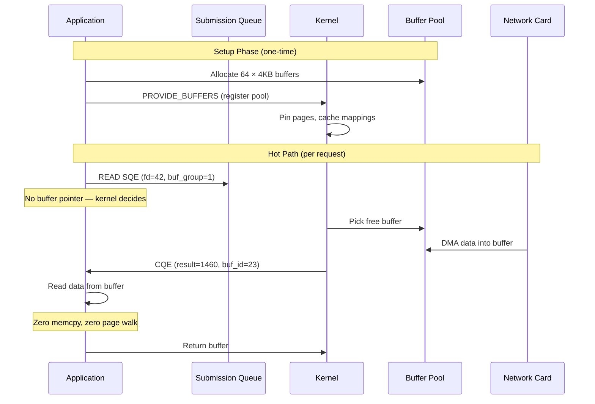

# 4. Buffer Ownership and Registered Memory 🔴

> **What you'll learn:**
> - Why standard `io_uring` reads still involve virtual memory mapping overhead — and how to eliminate it with `IORING_REGISTER_BUFFERS`
> - The ownership model shift from "application lends buffer to kernel" to "kernel owns buffer during I/O"
> - How provided buffer rings (`IORING_OP_PROVIDE_BUFFERS`) let the kernel select buffers autonomously
> - The safety implications in Rust: why `&mut [u8]` semantics break down and how to model kernel-owned buffers

---

## The Last Memcpy: Virtual Memory Overhead

In Chapter 3, we eliminated syscalls with `io_uring`. But there's still a hidden cost. When you submit a READ SQE with a pointer to a userspace buffer, the kernel must:

1. **Pin the page** — ensure the buffer's virtual memory pages are physically resident (not swapped)
2. **Translate the virtual address** — walk the page table to find the physical address for DMA
3. **Set up the DMA mapping** — program the IOMMU to map the physical address for the NIC

This per-operation page table walk costs **200–500ns**, which dominates at high throughput.

```mermaid
graph TD
    subgraph "Standard io_uring Read"
        A["App writes SQE:<br>buf = 0x7fff1234, len = 4096"] --> B["Kernel receives SQE"]
        B --> C["Pin virtual page 0x7fff1000"]
        C --> D["Walk page table → physical addr 0x1A3000"]
        D --> E["Program IOMMU for DMA"]
        E --> F["NIC DMAs data to physical page"]
        F --> G["Unpin page, write CQE"]
        style C fill:#e74c3c,color:#fff
        style D fill:#e74c3c,color:#fff
        style E fill:#e74c3c,color:#fff
    end

    subgraph "Registered Buffer io_uring Read"
        H["One-time: REGISTER_BUFFERS<br>pins pages, caches translations"] --> I["App writes SQE:<br>buf_index = 7"]
        I --> J["Kernel receives SQE"]
        J --> K["Look up pre-pinned physical<br>addr from table[7]"]
        K --> L["NIC DMAs data to physical page"]
        L --> M["Write CQE"]
        style K fill:#27ae60,color:#fff
    end
```



## Registered Buffers: `io_uring_register`

The solution is to **pre-register** your buffers with the kernel once at setup time. The kernel pins the pages, resolves the physical addresses, and caches the IOMMU mappings. Subsequent I/O operations reference buffers by **index** instead of pointer, skipping the entire page table walk.

```rust
use io_uring::{IoUring, opcode, types};
use std::os::unix::io::AsRawFd;

fn main() -> Result<(), Box<dyn std::error::Error>> {
    let mut ring = IoUring::new(256)?;

    // ✅ FIX: Pre-allocate a pool of page-aligned buffers.
    // These will be pinned in physical memory by the kernel.
    const NUM_BUFFERS: usize = 64;
    const BUFFER_SIZE: usize = 4096;

    // Allocate page-aligned memory to avoid straddling page boundaries
    let mut buffers: Vec<Vec<u8>> = (0..NUM_BUFFERS)
        .map(|_| {
            let layout = std::alloc::Layout::from_size_align(BUFFER_SIZE, 4096).unwrap();
            let ptr = unsafe { std::alloc::alloc_zeroed(layout) };
            unsafe { Vec::from_raw_parts(ptr, BUFFER_SIZE, BUFFER_SIZE) }
        })
        .collect();

    // ✅ FIX: Register all buffers with the kernel in a single syscall.
    // After this, the kernel has:
    //   - Pinned all pages (they won't be swapped out)
    //   - Cached the virtual → physical address translations
    //   - Set up persistent IOMMU mappings for DMA
    //
    // Cost: one expensive setup call (~microseconds)
    // Benefit: every subsequent I/O skips the page table walk (~200-500ns saved per op)
    let iovecs: Vec<libc::iovec> = buffers.iter_mut()
        .map(|buf| libc::iovec {
            iov_base: buf.as_mut_ptr() as *mut _,
            iov_len: buf.len(),
        })
        .collect();

    // Register buffers with the io_uring instance
    let submitter = ring.submitter();
    submitter.register_buffers(&iovecs)?;
    println!("Registered {} buffers with the kernel", NUM_BUFFERS);

    // ✅ FIX: Now use ReadFixed instead of Read.
    // The SQE references a buffer INDEX, not a pointer.
    // The kernel looks up the pre-cached physical address immediately.
    let read_sqe = opcode::ReadFixed::new(
        types::Fd(0),    // stdin for demo
        buffers[7].as_mut_ptr(),
        buffers[7].len() as u32,
        7,               // ← buffer INDEX, not pointer. Kernel uses cached mapping.
    )
    .build()
    .user_data(0x42);

    unsafe { ring.submission().push(&read_sqe)?; }
    ring.submit_and_wait(1)?;

    let cqe = ring.completion().next().unwrap();
    if cqe.result() > 0 {
        let n = cqe.result() as usize;
        println!("Read {} bytes into registered buffer #7", n);
        // Data is already in buffers[7] — no copy occurred.
        // The NIC DMA'd directly into the pre-pinned physical page.
    }

    Ok(())
}
```

### Performance Impact

| Approach | Per-Read Overhead | At 1M reads/sec |
|----------|-------------------|-----------------|
| `epoll` + `read()` | ~2000–5000ns (syscall + memcpy + page walk) | 2.0–5.0 CPU-seconds |
| `io_uring` + regular buffer | ~200–500ns (page walk + DMA setup) | 0.2–0.5 CPU-seconds |
| `io_uring` + registered buffer | ~5–10ns (index lookup only) | 0.005–0.01 CPU-seconds |

**Registered buffers reduce per-I/O overhead by 20–100x** compared to unregistered `io_uring`, and by **200–1000x** compared to `epoll`.

## Buffer Ownership: The Paradigm Shift

In traditional Rust I/O, you lend a buffer to the operation:

```rust
// Standard Rust I/O: you OWN the buffer, the kernel BORROWS it
let mut buf = vec![0u8; 4096];
let n = file.read(&mut buf)?;  // ← Kernel borrows &mut buf during the syscall
// After read() returns, you own buf again with data in buf[..n]
```

This works because `read()` is **synchronous** — the kernel borrows the buffer, copies data in, and returns. Ownership is never ambiguous.

With `io_uring`, the I/O is **asynchronous**. You submit an SQE pointing to a buffer, and the kernel will write to that buffer *at some point in the future*. Between submission and completion, **who owns the buffer?**

```rust
// ⚠️ SYNC BOTTLENECK: This is UNSOUND — the buffer could be freed
// or mutated while the kernel is writing to it.

let mut buf = vec![0u8; 4096];

let read_sqe = opcode::Read::new(
    types::Fd(fd),
    buf.as_mut_ptr(),   // ⚠️ We gave the kernel a raw pointer
    buf.len() as u32,
).build();

unsafe { ring.submission().push(&read_sqe)?; }
ring.submit()?;

// ⚠️ SYNC BOTTLENECK: If we drop or reallocate `buf` here,
// the kernel will DMA into freed memory → use-after-free.
// There is NO Rust borrow checker protection because the kernel
// is a separate entity that doesn't know about Rust lifetimes.

// We MUST keep `buf` alive and unmodified until the CQE arrives.
```

### Rust's Ownership Model vs. Kernel Buffer Ownership

| Phase | Traditional I/O | io_uring |
|-------|----------------|----------|
| Before I/O | App owns buffer | App owns buffer |
| During I/O | Kernel borrows buffer (synchronous, instant) | **Kernel owns buffer** (async, unknown duration) |
| After I/O | App owns buffer again | App owns buffer again (after CQE) |

The critical insight: **between SQE submission and CQE arrival, the buffer is exclusively owned by the kernel**. Rust's type system cannot enforce this because the kernel is outside the language's ownership model.

## Safe Buffer Management with Tokio-uring's `BufRing`

The `tokio-uring` crate addresses this with an ownership-transfer API:

```rust
// ✅ FIX: tokio-uring's read() TAKES OWNERSHIP of the buffer.
// You cannot access the buffer until the future completes,
// at which point you get the buffer BACK.

// You give the buffer to the read operation:
let buf = vec![0u8; 4096];
let (result, buf) = stream.read(buf).await;
//                        ^^^^^^^^ buf is MOVED into the future
// You cannot use `buf` here — it's been moved.

// The future returns (result, buf) — you get ownership back.
let n = result?;
process(&buf[..n]);

// ✅ FIX: This is a compile-time guarantee that you cannot
// access the buffer while the kernel owns it.
```

## Provided Buffer Rings: Kernel-Selected Buffers

For maximum throughput, you don't want to specify *which* buffer to use for each operation — let the kernel choose from a pre-provisioned pool:

```rust
use io_uring::{IoUring, opcode, types};

const BGID: u16 = 1;        // Buffer Group ID
const NUM_BUFFERS: u16 = 64;
const BUFFER_SIZE: u32 = 4096;

fn setup_provided_buffers(ring: &mut IoUring) -> Vec<Vec<u8>> {
    // ✅ FIX: Allocate a pool of buffers and register them as a "buffer group."
    // The kernel will pick a free buffer from this group for each completed read.
    let mut buffers: Vec<Vec<u8>> = (0..NUM_BUFFERS)
        .map(|_| vec![0u8; BUFFER_SIZE as usize])
        .collect();

    // Provide buffers to the kernel using IORING_OP_PROVIDE_BUFFERS
    for (i, buf) in buffers.iter_mut().enumerate() {
        let sqe = opcode::ProvideBuffers::new(
            buf.as_mut_ptr(),
            BUFFER_SIZE as i32,
            1,           // count: 1 buffer per SQE
            BGID,        // buffer group ID
            i as u16,    // buffer ID within the group
        )
        .build()
        .user_data(0);

        unsafe { ring.submission().push(&sqe).unwrap(); }
    }
    ring.submit_and_wait(NUM_BUFFERS as usize).unwrap();

    // Drain the completions from the provide-buffers operations
    for _ in 0..NUM_BUFFERS {
        let cqe = ring.completion().next().unwrap();
        assert!(cqe.result() >= 0, "Failed to provide buffer");
    }

    println!("Provided {} buffers to kernel (group {})", NUM_BUFFERS, BGID);
    buffers
}

fn submit_read_with_provided_buffer(ring: &mut IoUring, fd: i32, user_data: u64) {
    // ✅ FIX: Submit a READ that uses a kernel-selected buffer.
    // We don't specify WHICH buffer — the kernel picks one from the group.
    // The CQE flags will tell us which buffer ID was used.
    let sqe = opcode::Read::new(types::Fd(fd), std::ptr::null_mut(), BUFFER_SIZE)
        .buf_group(BGID)  // ← Use buffer from this group
        .build()
        .flags(io_uring::squeue::Flags::BUFFER_SELECT)  // ← Kernel selects buffer
        .user_data(user_data);

    unsafe { ring.submission().push(&sqe).unwrap(); }
}

fn handle_completion(cqe: &io_uring::cqueue::Entry, buffers: &[Vec<u8>]) {
    let result = cqe.result();
    if result > 0 {
        // ✅ FIX: Extract the buffer ID from the CQE flags.
        // The kernel tells us which buffer from the group it used.
        let buf_id = io_uring::cqueue::buffer_select(cqe.flags()).unwrap();
        let n = result as usize;
        let data = &buffers[buf_id as usize][..n];
        println!("Read {} bytes into provided buffer #{}", n, buf_id);
        
        // Process data in-place — ZERO memcpy from NIC to application.
        // The NIC DMA'd directly into this buffer, the kernel selected it
        // from our pool, and we're reading it at the same physical address.
    }
}
```

### The Provided Buffer Flow



## Fixed Files: Eliminating File Descriptor Lookup

The same principle applies to file descriptors. Every SQE referencing a file descriptor forces the kernel to look up the `struct file *` in the process's file descriptor table. With `IORING_REGISTER_FILES`, you pre-register file descriptors:

```rust
// ✅ FIX: Register file descriptors once at setup time.
// The kernel caches the struct file * pointers.
let fds: Vec<i32> = connections.iter().map(|c| c.as_raw_fd()).collect();
ring.submitter().register_files(&fds)?;

// Now use types::Fixed(index) instead of types::Fd(raw_fd)
let read_sqe = opcode::Read::new(
    types::Fixed(7),  // ← index into the registered file table
    buf_ptr,
    buf_len,
)
.build()
.user_data(0x42);
// ✅ FIX: Kernel skips fdget/fdput — the struct file * is pre-cached.
// Saves ~20-50ns per operation (file descriptor table lock + lookup).
```

## Combining Everything: The Zero-Copy I/O Stack

When you combine thread-per-core + `io_uring` + registered buffers + registered files, the per-operation cost breakdown becomes:

| Component | Standard Tokio | io_uring + Registered |
|-----------|---------------|----------------------|
| Task scheduling | ~50–200ns (work-stealing) | 0ns (pinned to core) |
| I/O syscall | ~1000–3000ns (epoll + read) | 0ns (shared-memory rings) |
| Buffer page walk | ~200–500ns (per read) | 0ns (pre-pinned) |
| IOMMU mapping | ~100–300ns (per DMA) | 0ns (pre-mapped) |
| FD lookup | ~20–50ns (per operation) | 0ns (pre-registered) |
| **Total per-operation** | **~1370–4050ns** | **~5–20ns** |

That's a **70–800x reduction** in per-operation overhead. At 10M operations/sec, this is the difference between **13–40 CPU-seconds** and **0.05–0.2 CPU-seconds** of overhead per second.

---

<details>
<summary><strong>🏋️ Exercise: Implement a Registered Buffer Pool</strong> (click to expand)</summary>

**Challenge:** Build a buffer pool manager that:
1. Allocates N page-aligned buffers at startup
2. Registers them with `io_uring` using `IORING_REGISTER_BUFFERS`
3. Tracks which buffers are in use (owned by the kernel) vs. available
4. Provides a safe API that prevents accessing a buffer while the kernel owns it
5. Benchmarks the per-read latency with vs. without registered buffers

<details>
<summary>🔑 Solution</summary>

```rust
use io_uring::{IoUring, opcode, types};
use std::collections::VecDeque;

/// A pool of pre-registered io_uring buffers that tracks ownership.
/// 
/// Safety invariant: a buffer index is either in `free_list` (app-owned)
/// or in-flight (kernel-owned). We never allow access to kernel-owned buffers.
struct RegisteredBufferPool {
    /// The raw buffer memory. Indices correspond to io_uring registered buffer indices.
    buffers: Vec<Vec<u8>>,
    /// Indices of buffers not currently in use by the kernel.
    free_list: VecDeque<u16>,
    /// Buffer size (all buffers are the same size).
    buf_size: usize,
}

impl RegisteredBufferPool {
    fn new(ring: &IoUring, num_buffers: u16, buf_size: usize) -> Self {
        // ✅ FIX: Allocate page-aligned buffers for optimal DMA performance.
        let layout = std::alloc::Layout::from_size_align(buf_size, 4096).unwrap();
        let mut buffers: Vec<Vec<u8>> = (0..num_buffers)
            .map(|_| {
                let ptr = unsafe { std::alloc::alloc_zeroed(layout) };
                unsafe { Vec::from_raw_parts(ptr, buf_size, buf_size) }
            })
            .collect();

        // ✅ FIX: Register all buffers with the kernel ONCE.
        // After this, every I/O with these buffers skips the page-table walk.
        let iovecs: Vec<libc::iovec> = buffers.iter_mut()
            .map(|buf| libc::iovec {
                iov_base: buf.as_mut_ptr() as *mut _,
                iov_len: buf.len(),
            })
            .collect();
        ring.submitter().register_buffers(&iovecs)
            .expect("failed to register buffers");

        let free_list: VecDeque<u16> = (0..num_buffers).collect();

        RegisteredBufferPool {
            buffers,
            free_list,
            buf_size,
        }
    }

    /// Take a buffer from the pool. Returns None if all buffers are in-flight.
    /// The returned index can be used in ReadFixed/WriteFixed SQEs.
    fn acquire(&mut self) -> Option<u16> {
        // ✅ FIX: Pop from free list — this buffer is now "kernel-owned"
        // until we call release(). No access to the buffer is allowed
        // between acquire() and release().
        self.free_list.pop_front()
    }

    /// Return a buffer to the pool after the CQE confirms the kernel
    /// is done with it. Returns a slice of the data the kernel wrote.
    fn release(&mut self, index: u16, bytes_written: usize) -> &[u8] {
        // ✅ FIX: The CQE has arrived — kernel no longer owns this buffer.
        // We can safely read the data and return the index to the free list.
        self.free_list.push_back(index);
        &self.buffers[index as usize][..bytes_written]
    }

    /// Get the raw pointer and length for an acquired buffer (for SQE construction).
    fn buf_ptr(&self, index: u16) -> (*mut u8, u32) {
        let buf = &self.buffers[index as usize];
        (buf.as_ptr() as *mut u8, buf.len() as u32)
    }
}

fn main() -> Result<(), Box<dyn std::error::Error>> {
    let mut ring = IoUring::new(256)?;
    let mut pool = RegisteredBufferPool::new(&ring, 64, 4096);

    // Simulate reading from stdin with registered buffers
    let buf_idx = pool.acquire().expect("no free buffers");
    let (ptr, len) = pool.buf_ptr(buf_idx);

    // ✅ FIX: ReadFixed uses the registered buffer INDEX.
    // The kernel skips the page-table walk entirely.
    let sqe = opcode::ReadFixed::new(
        types::Fd(0),  // stdin
        ptr,
        len,
        buf_idx,       // ← registered buffer index
    )
    .build()
    .user_data(buf_idx as u64);

    unsafe { ring.submission().push(&sqe)?; }
    ring.submit_and_wait(1)?;

    let cqe = ring.completion().next().unwrap();
    if cqe.result() > 0 {
        // ✅ FIX: Release the buffer — we get back a safe slice of the data.
        let data = pool.release(buf_idx, cqe.result() as usize);
        println!("Read {} bytes: {:?}",
            data.len(),
            std::str::from_utf8(data).unwrap_or("<binary>"));
    } else {
        // Release buffer even on error
        pool.release(buf_idx, 0);
    }

    Ok(())
}
```

**Key design insight:** The `RegisteredBufferPool` enforces the ownership contract at the API level:
- `acquire()` → buffer transitions to kernel-owned (no access allowed)
- `release()` → buffer transitions back to app-owned (safe to read)

This mirrors Rust's ownership model but across the user/kernel boundary.

</details>
</details>

---

> **Key Takeaways**
> - Even with `io_uring`, unregistered buffers incur ~200–500ns of page-table walk and IOMMU setup per I/O operation — this dominates at high throughput
> - `IORING_REGISTER_BUFFERS` pins pages and caches physical addresses once at setup, reducing per-I/O buffer overhead to a simple index lookup (~5ns)
> - Between SQE submission and CQE arrival, the **kernel exclusively owns** the buffer — Rust's borrow checker cannot enforce this, so safe APIs must model ownership transfer
> - Provided buffer rings (`IORING_OP_PROVIDE_BUFFERS`) let the kernel autonomously select buffers from a pool, eliminating the application's need to decide which buffer to use per-operation
> - Combining registered buffers + registered files + SQPOLL achieves ~5–20ns per-I/O overhead — a **70–800x improvement** over `epoll` + `read()`

> **See also:**
> - [Chapter 3: Readiness vs. Completion I/O](ch03-readiness-vs-completion-io.md) — the io_uring foundation this chapter builds on
> - [Chapter 5: The Deserialization Fallacy](ch05-the-deserialization-fallacy.md) — why zero-copy I/O is wasted if you copy data during deserialization
> - [Unsafe Rust & FFI](../unsafe-ffi-book/src/SUMMARY.md) — deeper coverage of raw pointer safety and `unsafe` invariants
