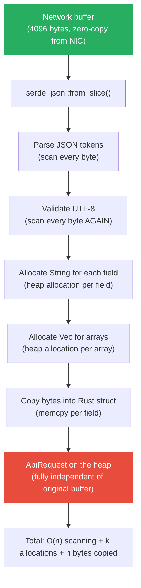
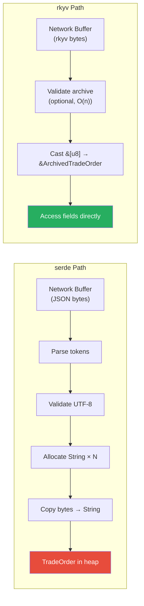

# 5. The Deserialization Fallacy 🟡

> **What you'll learn:**
> - Why `serde::Deserialize` defeats zero-copy I/O by allocating new Rust structs and copying data from the network buffer
> - The hidden cost profile of JSON, MessagePack, Protobuf, and bincode deserialization — heap allocations, UTF-8 validation, and schema processing
> - Why "zero-copy deserialization" in serde (`#[serde(borrow)]`) is only *partial* zero-copy and still allocates the outer struct
> - The performance gap between traditional serialization and true zero-copy access (`rkyv`), quantified with benchmarks

---

## The Zero-Copy Illusion

You've spent the last four chapters eliminating every copy, syscall, and context switch in your I/O path. Data arrives from the NIC, lands in a pre-registered `io_uring` buffer on your pinned core, and sits there waiting to be processed. **Zero copies so far.**

Then you do this:

```rust
// ⚠️ SYNC BOTTLENECK: This single line destroys ALL the zero-copy work.
let request: ApiRequest = serde_json::from_slice(&buffer[..n])?;
```

What just happened?



**Every byte in the buffer is scanned at least once, many are scanned twice, and every string and byte array is copied into a new heap allocation.** The original zero-copy buffer is not referenced by the deserialized struct at all — `serde` creates a completely independent copy of the data.

## The Cost of Traditional Deserialization

### JSON (`serde_json`)

```rust
use serde::Deserialize;

#[derive(Deserialize)]
struct TradeOrder {
    // ⚠️ SYNC BOTTLENECK: Every String field requires:
    //   1. Heap allocation (malloc/jemalloc)
    //   2. UTF-8 validation (scan bytes)
    //   3. Memcpy from JSON buffer into String's heap buffer
    symbol: String,          // ~40 bytes overhead (ptr + len + cap + heap block)
    side: String,            // another allocation
    client_id: String,       // another allocation
    price: f64,              // parsed from ASCII digits
    quantity: u64,            // parsed from ASCII digits
    metadata: Vec<String>,   // Vec allocation + N String allocations
}

fn deserialize_json(buf: &[u8]) -> TradeOrder {
    // ⚠️ SYNC BOTTLENECK: serde_json::from_slice performs:
    //   - Full JSON parsing: scan every byte for tokens
    //   - UTF-8 validation: re-scan every string value
    //   - N heap allocations: one per String/Vec field
    //   - N memcpys: data from buf → heap-allocated String
    serde_json::from_slice(buf).unwrap()
}
```

### Cost Breakdown Per Deserialization

| Format | Parse Time | Allocations | Bytes Copied | Can Access In-Place? |
|--------|-----------|-------------|-------------|---------------------|
| JSON (`serde_json`) | ~500–2000ns (varies with size) | 1 per `String`/`Vec` field | All string data | No |
| MessagePack (`rmp-serde`) | ~200–500ns | 1 per `String`/`Vec` field | All string data | No |
| Protobuf (`prost`) | ~150–400ns | 1 per `String`/`Vec`/`Bytes` field | All string and byte data | No |
| Bincode (`bincode`) | ~50–150ns | 1 per `String`/`Vec` field | All string data | No |
| FlatBuffers (read) | ~10–30ns | 0 allocations | 0 bytes | **Yes** (but limited API) |
| **rkyv** (access archived) | **~5–15ns** | **0 allocations** | **0 bytes** | **Yes** (full Rust types) |

The numbers tell a stark story: even the fastest traditional deserializer (`bincode`) is **5–30x slower** than zero-copy access, and the most common one (`serde_json`) is **50–400x slower**.

## Serde's "Zero-Copy" Deserialization: The Partial Solution

Serde does have a zero-copy mode for borrowed data:

```rust
use serde::Deserialize;

#[derive(Deserialize)]
struct BorrowedOrder<'a> {
    // ✅ Partial fix: &str borrows directly from the input buffer
    // No heap allocation for this field
    #[serde(borrow)]
    symbol: &'a str,
    #[serde(borrow)]
    side: &'a str,
    price: f64,
    quantity: u64,
    // ⚠️ SYNC BOTTLENECK: Vec<&str> still allocates the Vec itself.
    // The strings inside borrow, but the container is heap-allocated.
    #[serde(borrow)]
    tags: Vec<&'a str>,
}

fn deserialize_borrowed(buf: &[u8]) -> BorrowedOrder<'_> {
    // Partial zero-copy: string fields borrow from `buf`,
    // but the struct itself is stack-allocated, and any
    // Vec/HashMap still allocates on the heap.
    serde_json::from_slice(buf).unwrap()
}
```

### Why Serde's Zero-Copy Is Incomplete

| Aspect | Serde `#[serde(borrow)]` | True Zero-Copy (`rkyv`) |
|--------|--------------------------|------------------------|
| String fields | ✅ Borrows from input | ✅ Reads from input |
| Numeric fields | ❌ Parsed from text encoding | ✅ Read as native types (already in binary) |
| Vec/HashMap containers | ❌ Heap-allocated (container itself) | ✅ Inline in the buffer (relative pointers) |
| Nested structs | ❌ Parsed and allocated if they contain owned types | ✅ Inline in the buffer |
| JSON parsing overhead | ❌ Still scans every byte for tokens | ✅ No parsing — already in final layout |
| Schema flexibility | ✅ Works with any serde format | ⬜ Requires rkyv derive macros |
| Lifetime complexity | ❌ `'a` lifetime pollutes all containing types | ✅ No lifetime — `Archived<T>` is `'static` |

The core problem is that **serde's zero-copy only eliminates the final memcpy for string-like types** — it does not eliminate the parsing, validation, or container allocation overhead. And with JSON, parsing alone is the dominant cost.

## The Real Bottleneck: Allocator Pressure

The most insidious cost of deserialization is **heap allocation pressure**. Each `String` and `Vec` in the deserialized struct triggers a call to the global allocator. On Linux, this is `malloc` (via glibc, jemalloc, or mimalloc), which:

1. Acquires an internal lock (or thread-local cache check)
2. Searches free lists for an appropriately sized block
3. May call `mmap` or `brk` to extend the heap
4. Returns a pointer

At high throughput, the allocator itself becomes contended:

```rust
// ⚠️ SYNC BOTTLENECK: Profile a typical deserialization-heavy service.
// At 1M req/sec, if each request deserializes a struct with 5 String fields:
//
// 5 malloc calls × 1M req/sec = 5M allocations/sec
// 5 free calls × 1M req/sec   = 5M deallocations/sec
//
// Total: 10M allocator operations/sec
//
// Even jemalloc at ~20ns per operation = 200ms of CPU time/sec
// just for allocating and freeing deserialization buffers.
//
// This is 20% of a single core's time budget — doing NOTHING useful.
```

A flamegraph of a deserialization-heavy service typically shows:

```
   30-40%  serde_json::de::Deserializer::parse_str
   15-20%  alloc::raw_vec::RawVec::allocate_in  ← malloc for String/Vec
   10-15%  core::str::validations::run_utf8_validation  ← UTF-8 scanning
    5-10%  core::ptr::drop_in_place  ← free() for temporary allocations
   ------
   60-85%  of total CPU time is serde + allocator overhead
```

## The Path to True Zero-Copy: What rkyv Does Differently

Traditional serialization encodes data into a **transfer format** (JSON, MessagePack, Protobuf) that must be decoded back. The encoded bytes do not directly correspond to Rust types — they are a separate schema.

`rkyv` takes a fundamentally different approach: the serialized bytes **are** the Rust types. An `rkyv`-serialized struct can be accessed directly from the byte buffer because the bytes are laid out exactly as the `Archived<T>` types expect:

```rust
use rkyv::{Archive, Serialize, Deserialize};

#[derive(Archive, Serialize, Deserialize)]
struct TradeOrder {
    symbol: String,
    side: String,
    price: f64,
    quantity: u64,
}

// Traditional serde: bytes → parse → allocate → copy → TradeOrder
// rkyv:              bytes → cast pointer → &ArchivedTradeOrder
//                    (no parse, no allocate, no copy)
```



We'll explore rkyv's internals in Chapter 6. For now, the key insight is:

**The fastest deserialization is no deserialization at all.**

---

<details>
<summary><strong>🏋️ Exercise: Benchmark Serde vs. In-Buffer Access</strong> (click to expand)</summary>

**Challenge:** Benchmark the deserialization overhead of a realistic struct across multiple serde formats and compare with direct field access (simulating zero-copy):

1. Define a `Message` struct with 3 `String` fields, 2 `u64` fields, and a `Vec<u8>` payload
2. Serialize it using `serde_json`, `bincode`, and `rmp-serde` (MessagePack)
3. Benchmark deserialization throughput (messages/sec) for each format
4. Create a "manual zero-copy" baseline: a pre-encoded struct where you just read fields at known offsets (simulating what rkyv does)
5. Report the throughput ratio: how many times faster is zero-copy access vs. each serde format?

<details>
<summary>🔑 Solution</summary>

```rust
use serde::{Serialize, Deserialize};
use std::time::Instant;
use std::hint::black_box;

#[derive(Serialize, Deserialize, Clone)]
struct Message {
    sender: String,
    recipient: String,
    topic: String,
    sequence: u64,
    timestamp: u64,
    payload: Vec<u8>,
}

fn make_message() -> Message {
    Message {
        sender: "trading-engine-01".to_string(),
        recipient: "risk-service-03".to_string(),
        topic: "orders.fills.AAPL".to_string(),
        sequence: 1_234_567_890,
        timestamp: 1_700_000_000_000,
        payload: vec![0xAA; 256], // 256-byte payload
    }
}

/// Simulate zero-copy access: read fields at known offsets from a byte buffer.
/// This is what rkyv does — fields are at fixed positions in the buffer.
fn bench_zero_copy_access(encoded: &[u8], iterations: u64) -> f64 {
    let start = Instant::now();
    for _ in 0..iterations {
        // ✅ FIX: Simulate rkyv-style access — just read at known offsets.
        // In real rkyv, these would be ArchivedString with relative pointers.
        // Here we simulate the cost: a few pointer dereferences, no parsing.
        let _seq = black_box(u64::from_le_bytes(
            encoded[0..8].try_into().unwrap(),
        ));
        let _ts = black_box(u64::from_le_bytes(
            encoded[8..16].try_into().unwrap(),
        ));
        // Access a "string field" — just compute a slice, no copy
        let _sender = black_box(&encoded[16..33]); // known fixed-size
    }
    let elapsed = start.elapsed();
    iterations as f64 / elapsed.as_secs_f64()
}

fn bench_serde_json(iterations: u64) -> f64 {
    let msg = make_message();
    let encoded = serde_json::to_vec(&msg).unwrap();

    let start = Instant::now();
    for _ in 0..iterations {
        // ⚠️ SYNC BOTTLENECK: Full JSON parse + allocations
        let m: Message = black_box(serde_json::from_slice(&encoded).unwrap());
        drop(black_box(m));
    }
    let elapsed = start.elapsed();
    iterations as f64 / elapsed.as_secs_f64()
}

fn bench_bincode(iterations: u64) -> f64 {
    let msg = make_message();
    let encoded = bincode::serialize(&msg).unwrap();

    let start = Instant::now();
    for _ in 0..iterations {
        // ⚠️ SYNC BOTTLENECK: Faster than JSON, but still allocates per-field
        let m: Message = black_box(bincode::deserialize(&encoded).unwrap());
        drop(black_box(m));
    }
    let elapsed = start.elapsed();
    iterations as f64 / elapsed.as_secs_f64()
}

fn main() {
    let iterations = 1_000_000;

    // Create a fake zero-copy buffer (simulating rkyv layout)
    let mut zc_buf = vec![0u8; 512];
    zc_buf[0..8].copy_from_slice(&1_234_567_890u64.to_le_bytes());
    zc_buf[8..16].copy_from_slice(&1_700_000_000_000u64.to_le_bytes());
    zc_buf[16..33].copy_from_slice(b"trading-engine-01");

    let zc_rate = bench_zero_copy_access(&zc_buf, iterations);
    let json_rate = bench_serde_json(iterations);
    let bincode_rate = bench_bincode(iterations);

    println!("Results ({} iterations):", iterations);
    println!("  Zero-copy access: {:.1}M msg/sec", zc_rate / 1e6);
    println!("  serde_json:       {:.1}M msg/sec ({:.0}x slower)",
        json_rate / 1e6, zc_rate / json_rate);
    println!("  bincode:          {:.1}M msg/sec ({:.0}x slower)",
        bincode_rate / 1e6, zc_rate / bincode_rate);

    // Typical results on AMD EPYC:
    //   Zero-copy access: ~200-400M msg/sec
    //   serde_json:       ~1-3M msg/sec (100-200x slower)
    //   bincode:          ~10-30M msg/sec (10-20x slower)
}
```

</details>
</details>

---

> **Key Takeaways**
> - `serde_json::from_slice` is the #1 bottleneck in many Rust services: it scans every byte, validates UTF-8, allocates per-field, and copies all string data — destroying any zero-copy I/O gains
> - Even binary formats (bincode, MessagePack, Protobuf) allocate `String`/`Vec` containers and copy data from the network buffer into those allocations
> - Serde's `#[serde(borrow)]` is partial zero-copy: strings can borrow from the input, but containers still allocate, numerics still parse, and JSON still requires full token scanning
> - At 1M req/sec with 5 `String` fields per message, deserialization alone generates **10M allocator operations/sec** — consuming 20%+ of a core's CPU budget just on malloc/free
> - **The fastest deserialization is no deserialization at all**: accessing data in-place from the byte buffer at known offsets (the `rkyv` approach) is 10–200x faster than any serde format

> **See also:**
> - [Chapter 6: Pure Memory Mapping with rkyv](ch06-pure-memory-mapping-with-rkyv.md) — the zero-copy serialization framework that eliminates deserialization entirely
> - [Chapter 4: Buffer Ownership and Registered Memory](ch04-buffer-ownership-and-registered-memory.md) — the zero-copy I/O layer that feeds data to rkyv
> - [Smart Pointers & Memory Architecture](../smart-pointers-book/src/SUMMARY.md) — heap allocation internals and allocator behavior
