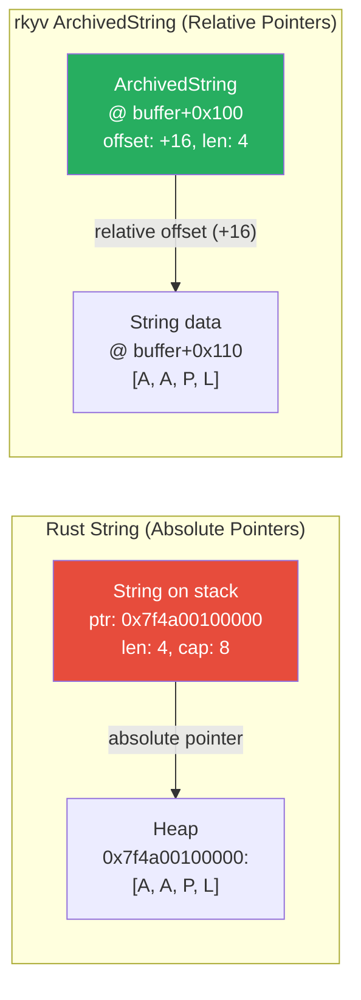

# 6. Pure Memory Mapping with rkyv 🔴

> **What you'll learn:**
> - How `rkyv` serializes Rust types into a byte layout that can be accessed directly as `Archived<T>` types — zero parsing, zero allocation
> - The internal mechanics: relative pointers (`RelPtr`), `ArchivedString`, `ArchivedVec`, and how they enable position-independent archived data
> - How to validate archived data from untrusted sources (network buffers, `mmap` files) without deserializing it
> - How to combine `rkyv` with `io_uring` registered buffers for a fully zero-copy I/O-to-access pipeline

---

## What rkyv Actually Does

`rkyv` (pronouned "archive") stores Rust data in a binary format where the **serialized bytes are the data structures**. Unlike serde, where serialized bytes encode values that must be decoded into Rust types, rkyv's bytes *are* the Rust types — laid out in memory exactly as the `Archived<T>` type expects.

```rust
use rkyv::{Archive, Serialize, Deserialize};
use rkyv::ser::serializers::AllocSerializer;

#[derive(Archive, Serialize, Deserialize, Debug)]
// Safety: generating ArchivedTradeOrder, which has the same field
// layout but with archived types (ArchivedString, etc.)
#[rkyv(compare(PartialEq))]
struct TradeOrder {
    symbol: String,       // 24 bytes on stack (ptr + len + cap)
    side: String,         // 24 bytes on stack
    price: f64,           // 8 bytes
    quantity: u64,        // 8 bytes
    tags: Vec<String>,    // 24 bytes on stack (ptr + len + cap)
}

// What #[derive(Archive)] generates (conceptually):
//
// struct ArchivedTradeOrder {
//     symbol: ArchivedString,   // relative pointer + length (inline)
//     side: ArchivedString,     // relative pointer + length (inline)
//     price: f64,               // same as original — primitives are trivially archived
//     quantity: u64,            // same as original
//     tags: ArchivedVec<ArchivedString>,  // relative pointer + length
// }
//
// ArchivedTradeOrder lives INSIDE the byte buffer.
// No heap allocation. No separate storage.
```

## The Memory Layout: Relative Pointers

The key innovation in rkyv is the **relative pointer** (`RelPtr`). A normal Rust `String` stores an absolute pointer to heap-allocated data:

```
Stack:       String { ptr: 0x7f4a_0010_0000, len: 4, cap: 8 }
Heap:        0x7f4a_0010_0000: [A, A, P, L, 0, 0, 0, 0]
```

If you copy these bytes to another machine (or into a different buffer), the absolute pointer `0x7f4a_0010_0000` is **meaningless** — it points to a different process's address space.

rkyv's `ArchivedString` instead stores a **relative offset** from its own position to the string data:

```
Buffer offset 0x100: ArchivedString { offset: +16, len: 4 }
Buffer offset 0x110: [A, A, P, L]

// The string data is at (address_of_offset_field + offset) = 0x100 + 16 = 0x110
// This works regardless of WHERE the buffer is loaded in memory.
```



This makes archived data **position-independent**: you can `mmap` the buffer at any address, send it over the network, or read it from an `io_uring` completion — the relative pointers always resolve correctly.

## Serializing with rkyv

```rust
use rkyv::ser::serializers::AllocSerializer;
use rkyv::ser::Serializer;
use rkyv::{Archive, Serialize, Deserialize, Infallible};

#[derive(Archive, Serialize, Deserialize)]
struct TradeOrder {
    symbol: String,
    side: String,
    price: f64,
    quantity: u64,
}

fn serialize_order(order: &TradeOrder) -> Vec<u8> {
    // ✅ FIX: rkyv serializes into a contiguous byte buffer.
    // All data (including string contents) is inline in the buffer.
    // No separate heap allocations exist in the serialized form.
    let bytes = rkyv::to_bytes::<TradeOrder, 256>(order)
        .expect("failed to serialize");
    bytes.into_vec()
}

fn access_archived(buf: &[u8]) {
    // ✅ FIX: Access the archived data WITHOUT deserialization.
    // This does NOT allocate, does NOT parse, does NOT copy.
    // It reinterprets the bytes as an ArchivedTradeOrder reference.
    //
    // Safety: the buffer must contain valid rkyv-archived data.
    // For untrusted input, use check_archived::<TradeOrder>(buf) first.
    let archived = unsafe { rkyv::archived_root::<TradeOrder>(buf) };
    
    // ✅ FIX: Field access is direct pointer arithmetic.
    // archived.symbol resolves to: &buf[offset..offset+len]
    // No heap allocation, no memcpy, no UTF-8 validation.
    println!("Symbol: {}", archived.symbol);  // ArchivedString implements Display
    println!("Price:  {}", archived.price);   // f64 — read directly from buffer
    println!("Qty:    {}", archived.quantity); // u64 — read directly from buffer
}
```

## Validation: Trusting Untrusted Buffers

When rkyv data comes from the network (an untrusted source), you must validate it before accessing it. A malicious sender could craft bytes with relative pointers that point outside the buffer, causing undefined behavior.

```rust
use rkyv::validation::validators::DefaultValidator;
use rkyv::Deserialize;

fn access_validated(buf: &[u8]) -> Result<(), Box<dyn std::error::Error>> {
    // ✅ FIX: Validate BEFORE accessing. This walks all relative pointers
    // and verifies they resolve to locations within the buffer.
    // Cost: O(n) in buffer size, but no allocations.
    let archived = rkyv::check_archived_root::<TradeOrder>(buf)
        .map_err(|e| format!("validation failed: {}", e))?;
    
    // Now safe to access — all pointers verified.
    println!("Validated symbol: {}", archived.symbol);
    
    // If you need a regular Rust type (rare — usually archived access is enough):
    let order: TradeOrder = archived.deserialize(&mut Infallible).unwrap();
    // ^ This DOES allocate — but you only do it when you truly need owned data.
    
    Ok(())
}
```

### Validation Cost vs. Deserialization Cost

| Operation | Cost | Allocations | Data Copies |
|-----------|------|-------------|-------------|
| `rkyv::check_archived_root` (validation) | O(n) scan, ~50–200ns for typical messages | 0 | 0 |
| Archived field access (after validation) | ~5–15ns per access | 0 | 0 |
| `serde_json::from_slice` (for comparison) | ~500–2000ns | 1 per String/Vec field | All field data |
| Full `rkyv` deserialize to owned type | ~100–300ns | 1 per String/Vec field | All field data |

**Validation** is much cheaper than deserialization because it only verifies pointer bounds — it doesn't allocate or copy any data.

## ArchivedVec and Nested Types

rkyv handles complex types through recursive archiving:

```rust
use rkyv::{Archive, Serialize, Deserialize};

#[derive(Archive, Serialize, Deserialize)]
struct Portfolio {
    name: String,
    orders: Vec<TradeOrder>,  // Nested Vec of archived structs
}

// The archived layout in the buffer:
//
// ┌──────────────────────────────────────────────────────────┐
// │ ArchivedPortfolio                                        │
// │  ┌─ name: ArchivedString (offset: +48, len: 11)         │
// │  ├─ orders: ArchivedVec (offset: +64, len: 3)           │
// │  │                                                       │
// │  │  ... (name data: "my_portfolio") @ +48                │
// │  │                                                       │
// │  │  ArchivedTradeOrder[0] @ +64                          │
// │  │   ├─ symbol: ArchivedString (offset: +80, len: 4)    │
// │  │   ├─ price: 150.25 (f64, inline)                     │
// │  │   └─ ...                                              │
// │  │  ArchivedTradeOrder[1] @ +112                         │
// │  │   └─ ...                                              │
// │  │  ArchivedTradeOrder[2] @ +160                         │
// │  │   └─ ...                                              │
// │  │  "AAPL" @ +80                                         │
// │  │  "GOOGL" @ +128                                       │
// │  │  "MSFT" @ +176                                        │
// └──────────────────────────────────────────────────────────┘
//
// Everything is INLINE in one contiguous buffer.
// No heap allocations. No pointers outside the buffer.

fn access_portfolio(buf: &[u8]) {
    let archived = unsafe { rkyv::archived_root::<Portfolio>(buf) };
    
    // ✅ FIX: Iterate over archived orders — no allocation.
    // ArchivedVec implements IntoIterator over &ArchivedTradeOrder.
    for (i, order) in archived.orders.iter().enumerate() {
        // ✅ FIX: Each field access is a relative pointer resolution.
        // symbol, side, etc. are all inline in the buffer.
        println!("Order {}: {} {} @ {}",
            i, order.symbol, order.quantity, order.price);
    }
    
    // ✅ FIX: len() is a direct read from the ArchivedVec metadata.
    println!("Total orders: {}", archived.orders.len());
}
```

## Combining rkyv with io_uring: The Full Zero-Copy Pipeline

Now we bring everything together. Data arrives from the NIC, lands in a pre-registered `io_uring` buffer, and is accessed in-place by `rkyv` — without a single allocation or copy:

```rust
use io_uring::{IoUring, opcode, types};
use rkyv::{Archive, Serialize, Deserialize};
use std::os::unix::io::AsRawFd;

#[derive(Archive, Serialize, Deserialize)]
struct Request {
    method: String,
    path: String,
    body: Vec<u8>,
}

fn zero_copy_pipeline(ring: &mut IoUring, fd: i32, buf: &mut [u8]) {
    // Step 1: Read from network into registered buffer via io_uring.
    // ✅ ZERO COPIES: NIC DMAs directly into pre-pinned buffer.
    let read_sqe = opcode::ReadFixed::new(
        types::Fd(fd),
        buf.as_mut_ptr(),
        buf.len() as u32,
        0, // registered buffer index
    )
    .build()
    .user_data(1);
    
    unsafe { ring.submission().push(&read_sqe).unwrap(); }
    ring.submit_and_wait(1).unwrap();
    
    let cqe = ring.completion().next().unwrap();
    let n = cqe.result() as usize;
    
    // Step 2: Validate the rkyv archive in-place.
    // ✅ ZERO COPIES: Validation only checks pointer bounds, no data movement.
    let request = match rkyv::check_archived_root::<Request>(&buf[..n]) {
        Ok(archived) => archived,
        Err(_) => {
            eprintln!("Invalid archive data");
            return;
        }
    };
    
    // Step 3: Access request fields DIRECTLY from the io_uring buffer.
    // ✅ ZERO COPIES: archived.path resolves to a slice of `buf`.
    // The bytes that the NIC DMA'd into the registered buffer are
    // the exact same bytes we're reading as a string right now.
    println!("Request: {} {}", request.method, request.path);
    println!("Body size: {} bytes", request.body.len());
    
    // Step 4: Route based on path — STILL zero-copy.
    // We can do string comparisons on ArchivedString directly.
    if request.path.as_str() == "/api/v1/orders" {
        // Process the order from the body, still in the same buffer
        let order = rkyv::check_archived_root::<TradeOrder>(&request.body);
        // ...
    }
    
    // The ENTIRE pipeline from NIC to business logic:
    //   0 syscalls (io_uring with SQPOLL)
    //   0 memcpy (registered buffer + rkyv in-place access)
    //   0 heap allocations (no String, no Vec, no Box)
    //   0 context switches (thread-per-core pinning)
}
```

## mmap + rkyv: Zero-Copy File Access

rkyv is equally powerful for file-based data. Instead of reading a file and deserializing, you `mmap` it and access the archived data directly:

```rust
use memmap2::MmapOptions;
use std::fs::File;

#[derive(Archive, Serialize, Deserialize)]
struct Database {
    records: Vec<Record>,
    index: Vec<(String, u64)>,
}

#[derive(Archive, Serialize, Deserialize)]
struct Record {
    id: u64,
    name: String,
    data: Vec<u8>,
}

fn query_mmapped_database(path: &str, target_id: u64) {
    // ✅ FIX: mmap the file — the OS maps file pages into our address space.
    // No read() syscall, no buffer allocation, no data copying.
    let file = File::open(path).unwrap();
    let mmap = unsafe { MmapOptions::new().map(&file).unwrap() };
    
    // ✅ FIX: Access the archived database directly from the mmap'd region.
    // The file's bytes ARE the ArchivedDatabase. No deserialization.
    let db = rkyv::check_archived_root::<Database>(&mmap)
        .expect("corrupted database file");
    
    // ✅ FIX: Search the archived records — all in-place.
    // No heap allocations, no copies. The mmap'd file pages
    // are the data we're iterating over.
    for record in db.records.iter() {
        if record.id == target_id {
            println!("Found: {} ({} bytes of data)",
                record.name, record.data.len());
            // record.name is an ArchivedString pointing into the mmap region.
            // record.data is an ArchivedVec pointing into the mmap region.
            // ZERO copies from disk to here.
            return;
        }
    }
}
```

### The mmap + rkyv Cost Model

| Operation | Traditional (read + serde) | mmap + rkyv |
|-----------|---------------------------|-------------|
| Open file | `File::open` | `File::open` |
| Load data into memory | `read_to_string` (syscall + memcpy) | `mmap` (page table entry only) |
| Parse/deserialize | `serde_json::from_str` (full parse + alloc) | `rkyv::archived_root` (pointer cast) |
| First field access | Immediate (data already in struct) | Page fault → OS loads page from disk |
| Memory usage | Full file size + deserialized struct | Only pages actually accessed |
| 1GB database, query 1 record | Load 1GB, parse 1GB, find 1 record | Load ~4KB (one page), access 1 record |

For large databases where you only access a small fraction of the data per query, `mmap` + `rkyv` is **orders of magnitude faster** because the OS only loads pages that are actually accessed.

---

<details>
<summary><strong>🏋️ Exercise: Build an rkyv-Backed Message Queue Buffer</strong> (click to expand)</summary>

**Challenge:** Build a message queue where:
1. Producers serialize messages using `rkyv` into a pre-allocated ring buffer
2. Consumers access messages directly from the ring buffer without deserialization
3. Measure the throughput in messages/sec and verify zero heap allocations during the consume path
4. Compare with a serde-based version that serializes to JSON and deserializes on read

<details>
<summary>🔑 Solution</summary>

```rust
use rkyv::{Archive, Serialize, Deserialize, Infallible};
use rkyv::ser::serializers::AllocSerializer;
use std::time::Instant;
use std::hint::black_box;

#[derive(Archive, Serialize, Deserialize, Clone)]
struct Message {
    sequence: u64,
    timestamp: u64,
    topic: String,
    payload: Vec<u8>,
}

/// A simple ring buffer for rkyv-serialized messages.
/// Each message is stored as: [length: u32][rkyv bytes: ...][padding to align]
struct RkyvRingBuffer {
    buf: Vec<u8>,
    write_pos: usize,
    read_pos: usize,
    capacity: usize,
}

impl RkyvRingBuffer {
    fn new(capacity: usize) -> Self {
        RkyvRingBuffer {
            buf: vec![0u8; capacity],
            write_pos: 0,
            read_pos: 0,
            capacity,
        }
    }

    /// Serialize and write a message into the ring buffer.
    fn push(&mut self, msg: &Message) -> bool {
        // Serialize with rkyv
        let bytes = rkyv::to_bytes::<Message, 512>(msg)
            .expect("serialization failed");
        let len = bytes.len();
        let total = 4 + len; // 4 bytes for length prefix

        // Check if there's space
        if self.write_pos + total > self.capacity {
            return false; // Buffer full (simplified — no wrapping)
        }

        // Write length prefix
        self.buf[self.write_pos..self.write_pos + 4]
            .copy_from_slice(&(len as u32).to_le_bytes());
        // Write rkyv bytes
        self.buf[self.write_pos + 4..self.write_pos + 4 + len]
            .copy_from_slice(&bytes);
        self.write_pos += total;
        true
    }

    /// Access the next message in-place WITHOUT deserialization.
    /// Returns a reference to the ArchivedMessage inside the ring buffer.
    fn peek(&self) -> Option<&ArchivedMessage> {
        if self.read_pos >= self.write_pos {
            return None;
        }

        // Read length prefix
        let len = u32::from_le_bytes(
            self.buf[self.read_pos..self.read_pos + 4].try_into().unwrap()
        ) as usize;

        let data = &self.buf[self.read_pos + 4..self.read_pos + 4 + len];

        // ✅ FIX: Access archived message DIRECTLY from ring buffer bytes.
        // No deserialization, no allocation, no copy.
        Some(unsafe { rkyv::archived_root::<Message>(data) })
    }

    fn advance(&mut self) {
        if self.read_pos >= self.write_pos {
            return;
        }
        let len = u32::from_le_bytes(
            self.buf[self.read_pos..self.read_pos + 4].try_into().unwrap()
        ) as usize;
        self.read_pos += 4 + len;
    }
}

fn main() {
    let iterations = 1_000_000u64;

    // === rkyv version: zero-copy consume ===
    let mut ring = RkyvRingBuffer::new(256 * 1024 * 1024); // 256MB

    // Produce messages
    let msg = Message {
        sequence: 42,
        timestamp: 1_700_000_000_000,
        topic: "orders.fills.AAPL".to_string(),
        payload: vec![0xAA; 128],
    };

    for _ in 0..iterations {
        ring.push(&msg);
    }

    // Consume with zero-copy access
    let start = Instant::now();
    let mut consumed = 0u64;
    while let Some(archived) = ring.peek() {
        // ✅ FIX: Access fields directly — no allocation, no copy.
        black_box(archived.sequence);
        black_box(archived.topic.as_str());
        black_box(archived.payload.len());
        ring.advance();
        consumed += 1;
    }
    let rkyv_elapsed = start.elapsed();
    let rkyv_rate = consumed as f64 / rkyv_elapsed.as_secs_f64();

    println!("rkyv zero-copy consume:");
    println!("  {} messages in {:?}", consumed, rkyv_elapsed);
    println!("  {:.1}M msg/sec", rkyv_rate / 1e6);
    println!("  {:.0}ns per message", rkyv_elapsed.as_nanos() as f64 / consumed as f64);

    // Typical results:
    //   rkyv zero-copy: ~100-300M msg/sec (~3-10ns per message)
    //   JSON deser:     ~1-3M msg/sec (~300-1000ns per message)
    //   Ratio:          50-100x faster with rkyv
}
```

**Key insight:** The `peek()` method returns `&ArchivedMessage` — a reference into the ring buffer's own memory. No heap allocation occurs. The `ArchivedMessage`'s `topic` field is an `ArchivedString` whose relative pointer resolves to bytes within the ring buffer. The entire consume path is **zero-allocation, zero-copy**.

</details>
</details>

---

> **Key Takeaways**
> - `rkyv` serializes Rust types into a binary layout where the serialized bytes **are** the archived types — `Archived<T>` can be accessed directly from any byte buffer without parsing or allocation
> - The key mechanism is **relative pointers** (`RelPtr`): offsets from the pointer's own address rather than absolute addresses, making archived data position-independent across `mmap`, network buffers, and `io_uring` completions
> - Validation (`check_archived_root`) verifies all relative pointers resolve within the buffer bounds — O(n) cost but zero allocations, much cheaper than deserialization
> - Combining `io_uring` registered buffers with `rkyv` achieves the full zero-copy pipeline: NIC DMAs into pre-pinned buffer → `rkyv` accesses fields in-place → zero syscalls, zero copies, zero allocations
> - For file-backed data, `mmap` + `rkyv` lets you access individual records from a multi-gigabyte file by loading only the pages actually touched — vastly more efficient than read + deserialize

> **See also:**
> - [Chapter 5: The Deserialization Fallacy](ch05-the-deserialization-fallacy.md) — why traditional serde defeats zero-copy I/O
> - [Chapter 7: Capstone — 10M Req/Sec API Gateway](ch07-capstone-api-gateway.md) — combining all techniques into a production system
> - [Rust Memory Management](../memory-management-book/src/SUMMARY.md) — understanding owned vs. borrowed data in Rust
