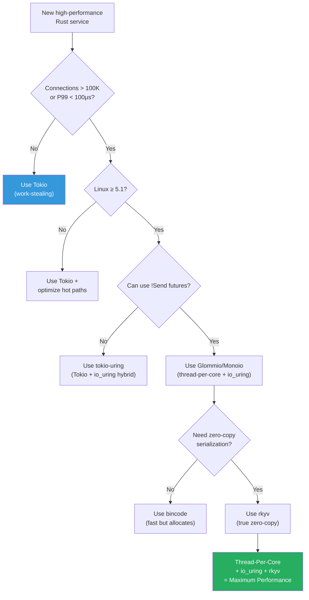

# Summary and Reference Card

> This appendix provides a quick-reference cheat sheet for all concepts, APIs, and patterns covered in this book. Pin it next to your monitor.

---

## Architecture Decision Matrix

| Question | If Yes → Use | If No → Use |
|----------|-------------|-------------|
| Do you have >100K concurrent connections? | Thread-per-core (Glommio/Monoio) | Tokio (work-stealing) |
| Is P99.9 latency critical (< 100μs)? | Thread-per-core + io_uring | Tokio is likely fine |
| Are you on Linux ≥ 5.1? | io_uring for I/O | epoll (Tokio default) |
| Do you need zero-copy serialization? | rkyv | serde + bincode/protobuf |
| Is data read-heavy from files? | mmap + rkyv | Read + deserialize |
| Do tasks need cross-core sharing? | Message passing (SPSC channels) | Shared memory (Arc + Mutex) |

---

## io_uring Syscall Reference

### Setup

```rust
// Create an io_uring instance with N entries
let ring = IoUring::new(256)?;

// Enable SQ polling (kernel-side thread polls SQ — eliminates io_uring_enter)
let ring = IoUring::builder()
    .setup_sqpoll(2000)  // idle timeout in ms
    .build(256)?;
```

### Register Resources (One-Time)

```rust
// Register buffers (pins pages, caches physical addresses)
ring.submitter().register_buffers(&iovecs)?;

// Register file descriptors (caches struct file * pointers)
ring.submitter().register_files(&fds)?;
```

### Common SQE Operations

| Operation | Opcode | Rust API |
|-----------|--------|----------|
| Accept TCP connection | `IORING_OP_ACCEPT` | `opcode::Accept::new(fd, addr, addrlen)` |
| Read into buffer | `IORING_OP_READ` | `opcode::Read::new(fd, buf, len)` |
| Read into registered buffer | `IORING_OP_READ_FIXED` | `opcode::ReadFixed::new(fd, buf, len, buf_index)` |
| Write from buffer | `IORING_OP_WRITE` | `opcode::Write::new(fd, buf, len)` |
| Write from registered buffer | `IORING_OP_WRITE_FIXED` | `opcode::WriteFixed::new(fd, buf, len, buf_index)` |
| Connect to remote | `IORING_OP_CONNECT` | `opcode::Connect::new(fd, addr, addrlen)` |
| Close file descriptor | `IORING_OP_CLOSE` | `opcode::Close::new(fd)` |
| Provide buffer to pool | `IORING_OP_PROVIDE_BUFFERS` | `opcode::ProvideBuffers::new(addr, len, count, bgid, bid)` |
| No-op (for wake-up) | `IORING_OP_NOP` | `opcode::Nop::new()` |

### Submit and Reap

```rust
// Push an SQE into the submission queue
unsafe { ring.submission().push(&sqe)?; }

// Submit all pending SQEs (syscall — but free with SQPOLL)
ring.submit()?;

// Submit and wait for at least N completions
ring.submit_and_wait(1)?;

// Read a completion (CQE) — no syscall, reads from shared memory
if let Some(cqe) = ring.completion().next() {
    let result = cqe.result();     // bytes transferred or -errno
    let token = cqe.user_data();   // your correlation token
}
```

---

## Glommio Cheat Sheet

### Executor Setup

```rust
use glommio::prelude::*;

// Pin executor to a specific CPU core
LocalExecutorBuilder::new(Placement::Fixed(core_id))
    .spawn(|| async { /* ... */ })
    .unwrap();
```

### Task Spawning

```rust
// Spawn a !Send future (stays on this core forever)
glommio::spawn_local(async {
    // Can use Rc, RefCell, thread-locals
}).detach();

// Spawn and await the result
let result = glommio::spawn_local(async { 42 }).await;
```

### I/O Primitives

```rust
use glommio::net::{TcpListener, TcpStream};

// TCP listener with SO_REUSEPORT (io_uring backed)
let listener = TcpListener::bind("0.0.0.0:8080")?;
let stream = listener.accept().await?;

// TCP client connection (io_uring backed)
let stream = TcpStream::connect("10.0.1.10:8080").await?;

// File I/O (io_uring backed, O_DIRECT support)
use glommio::io::{DmaFile, DmaStreamReaderBuilder};
let file = DmaFile::open("data.bin").await?;
```

### Cross-Core Communication

```rust
use glommio::channels::shared_channel;

// Create SPSC channel between executors
let (sender, receiver) = shared_channel::new_bounded(1024);

// Sender side (Core 0)
let connected = sender.connect().await;
connected.send(message).await?;

// Receiver side (Core 1)
let connected = receiver.connect().await;
let msg = connected.recv().await?;
```

---

## rkyv Cheat Sheet

### Derive Macros

```rust
use rkyv::{Archive, Serialize, Deserialize};

#[derive(Archive, Serialize, Deserialize)]
struct MyStruct {
    name: String,         // → ArchivedString (relative pointer)
    values: Vec<u64>,     // → ArchivedVec<u64> (relative pointer)
    count: u64,           // → u64 (trivially archived)
    flag: bool,           // → bool (trivially archived)
}
```

### Serialize

```rust
// Serialize to bytes (allocates a buffer)
let bytes: AlignedVec = rkyv::to_bytes::<MyStruct, 256>(&my_struct)?;

// Serialize into an existing buffer (zero-alloc serialization)
use rkyv::ser::serializers::AllocSerializer;
let mut serializer = AllocSerializer::<256>::default();
serializer.serialize_value(&my_struct)?;
let bytes = serializer.into_serializer().into_inner();
```

### Access (Zero-Copy)

```rust
// Unsafe access (trusted data — e.g., your own mmap files)
let archived = unsafe { rkyv::archived_root::<MyStruct>(&bytes) };

// Validated access (untrusted data — e.g., network input)
let archived = rkyv::check_archived_root::<MyStruct>(&bytes)?;

// Access fields directly (zero allocation, zero copy)
println!("{}", archived.name);              // ArchivedString: Display
println!("{}", archived.values.len());      // ArchivedVec: len()
println!("{}", archived.count);             // u64: direct read
```

### Deserialize to Owned (When Needed)

```rust
use rkyv::Infallible;

// Convert Archived<T> back to T (allocates — only when you need owned data)
let owned: MyStruct = archived.deserialize(&mut Infallible)?;
```

---

## Cost Reference Table

| Operation | Approximate Latency | Context |
|-----------|-------------------|---------|
| L1 cache hit | 1–4 ns | Local core, data already cached |
| `Rc::clone()` | ~1 ns | Non-atomic increment |
| `RefCell::borrow()` | ~1 ns | Non-atomic flag check |
| rkyv field access | ~5–15 ns | Relative pointer + dereference |
| `Arc::clone()` (uncontended) | ~5–10 ns | Atomic increment, no cache bounce |
| L2 cache hit | 5–12 ns | Local core, larger cache |
| io_uring SQE write | ~5 ns | Memory store to shared ring |
| io_uring CQE read | ~5 ns | Memory load from shared ring |
| L3 cache hit | 20–40 ns | Shared across cores |
| `Arc::clone()` (contended, 4 cores) | ~30–80 ns | Atomic + MESI invalidation |
| rkyv validation | ~50–200 ns | O(n) pointer bounds check |
| `bincode::deserialize` | ~50–150 ns | Binary parse + allocations |
| `Mutex::lock()` (contended) | ~50–200 ns | Spin + futex |
| Cross-core MESI invalidation | ~40–80 ns | Cache-line bounce |
| NUMA remote memory access | ~100–300 ns | Cross-socket memory |
| io_uring buffer registration overhead (per op, without registration) | ~200–500 ns | Page table walk + IOMMU |
| `serde_json::from_slice` | ~500–2000 ns | Full parse + allocations |
| `epoll_wait` syscall | ~1000–3000 ns | Context switch + readiness check |
| `read()` syscall | ~1000–3000 ns | Context switch + memcpy |

---

## Key Crate Versions

| Crate | Version | Purpose |
|-------|---------|---------|
| `glommio` | 0.9 | Thread-per-core runtime with io_uring |
| `monoio` | 0.2 | Alternative thread-per-core runtime (ByteDance) |
| `io-uring` | 0.7 | Low-level io_uring bindings |
| `tokio-uring` | 0.5 | Tokio-compatible io_uring runtime |
| `rkyv` | 0.8 | Zero-copy serialization/deserialization |
| `memmap2` | 0.9 | Safe memory-mapped file I/O |
| `socket2` | 0.5 | Advanced socket options (SO_REUSEPORT, etc.) |
| `core_affinity` | 0.8 | CPU core pinning |
| `crossbeam-channel` | 0.5 | Lock-free MPMC/SPSC channels |

---

## Quick Decision Flowchart



---

## Further Reading

| Resource | Topic |
|----------|-------|
| [io_uring man page](https://man7.org/linux/man-pages/man7/io_uring.7.html) | Official Linux documentation |
| [Lord of the io_uring](https://unixism.net/loti/) | Comprehensive io_uring tutorial |
| [Glommio Documentation](https://docs.rs/glommio) | Glommio API reference |
| [rkyv Book](https://rkyv.org/) | Official rkyv documentation |
| [Seastar Framework](https://seastar.io/) | C++ thread-per-core framework (ScyllaDB, Redpanda) |
| [Bryan Cantrill — Platform as a Reflection of Values](https://www.youtube.com/watch?v=9QMGAtxUlAc) | Philosophy behind shared-nothing systems |
| [Jens Axboe — io_uring](https://kernel.dk/io_uring.pdf) | io_uring design paper by its creator |
