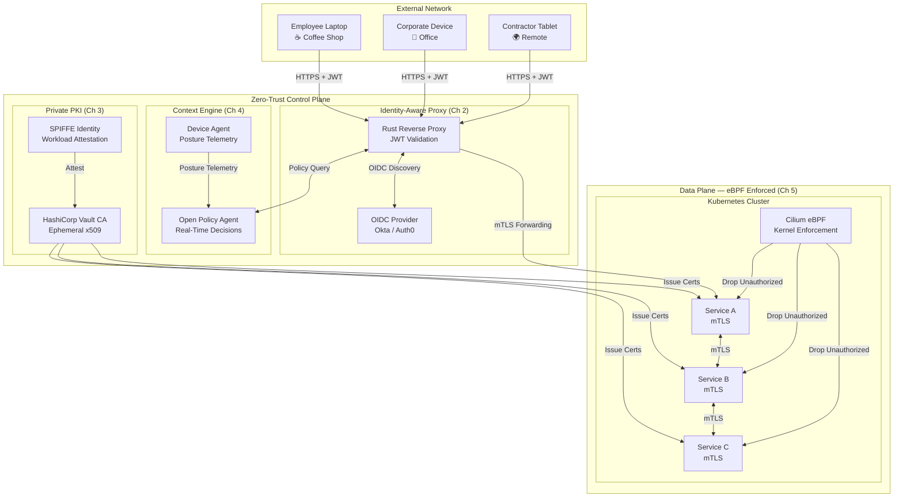

# System Design: The Zero-Trust Identity-Aware Proxy

## Speaker Intro

This handbook is written from the perspective of a **Principal Security Architect** who has spent a career designing and operating zero-trust architectures across Fortune 500 enterprises, hyperscale cloud providers, and government security programs. The content draws from first-hand experience migrating organizations from legacy VPN-based perimeter security to continuous-verification, identity-aware access models — hardening environments where a single lateral-movement exploit would have cost hundreds of millions of dollars.

## Who This Is For

- **Platform / Infrastructure engineers** who are tired of managing VPN concentrators and firewall ACL sprawl and want to understand the architecture that replaces them.
- **Security engineers** building or evaluating zero-trust access tiers and who need a concrete, code-level understanding of how identity-aware proxies, mTLS, and eBPF enforcement actually work under the hood.
- **Backend developers** deploying services into Kubernetes or cloud environments who need to understand how their traffic is authenticated, authorized, and encrypted — even inside the "trusted" network.
- **Architects studying for system design interviews** where "Design a Zero-Trust Access Architecture" is an increasingly common Staff+ prompt.
- **Anyone who has read Google's BeyondCorp papers** and wants to go from conceptual understanding to a working Rust implementation.

## Prerequisites

| Concept | Where to Learn |
|---|---|
| Intermediate Rust (ownership, traits, `async`) | [Async Rust](../async-book/src/SUMMARY.md) |
| Basic networking (TCP/TLS, HTTP, DNS) | [Tokio Internals](../tokio-internals-book/src/SUMMARY.md) |
| Linux fundamentals (syscalls, namespaces) | [Hardware Sympathy](../hardware-sympathy-book/src/SUMMARY.md) |
| Familiarity with public-key cryptography (RSA, ECDSA, x509) | [Enterprise Rust](../enterprise-rust-book/src/SUMMARY.md) |
| Basic Kubernetes concepts (pods, services, CNI) | [Cloud Native](../cloud-native-book/src/SUMMARY.md) |

## How to Use This Book

| Emoji | Meaning |
|---|---|
| 🟢 | **Architecture** — foundational design decisions, threat models, and philosophical shifts |
| 🟡 | **Cryptography / Identity** — OIDC flows, JWT validation, certificate lifecycle |
| 🔴 | **Network / Kernel** — mTLS at scale, eBPF programs, kernel-level packet filtering |

Each chapter builds on the previous one. The proxy bootstraps its trust model in Ch 1–2, layers cryptographic identity in Ch 3, adds real-time device posture in Ch 4, and finally drops unauthorized packets at the kernel before they reach userspace in Ch 5.

## The Problem We Are Solving

> Design a **zero-trust identity-aware proxy** that replaces VPN-based perimeter access with per-request identity and device verification. Every HTTP request to any internal service must be authenticated via OIDC, authorized against a real-time policy engine, encrypted end-to-end with mTLS, and enforced at the kernel level with eBPF — regardless of whether the request originates from corporate Wi-Fi, a coffee shop, or another microservice.

The system we will build has these non-negotiable requirements:

| Requirement | Target |
|---|---|
| Authentication | Every request carries a short-lived JWT (≤ 5 min lifetime) validated against an OIDC IdP |
| Authorization | Per-request policy evaluation via OPA (< 1 ms p99 decision latency) |
| Encryption | All east-west and north-south traffic encrypted with mTLS; ephemeral certs (24h TTL) |
| Device posture | Real-time endpoint health checks (disk encryption, OS patch, EDR status) |
| Lateral movement prevention | eBPF micro-segmentation drops unauthorized packets before userspace |
| Proxy overhead | < 2 ms added p99 latency per request |
| Certificate rotation | Zero-downtime automated rotation via private CA (HashiCorp Vault) |

## Pacing Guide

| Chapter | Topic | Time | Checkpoint |
|---|---|---|---|
| Ch 0 | Introduction & Threat Model | 30 min | Understand the zero-trust design canvas |
| Ch 1 | The Death of the VPN | 3–4 hours | Can articulate why perimeter security fails; BeyondCorp mental model |
| Ch 2 | The Identity-Aware Proxy (IAP) | 8–10 hours | Working Rust reverse proxy validating JWTs via OIDC |
| Ch 3 | Mutual TLS & Certificate Authorities | 6–8 hours | Private CA issuing ephemeral x509 certs; mTLS handshake working |
| Ch 4 | Device Posture & Context Engine | 6–8 hours | OPA policy engine evaluating device telemetry on every request |
| Ch 5 | Micro-segmentation with eBPF | 8–10 hours | eBPF programs dropping unauthorized packets at tc/XDP layer |

**Total: ~32–40 hours** of focused study.

## Table of Contents

### Part I: Foundations — Why Zero Trust
- **Chapter 1 — The Death of the VPN 🟢** — Why perimeter security (the "castle and moat" model) is fundamentally broken. Real-world breaches that exploited implicit trust. Introduction to the BeyondCorp philosophy: moving access controls from the network perimeter to individual users and devices. Comparing VPN, ZTNA, and IAP architectures.

### Part II: The Gatekeeper
- **Chapter 2 — The Identity-Aware Proxy (IAP) 🟡** — Architecting the gatekeeper. Building a Rust-based reverse proxy that intercepts all traffic to internal applications. Validating short-lived JSON Web Tokens (JWTs) and integrating with an Identity Provider (Okta/Auth0) via OpenID Connect (OIDC). Token refresh, session binding, and anti-replay protections.
- **Chapter 3 — Mutual TLS (mTLS) and Certificate Authorities 🔴** — Securing service-to-service communication. Establishing a private CA using HashiCorp Vault. Provisioning ephemeral x509 certificates with SPIFFE identities. The mTLS handshake in detail. Certificate rotation without downtime.

### Part III: Continuous Verification
- **Chapter 4 — Device Posture and Context Engine 🔴** — Identity isn't just "who you are," it's "what machine you are using." Building an agent that collects disk encryption status, OS patch levels, and EDR presence. Feeding telemetry into OPA for real-time, per-request policy decisions. Dynamic access tiers based on device risk score.

### Part IV: Kernel-Level Enforcement
- **Chapter 5 — Micro-segmentation with eBPF 🔴** — Enforcing network policy at the kernel level. Using eBPF (via Cilium) to drop unauthorized packets before they reach the application layer. Identity-aware network policies. Completely isolating compromised workloads from laterally moving across the datacenter.

## Architecture Overview

## Companion Guides

This handbook builds on concepts from several other books in the Rust Training curriculum:

| Book | Relevant Concepts |
|---|---|
| [Enterprise Rust](../enterprise-rust-book/src/SUMMARY.md) | OpenTelemetry, zero-trust cryptography, SBOM, SLSA compliance |
| [Cloud Native](../cloud-native-book/src/SUMMARY.md) | Kubernetes internals, eBPF, Cilium, CRDs |
| [Async Rust](../async-book/src/SUMMARY.md) | Tokio runtime, streams, cancellation safety |
| [Tokio Internals](../tokio-internals-book/src/SUMMARY.md) | mio, epoll, reactor, wakers, work-stealing |
| [Hardware Sympathy](../hardware-sympathy-book/src/SUMMARY.md) | XDP, DPDK, kernel bypass, thread-per-core |
| [Rust Microservices](../microservices-book/src/SUMMARY.md) | Axum, Tower middleware, gRPC with Tonic |
