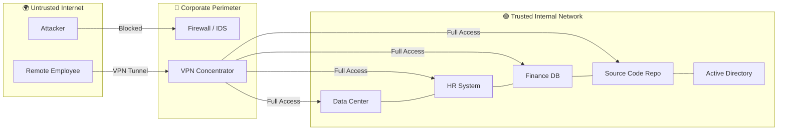
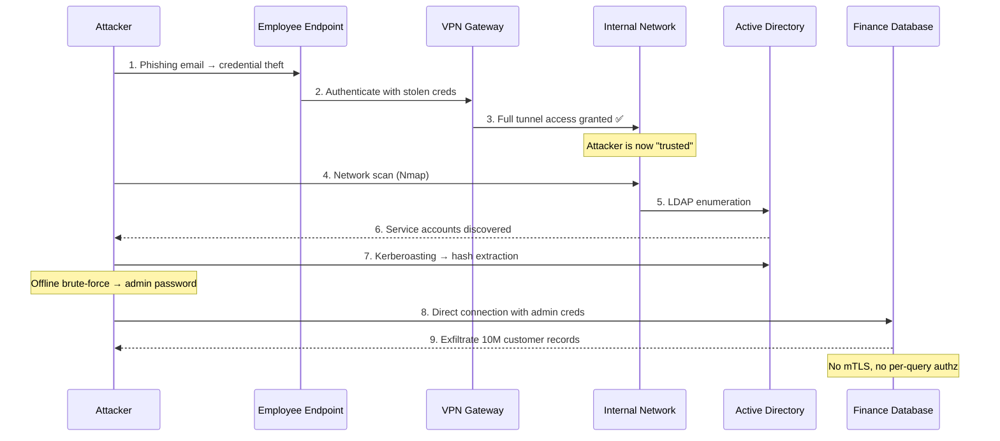
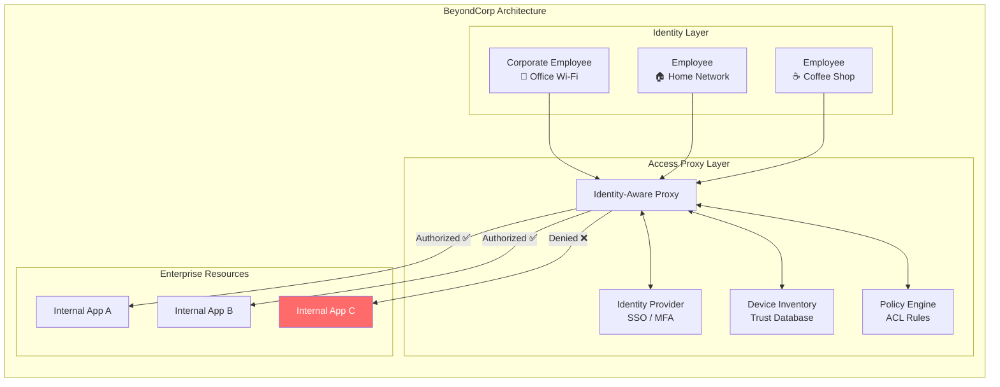
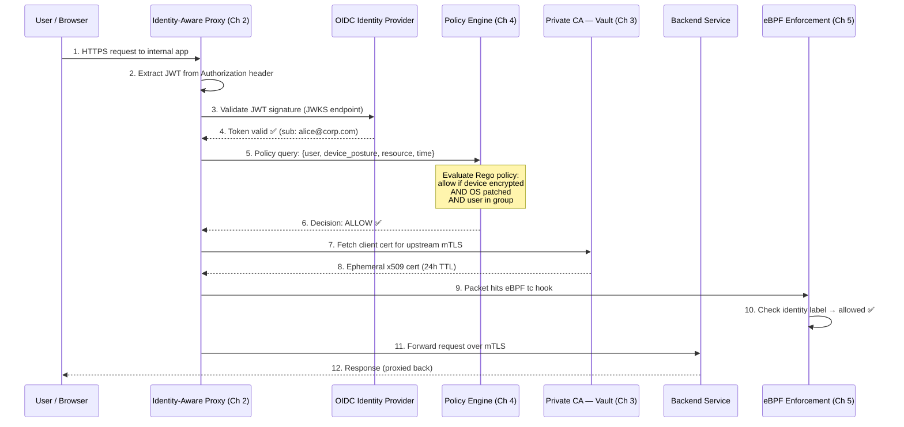

# Chapter 1: The Death of the VPN 🟢

> **The Problem:** For decades, organizations have relied on the "castle and moat" model — a hardened network perimeter with a VPN as the drawbridge. Once a user authenticates to the VPN, they are implicitly trusted to roam the internal network. But modern breaches — SolarWinds, Colonial Pipeline, the Microsoft Exchange Hafnium attacks — all share one devastating pattern: attackers breach the perimeter *once* and then move laterally *unchallenged* across the flat internal network. The VPN doesn't just fail to prevent this — it *enables* it by design.

---

## 1.1 The Castle and Moat Model

The traditional enterprise network architecture is built on a simple axiom:

> **"Everything inside the firewall is trusted. Everything outside is hostile."**

This leads to a predictable topology:



The critical flaw is visible in the diagram: once past the VPN, the user (or attacker) has **lateral access to every system on the flat network**. There is no per-resource authentication, no continuous authorization, and no encryption between internal services.

### The Implicit Trust Problem

| Property | Perimeter Model | Zero-Trust Model |
|---|---|---|
| Trust boundary | Network edge (firewall) | Every individual request |
| Authentication | Once, at VPN login | Every request, with short-lived tokens |
| Authorization | IP-based ACLs (or none) | Identity + device + context per request |
| Internal encryption | Rarely (plaintext east-west) | Always (mTLS everywhere) |
| Lateral movement | Trivial after initial breach | Blocked by micro-segmentation |
| Device posture | Checked once at VPN connect | Continuously evaluated |

---

## 1.2 Anatomy of a Lateral-Movement Attack

To understand *why* the perimeter model is broken, let's trace a real-world attack pattern step by step:



**Key observation:** Steps 4–9 happen *entirely inside the trusted zone*. The VPN performed its job perfectly — it authenticated the user. But authentication ≠ authorization, and the network offered zero resistance after the initial breach.

### Real-World Breaches Exploiting Flat Networks

| Breach | Year | Initial Vector | Lateral Movement Technique | Impact |
|---|---|---|---|---|
| **SolarWinds / SUNBURST** | 2020 | Supply chain (trojanized update) | SAML token forging, admin pivot | 18,000 organizations compromised |
| **Colonial Pipeline** | 2021 | Compromised VPN password (no MFA) | Flat OT/IT network | Fuel supply disruption, $4.4M ransom |
| **Microsoft Exchange / Hafnium** | 2021 | Zero-day RCE (ProxyLogon) | Web shells, credential dumping | 30,000+ Exchange servers |
| **Target** | 2013 | HVAC vendor VPN credentials | Flat network to POS systems | 40M+ credit card numbers |
| **NotPetya / Maersk** | 2017 | Ukrainian tax software update | EternalBlue, flat AD trust | $10B+ global damage |

Every one of these breaches would have been **contained or prevented** by a zero-trust architecture where:

1. No implicit network trust exists
2. Every request requires fresh identity proof
3. Lateral movement is blocked by micro-segmentation
4. Device posture is continuously evaluated

---

## 1.3 Google's BeyondCorp: The Origin of Zero Trust

In 2011, after the **Operation Aurora** attacks (a sophisticated Chinese APT campaign that breached Google's internal network), Google made a radical decision: **treat the internal network as if it were the public internet**.

The result was **BeyondCorp** — the first production-scale zero-trust architecture. Its core principles:

### BeyondCorp Axioms

1. **Access is determined by the user, their device, and the context — never by the network location.**
2. **All access to enterprise resources must be authenticated, authorized, and encrypted.**
3. **Access policies are dynamic and can adapt in real-time based on risk signals.**



**The revolutionary insight:** The employee on office Wi-Fi gets **no special access** compared to the one at a coffee shop. Network location is irrelevant. Every request goes through the same identity-aware proxy, is evaluated against the same policy engine, and the decision is: *does this specific user, on this specific device, at this specific moment, have permission to access this specific resource?*

### BeyondCorp vs. Traditional VPN

| Dimension | Traditional VPN | BeyondCorp / Zero Trust |
|---|---|---|
| Network model | Perimeter with trusted interior | All networks are untrusted |
| Access mechanism | VPN tunnel → flat internal access | Identity-aware proxy per resource |
| Authentication | Username/password + optional MFA at VPN login | SSO + MFA + device cert on every request |
| Authorization | Coarse IP ACLs | Fine-grained: user × device × resource × context |
| Device trust | Binary (VPN client installed or not) | Continuous posture assessment (encryption, patches, EDR) |
| Encryption | VPN tunnel only (plaintext inside) | mTLS end-to-end, including east-west |
| Lateral movement | Unrestricted once inside | Impossible — no flat network, per-request authz |
| Scalability | VPN concentrator bottleneck | Distributed proxy fleet, horizontal scaling |
| User experience | Client software, split-tunneling issues, latency | Browser-native, seamless SSO |

---

## 1.4 Zero Trust Network Access (ZTNA) — The Industry Response

Google's BeyondCorp papers (published 2014–2017) sparked an industry-wide shift. The resulting architectural pattern is formalized as **Zero Trust Network Access (ZTNA)**, codified in **NIST SP 800-207**.

### NIST Zero Trust Tenets (SP 800-207)

1. All data sources and computing services are considered *resources*.
2. All communication is secured regardless of network location.
3. Access to individual enterprise resources is granted on a *per-session basis*.
4. Access to resources is determined by dynamic policy — including client identity, application/service, and the requesting asset's observable state.
5. The enterprise monitors and measures the integrity and security posture of all owned and associated assets.
6. All resource authentication and authorization are dynamic and strictly enforced before access is allowed.
7. The enterprise collects information about the current state of assets and uses it to improve its security posture.

### Mapping NIST Tenets to Our Architecture

| NIST Tenet | Our Implementation | Chapter |
|---|---|---|
| Per-session access | Short-lived JWT tokens (5-min lifetime) | Ch 2 |
| Secured communication | mTLS with ephemeral x509 certificates | Ch 3 |
| Dynamic policy | OPA policy engine evaluated per-request | Ch 4 |
| Asset posture monitoring | Device agent collecting telemetry in real-time | Ch 4 |
| Strict enforcement | eBPF kernel-level packet filtering | Ch 5 |
| Identity-driven access | OIDC authentication via IdP | Ch 2 |

---

## 1.5 What We Are Building — The Zero-Trust Proxy

Over the next four chapters, we will build a complete zero-trust identity-aware proxy in Rust. Here is the request lifecycle:



Every single request — whether from a human at a coffee shop or a microservice in the same datacenter — traverses this entire verification chain. There is no "fast path" that skips identity checks. **Trust is never assumed; it is continuously verified.**

---

## 1.6 The Rust Advantage for Security Infrastructure

Why build a zero-trust proxy in Rust instead of Go, Java, or C++?

| Property | Rust | Go | C++ | Java |
|---|---|---|---|---|
| Memory safety | ✅ Compile-time guaranteed | ✅ GC-managed | ❌ Manual, CVE-prone | ✅ GC-managed |
| Performance | ✅ Zero-cost abstractions | 🟡 GC pauses | ✅ Manual optimization | 🟡 JIT warmup, GC |
| Concurrency safety | ✅ `Send`/`Sync` enforced | 🟡 Goroutines (data races possible) | ❌ Manual synchronization | 🟡 Shared mutable state |
| Tail latency | ✅ No GC pauses | ❌ GC stop-the-world | ✅ Deterministic | ❌ GC stop-the-world |
| FFI with eBPF/kernel | ✅ `libbpf-rs`, `aya` | 🟡 cgo overhead | ✅ Native | ❌ JNI overhead |
| Supply chain safety | ✅ `cargo-audit`, `cargo-deny` | 🟡 `govulncheck` | ❌ Limited tooling | 🟡 OWASP Dependency-Check |
| TLS libraries | ✅ `rustls` (memory-safe) | 🟡 `crypto/tls` (safe, slower) | ❌ OpenSSL (CVE history) | 🟡 BouncyCastle |

**Critical point for security infrastructure:** A proxy handling every byte of corporate traffic is the *single highest-value target* in the infrastructure. Memory corruption in this component (buffer overflows, use-after-free) would be catastrophic. Rust eliminates entire categories of vulnerabilities by construction.

### Crates We Will Use

```rust,no_run,noplayground
// Chapter 2: Identity-Aware Proxy
use axum::{Router, middleware};           // HTTP framework
use jsonwebtoken::{decode, DecodingKey};  // JWT validation
use reqwest::Client;                      // OIDC discovery

// Chapter 3: mTLS & Certificates
use rustls::{ServerConfig, ClientConfig}; // Memory-safe TLS
use rcgen::CertificateParams;            // x509 cert generation
use x509_parser::parse_x509_certificate; // Cert parsing

// Chapter 4: Policy Engine
use serde_json::Value;                    // OPA input/output
use reqwest::Client;                      // OPA REST API

// Chapter 5: eBPF
use aya::programs::{tc, SchedClassifier}; // eBPF loader
use aya::maps::HashMap;                   // eBPF identity map
```

---

## 1.7 Threat Model — What We Defend Against

Before building, we must define our adversary. The zero-trust proxy is designed to withstand these threat classes:

| Threat | Perimeter Defense | Zero-Trust Defense |
|---|---|---|
| **Stolen credentials** | Attacker gets full VPN access | JWT is short-lived (5 min); MFA required; device posture checked |
| **Compromised endpoint** | Lateral movement across flat network | Device agent detects missing encryption/patches → access revoked |
| **Insider threat** | Full access to all internal systems | Least-privilege per resource; all access logged and auditable |
| **Network eavesdropping** | Plaintext east-west traffic intercepted | mTLS encrypts all traffic, even between co-located pods |
| **Supply chain compromise** | Trojanized service communicates freely | eBPF micro-segmentation blocks unexpected service-to-service traffic |
| **Privilege escalation** | Admin access gives network-wide control | Per-request authz; escalated privileges don't bypass identity checks |

---

> **Key Takeaways**
>
> 1. **The perimeter is dead.** VPNs create a false binary — "inside = trusted, outside = hostile" — that collapses the moment an attacker breaches the firewall.
> 2. **Lateral movement is the #1 post-compromise technique.** Every major breach in the last decade exploited flat internal networks.
> 3. **Zero trust replaces implicit trust with continuous verification:** authenticate every request, authorize against real-time policy, encrypt everything, and enforce at the kernel level.
> 4. **BeyondCorp proved it works at scale.** Google has operated without a VPN since 2011. Network location is irrelevant to access decisions.
> 5. **Rust is uniquely suited** for security-critical proxies: memory safety eliminates buffer overflows, the type system prevents concurrency bugs, and the eBPF ecosystem (`aya`) is first-class.
> 6. **Our architecture:** Identity-Aware Proxy (Ch 2) → mTLS/PKI (Ch 3) → Device Posture + OPA (Ch 4) → eBPF Enforcement (Ch 5). Each layer adds defense-in-depth that the previous layer cannot provide alone.
