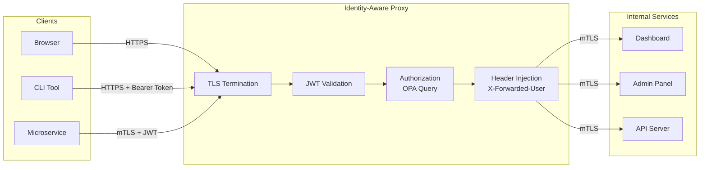
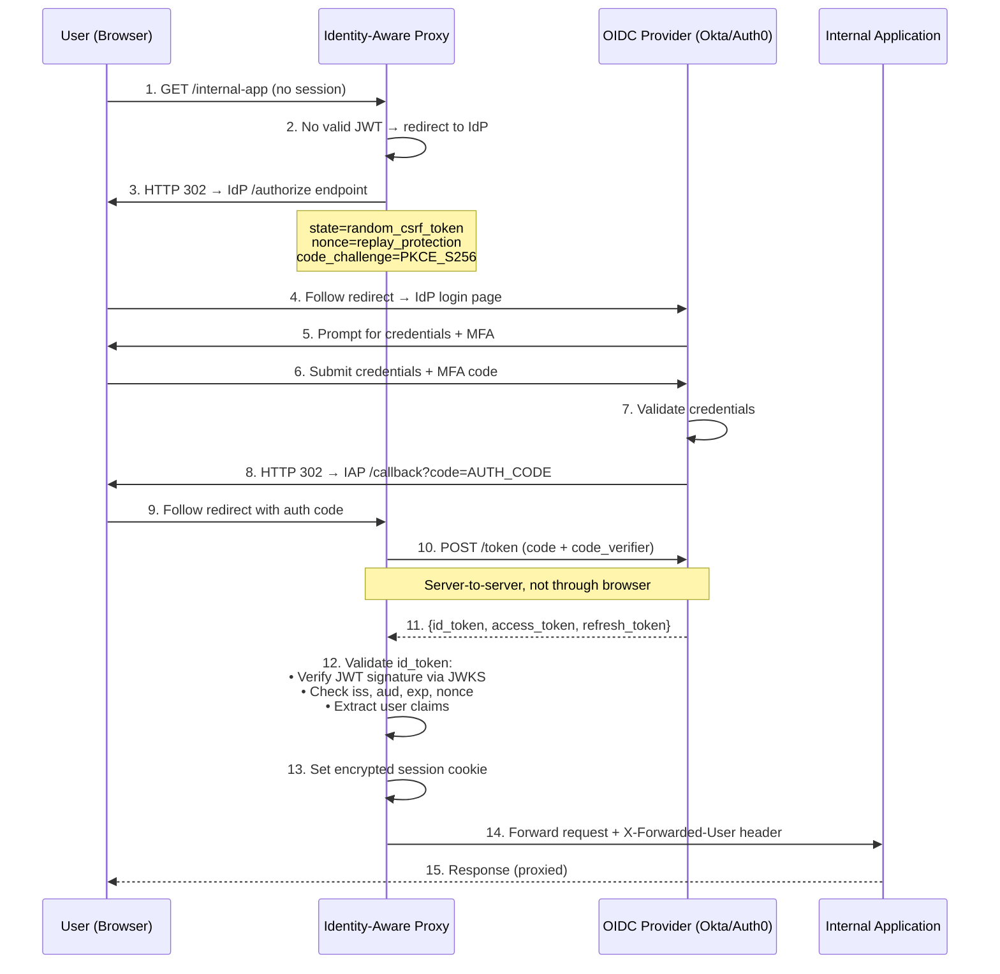
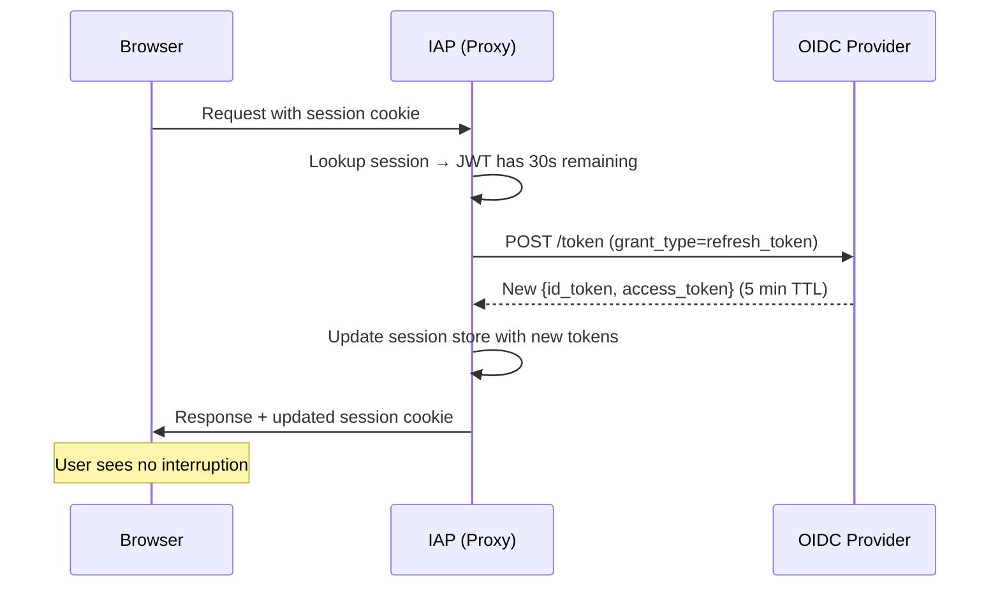
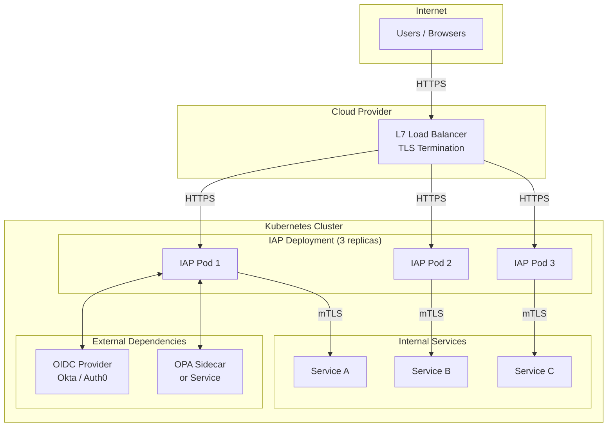

# Chapter 2: The Identity-Aware Proxy (IAP) 🟡

> **The Problem:** In a zero-trust architecture, there is no VPN to "let users in." Instead, every request to every internal application passes through a single enforcement point — the **Identity-Aware Proxy (IAP)**. This proxy must authenticate the user (via OIDC), validate a short-lived JWT, query a policy engine for authorization, and forward the request upstream — all in under 2ms of added latency. Building this incorrectly is worse than having no proxy at all: a broken IAP is a single point of total compromise.

---

## 2.1 What Is an Identity-Aware Proxy?

An Identity-Aware Proxy is a **reverse proxy** that sits in front of every internal application and makes access decisions based on **identity, not network location**.

Unlike a traditional reverse proxy (Nginx, HAProxy) that routes based on Host headers and URL paths, an IAP:

1. **Authenticates** every request (who are you?)
2. **Authorizes** every request (are you allowed to access *this* resource, *right now*, from *this device*?)
3. **Injects identity context** into the upstream request (so the backend knows who the caller is without re-authenticating)
4. **Terminates TLS** and re-establishes mTLS to the upstream (Ch 3)



### IAP vs. API Gateway vs. Service Mesh

| Feature | API Gateway (Kong, Apigee) | Service Mesh (Istio) | Identity-Aware Proxy |
|---|---|---|---|
| Primary purpose | Rate limiting, API management | Service-to-service traffic | Per-request identity + device authz |
| Authentication | API keys, OAuth tokens | mTLS (service identity) | OIDC + JWT (human identity) + mTLS |
| Authorization | Coarse (rate limits, API plans) | Basic RBAC | Fine-grained: user × device × resource × context |
| Device posture | ❌ Not supported | ❌ Not supported | ✅ Real-time device health checks |
| North-south traffic | ✅ Primary focus | 🟡 Via ingress gateway | ✅ Primary focus |
| East-west traffic | ❌ Not designed for this | ✅ Primary focus | ✅ Via mTLS + eBPF (Ch 3, 5) |
| User identity propagation | Limited | ❌ Service-level only | ✅ End-to-end user context |

---

## 2.2 OpenID Connect (OIDC) — The Authentication Foundation

Our proxy authenticates users via **OpenID Connect (OIDC)**, an identity layer built on top of OAuth 2.0. OIDC provides:

- A standard way to authenticate users and receive **ID Tokens** (JWTs)
- A **discovery protocol** (`.well-known/openid-configuration`) so the proxy can auto-configure itself
- **JWKS (JSON Web Key Sets)** for token signature verification without shared secrets

### The OIDC Authorization Code Flow



### Security-Critical Details

| Parameter | Purpose | Attack Prevented |
|---|---|---|
| `state` | CSRF protection token (random, per-request) | Cross-site request forgery on callback |
| `nonce` | Binds the ID token to the specific authentication request | Token replay attacks |
| `code_challenge` / `code_verifier` (PKCE) | Proves the caller who received the code is the same who requested it | Authorization code interception |
| `id_token` signature verification | Validates the token was issued by the real IdP | Token forgery / IdP impersonation |
| Short-lived tokens (5 min) | Limits window of exploitation for stolen tokens | Token theft |

---

## 2.3 Building the Proxy — Axum + Tower Middleware

Our IAP is built with **Axum** (HTTP framework) and **Tower** (middleware). The proxy is structured as a pipeline of middleware layers:

```
Request → TLS Termination → JWT Extraction → Signature Verification →
Claims Validation → OPA Authorization → Header Injection → Upstream Proxy
```

### Project Structure

```
zero-trust-proxy/
├── Cargo.toml
├── src/
│   ├── main.rs              # Server bootstrap
│   ├── config.rs             # OIDC discovery + JWKS config
│   ├── middleware/
│   │   ├── mod.rs
│   │   ├── jwt_auth.rs       # JWT extraction + validation
│   │   ├── opa_authz.rs      # Policy engine query
│   │   └── identity_header.rs # X-Forwarded-User injection
│   ├── oidc/
│   │   ├── mod.rs
│   │   ├── discovery.rs      # .well-known/openid-configuration
│   │   ├── jwks.rs           # JWKS key rotation
│   │   └── callback.rs       # Authorization code exchange
│   └── proxy/
│       ├── mod.rs
│       └── upstream.rs       # Reverse proxy to backend
```

### The OIDC Discovery Client

The first thing our proxy does at startup is discover the IdP's configuration. This is a single HTTP GET to a well-known URL:

```rust,no_run,noplayground
use serde::Deserialize;
use url::Url;

#[derive(Debug, Deserialize)]
pub struct OidcDiscovery {
    pub issuer: String,
    pub authorization_endpoint: String,
    pub token_endpoint: String,
    pub jwks_uri: String,
    pub userinfo_endpoint: String,
    pub supported_scopes: Option<Vec<String>>,
}

/// Discovers OIDC provider configuration from the well-known endpoint.
/// The `issuer_url` should be the base URL of the IdP 
/// (e.g., "https://corp.okta.com").
pub async fn discover(issuer_url: &Url) -> Result<OidcDiscovery, OidcError> {
    let well_known = issuer_url
        .join(".well-known/openid-configuration")
        .map_err(|_| OidcError::InvalidIssuerUrl)?;

    let client = reqwest::Client::builder()
        .timeout(std::time::Duration::from_secs(10))
        .build()?;

    let discovery: OidcDiscovery = client
        .get(well_known.as_str())
        .send()
        .await?
        .error_for_status()?
        .json()
        .await?;

    // CRITICAL: Verify the discovered issuer matches what we expected.
    // Without this check, a MITM could redirect us to a rogue IdP.
    if discovery.issuer != issuer_url.as_str().trim_end_matches('/') {
        return Err(OidcError::IssuerMismatch {
            expected: issuer_url.to_string(),
            got: discovery.issuer,
        });
    }

    Ok(discovery)
}
```

> ⚠️ **Security note:** The issuer mismatch check on the last lines is **not optional**. Without it, an attacker who can MITM the discovery request could point the proxy at a malicious IdP, issuing tokens that the proxy would accept as legitimate. This is a real CVE class (e.g., CVE-2023-36665 in `protobufjs` was a similar "trust without verification" bug).

### JWKS Fetching and Key Rotation

The proxy must fetch the IdP's public keys (JWKS) to verify JWT signatures. Keys rotate periodically, so we cache them and refresh on cache miss:

```rust,no_run,noplayground
use jsonwebtoken::jwk::{JwkSet, Jwk};
use std::sync::Arc;
use tokio::sync::RwLock;

pub struct JwksCache {
    jwks_uri: String,
    client: reqwest::Client,
    cache: Arc<RwLock<JwkSet>>,
}

impl JwksCache {
    pub async fn new(jwks_uri: String) -> Result<Self, OidcError> {
        let client = reqwest::Client::builder()
            .timeout(std::time::Duration::from_secs(10))
            .build()?;

        let jwks: JwkSet = client
            .get(&jwks_uri)
            .send()
            .await?
            .error_for_status()?
            .json()
            .await?;

        Ok(Self {
            jwks_uri,
            client,
            cache: Arc::new(RwLock::new(jwks)),
        })
    }

    /// Look up a key by Key ID (`kid`). If not found, refresh from the IdP.
    pub async fn get_key(&self, kid: &str) -> Result<Jwk, OidcError> {
        // Fast path: key in cache
        {
            let jwks = self.cache.read().await;
            if let Some(key) = jwks.keys.iter().find(|k| {
                k.common.key_id.as_deref() == Some(kid)
            }) {
                return Ok(key.clone());
            }
        }

        // Slow path: key rotated, re-fetch JWKS
        let new_jwks: JwkSet = self.client
            .get(&self.jwks_uri)
            .send()
            .await?
            .error_for_status()?
            .json()
            .await?;

        let mut cache = self.cache.write().await;
        *cache = new_jwks;

        cache.keys.iter()
            .find(|k| k.common.key_id.as_deref() == Some(kid))
            .cloned()
            .ok_or(OidcError::UnknownKeyId(kid.to_string()))
    }
}
```

---

## 2.4 JWT Validation — The Core Security Gate

JWT validation is the most security-critical code in the entire proxy. A single bug here — accepting expired tokens, skipping signature verification, accepting `alg: none` — gives attackers a skeleton key to the entire infrastructure.

### The JWT Structure

A JWT has three base64url-encoded parts separated by dots:

```
eyJhbGciOiJSUzI1NiIsInR5cCI6IkpXVCIsImtpZCI6InRlc3Qta2V5LTEifQ.
eyJpc3MiOiJodHRwczovL2NvcnAub2t0YS5jb20iLCJzdWIiOiJhbGljZUBjb3JwLmNvbSJ9.
<signature>
```

| Part | Contains | We Validate |
|---|---|---|
| **Header** | `alg` (algorithm), `kid` (key ID), `typ` | `alg` must be RS256/ES256 (NEVER `none`) |
| **Payload** | `iss`, `sub`, `aud`, `exp`, `iat`, `nonce` + custom claims | Every field. See checklist below |
| **Signature** | HMAC/RSA/ECDSA over `header.payload` | Verify with IdP's public key from JWKS |

### The Validation Middleware

```rust,no_run,noplayground
use axum::{
    extract::State,
    http::{Request, StatusCode, header},
    middleware::Next,
    response::Response,
};
use jsonwebtoken::{decode, decode_header, Algorithm, DecodingKey, Validation};
use serde::{Deserialize, Serialize};

/// Claims we expect in the ID token from the OIDC provider.
#[derive(Debug, Serialize, Deserialize)]
pub struct IdTokenClaims {
    pub iss: String,            // Issuer (must match our IdP)
    pub sub: String,            // Subject (user identifier)
    pub aud: StringOrVec,       // Audience (must include our client_id)
    pub exp: u64,               // Expiration timestamp
    pub iat: u64,               // Issued-at timestamp
    pub nonce: Option<String>,  // Replay protection
    pub email: Option<String>,
    pub groups: Option<Vec<String>>,
    pub device_id: Option<String>,
}

/// The JWT authentication middleware. Runs on EVERY request.
pub async fn jwt_auth_middleware(
    State(state): State<AppState>,
    mut request: Request<axum::body::Body>,
    next: Next,
) -> Result<Response, StatusCode> {
    // 1. Extract the Bearer token from the Authorization header
    let token = request
        .headers()
        .get(header::AUTHORIZATION)
        .and_then(|v| v.to_str().ok())
        .and_then(|v| v.strip_prefix("Bearer "))
        .ok_or(StatusCode::UNAUTHORIZED)?;

    // 2. Decode the header WITHOUT verifying the signature yet
    //    (we need the `kid` to look up the right public key)
    let header = decode_header(token)
        .map_err(|_| StatusCode::UNAUTHORIZED)?;

    // 3. CRITICAL: Reject unsupported algorithms.
    //    The `alg: none` attack allows forged tokens with no signature.
    let allowed_algorithms = [Algorithm::RS256, Algorithm::ES256];
    if !allowed_algorithms.contains(&header.alg) {
        tracing::warn!(
            algorithm = ?header.alg,
            "Rejected JWT with disallowed algorithm"
        );
        return Err(StatusCode::UNAUTHORIZED);
    }

    // 4. Look up the signing key by Key ID
    let kid = header.kid
        .as_deref()
        .ok_or(StatusCode::UNAUTHORIZED)?;
    let jwk = state.jwks_cache
        .get_key(kid)
        .await
        .map_err(|_| StatusCode::UNAUTHORIZED)?;
    let decoding_key = DecodingKey::from_jwk(&jwk)
        .map_err(|_| StatusCode::UNAUTHORIZED)?;

    // 5. Build strict validation parameters
    let mut validation = Validation::new(header.alg);
    validation.set_issuer(&[&state.config.issuer]);
    validation.set_audience(&[&state.config.client_id]);
    validation.set_required_spec_claims(
        &["iss", "sub", "aud", "exp", "iat"]
    );
    // Reject tokens more than 5 minutes old
    validation.leeway = 30; // 30 seconds clock skew tolerance

    // 6. Verify signature AND validate all claims in one step
    let token_data = decode::<IdTokenClaims>(token, &decoding_key, &validation)
        .map_err(|e| {
            tracing::warn!(error = %e, "JWT validation failed");
            StatusCode::UNAUTHORIZED
        })?;

    // 7. Inject validated identity into request extensions
    //    for downstream middleware and handlers
    request.extensions_mut().insert(token_data.claims);

    Ok(next.run(request).await)
}
```

### JWT Validation Checklist

Every single check below is **mandatory**. Skipping any one creates a critical vulnerability:

| # | Check | Vulnerability if Skipped |
|---|---|---|
| 1 | Verify `alg` is in allowlist (RS256, ES256) | `alg: none` attack → unsigned tokens accepted |
| 2 | Verify signature against IdP's public key | Token forgery → any attacker can create valid tokens |
| 3 | Verify `iss` matches expected issuer | Rogue IdP → attacker's IdP tokens accepted |
| 4 | Verify `aud` contains our `client_id` | Token confusion → token from another app accepted |
| 5 | Verify `exp` (expiration) | Expired tokens used indefinitely |
| 6 | Verify `iat` (issued at) is recent | Pre-issued tokens accepted |
| 7 | Verify `nonce` (if using auth code flow) | Token replay attacks |
| 8 | Reject tokens with `kid` not in JWKS | Key confusion attacks |

---

## 2.5 Authorization — From Identity to Access Decision

Authentication tells us *who* the user is. Authorization tells us *what they can access*. Our proxy delegates authorization to **Open Policy Agent (OPA)**, which we cover in depth in Chapter 4. Here we show the integration point:

```rust,no_run,noplayground
use serde::{Deserialize, Serialize};

#[derive(Serialize)]
struct OpaInput<'a> {
    user: &'a str,
    groups: &'a [String],
    resource: &'a str,
    method: &'a str,
    device_posture: &'a DevicePosture,
    timestamp: u64,
    source_ip: &'a str,
}

#[derive(Deserialize)]
struct OpaResult {
    result: OpaDecision,
}

#[derive(Deserialize)]
struct OpaDecision {
    allow: bool,
    reason: Option<String>,
}

/// Query OPA for an authorization decision. Returns true if allowed.
pub async fn check_authorization(
    opa_url: &str,
    input: &OpaInput<'_>,
) -> Result<bool, AuthzError> {
    let client = reqwest::Client::new();

    let response: OpaResult = client
        .post(format!("{}/v1/data/zerotrust/authz", opa_url))
        .json(&serde_json::json!({ "input": input }))
        .timeout(std::time::Duration::from_millis(50)) // 50ms hard timeout
        .send()
        .await?
        .error_for_status()?
        .json()
        .await?;

    Ok(response.result.allow)
}
```

### Fail-Closed vs. Fail-Open

> **Critical design decision:** If OPA is unreachable, does the proxy **allow** (fail-open) or **deny** (fail-closed)?

| Strategy | Behavior | Risk |
|---|---|---|
| **Fail-open** | OPA down → allow all requests | Attacker can DoS the OPA server to bypass authorization |
| **Fail-closed** ✅ | OPA down → deny all requests | Availability impact, but no security compromise |
| **Cached decision** | OPA down → use last-known decision for this user+resource | Bounded risk (cache TTL), good availability |

Our proxy uses **fail-closed with cached fallback**: if OPA is unreachable, we use a cached decision (if one exists and is < 60 seconds old). Otherwise, we deny.

---

## 2.6 Identity Header Injection

After authentication and authorization succeed, the proxy injects identity information into HTTP headers so the upstream service knows who the caller is — without needing to re-validate the JWT:

```rust,no_run,noplayground
use axum::{
    http::{Request, HeaderValue},
    middleware::Next,
    response::Response,
};

pub async fn inject_identity_headers(
    mut request: Request<axum::body::Body>,
    next: Next,
) -> Response {
    if let Some(claims) = request.extensions().get::<IdTokenClaims>() {
        let headers = request.headers_mut();

        // Remove any client-supplied identity headers to prevent spoofing
        headers.remove("x-forwarded-user");
        headers.remove("x-forwarded-email");
        headers.remove("x-forwarded-groups");

        // Inject validated identity
        if let Ok(val) = HeaderValue::from_str(&claims.sub) {
            headers.insert("x-forwarded-user", val);
        }
        if let Some(email) = &claims.email {
            if let Ok(val) = HeaderValue::from_str(email) {
                headers.insert("x-forwarded-email", val);
            }
        }
        if let Some(groups) = &claims.groups {
            let joined = groups.join(",");
            if let Ok(val) = HeaderValue::from_str(&joined) {
                headers.insert("x-forwarded-groups", val);
            }
        }
    }

    next.run(request).await
}
```

> ⚠️ **Security note:** The `headers.remove()` calls at the top are **critical**. Without them, an attacker could inject `X-Forwarded-User: admin@corp.com` in their request, and if the proxy passes it through to the backend, the backend would trust the spoofed identity. The proxy must **always strip and re-inject** these headers.

---

## 2.7 Session Management and Token Refresh

For browser-based access, the proxy manages sessions using encrypted HTTP-only cookies rather than passing raw JWTs:

```rust,no_run,noplayground
use axum_extra::extract::cookie::{Cookie, SameSite};

/// Create a secure session cookie after successful OIDC callback.
fn create_session_cookie(session_id: &str) -> Cookie<'static> {
    Cookie::build(("__zt_session", session_id.to_string()))
        .http_only(true)     // Not accessible via JavaScript (XSS protection)
        .secure(true)        // Only sent over HTTPS
        .same_site(SameSite::Strict) // CSRF protection
        .path("/")
        .max_age(time::Duration::minutes(5)) // Match JWT lifetime
        .build()
}
```

### Token Refresh Flow

When the session cookie's associated JWT is nearing expiration, the proxy transparently refreshes it using the stored refresh token:



---

## 2.8 The Complete Middleware Stack

Assembling all the pieces into the Axum router:

```rust,no_run,noplayground
use axum::{Router, middleware};
use tower::ServiceBuilder;

pub fn build_router(state: AppState) -> Router {
    let protected = Router::new()
        .fallback(proxy_handler) // Reverse proxy to upstream
        .layer(
            ServiceBuilder::new()
                // Layers execute bottom-to-top (outermost first)
                .layer(middleware::from_fn_with_state(
                    state.clone(),
                    jwt_auth_middleware,
                ))
                .layer(middleware::from_fn_with_state(
                    state.clone(),
                    opa_authz_middleware,
                ))
                .layer(middleware::from_fn(inject_identity_headers))
        );

    let public = Router::new()
        .route("/healthz", axum::routing::get(health_check))
        .route("/auth/callback", axum::routing::get(oidc_callback))
        .route("/.well-known/ready", axum::routing::get(readiness));

    Router::new()
        .merge(public)
        .merge(protected)
        .with_state(state)
}
```

---

## 2.9 Deployment Topology

The IAP runs as a Kubernetes `DaemonSet` or `Deployment` behind a cloud load balancer:



### Scaling Considerations

| Concern | Solution |
|---|---|
| Proxy is a bottleneck | Horizontally scale IAP pods; stateless design (sessions in Redis or encrypted cookies) |
| JWKS refresh storms | Cache JWKS with background refresh (every 5 min), not per-request |
| OPA latency | Run OPA as a sidecar (localhost), not a remote service |
| Session stickiness | Not needed — encrypted cookie is self-contained |
| DDoS on the proxy | Cloud WAF + rate limiting at the LB layer, before traffic hits IAP |

---

> **Key Takeaways**
>
> 1. **The IAP is the single enforcement point** for all access to internal resources. It replaces VPN login, firewall rules, and ad-hoc authentication in individual services.
> 2. **OIDC + PKCE** provides the authentication foundation. The authorization code flow with PKCE protects against code interception even on public clients.
> 3. **JWT validation is the security-critical hot path.** Every check in the validation checklist is mandatory — `alg: none` rejection, issuer verification, audience verification, expiration, and signature verification.
> 4. **Fail-closed authorization:** If the policy engine is unreachable, deny by default. Never fail-open on authorization decisions.
> 5. **Strip and re-inject identity headers.** Never trust client-supplied `X-Forwarded-User` headers. The proxy is the sole authority for identity assertion.
> 6. **Stateless design enables horizontal scaling.** Sessions stored in encrypted cookies or a shared store (Redis) mean any IAP pod can handle any request.
> 7. **The proxy adds < 2ms of latency** when JWKS keys are cached and OPA runs as a local sidecar.
