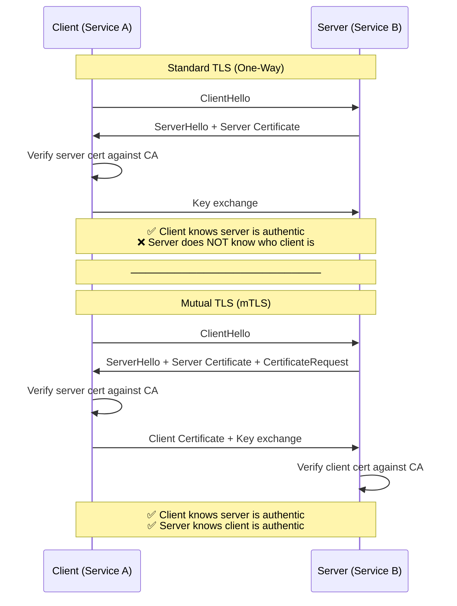
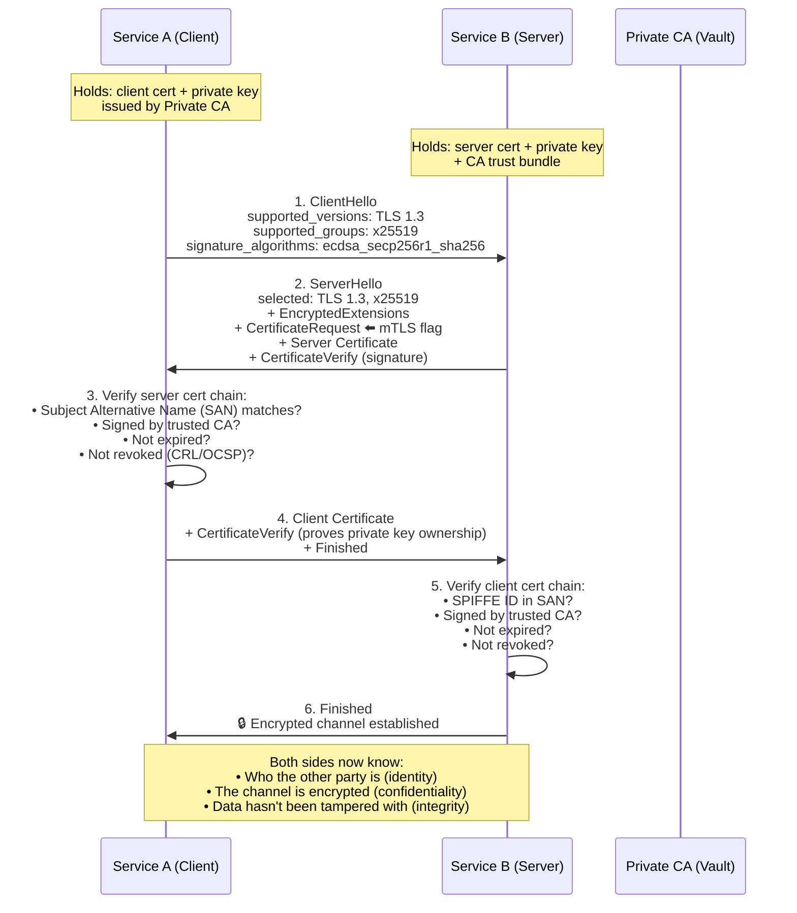
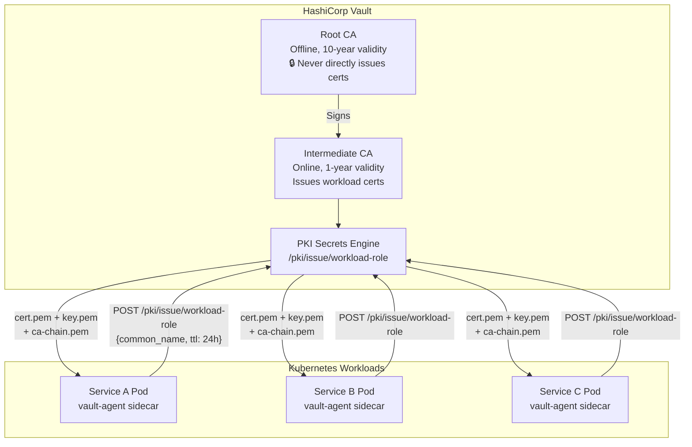
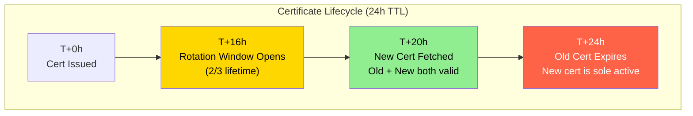
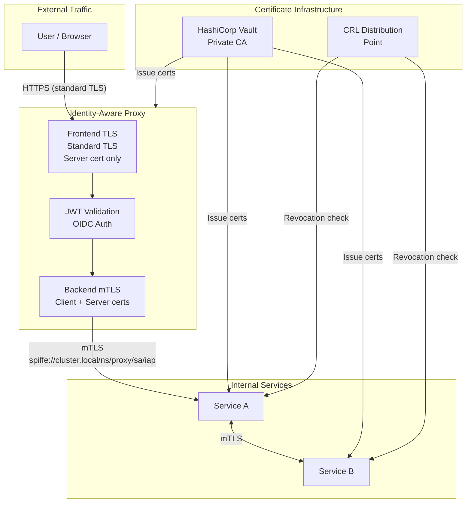

# Chapter 3: Mutual TLS (mTLS) and Certificate Authorities 🔴

> **The Problem:** Chapter 2 secured the north-south path (users → proxy). But what about east-west traffic — the millions of requests that microservices make to each other *inside* the datacenter? In a traditional network, this traffic is plaintext. An attacker who compromises a single pod (or simply taps a network switch) can read every inter-service request: database queries, auth tokens, PII, payment data. mTLS encrypts *every* connection and cryptographically proves the identity of both endpoints — but operating a certificate authority and rotating ephemeral certificates at scale is one of the hardest problems in infrastructure engineering.

---

## 3.1 Why TLS Isn't Enough — The Case for Mutual TLS

Standard TLS (what your browser uses for HTTPS) is **one-way authentication**: the client verifies the server's certificate, but the server doesn't verify the client. This is fine for the public web, where anyone can be a client. But inside a zero-trust architecture, we need **every connection to be mutually authenticated**.

### One-Way TLS vs. Mutual TLS



| Property | One-Way TLS | Mutual TLS |
|---|---|---|
| Server authenticated? | ✅ Yes | ✅ Yes |
| Client authenticated? | ❌ No | ✅ Yes (via x509 cert) |
| Encryption | ✅ Yes | ✅ Yes |
| Identity propagation | None (server doesn't know caller) | Client's SPIFFE ID in cert SAN |
| Use case | Public web (HTTPS) | Service-to-service in zero-trust |

---

## 3.2 The mTLS Handshake — Step by Step

Let's trace the complete TLS 1.3 mutual authentication handshake:



### TLS 1.3 Performance

TLS 1.3 completes the mutual handshake in **1 round trip** (1-RTT), compared to 2 RTTs in TLS 1.2. With session resumption (0-RTT), subsequent connections are even faster:

| Handshake Type | Round Trips | Latency (same datacenter) |
|---|---|---|
| TLS 1.2 mutual | 2 RTT | ~1.0 ms |
| TLS 1.3 mutual | 1 RTT | ~0.5 ms |
| TLS 1.3 resumption (0-RTT) | 0 RTT | ~0.1 ms |

---

## 3.3 Building a Private Certificate Authority with HashiCorp Vault

Public CAs (Let's Encrypt, DigiCert) issue certificates for public domains. For internal services, we need a **private CA** that:

1. Issues certificates to workloads automatically (no human approval)
2. Issues **short-lived certificates** (hours, not years) to limit blast radius
3. Embeds **SPIFFE identities** in certificate SANs for workload identification
4. Supports **automated rotation** without service restarts

**HashiCorp Vault's PKI secrets engine** is purpose-built for this:



### Root CA vs. Intermediate CA

| Property | Root CA | Intermediate CA |
|---|---|---|
| Validity | 10 years | 1 year |
| Storage | Offline (HSM, air-gapped) | Online in Vault |
| Issues certs directly? | ❌ Never | ✅ Yes, to workloads |
| Compromise impact | Entire trust chain broken | Revoke and re-issue intermediate |
| Rotation | Decade cycle | Yearly |

> ⚠️ **Security note:** The root CA private key should **never** be stored on a network-connected machine. In production, it lives in a Hardware Security Module (HSM) or is generated in an air-gapped ceremony and the resulting intermediate is imported into Vault.

### Vault PKI Configuration

```bash
# Enable the PKI secrets engine
vault secrets enable pki

# Generate the root CA (in production, import from HSM)
vault write pki/root/generate/internal \
    common_name="Zero Trust Root CA" \
    ttl=87600h  # 10 years

# Enable the intermediate PKI engine
vault secrets enable -path=pki_int pki

# Generate intermediate CSR
vault write pki_int/intermediate/generate/internal \
    common_name="Zero Trust Intermediate CA" \
    ttl=8760h  # 1 year

# Sign the intermediate with the root
vault write pki/root/sign-intermediate \
    csr=@intermediate.csr \
    ttl=8760h

# Create a role for issuing workload certificates
vault write pki_int/roles/workload \
    allowed_domains="svc.cluster.local" \
    allow_subdomains=true \
    max_ttl=24h \
    key_type="ec" \
    key_bits=256 \
    require_cn=false \
    allowed_uri_sans="spiffe://cluster.local/ns/*/sa/*"
```

---

## 3.4 SPIFFE — Workload Identity Standard

**SPIFFE** (Secure Production Identity Framework for Everyone) provides a standard way to identify workloads. Instead of relying on IP addresses (which change) or hostnames (which can be spoofed), SPIFFE uses **URI-based identifiers** embedded in x509 certificate Subject Alternative Names (SANs):

```
spiffe://cluster.local/ns/payments/sa/payment-service
  │          │              │            │
  scheme     trust domain   namespace   service account
```

### Generating SPIFFE-Enabled Certificates in Rust

```rust,no_run,noplayground
use rcgen::{
    Certificate, CertificateParams, DistinguishedName,
    KeyPair, SanType, IsCa, BasicConstraints,
};
use time::OffsetDateTime;

/// Generate an ephemeral x509 certificate with a SPIFFE identity.
pub fn generate_workload_cert(
    spiffe_id: &str,      // e.g., "spiffe://cluster.local/ns/api/sa/frontend"
    ca_cert: &Certificate,
    ttl_hours: u64,
) -> Result<(String, String), CertError> {
    let mut params = CertificateParams::default();

    // No CN needed — identity is in the SAN
    params.distinguished_name = DistinguishedName::new();

    // Embed the SPIFFE identity as a URI SAN
    params.subject_alt_names = vec![
        SanType::URI(spiffe_id.to_string()),
    ];

    // Short-lived: 24 hours (not years!)
    let now = OffsetDateTime::now_utc();
    params.not_before = now;
    params.not_after = now + time::Duration::hours(ttl_hours as i64);

    // Use ECDSA P-256 (fast, small certs)
    let key_pair = KeyPair::generate_for(
        &rcgen::PKCS_ECDSA_P256_SHA256,
    )?;
    params.key_pair = Some(key_pair);

    // This is NOT a CA cert — it cannot sign other certs
    params.is_ca = IsCa::NoCa;

    // Generate and sign with the CA
    let cert = params.self_signed(ca_cert)?;

    Ok((cert.pem(), cert.key_pair().serialize_pem()))
}
```

---

## 3.5 Configuring rustls for mTLS

**rustls** is a memory-safe TLS library written in pure Rust. Unlike OpenSSL (which has a long history of CVEs — Heartbleed, etc.), rustls is built from the ground up with safety guarantees.

### Server-Side mTLS Configuration

```rust,no_run,noplayground
use rustls::{
    ServerConfig, RootCertStore,
    pki_types::{CertificateDer, PrivateKeyDer},
    server::WebPkiClientVerifier,
};
use std::sync::Arc;

/// Build a rustls ServerConfig that requires client certificates.
pub fn build_mtls_server_config(
    server_cert_chain: Vec<CertificateDer<'static>>,
    server_key: PrivateKeyDer<'static>,
    ca_certs: Vec<CertificateDer<'static>>,
) -> Result<ServerConfig, TlsError> {
    // 1. Build the trust store from our private CA's certificate chain
    let mut root_store = RootCertStore::empty();
    for ca_cert in ca_certs {
        root_store.add(ca_cert)?;
    }

    // 2. Create a client verifier that REQUIRES a valid client cert
    //    signed by our private CA. No anonymous connections allowed.
    let client_verifier = WebPkiClientVerifier::builder(
        Arc::new(root_store),
    )
    .build()?;

    // 3. Assemble the server config
    let config = ServerConfig::builder()
        .with_client_cert_verifier(client_verifier)
        .with_single_cert(server_cert_chain, server_key)?;

    Ok(config)
}
```

### Client-Side mTLS Configuration

```rust,no_run,noplayground
use rustls::{
    ClientConfig, RootCertStore,
    pki_types::{CertificateDer, PrivateKeyDer},
};
use std::sync::Arc;

/// Build a rustls ClientConfig that presents a client certificate.
pub fn build_mtls_client_config(
    client_cert_chain: Vec<CertificateDer<'static>>,
    client_key: PrivateKeyDer<'static>,
    ca_certs: Vec<CertificateDer<'static>>,
) -> Result<ClientConfig, TlsError> {
    // 1. Trust our private CA for server verification
    let mut root_store = RootCertStore::empty();
    for ca_cert in ca_certs {
        root_store.add(ca_cert)?;
    }

    // 2. Configure client cert presentation
    let config = ClientConfig::builder()
        .with_root_certificates(root_store)
        .with_client_auth_cert(client_cert_chain, client_key)?;

    Ok(config)
}
```

---

## 3.6 Certificate Rotation Without Downtime

Certificates expire. Our workload certs have a 24-hour TTL, so we need to rotate them automatically — without restarting the service or dropping connections.

### The Rotation Strategy



### Hot-Reloading Certificates in Rust

The key insight is a **certificate resolver** — a callback that rustls invokes on every new TLS connection to get the current certificate. By swapping the certificate behind an `Arc<RwLock>`, we rotate without dropping existing connections:

```rust,no_run,noplayground
use rustls::server::{ClientHello, ResolvesServerCert};
use rustls::sign::CertifiedKey;
use std::sync::{Arc, RwLock};

/// A certificate resolver that supports hot-reloading.
/// Existing connections continue using the old cert;
/// new connections use the freshly rotated cert.
pub struct ReloadableCertResolver {
    current: Arc<RwLock<Arc<CertifiedKey>>>,
}

impl ReloadableCertResolver {
    pub fn new(initial: Arc<CertifiedKey>) -> Self {
        Self {
            current: Arc::new(RwLock::new(initial)),
        }
    }

    /// Atomically swap in a new certificate.
    /// Called by the background rotation task.
    pub fn update(&self, new_cert: Arc<CertifiedKey>) {
        let mut current = self.current.write()
            .expect("cert lock poisoned");
        *current = new_cert;
        tracing::info!("TLS certificate rotated successfully");
    }
}

impl ResolvesServerCert for ReloadableCertResolver {
    fn resolve(&self, _client_hello: ClientHello) -> Option<Arc<CertifiedKey>> {
        let current = self.current.read()
            .expect("cert lock poisoned");
        Some(Arc::clone(&current))
    }
}
```

### Background Rotation Task

```rust,no_run,noplayground
use tokio::time::{interval, Duration};

/// Periodically fetch a new certificate from Vault before the
/// current one expires. Runs as a background Tokio task.
pub async fn certificate_rotation_loop(
    resolver: Arc<ReloadableCertResolver>,
    vault_client: VaultClient,
    spiffe_id: String,
) {
    // Rotate at 2/3 of the certificate lifetime (24h → every 16h)
    let mut tick = interval(Duration::from_secs(16 * 3600));

    loop {
        tick.tick().await;

        match vault_client.issue_cert(&spiffe_id, 24).await {
            Ok((cert_chain, key)) => {
                let certified_key = build_certified_key(cert_chain, key);
                resolver.update(Arc::new(certified_key));
            }
            Err(e) => {
                // Don't panic — the current cert is still valid.
                // Alert and retry on next tick.
                tracing::error!(
                    error = %e,
                    "Failed to rotate certificate — retrying in 16h"
                );
                metrics::counter!("cert_rotation_failures").increment(1);
            }
        }
    }
}
```

---

## 3.7 Certificate Revocation

What happens when a service is compromised and we need to immediately revoke its certificate — even if it hasn't expired yet?

| Method | Latency | Tradeoff |
|---|---|---|
| **Short-lived certs (24h)** | Wait up to 24h | Simplest; compromise window = TTL |
| **CRL (Certificate Revocation List)** | Minutes (stale by design) | Clients must fetch and cache CRL periodically |
| **OCSP (Online Certificate Status Protocol)** | Real-time per-connection | Adds a network round-trip; OCSP responder is an availability dependency |
| **OCSP Stapling** | Real-time, no extra round-trip | Server fetches OCSP response and sends it during TLS handshake |

**Our approach:** Short-lived certs (24h) as the primary defense, with CRL distribution for emergency revocation (compromised key must not wait 24h):

```rust,no_run,noplayground
use x509_parser::prelude::*;

/// Check if a peer's certificate appears in the CRL.
pub fn is_certificate_revoked(
    cert_der: &[u8],
    crl_der: &[u8],
) -> Result<bool, CertError> {
    let (_, cert) = X509Certificate::from_der(cert_der)
        .map_err(|_| CertError::ParseFailure)?;
    let (_, crl) = CertificateRevocationList::from_der(crl_der)
        .map_err(|_| CertError::CrlParseFailure)?;

    let serial = cert.tbs_certificate.serial.clone();

    let revoked = crl.iter_revoked_certificates()
        .any(|entry| entry.user_certificate == serial);

    Ok(revoked)
}
```

---

## 3.8 mTLS in the IAP — Putting It All Together

Here's how mTLS integrates with the Identity-Aware Proxy from Chapter 2:



The IAP has **two TLS configurations**:

| Direction | TLS Type | Certificate | Purpose |
|---|---|---|---|
| **Frontend** (user → proxy) | Standard TLS | Public CA cert (Let's Encrypt) | Users' browsers need to trust it |
| **Backend** (proxy → services) | Mutual TLS | Private CA cert (Vault) | Proves proxy identity to internal services |

---

## 3.9 Observability and Debugging mTLS

mTLS failures are notoriously hard to debug. Common failure modes and how to diagnose them:

| Failure | Symptom | Diagnosis | Fix |
|---|---|---|---|
| Client cert not presented | `SSL_ERROR_HANDSHAKE_FAILURE` | Server expects client cert; client didn't send one | Configure client cert in `ClientConfig` |
| CA mismatch | `CERTIFICATE_UNKNOWN` | Client cert signed by CA not in server's trust store | Add CA cert to server's `RootCertStore` |
| Expired certificate | `CERTIFICATE_EXPIRED` | Rotation failed or clock skew | Check rotation logs; sync NTP |
| Wrong SAN | Connection succeeds but identity check fails | SPIFFE ID in SAN doesn't match expected identity | Re-issue cert with correct SAN |
| Revoked certificate | Connection rejected after CRL update | Certificate serial in CRL | Re-issue certificate from Vault |

### Logging TLS Events

```rust,no_run,noplayground
use rustls::server::ClientHello;
use tracing::{info, warn};

/// Log mTLS connection details for debugging and audit.
pub fn log_mtls_connection(
    client_hello: &ClientHello,
    peer_cert: Option<&[u8]>,
) {
    match peer_cert {
        Some(cert_der) => {
            if let Ok((_, cert)) = x509_parser::parse_x509_certificate(cert_der) {
                let spiffe_id = cert
                    .subject_alternative_name()
                    .and_then(|san| san.ok())
                    .and_then(|san| {
                        san.value.general_names.iter().find_map(|name| {
                            if let x509_parser::extensions::GeneralName::URI(uri) = name {
                                if uri.starts_with("spiffe://") {
                                    return Some(uri.to_string());
                                }
                            }
                            None
                        })
                    });

                let not_after = cert.validity().not_after;

                info!(
                    spiffe_id = ?spiffe_id,
                    serial = %cert.tbs_certificate.serial,
                    not_after = %not_after,
                    "mTLS connection established"
                );
            }
        }
        None => {
            warn!("TLS connection without client certificate");
        }
    }
}
```

---

> **Key Takeaways**
>
> 1. **Standard TLS is insufficient for zero trust.** One-way TLS verifies the server but not the client. mTLS ensures both parties prove their identity cryptographically.
> 2. **A private CA is mandatory.** Use HashiCorp Vault's PKI engine (or equivalent) to issue ephemeral x509 certificates to workloads. Never share long-lived certificates.
> 3. **Short-lived certificates (24h TTL) are the primary revocation mechanism.** Even if an attacker steals a certificate, it expires in hours — not years.
> 4. **SPIFFE identities replace IP-based trust.** A workload's identity is cryptographic (`spiffe://cluster.local/ns/api/sa/frontend`), not a mutable network property.
> 5. **rustls eliminates TLS library CVEs.** Unlike OpenSSL, rustls is memory-safe by construction. Heartbleed-class bugs are structurally impossible.
> 6. **Hot-reload certificates without downtime.** Use a `ResolvesServerCert` implementation backed by `Arc<RwLock<CertifiedKey>>` to swap certs on every new connection.
> 7. **The Root CA must be offline.** Store the root key in an HSM or air-gapped system. Only the intermediate CA (with a 1-year lifetime) should be online in Vault.
