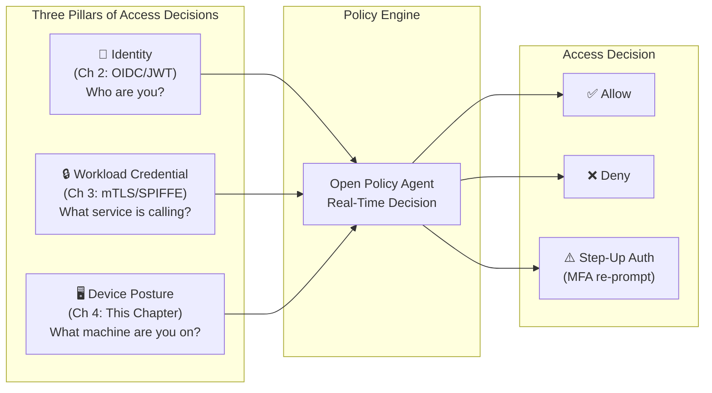
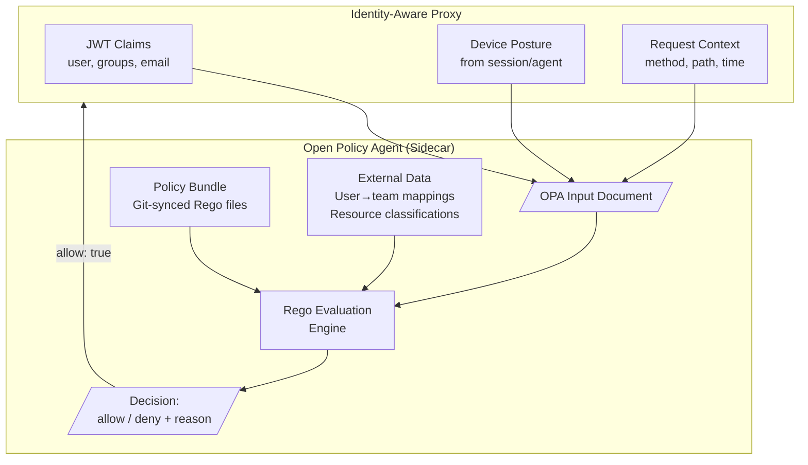
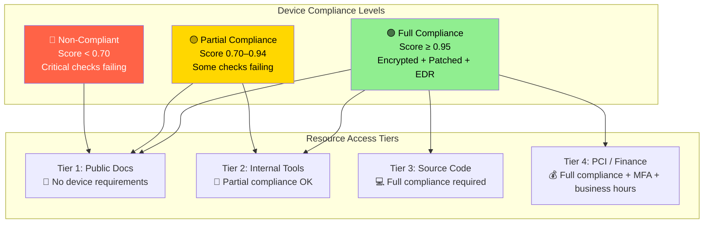
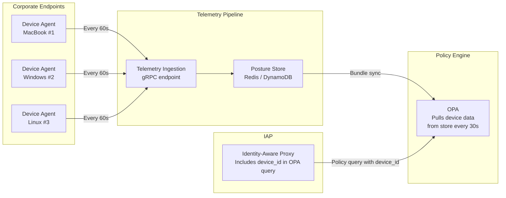

# Chapter 4: Device Posture and Context Engine 🔴

> **The Problem:** Chapters 2 and 3 answer two questions: *who is this user?* (OIDC/JWT) and *who is this service?* (mTLS/SPIFFE). But identity alone isn't enough. A legitimate user authenticating from a compromised laptop — one with disabled disk encryption, a 6-month-old OS, and no endpoint detection — is arguably *more* dangerous than an anonymous attacker, because they have valid credentials. Zero trust demands a third signal: **device posture**. Every request must be evaluated not just against who is asking, but what device they are asking *from* and what the current risk context *is*.

---

## 4.1 The Three Pillars of Zero-Trust Decisions



| Pillar | Signal | Example | Chapter |
|---|---|---|---|
| **Identity** | User authentication | `alice@corp.com`, groups: `[engineering, admin]` | Ch 2 |
| **Workload credential** | Service authentication | `spiffe://cluster.local/ns/api/sa/frontend` | Ch 3 |
| **Device posture** | Endpoint health | Disk encrypted, OS patched, EDR active | Ch 4 |

**Only when all three pillars are satisfied does the request proceed.**

---

## 4.2 What Is Device Posture?

Device posture is a real-time assessment of the requesting device's security health. It answers: "Is this device safe enough to access this resource right now?"

### Posture Signals

| Signal | What We Check | Why It Matters | How to Collect |
|---|---|---|---|
| **Disk encryption** | FileVault (macOS), BitLocker (Windows), LUKS (Linux) | Lost/stolen laptop → data at rest protected | OS-specific APIs |
| **OS version / patch level** | Kernel version, last security update date | Known CVEs in unpatched OS → exploitable endpoint | `uname`, registry keys |
| **EDR presence** | CrowdStrike, Sentinel, Defender running? | No EDR → no visibility into malware/lateral movement | Process enumeration |
| **Firewall status** | Host firewall enabled? | Disabled firewall → open to network attacks | OS firewall APIs |
| **Screen lock** | Auto-lock timeout ≤ 5 minutes? | Unlocked, unattended device → physical access risk | OS security settings |
| **Jailbreak / root** | Device integrity (iOS/Android) | Rooted device → any app can read keychain | Device attestation |
| **Certificate validity** | Device cert exists and is current | No cert → device not enrolled in MDM | Certificate store check |

### The Device Agent

A lightweight agent runs on every corporate endpoint, collecting posture telemetry and reporting it to the context engine:

```rust,no_run,noplayground
use serde::{Deserialize, Serialize};

/// Device posture report collected by the endpoint agent.
#[derive(Debug, Serialize, Deserialize)]
pub struct DevicePosture {
    pub device_id: String,
    pub timestamp: u64,
    pub os: OsInfo,
    pub disk_encryption: EncryptionStatus,
    pub edr_status: EdrStatus,
    pub firewall_enabled: bool,
    pub screen_lock_seconds: Option<u32>,
    pub compliance_score: f64, // 0.0 (critical) to 1.0 (fully compliant)
}

#[derive(Debug, Serialize, Deserialize)]
pub struct OsInfo {
    pub name: String,            // "macOS", "Windows", "Ubuntu"
    pub version: String,         // "14.3.1"
    pub kernel_version: String,  // "23.3.0"
    pub last_security_patch: String, // "2025-12-01"
    pub days_since_patch: u32,
}

#[derive(Debug, Serialize, Deserialize)]
pub enum EncryptionStatus {
    /// Full disk encryption is enabled and verified.
    Encrypted { method: String }, // "FileVault", "BitLocker", "LUKS"
    /// Disk encryption is not enabled.
    NotEncrypted,
    /// Could not determine encryption status.
    Unknown,
}

#[derive(Debug, Serialize, Deserialize)]
pub enum EdrStatus {
    /// EDR is running and connected to the management console.
    Active { product: String, last_scan: String },
    /// EDR is installed but not running.
    Inactive { product: String },
    /// No EDR product detected.
    NotInstalled,
}
```

### Collecting Posture on macOS

```rust,no_run,noplayground
use std::process::Command;

/// Check if FileVault (full-disk encryption) is enabled on macOS.
pub fn check_filevault() -> EncryptionStatus {
    let output = Command::new("fdesetup")
        .arg("status")
        .output();

    match output {
        Ok(out) => {
            let stdout = String::from_utf8_lossy(&out.stdout);
            if stdout.contains("FileVault is On") {
                EncryptionStatus::Encrypted {
                    method: "FileVault".into(),
                }
            } else {
                EncryptionStatus::NotEncrypted
            }
        }
        Err(_) => EncryptionStatus::Unknown,
    }
}

/// Get the macOS version and last security update.
pub fn check_os_info() -> OsInfo {
    let version_output = Command::new("sw_vers")
        .arg("-productVersion")
        .output()
        .map(|o| String::from_utf8_lossy(&o.stdout).trim().to_string())
        .unwrap_or_default();

    let kernel_output = Command::new("uname")
        .arg("-r")
        .output()
        .map(|o| String::from_utf8_lossy(&o.stdout).trim().to_string())
        .unwrap_or_default();

    OsInfo {
        name: "macOS".into(),
        version: version_output,
        kernel_version: kernel_output,
        last_security_patch: get_last_patch_date(),
        days_since_patch: calculate_days_since_patch(),
    }
}

/// Check if an EDR product is running.
pub fn check_edr() -> EdrStatus {
    // Check for common EDR processes
    let edr_processes = [
        ("CrowdStrike", "falcond"),
        ("SentinelOne", "sentineld"),
        ("Microsoft Defender", "wdavdaemon"),
    ];

    for (product, process_name) in &edr_processes {
        let output = Command::new("pgrep")
            .arg("-x")
            .arg(process_name)
            .output();

        if let Ok(out) = output {
            if out.status.success() {
                return EdrStatus::Active {
                    product: product.to_string(),
                    last_scan: get_last_scan_time(product),
                };
            }
        }
    }

    EdrStatus::NotInstalled
}
```

---

## 4.3 Open Policy Agent (OPA) — The Decision Engine

**Open Policy Agent (OPA)** is a general-purpose policy engine that decouples policy from code. Instead of hardcoding authorization logic in the proxy, we write **declarative policies in Rego** (OPA's policy language) that can be updated, audited, and versioned independently.

### Why OPA?

| Approach | Pros | Cons |
|---|---|---|
| **Hardcoded `if` statements** | Simple, fast | Requires redeployment for policy changes; not auditable |
| **Database-driven ACLs** | Dynamic | Complex queries; no temporal/contextual logic |
| **OPA (Rego policies)** ✅ | Declarative, auditable, composable, testable, < 1ms decisions | Learning curve for Rego language |

### Architecture



### OPA Input Document

Our proxy constructs this JSON document and sends it to OPA on every request:

```json
{
  "input": {
    "user": {
      "sub": "alice@corp.com",
      "email": "alice@corp.com",
      "groups": ["engineering", "oncall-tier1"]
    },
    "device": {
      "device_id": "macbook-a1b2c3",
      "disk_encryption": "encrypted",
      "os_version": "14.3.1",
      "days_since_patch": 3,
      "edr_active": true,
      "firewall_enabled": true,
      "compliance_score": 0.95
    },
    "request": {
      "method": "GET",
      "path": "/api/v1/payments",
      "source_ip": "203.0.113.42",
      "timestamp": 1711929600
    },
    "resource": {
      "name": "payment-service",
      "classification": "pci-restricted",
      "environment": "production"
    }
  }
}
```

---

## 4.4 Writing Rego Policies

Rego is a declarative query language designed for policy. Policies are evaluated as **rules** that produce decisions:

### Base Policy — Resource Access Control

```rego
package zerotrust.authz

import rego.v1

default allow := false
default reason := "access denied by default (fail-closed)"

# ─── Rule 1: Basic identity check ─────────────────────────
allow if {
    identity_verified
    device_compliant
    resource_authorized
}

reason := "identity, device, and resource checks passed" if {
    allow
}

# ─── Identity Verification ────────────────────────────────
identity_verified if {
    # User must be authenticated (non-empty subject)
    count(input.user.sub) > 0
}

# ─── Device Compliance ────────────────────────────────────
device_compliant if {
    input.device.disk_encryption == "encrypted"
    input.device.edr_active == true
    input.device.days_since_patch <= 14
    input.device.compliance_score >= 0.8
}

reason := sprintf("device non-compliant: encryption=%s, edr=%v, patch_age=%d days", [
    input.device.disk_encryption,
    input.device.edr_active,
    input.device.days_since_patch,
]) if {
    not device_compliant
}

# ─── Resource Authorization (RBAC) ────────────────────────
resource_authorized if {
    # Check if any of the user's groups has access to this resource
    some group in input.user.groups
    group_has_access(group, input.resource.name, input.request.method)
}

# Group → Resource → Method mapping
group_has_access(group, resource, method) if {
    permissions := data.rbac[group]
    some permission in permissions
    permission.resource == resource
    permission.methods[_] == method
}
```

### RBAC Data (loaded as OPA external data)

```json
{
  "rbac": {
    "engineering": [
      { "resource": "api-service", "methods": ["GET", "POST"] },
      { "resource": "dashboard", "methods": ["GET"] }
    ],
    "oncall-tier1": [
      { "resource": "payment-service", "methods": ["GET"] },
      { "resource": "api-service", "methods": ["GET", "POST", "DELETE"] }
    ],
    "admin": [
      { "resource": "payment-service", "methods": ["GET", "POST", "DELETE"] },
      { "resource": "admin-panel", "methods": ["GET", "POST"] }
    ]
  }
}
```

### Advanced Policy — Time-Based and Risk-Adaptive

```rego
package zerotrust.authz.advanced

import rego.v1

# ─── PCI-Restricted resources need stricter checks ────────
allow if {
    input.resource.classification == "pci-restricted"
    pci_compliant_device
    pci_authorized_user
    within_business_hours
}

pci_compliant_device if {
    input.device.disk_encryption == "encrypted"
    input.device.edr_active == true
    input.device.firewall_enabled == true
    input.device.days_since_patch <= 7  # Stricter than default
    input.device.compliance_score >= 0.95
}

pci_authorized_user if {
    some group in input.user.groups
    group in {"admin", "oncall-tier1", "pci-auditors"}
}

# Only allow PCI access during business hours (UTC)
within_business_hours if {
    hour := time.clock(time.now_ns())[0]
    hour >= 8
    hour < 20
}

# ─── Step-up authentication for sensitive operations ──────
step_up_required if {
    input.request.method in {"DELETE", "PUT"}
    input.resource.classification == "pci-restricted"
}

# ─── Risk score calculation ───────────────────────────────
risk_score := score if {
    base := 0.0
    patch_risk := max([0, (input.device.days_since_patch - 7) * 0.05])
    edr_risk := 0.3 * (1 - to_number(input.device.edr_active))
    encryption_risk := 0.4 * to_number(input.device.disk_encryption != "encrypted")
    score := base + patch_risk + edr_risk + encryption_risk
}
```

---

## 4.5 Integrating OPA with the Proxy

### The Authorization Middleware

```rust,no_run,noplayground
use axum::{
    extract::State,
    http::{Request, StatusCode, Method},
    middleware::Next,
    response::Response,
};
use serde::{Deserialize, Serialize};

#[derive(Serialize)]
struct OpaRequest<'a> {
    input: OpaInput<'a>,
}

#[derive(Serialize)]
struct OpaInput<'a> {
    user: UserContext<'a>,
    device: &'a DevicePosture,
    request: RequestContext<'a>,
    resource: ResourceContext<'a>,
}

#[derive(Serialize)]
struct UserContext<'a> {
    sub: &'a str,
    email: Option<&'a str>,
    groups: &'a [String],
}

#[derive(Serialize)]
struct RequestContext<'a> {
    method: &'a str,
    path: &'a str,
    source_ip: &'a str,
    timestamp: u64,
}

#[derive(Serialize)]
struct ResourceContext<'a> {
    name: &'a str,
    classification: &'a str,
    environment: &'a str,
}

#[derive(Deserialize)]
struct OpaResponse {
    result: OpaDecision,
}

#[derive(Deserialize)]
struct OpaDecision {
    allow: bool,
    reason: Option<String>,
    step_up_required: Option<bool>,
    risk_score: Option<f64>,
}

pub async fn opa_authz_middleware(
    State(state): State<AppState>,
    request: Request<axum::body::Body>,
    next: Next,
) -> Result<Response, StatusCode> {
    let claims = request.extensions().get::<IdTokenClaims>()
        .ok_or(StatusCode::UNAUTHORIZED)?;

    let device_posture = request.extensions().get::<DevicePosture>()
        .ok_or(StatusCode::FORBIDDEN)?;

    // Resolve the target resource from the request path
    let resource = state.resource_registry
        .resolve(request.uri().path())
        .ok_or(StatusCode::NOT_FOUND)?;

    let source_ip = request
        .headers()
        .get("x-real-ip")
        .and_then(|v| v.to_str().ok())
        .unwrap_or("unknown");

    let opa_input = OpaRequest {
        input: OpaInput {
            user: UserContext {
                sub: &claims.sub,
                email: claims.email.as_deref(),
                groups: claims.groups.as_deref().unwrap_or(&[]),
            },
            device: device_posture,
            request: RequestContext {
                method: request.method().as_str(),
                path: request.uri().path(),
                source_ip,
                timestamp: now_epoch_secs(),
            },
            resource: ResourceContext {
                name: &resource.name,
                classification: &resource.classification,
                environment: &resource.environment,
            },
        },
    };

    // Query OPA with a strict timeout
    let decision = state.opa_client
        .query(&opa_input)
        .await
        .map_err(|e| {
            tracing::error!(error = %e, "OPA query failed — fail-closed");
            StatusCode::FORBIDDEN // Fail-closed
        })?;

    if !decision.allow {
        tracing::warn!(
            user = %claims.sub,
            resource = %resource.name,
            reason = ?decision.reason,
            risk_score = ?decision.risk_score,
            "Access denied by policy engine"
        );
        return Err(StatusCode::FORBIDDEN);
    }

    // Check if step-up authentication is required
    if decision.step_up_required.unwrap_or(false) {
        tracing::info!(
            user = %claims.sub,
            "Step-up authentication required for sensitive operation"
        );
        return Err(StatusCode::from_u16(403).unwrap());
    }

    // Log the successful authorization for audit
    tracing::info!(
        user = %claims.sub,
        resource = %resource.name,
        risk_score = ?decision.risk_score,
        "Access granted"
    );

    Ok(next.run(request).await)
}
```

---

## 4.6 Dynamic Access Tiers

Not all resources require the same security posture. We define **access tiers** that map device compliance levels to resource classifications:



### Access Tier Policy in Rego

```rego
package zerotrust.tiers

import rego.v1

# Tier 1: Public docs — anyone authenticated
tier1_access if {
    count(input.user.sub) > 0
}

# Tier 2: Internal tools — partial compliance
tier2_access if {
    tier1_access
    input.device.compliance_score >= 0.70
}

# Tier 3: Source code — full compliance
tier3_access if {
    tier2_access
    input.device.compliance_score >= 0.95
    input.device.disk_encryption == "encrypted"
    input.device.edr_active == true
}

# Tier 4: PCI / Finance — full compliance + extra
tier4_access if {
    tier3_access
    input.device.firewall_enabled == true
    input.device.days_since_patch <= 7
    within_business_hours
}

# Route to the correct tier based on resource classification
allow if {
    input.resource.classification == "public"
    tier1_access
}

allow if {
    input.resource.classification == "internal"
    tier2_access
}

allow if {
    input.resource.classification == "confidential"
    tier3_access
}

allow if {
    input.resource.classification == "pci-restricted"
    tier4_access
}
```

---

## 4.7 Posture Telemetry Pipeline

The device agent doesn't communicate directly with OPA. Instead, it publishes posture telemetry to a centralized store that OPA consumes as external data:



### Telemetry Ingestion Service

```rust,no_run,noplayground
use axum::{extract::State, Json};
use std::collections::HashMap;
use tokio::sync::RwLock;
use std::sync::Arc;

/// In-memory posture store (production: Redis or DynamoDB).
pub type PostureStore = Arc<RwLock<HashMap<String, DevicePosture>>>;

/// Ingest a posture report from a device agent.
/// The agent authenticates via its device certificate (mTLS).
pub async fn ingest_posture(
    State(store): State<PostureStore>,
    Json(report): Json<DevicePosture>,
) -> StatusCode {
    // Validate the report timestamp is recent (prevent replay)
    let now = now_epoch_secs();
    let age = now.saturating_sub(report.timestamp);
    if age > 120 {
        // Report is more than 2 minutes old — reject
        return StatusCode::BAD_REQUEST;
    }

    // Calculate compliance score
    let score = calculate_compliance_score(&report);

    let mut store = store.write().await;
    store.insert(report.device_id.clone(), DevicePosture {
        compliance_score: score,
        ..report
    });

    StatusCode::OK
}

/// Compliance scoring algorithm.
fn calculate_compliance_score(posture: &DevicePosture) -> f64 {
    let mut score = 1.0;

    // Disk encryption is mandatory
    match &posture.disk_encryption {
        EncryptionStatus::Encrypted { .. } => {}
        EncryptionStatus::NotEncrypted => score -= 0.40,
        EncryptionStatus::Unknown => score -= 0.20,
    }

    // EDR must be active
    match &posture.edr_status {
        EdrStatus::Active { .. } => {}
        EdrStatus::Inactive { .. } => score -= 0.20,
        EdrStatus::NotInstalled => score -= 0.30,
    }

    // Penalize stale patches
    if posture.os.days_since_patch > 30 {
        score -= 0.30;
    } else if posture.os.days_since_patch > 14 {
        score -= 0.15;
    } else if posture.os.days_since_patch > 7 {
        score -= 0.05;
    }

    // Firewall
    if !posture.firewall_enabled {
        score -= 0.10;
    }

    score.max(0.0)
}
```

---

## 4.8 Testing Policies

OPA policies are code and must be tested like code. OPA provides a built-in test framework:

```rego
package zerotrust.authz_test

import rego.v1

import data.zerotrust.authz

# Test: fully compliant device with correct group → allow
test_allow_compliant_device if {
    authz.allow with input as {
        "user": {
            "sub": "alice@corp.com",
            "groups": ["engineering"]
        },
        "device": {
            "disk_encryption": "encrypted",
            "edr_active": true,
            "days_since_patch": 3,
            "compliance_score": 0.95
        },
        "request": {
            "method": "GET",
            "path": "/api/v1/services"
        },
        "resource": {
            "name": "api-service",
            "classification": "internal"
        }
    } with data.rbac as {
        "engineering": [
            {"resource": "api-service", "methods": ["GET", "POST"]}
        ]
    }
}

# Test: unencrypted disk → deny
test_deny_unencrypted_disk if {
    not authz.allow with input as {
        "user": {
            "sub": "alice@corp.com",
            "groups": ["engineering"]
        },
        "device": {
            "disk_encryption": "not_encrypted",
            "edr_active": true,
            "days_since_patch": 3,
            "compliance_score": 0.55
        },
        "request": {
            "method": "GET",
            "path": "/api/v1/services"
        },
        "resource": {
            "name": "api-service",
            "classification": "internal"
        }
    }
}

# Test: wrong group → deny even with compliant device
test_deny_wrong_group if {
    not authz.allow with input as {
        "user": {
            "sub": "bob@corp.com",
            "groups": ["marketing"]
        },
        "device": {
            "disk_encryption": "encrypted",
            "edr_active": true,
            "days_since_patch": 1,
            "compliance_score": 0.98
        },
        "request": {
            "method": "DELETE",
            "path": "/api/v1/payments"
        },
        "resource": {
            "name": "payment-service",
            "classification": "pci-restricted"
        }
    }
}
```

Run tests:

```bash
# Run all policy tests
opa test ./policies/ -v

# Output:
# data.zerotrust.authz_test.test_allow_compliant_device: PASS
# data.zerotrust.authz_test.test_deny_unencrypted_disk: PASS
# data.zerotrust.authz_test.test_deny_wrong_group: PASS
```

---

## 4.9 Audit Logging

Every access decision — allow and deny — must be logged for compliance and forensics:

```rust,no_run,noplayground
use serde::Serialize;
use tracing::info;

#[derive(Serialize)]
pub struct AuditEvent {
    pub timestamp: u64,
    pub event_type: &'static str,
    pub user: String,
    pub device_id: String,
    pub resource: String,
    pub method: String,
    pub path: String,
    pub decision: &'static str,
    pub reason: String,
    pub risk_score: f64,
    pub device_compliance_score: f64,
    pub source_ip: String,
}

pub fn log_access_decision(event: &AuditEvent) {
    // Structured JSON log — consumed by SIEM (Splunk, Sentinel, etc.)
    info!(
        event_type = event.event_type,
        user = %event.user,
        device_id = %event.device_id,
        resource = %event.resource,
        method = %event.method,
        decision = event.decision,
        reason = %event.reason,
        risk_score = event.risk_score,
        compliance_score = event.device_compliance_score,
        "access_decision"
    );
}
```

### What the SIEM Sees

```json
{
  "timestamp": "2025-03-30T14:22:01.003Z",
  "event_type": "access_decision",
  "user": "alice@corp.com",
  "device_id": "macbook-a1b2c3",
  "resource": "payment-service",
  "method": "GET",
  "path": "/api/v1/payments/123",
  "decision": "ALLOW",
  "reason": "identity, device, and resource checks passed",
  "risk_score": 0.05,
  "device_compliance_score": 0.95,
  "source_ip": "203.0.113.42"
}
```

---

> **Key Takeaways**
>
> 1. **Device posture is the third pillar** of zero-trust decisions. Identity (who) + credential (what service) + posture (what device) = complete access context.
> 2. **A lightweight agent** on every endpoint collects disk encryption, OS patch level, EDR status, and firewall state — and reports it continuously.
> 3. **OPA decouples policy from code.** Authorization logic lives in version-controlled Rego files that can be updated, tested, and audited without redeploying the proxy.
> 4. **Access tiers** map device compliance to resource sensitivity. A partially compliant device can access internal tools but not PCI-restricted resources.
> 5. **Risk scores enable graduated responses.** Instead of binary allow/deny, the system can require step-up authentication or restrict to read-only access based on the calculated risk.
> 6. **Fail-closed with audit.** Every decision — allow and deny — is logged to a SIEM for compliance and incident response.
> 7. **Test your policies.** OPA has a built-in test framework. Policy bugs are security bugs — treat Rego with the same rigor as production code.
