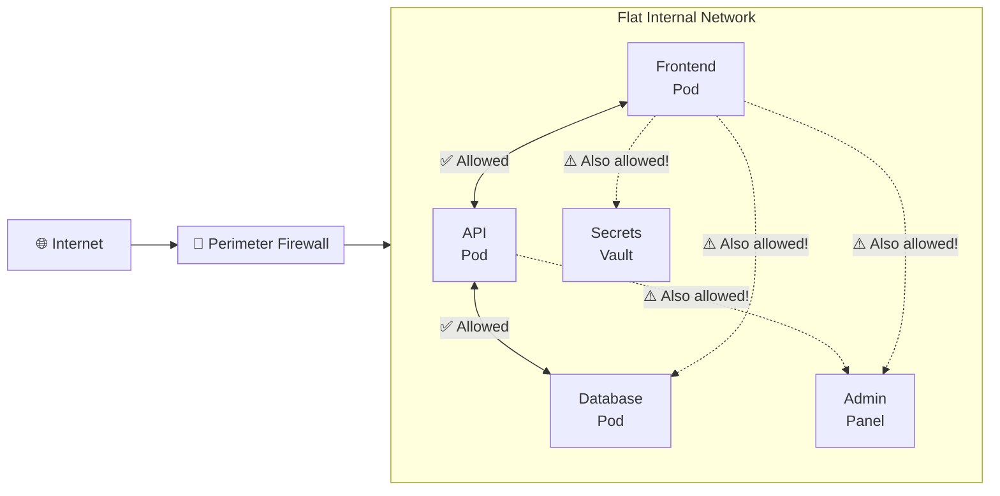
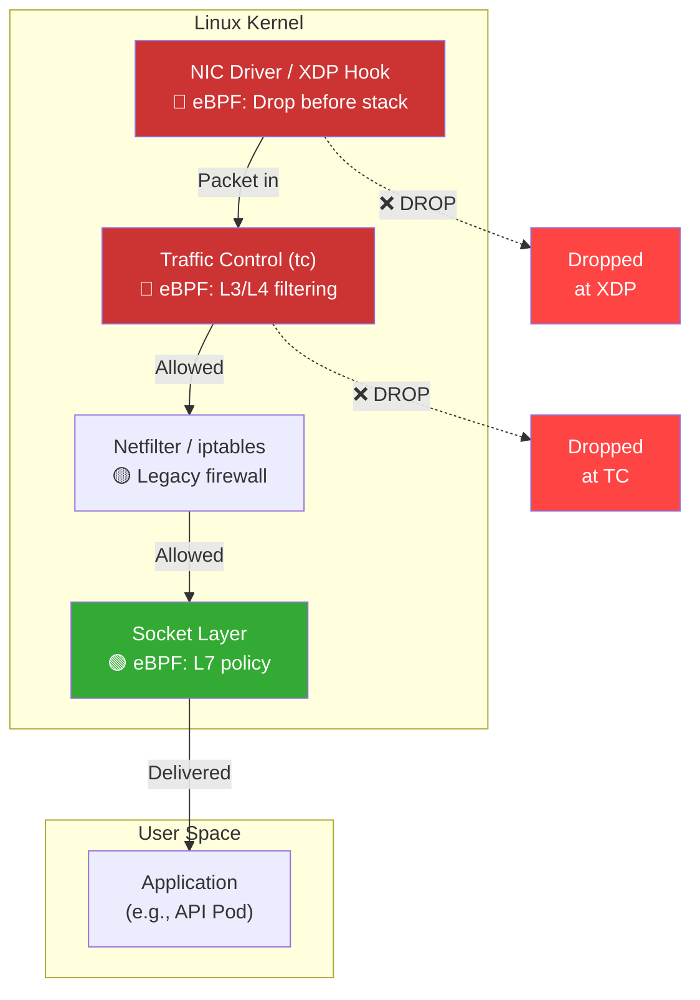
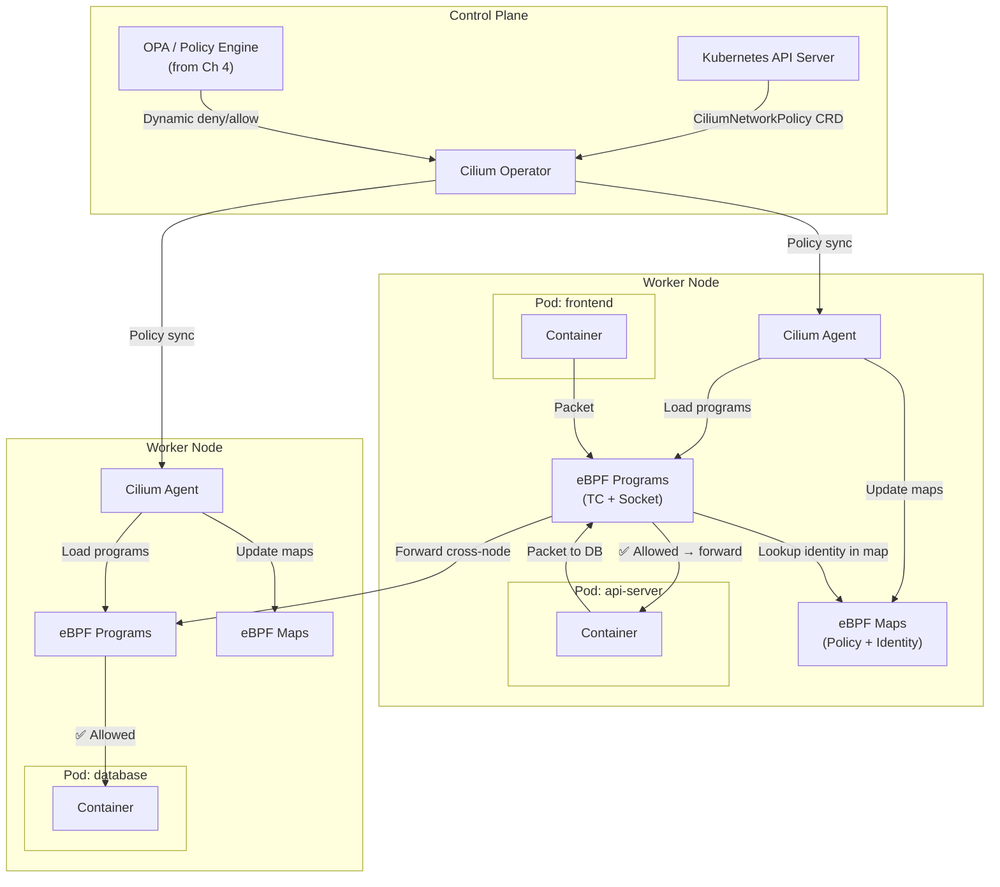
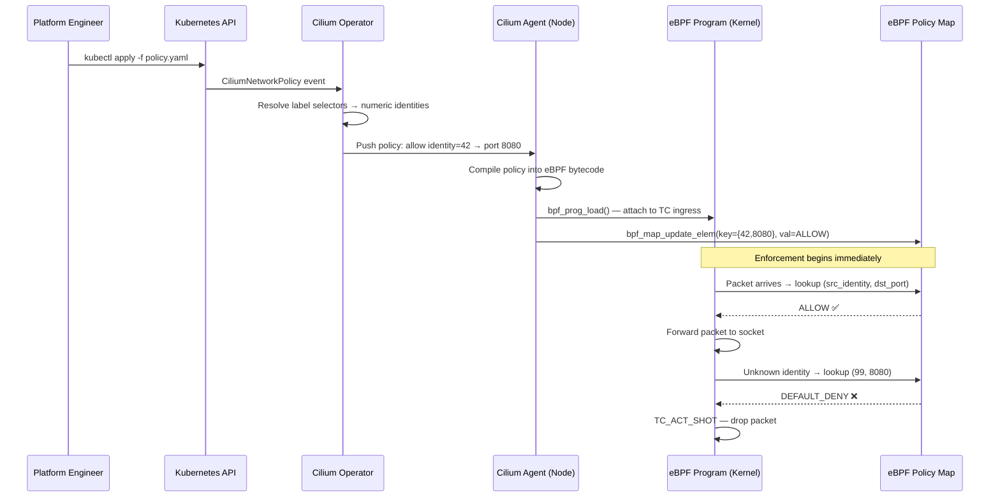
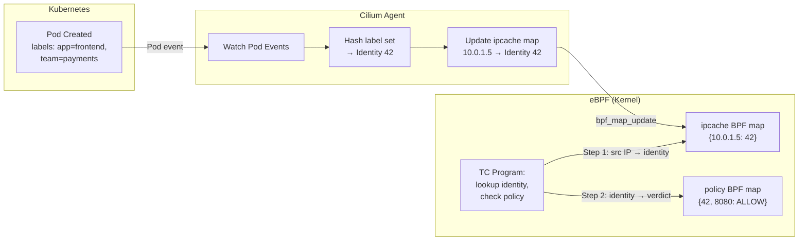
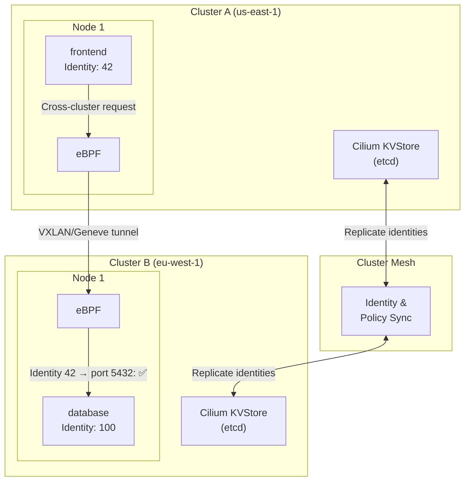
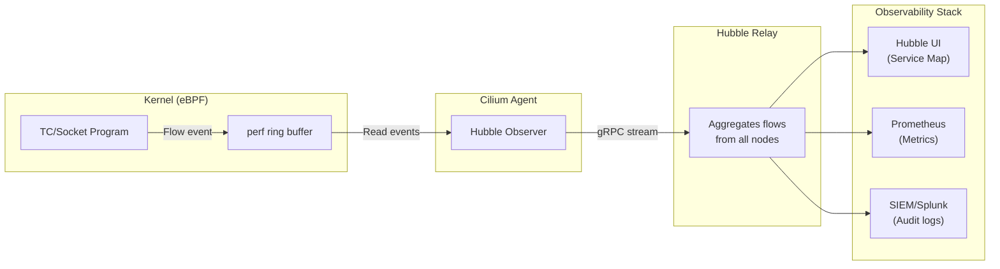
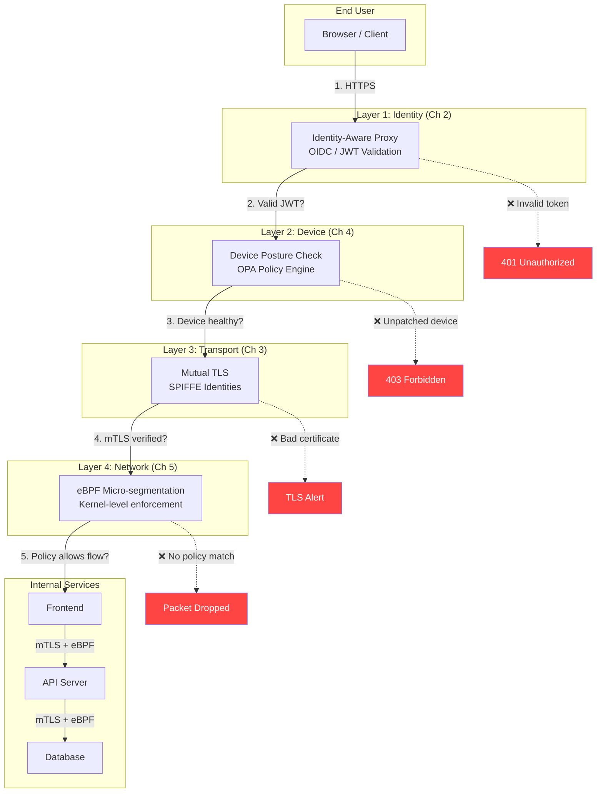

# Chapter 5: Micro-segmentation with eBPF 🔴

> **The Problem:** Even with identity verification (Ch 2), mTLS (Ch 3), and device posture checks (Ch 4), a compromised workload can still talk to *every other workload* on the same flat network. Traditional firewalls operate at the perimeter; they can't enforce rules *between* pods in the same cluster or VMs on the same VLAN. Once an attacker establishes a foothold, they move laterally — hopping from a low-value service to a high-value database — because nothing stops them. Zero trust demands that every network flow be explicitly authorized, and that unauthorized packets be **dropped at the kernel before they reach the application**. This is micro-segmentation, and the only tool fast enough to enforce it at datacenter scale without adding latency is **eBPF**.

---

## 5.1 The Lateral Movement Problem

In a traditional data centre, once traffic passes the perimeter firewall, internal communication is essentially unrestricted:



An attacker who compromises `Frontend` can reach `Database`, `Secrets Vault`, and `Admin Panel` directly — because no internal boundary exists.

### Real-World Lateral Movement: The Kill Chain

| Stage | Attacker Action | Why Flat Networks Enable It |
|---|---|---|
| **1. Initial access** | Exploit an RCE in the frontend | Perimeter firewall allows HTTPS in |
| **2. Discovery** | Port-scan internal network | All pods see each other at L3/L4 |
| **3. Lateral movement** | SSH/RPC to the database pod | No internal firewall blocks pod-to-pod |
| **4. Privilege escalation** | Query secrets vault API | Vault is reachable from every pod |
| **5. Exfiltration** | Tunnel data out through DNS | Egress filtering is coarse or absent |

**Micro-segmentation eliminates stages 2–5** by ensuring that each workload can only communicate with its explicitly authorized peers.

---

## 5.2 Why eBPF? The Kernel Enforcement Layer

eBPF (extended Berkeley Packet Filter) lets us attach small programs directly to the Linux kernel's networking stack — without modifying kernel source or loading kernel modules.

### Where eBPF Hooks Into the Packet Path



### eBPF vs. Traditional Enforcement

| Dimension | `iptables` / Netfilter | eBPF (XDP / TC) | Advantage |
|---|---|---|---|
| **Hook point** | After full stack processing | At NIC driver or TC, before stack | Drops packets before wasting CPU cycles |
| **Rule evaluation** | Linear chain walk — O(n) | Direct-lookup maps — O(1) | 10–100× faster with 10K+ rules |
| **Identity-awareness** | IP-based only | Can key on SPIFFE ID, pod label, cgroup | Works in dynamic orchestrated environments |
| **Update latency** | Full chain reload | Atomic map update | Zero-downtime policy changes |
| **Observability** | Counters only | Rich per-flow metrics via perf/ring buffers | Fine-grained audit trail |
| **Performance overhead** | ~5 µs per packet at scale | ~100 ns per packet | Near-zero latency added |

---

## 5.3 Architecture: Cilium as the eBPF Data Plane

Cilium is the de facto standard for eBPF-based networking in Kubernetes. It replaces `kube-proxy` and `iptables` entirely with eBPF programs.



### Key Components

| Component | Role | Location |
|---|---|---|
| **Cilium Operator** | Watches K8s API, distributes identity and policy to agents | Control plane |
| **Cilium Agent** | Per-node daemon; compiles and loads eBPF programs | Every worker node |
| **eBPF Programs** | Packet-level enforcement at TC/XDP hooks | Kernel, per-interface |
| **eBPF Maps** | Hash maps containing `(identity, port) → allow/deny` | Kernel memory, per-node |
| **Identity allocator** | Assigns a numeric security identity to each set of pod labels | Cilium Agent |

---

## 5.4 Cilium Network Policies: From YAML to Kernel

### 5.4.1 A Simple Micro-segmentation Policy

Only `frontend` pods can talk to `api-server` on port 8080; nothing else can:

```yaml
# cilium-network-policy.yaml
apiVersion: cilium.io/v2
kind: CiliumNetworkPolicy
metadata:
  name: api-server-ingress
  namespace: production
spec:
  endpointSelector:
    matchLabels:
      app: api-server
  ingress:
    - fromEndpoints:
        - matchLabels:
            app: frontend
      toPorts:
        - ports:
            - port: "8080"
              protocol: TCP
          rules:
            http:
              - method: "GET"
                path: "/api/v1/.*"
              - method: "POST"
                path: "/api/v1/orders"
```

### 5.4.2 How the Policy Becomes an eBPF Rule



### 5.4.3 What Happens in the eBPF Program (Pseudocode)

```c
// Simplified Cilium TC ingress program
SEC("classifier/tc_ingress")
int handle_ingress(struct __sk_buff *skb) {
    // 1. Extract packet headers
    struct iphdr *ip = get_ip_header(skb);
    struct tcphdr *tcp = get_tcp_header(skb);
    
    // 2. Look up source identity from the identity map
    //    (populated by Cilium agent based on SPIFFE/pod labels)
    __u32 src_identity = lookup_identity(ip->saddr);
    
    // 3. Build policy lookup key
    struct policy_key key = {
        .identity = src_identity,
        .dport    = tcp->dest,
        .protocol = IPPROTO_TCP,
    };
    
    // 4. Check the policy map (O(1) hash lookup)
    struct policy_entry *entry = bpf_map_lookup_elem(&policy_map, &key);
    
    if (entry && entry->action == ACTION_ALLOW) {
        // 5a. Emit allow verdict + metrics
        update_metrics(src_identity, METRIC_ALLOW);
        return TC_ACT_OK;  // Forward to application
    }
    
    // 5b. Default deny — drop and record audit event
    emit_audit_event(skb, src_identity, AUDIT_DENY);
    update_metrics(src_identity, METRIC_DENY);
    return TC_ACT_SHOT;  // Drop at kernel level
}
```

---

## 5.5 Identity-Aware eBPF: Beyond IP Addresses

Traditional firewalls rely on IP addresses for rules — but in Kubernetes, IPs are ephemeral. A pod's IP changes on every restart. eBPF + Cilium solves this with **security identities** derived from labels:

### The Identity Resolution Pipeline



| Concept | IP-Based Firewall | Cilium Identity-Based |
|---|---|---|
| **Rule target** | `10.0.1.5` | `app=frontend AND team=payments` |
| **Pod restart** | Rule broken (new IP) | Rule persists (same labels) |
| **Scale-up to 100 replicas** | 100 IP rules needed | 1 identity rule |
| **Cross-cluster** | Different IP ranges, separate rules | Same identity if same labels |

---

## 5.6 Implementing Micro-segmentation in Rust (Aya Framework)

While Cilium provides a production-ready solution, understanding how eBPF programs are written is essential. The **Aya** framework lets us write eBPF programs in pure Rust — no C required.

### 5.6.1 Project Structure

```
zero-trust-ebpf/
├── Cargo.toml
├── ebpf/                    # eBPF program (runs in kernel)
│   ├── Cargo.toml
│   └── src/
│       └── main.rs          # TC classifier
├── common/                  # Shared types between userspace and kernel
│   ├── Cargo.toml
│   └── src/
│       └── lib.rs
└── userspace/               # Userspace loader/manager
    ├── Cargo.toml
    └── src/
        └── main.rs
```

### 5.6.2 Shared Types (Common Crate)

```rust
// common/src/lib.rs
#![no_std]

/// Policy lookup key — must match eBPF map key layout
#[repr(C)]
#[derive(Clone, Copy)]
pub struct PolicyKey {
    pub src_identity: u32,
    pub dst_port: u16,
    pub protocol: u8,
    pub _pad: u8,
}

/// Policy verdict
#[repr(C)]
#[derive(Clone, Copy)]
pub struct PolicyValue {
    pub action: u32,      // 0 = deny, 1 = allow
    pub audit: u32,       // 1 = log this flow
    pub rate_limit_pps: u32, // 0 = no limit
}

/// IP-to-identity mapping
#[repr(C)]
#[derive(Clone, Copy)]
pub struct IdentityEntry {
    pub identity: u32,
    pub _reserved: [u32; 3],
}

// Action constants
pub const ACTION_DENY: u32 = 0;
pub const ACTION_ALLOW: u32 = 1;
```

### 5.6.3 The eBPF TC Classifier (Kernel Side)

```rust
// ebpf/src/main.rs
#![no_std]
#![no_main]

use aya_ebpf::{
    bindings::TC_ACT_OK,
    bindings::TC_ACT_SHOT,
    macros::{classifier, map},
    maps::HashMap,
    programs::TcContext,
};
use core::mem;
use zero_trust_common::{PolicyKey, PolicyValue, IdentityEntry, ACTION_ALLOW};

/// Map: source IP → security identity
#[map]
static IPCACHE: HashMap<u32, IdentityEntry> = HashMap::with_max_entries(65536, 0);

/// Map: (identity, port, proto) → policy verdict
#[map]
static POLICY_MAP: HashMap<PolicyKey, PolicyValue> = HashMap::with_max_entries(16384, 0);

/// Map: metrics counter per identity
#[map]
static METRICS: HashMap<u32, u64> = HashMap::with_max_entries(4096, 0);

#[classifier]
pub fn tc_ingress(ctx: TcContext) -> i32 {
    match try_tc_ingress(&ctx) {
        Ok(action) => action,
        Err(_) => TC_ACT_SHOT, // Fail-closed: deny on error
    }
}

fn try_tc_ingress(ctx: &TcContext) -> Result<i32, ()> {
    // 1. Parse Ethernet + IP + TCP headers
    let eth_hdr_len = 14;
    let ip_proto: u8 = ctx.load(eth_hdr_len + 9).map_err(|_| ())?;
    
    // Only process TCP
    if ip_proto != 6 {
        return Ok(TC_ACT_OK); // Pass non-TCP through
    }
    
    // Extract source IP (offset 12 in IP header)
    let src_ip: u32 = ctx.load(eth_hdr_len + 12).map_err(|_| ())?;
    
    // Extract destination port (offset 2 in TCP header)
    let ip_hdr_len = 20; // Assume no options for simplicity
    let dst_port: u16 = ctx.load(eth_hdr_len + ip_hdr_len + 2).map_err(|_| ())?;
    
    // 2. Resolve source IP → security identity
    let identity = match unsafe { IPCACHE.get(&src_ip) } {
        Some(entry) => entry.identity,
        None => 0, // Unknown identity → will be denied by policy
    };
    
    // 3. Build policy key and look up verdict
    let key = PolicyKey {
        src_identity: identity,
        dst_port,
        protocol: ip_proto,
        _pad: 0,
    };
    
    let action = match unsafe { POLICY_MAP.get(&key) } {
        Some(entry) if entry.action == ACTION_ALLOW => TC_ACT_OK,
        _ => TC_ACT_SHOT, // Default deny
    };
    
    // 4. Update metrics
    increment_counter(identity);
    
    Ok(action)
}

#[inline(always)]
fn increment_counter(identity: u32) {
    if let Some(counter) = unsafe { METRICS.get(&identity) } {
        let new_val = *counter + 1;
        let _ = METRICS.insert(&identity, &new_val, 0);
    }
}

#[panic_handler]
fn panic(_info: &core::panic::PanicInfo) -> ! {
    unsafe { core::hint::unreachable_unchecked() }
}
```

### 5.6.4 Userspace Loader and Policy Manager

```rust
// userspace/src/main.rs
use anyhow::Result;
use aya::{
    include_bytes_aligned,
    maps::HashMap,
    programs::{tc, SchedClassifier, TcAttachType},
    Ebpf,
};
use zero_trust_common::{
    PolicyKey, PolicyValue, IdentityEntry,
    ACTION_ALLOW, ACTION_DENY,
};
use tokio::signal;

#[tokio::main]
async fn main() -> Result<()> {
    env_logger::init();
    
    // 1. Load the compiled eBPF object
    let mut bpf = Ebpf::load(include_bytes_aligned!(
        "../../target/bpfel-unknown-none/release/zero-trust-ebpf"
    ))?;
    
    // 2. Attach TC classifier to the target interface
    let interface = "eth0";
    let _ = tc::qdisc_add_clsact(interface);
    let program: &mut SchedClassifier =
        bpf.program_mut("tc_ingress").unwrap().try_into()?;
    program.load()?;
    program.attach(interface, TcAttachType::Ingress)?;
    
    println!("eBPF TC classifier attached to {interface}");
    
    // 3. Populate identity map (in production, watch K8s API)
    let mut ipcache: HashMap<_, u32, IdentityEntry> =
        HashMap::try_from(bpf.map_mut("IPCACHE").unwrap())?;
    
    // frontend pod at 10.0.1.5 → identity 42
    ipcache.insert(
        u32::from(std::net::Ipv4Addr::new(10, 0, 1, 5)),
        IdentityEntry { identity: 42, _reserved: [0; 3] },
        0,
    )?;
    
    // api-server pod at 10.0.2.10 → identity 43
    ipcache.insert(
        u32::from(std::net::Ipv4Addr::new(10, 0, 2, 10)),
        IdentityEntry { identity: 43, _reserved: [0; 3] },
        0,
    )?;
    
    // 4. Populate policy map
    let mut policy: HashMap<_, PolicyKey, PolicyValue> =
        HashMap::try_from(bpf.map_mut("POLICY_MAP").unwrap())?;
    
    // Allow: frontend (42) → api-server port 8080/TCP
    policy.insert(
        PolicyKey {
            src_identity: 42,
            dst_port: 8080u16.to_be(),
            protocol: 6, // TCP
            _pad: 0,
        },
        PolicyValue {
            action: ACTION_ALLOW,
            audit: 1,
            rate_limit_pps: 0,
        },
        0,
    )?;
    
    // Allow: api-server (43) → database port 5432/TCP
    policy.insert(
        PolicyKey {
            src_identity: 43,
            dst_port: 5432u16.to_be(),
            protocol: 6,
            _pad: 0,
        },
        PolicyValue {
            action: ACTION_ALLOW,
            audit: 1,
            rate_limit_pps: 0,
        },
        0,
    )?;
    
    // Everything else: default deny (no map entry → TC_ACT_SHOT)
    
    println!("Policy loaded. Monitoring...");
    
    // 5. Wait for shutdown signal
    signal::ctrl_c().await?;
    println!("Detaching eBPF programs...");
    
    Ok(())
}
```

---

## 5.7 Multi-Cluster and Cross-Node Policy

In production, workloads span multiple clusters and cloud regions. Cilium's **Cluster Mesh** extends eBPF policies across cluster boundaries:



### Cross-Cluster Policy Requirements

| Requirement | Solution | Why |
|---|---|---|
| **Consistent identity** | Global identity allocator via etcd | Same labels = same identity across clusters |
| **Encrypted transit** | WireGuard between nodes | Untrusted network between clusters |
| **Policy propagation** | Cluster Mesh syncs `CiliumNetworkPolicy` | Single policy, multi-cluster enforcement |
| **Fault isolation** | Per-cluster etcd; mesh is eventually consistent | One cluster failure doesn't break the other |

---

## 5.8 Observability: Hubble and Flow Logs

Enforcement without visibility is flying blind. Cilium's **Hubble** provides real-time L3/L4/L7 flow visibility, powered by eBPF ring buffers:

### 5.8.1 The Observability Pipeline



### 5.8.2 What a Flow Log Looks Like

```json
{
  "time": "2026-04-01T10:15:32.456Z",
  "verdict": "DROPPED",
  "drop_reason": "POLICY_DENIED",
  "ethernet": {
    "source": "0a:58:0a:00:01:05",
    "destination": "0a:58:0a:00:02:0a"
  },
  "IP": {
    "source": "10.0.1.5",
    "destination": "10.0.2.10"
  },
  "l4": {
    "TCP": {
      "source_port": 52341,
      "destination_port": 5432,
      "flags": { "SYN": true }
    }
  },
  "source": {
    "identity": 42,
    "labels": ["k8s:app=frontend", "k8s:team=payments"],
    "namespace": "production",
    "pod_name": "frontend-7b9d4-xk2m1"
  },
  "destination": {
    "identity": 100,
    "labels": ["k8s:app=database"],
    "namespace": "production",
    "pod_name": "postgres-0"
  },
  "policy_match_type": "none",
  "trace_observation_point": "to-endpoint"
}
```

This log tells the security team: **frontend pod tried to directly access the database on port 5432 and was denied because no policy allows identity 42 → port 5432**. Only identity 43 (api-server) has that permission.

---

## 5.9 Defense in Depth: Integrating All Five Chapters

The full zero-trust architecture combines every layer we've built throughout this book:



### The Zero-Trust Decision Matrix

| Request Property | Ch 2: IAP | Ch 3: mTLS | Ch 4: Posture | Ch 5: eBPF | Result |
|---|---|---|---|---|---|
| Valid JWT, patched device, mTLS cert, allowed flow | ✅ | ✅ | ✅ | ✅ | **Access granted** |
| Expired JWT | ❌ | — | — | — | Blocked at proxy |
| Valid JWT, unpatched OS | ✅ | ✅ | ❌ | — | Blocked at policy engine |
| Valid JWT, healthy device, no mTLS cert | ✅ | ❌ | ✅ | — | TLS handshake failure |
| All valid, but unauthorized network flow | ✅ | ✅ | ✅ | ❌ | Packet dropped in kernel |
| Compromised pod, lateral movement attempt | — | — | — | ❌ | Dropped before reaching target |

**Every layer is independent.** Compromising one layer does not compromise the others. An attacker must defeat *all four simultaneously* — which is the fundamental promise of zero trust.

---

## 5.10 Production Hardening and Operational Considerations

### 5.10.1 Avoiding Policy Lockouts

The most dangerous failure mode with eBPF micro-segmentation is accidentally deploying a policy that blocks your own management traffic:

```yaml
# ALWAYS include a "break glass" policy for operations
apiVersion: cilium.io/v2
kind: CiliumClusterwideNetworkPolicy
metadata:
  name: allow-kube-system
spec:
  endpointSelector: {}
  ingress:
    - fromEndpoints:
        - matchLabels:
            "k8s:io.kubernetes.pod.namespace": kube-system
  egress:
    - toEndpoints:
        - matchLabels:
            "k8s:io.kubernetes.pod.namespace": kube-system
    # Allow DNS resolution
    - toEndpoints:
        - matchLabels:
            "k8s:io.kubernetes.pod.namespace": kube-system
            "k8s:k8s-app": kube-dns
      toPorts:
        - ports:
            - port: "53"
              protocol: UDP
```

### 5.10.2 Gradual Rollout Strategy

| Phase | Mode | Action | Duration |
|---|---|---|---|
| **1. Audit** | `policy-audit-mode: enabled` | Log what *would* be denied, don't actually deny | 2–4 weeks |
| **2. Selective enforcement** | Enforce on non-critical namespaces | Validate policies on staging workloads | 1–2 weeks |
| **3. Full enforcement** | Remove audit mode, default-deny all namespaces | Monitor Hubble for unexpected drops | Ongoing |
| **4. Continuous hardening** | Tighten rules based on observed flows | Remove overly broad rules | Continuous |

### 5.10.3 Performance Benchmarks

| Metric | Without eBPF | With Cilium eBPF | Delta |
|---|---|---|---|
| **Latency (p50)** | 0.42 ms | 0.43 ms | +2.4% |
| **Latency (p99)** | 1.21 ms | 1.24 ms | +2.5% |
| **Throughput (Gbps)** | 23.8 | 23.5 | −1.3% |
| **Policy evaluation** | N/A (no enforcement) | ~100 ns/packet | Negligible |
| **Max concurrent policies** | N/A | 50,000+ rules | O(1) lookup |
| **CPU overhead per node** | Baseline | +1–3% | Cilium agent + eBPF |

---

## 5.11 Common Pitfalls and Mitigations

| Pitfall | Symptom | Mitigation |
|---|---|---|
| **DNS not whitelisted** | All pods fail to resolve hostnames | Always allow `kube-dns` in egress policies |
| **Health checks blocked** | Pods marked unhealthy and restarted | Allow kubelet → pod on health check ports |
| **eBPF map exhaustion** | `BPF_MAP_FULL` errors in agent logs | Size maps based on expected workload count + 50% |
| **Policy ordering confusion** | Unexpected allows/denies | Cilium uses "allow-list" model — default deny, explicit allow |
| **Cross-namespace traffic** | Services can't reach dependencies | Use `CiliumClusterwideNetworkPolicy` for cross-namespace rules |
| **NodePort/LoadBalancer bypass** | External traffic skips policy | Enable `bpf-lb-external-clusterip: true` |

---

## 5.12 Exercises

1. **Audit Mode Analysis:** Deploy Cilium in audit mode on a staging cluster. Analyze Hubble flow logs for 1 week. How many unique flows exist? How many would be denied under a default-deny policy?

2. **Aya eBPF Lab:** Using the Aya framework code in Section 5.6, extend the TC classifier to also handle UDP packets. Add a second eBPF map for rate-limiting — if a source exceeds 1000 packets/second, drop subsequent packets.

3. **Policy Writing:** Write `CiliumNetworkPolicy` rules for a three-tier application (frontend → API → database) with the following constraints:
   - Frontend can only reach API on port 443 (HTTPS)
   - API can only reach database on port 5432 (PostgreSQL)
   - Database can only reach a backup service on port 9090
   - All pods can reach `kube-dns` on port 53/UDP
   - Nothing else is allowed

4. **Incident Simulation:** Intentionally deploy a pod with label `app=attacker` and attempt to connect to the database. Use `hubble observe` to capture the denied flow. Generate an incident report from the flow log.

5. **Performance Testing:** Run `iperf3` between two pods with and without Cilium eBPF policies enforced. Measure throughput and latency at p50/p99. Are the results consistent with the benchmarks in Section 5.10.3?

---

> **Key Takeaways**
>
> 1. **Flat networks are the attacker's best friend.** Without micro-segmentation, compromising one workload gives access to everything on the network.
> 2. **eBPF enforces policy at the kernel level** — packets are dropped before they reach the application, before they consume CPU cycles, and before an attacker can exploit anything.
> 3. **Identity, not IP addresses.** Cilium assigns numeric security identities based on Kubernetes labels, making policies resilient to pod restarts and scale events.
> 4. **O(1) policy evaluation.** eBPF hash maps replace iptables' linear chain walk, enabling 50,000+ rules with ~100 ns per-packet overhead.
> 5. **Observability is non-negotiable.** Hubble provides real-time flow visibility so you can audit, debug, and continuously harden policies.
> 6. **Defense in depth is multiplicative.** Combining identity verification (Ch 2), mTLS (Ch 3), device posture (Ch 4), and eBPF micro-segmentation (Ch 5) creates a security posture where an attacker must defeat every layer simultaneously — the core promise of zero trust.
> 7. **Roll out gradually.** Start in audit mode, analyze flows, enforce selectively, then enforce globally. Never skip the audit phase.
